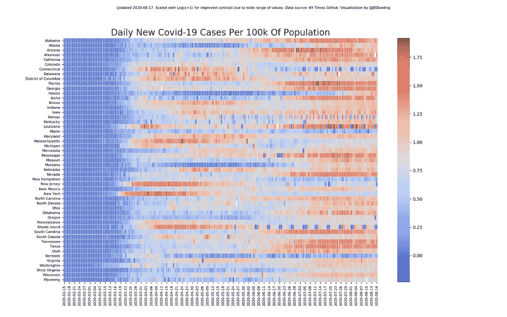

# Python 中新冠肺炎新病例随时间变化的可视化

> 原文：<https://towardsdatascience.com/visualization-of-covid-19-new-cases-over-time-in-python-8c6ac4620c88?source=collection_archive---------27----------------------->

## 热图显示了不同州的潮起潮落

每日每 10 万人口新新冠肺炎病例热图

这张热图显示了美国新冠肺炎疫情随时间的发展。该地图从左至右阅读，并以彩色编码显示各州新病例的相对数量，并根据人口进行调整。

这个可视化的灵感来自于我在一个论坛上看到的一个相似的热图。我从来没有找到来源，因为它只是一个粘贴的图像，没有链接。最初的版本也是为了表明一个政治观点，按照主要的党派划分各州，而我对此并不感兴趣。我被它如何简明地显示疫情的进展迷住了，所以我决定自己创建一个类似的可视化，以便我可以定期更新。

源代码托管在我的 [Github repo](https://github.com/JasonRBowling/covid19NewCasesPer100KHeatmap) 上。如果你有兴趣看这张热图的更新版本，我每周都会在我的 [Twitter feed](https://twitter.com/JRBowling) 上发布。需要注意的是，在比较一周和另一周的图表时要小心，因为随着新数据的加入，颜色图可能会发生变化。比较仅在给定的热图内有效。

该脚本依赖于 pandas、numpy、matplotlib 和 seaborn。

数据来自[《纽约时报》新冠肺炎 Github 回购](https://github.com/nytimes/covid-19-data)。一个简单的启动器脚本克隆存储库的最新副本并复制所需的文件，然后启动 Python 脚本来创建热图。只有一个文件是真正需要的，所以它当然可以收紧，但这是可行的。

该脚本首先将一个包含州人口的 CSV 文件加载到一个字典中，该字典用于衡量每天的新病例结果。每天的新病例是根据纽约时报数据中的累计总数计算出来的，然后[换算成人口中每 100，000 人中的新病例](https://www.robertniles.com/stats/percap.shtml)。

我们可以显示此时的热图，但如果我们这样做，每 100，000 人中病例数非常高的州将淹没病例数较低的州的详细信息。应用 [log(x+1)](http://onbiostatistics.blogspot.com/2012/05/logx1-data-transformation.html#:~:text=A%3A%20log(x%2B1,in%20which%20x%20was%20measured.) 变换可以显著提高对比度和可读性。

最后，使用 Seaborn 和 Matplotlib 生成热图，并将其保存到图像文件中。

就是这样！请随意使用这个作为你自己的可视化框架。你可以定制它来聚焦感兴趣的领域。

完整的源代码在下面。感谢阅读，希望你觉得有用。