# 马哈拉施特拉邦选举的可视化

> 原文：<https://towardsdatascience.com/visualization-of-maharashtras-elections-f7e85a79edd1?source=collection_archive---------51----------------------->

## 制作选举地图的指南

阿哈拉什特拉是印度人口第二多、面积第三大的邦。马哈拉施特拉邦对该国国内生产总值的贡献约为 15%，是该国最大的经济贡献者，而邦首府孟买则是该国的金融之都。此外，浦那还被称为“东方牛津”,因为那里有许多教育机构，如 IUCAA、NCRA、IISER 等。从今以后，马哈拉施特拉邦发生的任何事情都会在全国范围内产生经济影响。

本文将介绍如何使用公开数据制作马哈拉施特拉邦 2019 年议会选举的 choropleth 地图。通常，程序集选区的形状文件在 internet 上是极其稀缺的资源。

# 数据

1.  议会选区的形状文件可以在这里找到【https://github.com/datameet/maps 
2.  各选区获胜政党的数据可从[选举委员会网页](https://eci.gov.in/files/file/11699-maharashtra-legislative-assembly-election-2019/)下载。

# 必需的包

1.  熊猫(安装指南:[https://pandas . pydata . org/pandas-docs/stable/getting _ started/install . html](https://pandas.pydata.org/pandas-docs/stable/getting_started/install.html))
2.  Geopandas(安装:[https://geopandas.org/install.html](https://geopandas.org/install.html)
3.  Seaborn(安装:[https://seaborn.pydata.org/installing.html](https://seaborn.pydata.org/installing.html)
4.  Matplotlib 和 numpy

# 地图数据

## 导入包

首先，导入所需的包，如下所示:

```
import pandas as pd
import geopandas as gpd
import matplotlib.pyplot as plt
import numpy as np
import seaborn as sns
sns.set_style('whitegrid')
```

“set_style”是一个可选命令，为即将到来的绘图设置一个白色网格。

```
# Importing the shape file of assembly-constituencies
fp = "assembly-constituencies"
map_df = gpd.read_file(fp)
map_df = map_df[map_df['ST_NAME']=='MAHARASHTRA']
map_df = map_df[['AC_NAME', 'geometry']]
map_df.reset_index(drop=True,inplace=True)
map_df.head(3)
```


' *read_file* '导入印度议会选区的形状文件作为数据帧，'*map _ df[' ST _ NAME ']= ' MAHARASHTRA*'过滤属于 MAHARASHTRA 的选区。后续行仅保留所需的特征，如选区名称(AC_NAME)和形状文件(geometry)。

## 基本探索性数据分析

```
map_df.info()
```

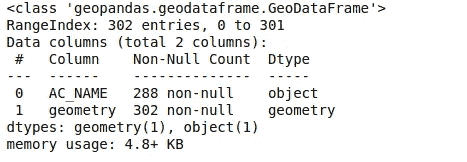

从上面可以看出，有 288 个装配选区名称( *AC_NAME* )和 302 个形状文件( *geometry* )。来自印度[选举委员会](https://eci.gov.in/files/file/11699-maharashtra-legislative-assembly-election-2019/)的数据显示，印度共有 288 个议会选区。让我们探索更多来解决这种差异。

```
# Plot of the assembly-constituencies
map_df.plot()
```

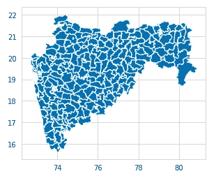

形状文件的情节看起来很正常。让我们检查一下是否有空类型值。

```
# checking for null values
Null_Values = map_df.isnull().sum()
print(Null_Values)
```

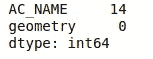

python 中的空类型对象用 *None* 关键字表示。这里， *isnull()* 命令将 DataFrame *map_df* 转换为 *True* 或 *False* 表格，其中 *True* 是 *None* 关键字的占位符，反之亦然。sum()命令将值分别为 1 和 0 的*真值*或*假值*相加*。*因此，选区名称中有 14 个缺失值，形状文件中同样没有缺失值。

这可以想象为 Seaborn 图书馆的热图:

```
# It seems some of the names of the assembly-constituencies is missing!
sns.heatmap(Null_Values)
```

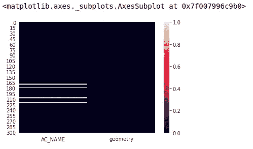

AC_NAME 列中的奇数直线表示缺少的值。这些值可以用熊猫的 *dropna()* 删除，如下所示。

```
map_df.dropna(inplace=True) # The 'None' type rows are removed
map_df.reset_index(drop=True,inplace=True) # index is reset
map_df.head()
```

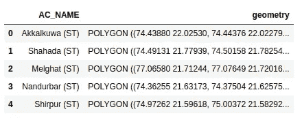

移除空类型值后，索引将被重置以考虑移除的值，并将选区名称设置为新索引—这是通过 *drop=True* 选项实现的。而 *inplace=True* 选项将这些变化保留在 map_df 数据帧中。

## 数据清理

数据必须被清理以匹配来自[选举委员会](https://eci.gov.in/files/file/11699-maharashtra-legislative-assembly-election-2019/)的选区名称。人们可以看到，名称后面有 *(ST)* 和 *(SC)* ，以表示为 ST 和 SC 保留的选区。

```
#Cleaning the names of assembly constituencies
def text_process(names):
    semi_cleaned_names = [word for word in names.strip().lower().split() if word not in ['(st)','(sc)']] 
    joined_cleaned_names = " ".join(semi_cleaned_names)
    removed_st_names = joined_cleaned_names.replace("(st)","")
    fully_cleaned_names = removed_st_names.replace("(sc)","")
    return fully_cleaned_names# The cleaned names
map_df['cleaned_names']=map_df['AC_NAME'].apply(text_process)
map_df = map_df[['cleaned_names','geometry']]
```

apply 命令一次向 *text_process()* 函数发送一个单词。在这里，每个单词都去掉了前导和结尾的空格，转换成小写，并通过 *names.strip()以空格分隔成更多的单词。降低()。【split()。一个示例单词 *Arjuni Morgaon(SC)* 在第一行代码后看起来像 *['arjuni '，' morgaon(sc)']* 。单词 *(sc)* 仍然保留在这个单词中，因为它没有用空格与 *morgaon* 分开。对这个字的 *join()* 命令将产生 *arjuni morgaon(sc)。*最后，*替换("(sc)"，" ")*会给出完全清洗的名字 *arjuni morgaon* 。*

数据帧现在看起来像这样:

```
map_df.head()
```

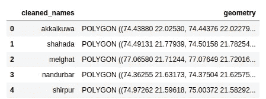

# 选举数据

可以从[选举委员会页面](https://eci.gov.in/files/file/11699-maharashtra-legislative-assembly-election-2019/)下载 xlsx 格式的各选区获胜政党的数据。

```
# Importing Election Data
df_election = pd.read_excel('2-List of Successful Candidates.xlsx',names=np.array(['State','Constituency','Winner','Sex','Party','Symbol'])) df_election.reset_index(drop=True)
df_election.head()
```

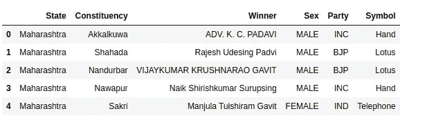

来自 pandas 的 *read_excel* 命令直接将 excel 表数据作为 DataFrame 导入， *names* 选项为列设置新名称。

## 基本探索性数据分析

```
df_election.info()
```

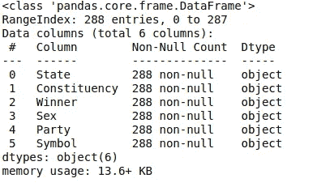

上面的结果显示六列中没有空值。

```
plt.figure(figsize=(10,5))
sns.countplot(x='Party',data=df_election,)
```

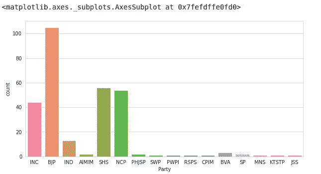

*countplot* 命令绘制了每一方赢得的选区数量，而 *value_count()* 给出了确切的数字:

```
df_election['Party'].value_counts()
```

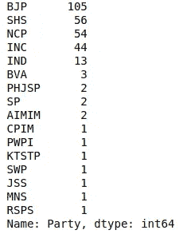

显然，前四大政党赢得的选区比其他政党多得多。现在，让我们只分离在 20 多个选区获胜的政党。这是为了关注表现良好的政党。

```
df_successful_party = df_election['Party'].value_counts() > 20
df_successful_party=df_successful_party[df_successful_party==True].index
Succ_parties = df_successful_party.values
df = df_election['Party'].apply(lambda x: x in Succ_parties)
sns.countplot(x = 'Party',data = df_election[df],hue='Sex')
```

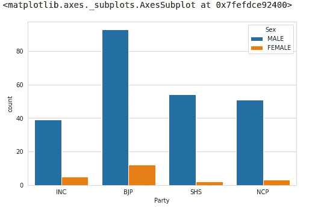

按性别对成功候选人进行党派细分。

第一行给出一个熊猫系列，以当事人名称为索引，列为*真*或*假*值，其中*真*表示大于 20 的值，而*假*否则为*。*第二行通过*索引*命令给出只有*真*值的各方名称。第三行将各方名称转换成一个 numpy 数组。这个数组在下面的 *apply* 命令中使用，该命令过滤所有胜率大于 20 的团体。最后一行只是标出了每个政党赢得的选区数量，并按照候选人的性别分类。从绝对数字来看，BJP 似乎在获胜的候选人中代表了更多的妇女。让我们更深入地了解一下这个问题。

```
df_election['Sex'].value_counts()
Percentage_of_women = 24/288*100
Percentage_of_women
```

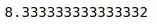

以上各行显示，在包括所有政党在内的所有成功候选人中，妇女仅占 8%。将它分解为一个党派的代表:

```
df_election[df_election['Party']=='BJP']['Sex'].value_counts()
Percentage_of_women_BJP = (12/105)*100
Percentage_of_women_BJP
```

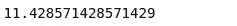

这表明在 BJP 的成功候选人中，妇女占 11 %。类似地，为所有各方计算它，可以绘制如下:

```
arr = np.array([Percentage_of_women,Percentage_of_women_BJP,Percentage_of_women_NCP,Percentage_of_women_SHS,Percentage_of_women_INC])

Women_representation = pd.DataFrame(data=arr,columns=['Women Representation (%)'],index=None)Women_representation['Party'] = ['Overall','BJP','NCP','SHS','INC']plt.figure(figsize=(8,5))sns.barplot(y='Women Representation (%)',x='Party',data=Women_representation)
```

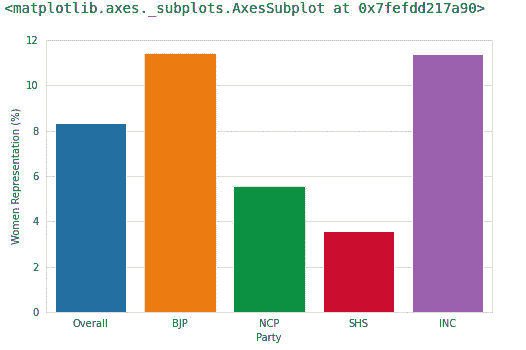

妇女在政党中的代表性。

上图显示了妇女在政党中的代表性，即在成功的候选人中所占的百分比。可以看出，BJP 和国会的妇女代表几乎相等。此外，两党都超过了 8 %的平均女性代表比例。排名第三和第四的是全国大会党和自助党，其代表性低于平均水平。

## 数据清理

```
# Cleaning the names of assembly constituencies
df_election['Constituency']=df_election['Constituency'].str.lower()
df_election['Constituency']=df_election['Constituency'].str.strip()

# Joining both DF with 'cleaned_names' column as index
merged = map_df.set_index('cleaned_names').join(df_election.set_index('Constituency'))
merged.head()
```

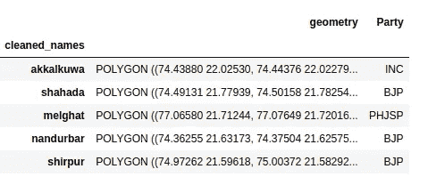

与地图数据相比，这是一种更简单的数据清理形式。这里，所有转换为小写的名称，以及开始和结尾的空格都被删除。 *join* 命令连接地图数据帧和该数据帧，其中选区名称匹配！

# 马哈拉施特拉邦的选举地图

```
# Plotting the election results
fig, ax = plt.subplots(1,figsize=(10, 6))
ax.axis('off')
ax.set_title('Maharashtra Election 2019', fontdict={'fontsize': '25', 'fontweight' : '3'})merged.plot(column='Party', cmap='plasma', linewidth=0.7, ax=ax, edgecolor='0.8', legend=True)
leg = ax.get_legend()
leg.set_bbox_to_anchor((1, 0.7, 0.2, 0.2))
```

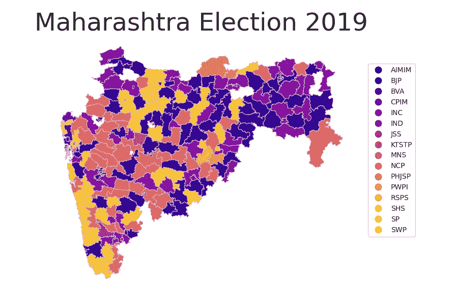

*子图形()*创建一个图形和轴实例，可用于设置图形的属性。这是一种面向对象的编程方式，相比之下， *plt.plot()* 是一种函数式的编程方式。这里的轴实例， *ax* ，用于设置绘图的标题，并删除绘图轴。m *erged.plot()* 绘制关于各方的 choropleth 图。这是 Pandas 特有的绘图方式，其中一个更通用的命令类似于 *DataFrame_Name.plot()* 。它使用 m *atplotlib* 作为后端，因此，与 *matplotlib* 特定命令如 *subplot()配合使用效果很好。**cmap*选项设置绘图的颜色方案。此外，g *et_legend()* 创建一个图例实例，它与 *set_bbox_to_anchor()* 一起使用，以便更准确地放置图例。

choropleth 地图上的白色斑块代表缺失的选区。这些是其名称为 *none* 并从 *map_df* 数据框中删除的议会选区。您可以尝试更多的 *cmap* 颜色选项，如图[所示](https://matplotlib.org/3.1.0/tutorials/colors/colormaps.html)。然而，人们必须看到，有太多的党，以确定他们所有的颜色。在未来，我们将探索更多关于提高理解和这个情节的美感！

完整的笔记本可以参考[这里](https://github.com/V-git-7003/Maharashtra_election_visualization)。