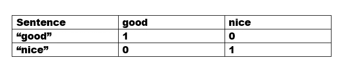
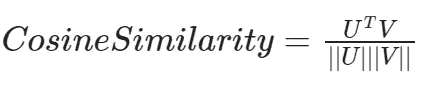
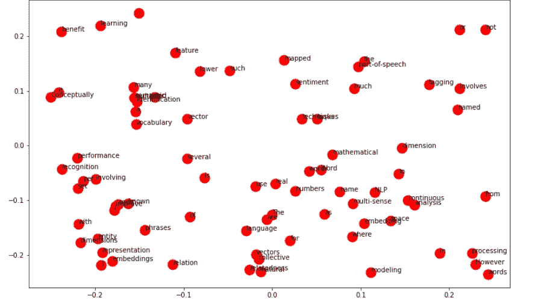
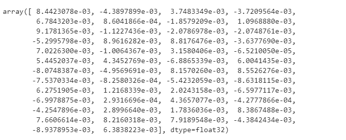
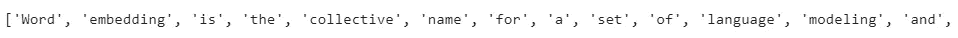
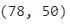
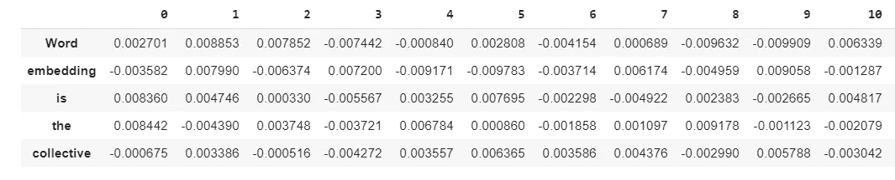
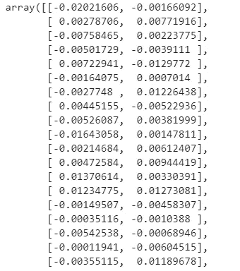
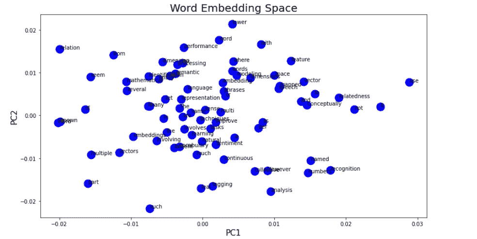

# 基于 Gensim 和 PCA 的单词嵌入向量可视化

> 原文：<https://towardsdatascience.com/visualization-of-word-embedding-vectors-using-gensim-and-pca-8f592a5d3354?source=collection_archive---------13----------------------->

## 在本文中，我们将学习如何使用单词嵌入来训练文本数据，并使用主成分分析来进一步可视化这些向量。

# **简介:**

有某些方法可以从任何文本数据中提取特征，然后输入到机器学习模型中。最基本的技术是—计数矢量器、Tf-Idf。这些技术的主要缺点是它们不能捕捉文本数据的语义，并且每个单词被分配到一个新的维度，就像一个热编码向量一样。因此，如果语料库规模相当大，那么维度可能高达数百万个单词，这是不可行的，并且可能导致模型不佳。我们可以使用简单的余弦相似度计算来验证这一点。假设我们有两个句子，每个句子包含一个单词“good”和“nice”。在这里，我们知道这两个词彼此有一些相似性，但是当我们使用计数矢量器向量计算余弦相似性时，结果是零。



其中 U 和 V 是两个句子-[1，0]和[0，1]的向量表示

# **什么是文字嵌入？**

这是一种将单词映射到实数向量的技术，同时捕捉关于文本含义的一些信息。它说，如果两个单词有相似的意思，它们将在密集的空间中彼此靠近。就像这两个词一样，我们前面用过的“好”和“漂亮”会在嵌入空间中彼此靠近。在本文中，我们将使用 gensim 库中的 Word2Vec 算法在密集空间中可视化这类单词。Word2Vec 包含两个模型，分别用于训练跳格模型和连续词袋(CBOW)。



对于想要熟悉单词嵌入的基本概念的人来说，他们应该首先回顾下面给出的文章。在本文中，我们将主要关注 python 的实现和可视化。

[](/introduction-to-word-embeddings-4cf857b12edc) [## 单词嵌入简介

### 什么是单词嵌入？

towardsdatascience.com](/introduction-to-word-embeddings-4cf857b12edc) [](https://medium.com/analytics-vidhya/maths-behind-word2vec-explained-38d74f32726b) [## Word2Vec 的数学优先解释

### 介绍

medium.com](https://medium.com/analytics-vidhya/maths-behind-word2vec-explained-38d74f32726b) 

# **Python 实现:**

## 数据集:

我从维基百科对单词嵌入的定义中摘录了一小段文字。我们将在密集的空间中呈现这篇课文的单词。

```
text="Word embedding is the collective name for a set of language modeling and feature learning techniques in natural language processing where words or phrases from the vocabulary are mapped to vectors of real numbers. Conceptually it involves a mathematical embedding from a space with many dimensions per word to a continuous vector space with a much lower dimension.The use of multi-sense embeddings is known to improve performance in several NLP tasks, such as part-of-speech tagging, semantic relation identification, and semantic relatedness. However, tasks involving named entity recognition and sentiment analysis seem not to benefit from a multiple vector representation."
```

**导入相关库:**

我们将安装 gensim 库并从中导入 Word2Vec 模块。此外，我们将导入 NLTK 并将其用于句子标记化。

## **标记化:**

我们将在 NLTK 分词器的帮助下对句子进行分词。

## Word2Vec:

我们在上一部分中获得的标记化格式的句子中采用的模型将被直接输入其中。除此之外，这个类还有各种参数——大小、窗口、最小计数、sg

**大小**=这决定了我们想要的单词表示的维数。(默认值=100)

**Window**=这是一个中心单词与其周围单词之间的最大距离。

**min _ count**=这是训练模型时要考虑的最小字数；出现次数少于此数的单词将被忽略。

**sg** =这指定了训练算法 CBOW (0)，Skip-Gram (1)

对于我们的设置，由于文本较少，我们将使用 min_count=1 来考虑所有的单词。我们将在跳格模型中使用窗口=50，因此 sg=1。

```
model = Word2Vec(tokens,size=50,sg=1,min_count=1)
model["the"]
```



我们可以看到单词“the”的矢量表示是通过使用模型[“the”]获得的。我们可以看到单词“the”的向量表示是在 50 维空间中。

我们可以把学过的词汇打印出来如下:

```
words=list(model.wv.vocab)
print(words)
```



词汇

此外，我们将在具有 50 维的数据帧中存储所有的词向量，并将该数据帧用于 PCA。

```
X=model[model.wv.vocab]
df=pd.DataFrame(df)
df.shape
df.head()
```



数据框的形状



数据帧

# PCA:

我们将使用 numpy 库实现 PCA。PCA 涉及的步骤如下-

**1-标准化数据集并计算相关矩阵。**

**2-使用特征分解计算特征值和特征向量。**

**3-对特征值及其对应的特征向量进行排序。**

**4-挑选两个最大的特征值，创建一个特征向量矩阵。**

**5-使用这些新特征向量的点积变换原始数据。**

在这种情况下，我们可以忽略标准化步骤，因为数据使用相同的单位。

获得的新数据集如下所示:



维度=(78，2)

# **可视化:**

我们将使用 matplotlib 来可视化密集空间中的单词。



# **结论:**

在本文中，我们学习了如何使用 Word2Vec 技术将文本数据转换为特征向量。此外，我们还学习了如何使用 matplotlib 和 PCA 在二维空间中表示这些单词向量。在我的下一篇文章中，我们将讨论单词嵌入技术背后的数学原理。

# **参考文献:**

[https://d2l . ai/chapter _ natural-language-processing-pre training/word 2 vec . html](https://d2l.ai/chapter_natural-language-processing-pretraining/word2vec.html)

# 感谢您的阅读！！！！

如果你喜欢我的工作，想支持我。

1-支持我的最好方式是在 [**中**](https://medium.com/@saketthavananilindan) **上关注我。**

2-关注我[**LinkedIn**](https://www.linkedin.com/in/saket-thavanani-b1a149a0/)**。**