# 用 Plotly 可视化。快递:综合指南

> 原文：<https://towardsdatascience.com/visualization-with-plotly-express-comprehensive-guide-eb5ee4b50b57?source=collection_archive---------3----------------------->

## 一个数据集和 70 多个图表。交互性和动画通常出现在一行代码中

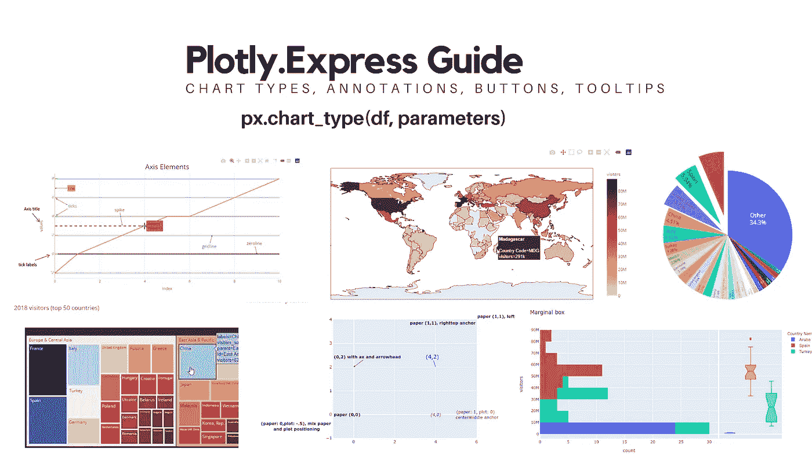

本文中的所有图片均由作者创作，图片属于本[许可](https://about.canva.com/license-agreements/onedesign/)。

我经常想出一个理想的形象，然后努力编码。这将是中肯的，富有表现力的，易于解释，但它是不可能创造的。当我发现 Plotly 时，它使绘图变得简单多了。

[阴谋地。Express](https://plotly.com/python/plotly-express/) ，在[版本 4.0.0](https://medium.com/plotly/introducing-plotly-express-808df010143d) 中首次引入，是 Plotly API 的一个高级抽象，经过优化可以完美地处理数据帧。这很好，虽然不是完美无缺。我认为最大的差距在于 API 文档的例子或链接的数量。这就是为什么我决定用我在图书馆的经历来写一本指南。

要运行图表和练习，请使用 Github 上的[plot ly Express-Comprehensive guide . ipynb](https://github.com/vaclavdekanovsky/data-analysis-in-examples/blob/master/Vizualizations/Plotly/Comperhansive%20Guide/Plotly%20Express%20-%20Comprehensive%20Guide.ipynb)笔记本。本文中的所有代码都是用 python 编写的。

目录:

*   [安装](#79e0) —和依赖关系
*   [阴谋地。快速语法—一行代码](#c162)
*   [数据至关重要](#ec6e) —我们应该将数据预处理成宽格式还是长格式？
*   [折线图](#41cc) —用于简单介绍，了解我们可以选择的输入数据和参数，以定制图表
*   [布局](#6899) —模板和样式
*   [注释](#909a) —帮助你描述数据
*   图表类型— [散点图](#2074)、[柱状图](#dd02)、[柱状图](#8723)、[饼图](#761c)、[甜甜圈](#2de5)、[旭日图](#d83e)、[树状图](#b12c)，带 [choropleth 的地图](#fb3e)，
*   [交互](#f38e) —改变图表的按钮
*   [陷阱](#2714)——以及其他需要改进的地方
*   [文件摘要](#0b2a)

# 安装 Plotly Express

普洛特利。Express 是 Plotly python 包的常规部分，所以最简单的就是全部安装。

```
# pip 
pip install plotly# anaconda
conda install -c anaconda plotly
```

Plotly Express 还要求安装 pandas，否则当你尝试导入时会得到这个错误。

```
[In]: import plotly.express as px
[Out]: **ImportError**: Plotly express requires pandas to be installed.
```

如果您想在 Jupyter 笔记本中使用 plotly，还有其他要求。对于 Jupyter 实验室你需要`[jupyterlab-plotly](https://plotly.com/python/getting-started/#jupyterlab-support-python-35)`。在普通笔记本上，我必须安装`nbformat` ( `conda install -c anaconda nbformat`)

# Plotly Express 语法—一行代码

普洛特利。Express 提供了创建多种图表类型的速记语法。每个都有不同的参数，理解参数是 Plotly 的关键。表达魅力。你可以用一个命令创建大多数图表(许多广告商说一行，但由于 [PEP8](https://www.python.org/dev/peps/pep-0008/#maximum-line-length) 建议每行最多 79 个字符，所以通常会更长)。


作者图片

```
import plotly.express as px# syntax of all the plotly charts
px.chart_type(df, parameters)
```

用 Plotly 创建图表。只表达你的类型`px.chart_type`(后面会介绍很多类型)。这个函数用你的数据`df`和图表的参数消耗一个数据帧。一些参数是图表特定的，但大多数情况下您输入`x`和`y`值(或`names`和`values`，例如在[饼状图](#761c)的情况下)。您用`text`标记数据点，并通过`color`、`dash`或`group`将其分成不同的类别(单独的线条、条形、饼图的扇形)。其他参数让你影响颜色，分裂为支线剧情(刻面)，自定义工具提示，轴的规模和范围，并添加动画。

大多数情况下，您将绘图分配到一个变量中，以便可以影响图形元素和布局的设置。

```
fig = px.chart_type(df, parameters)
fig.update_layout(layout_parameters or add annotations)
fig.update_traces(further graph parameters)
fig.update_xaxis() # or update_yaxis
fig.show()
```

# 数据集

尽管 plotly 附带了一些集成的数据集，但它们在许多现有的例子中使用过，所以我选择了我最喜欢的数据集，关于去每个国家旅游的[游客的数量](https://data.worldbank.org/indicator/ST.INT.ARVL)和他们在度假中花费的[钱](https://data.worldbank.org/indicator/ST.INT.RCPT.CD)。世界银行通过 [CC-BY 4.0 许可](https://datacatalog.worldbank.org/public-licenses#cc-by)提供该数据集。

与每个数据集一样，即使是这个数据集也需要一些预处理。关于旅游数据集，令人非常恼火的是，它将每个国家的值与地区总量混合在一起。预处理很简单([见代码](https://github.com/vaclavdekanovsky/data-analysis-in-examples/blob/master/Vizualizations/Plotly/Preprocess/Preprocessing.ipynb))，重要的是数据集以一种广泛的形式出现。

# 数据很重要(宽而长的数据帧)

所有数据帧都可以转换成多种形式。数据表可以是**宽**多列存储信息，也可以是**长**多行存储数据。幸运的是 python 和 pandas 库允许在它们之间轻松转换，使用`[DataFrame.T](https://pandas.pydata.org/pandas-docs/stable/reference/api/pandas.DataFrame.T.html)`将行转换成列，`[melt()](https://pandas.pydata.org/docs/reference/api/pandas.melt.html)`将列融合成长数据帧，`[pivot()](https://pandas.pydata.org/docs/reference/api/pandas.pivot.html)`和`[pivot_table()](https://pandas.pydata.org/docs/reference/api/pandas.pivot_table.html)`做相反的事情。Nicolas Kruchten 在他的[Beyond“tidy”](https://medium.com/plotly/beyond-tidy-plotly-express-now-accepts-wide-form-and-mixed-form-data-bdc3e054f891)文章中解释得很好，所以我不会在这里花更多的时间讨论它。还可以在 [Github](https://github.com/vaclavdekanovsky/data-analysis-in-examples/blob/master/Vizualizations/Plotly/Comperhansive%20Guide/Plotly%20Express%20-%20Comprehensive%20Guide.ipynb) 上看到评论笔记本里的所有数据操作。

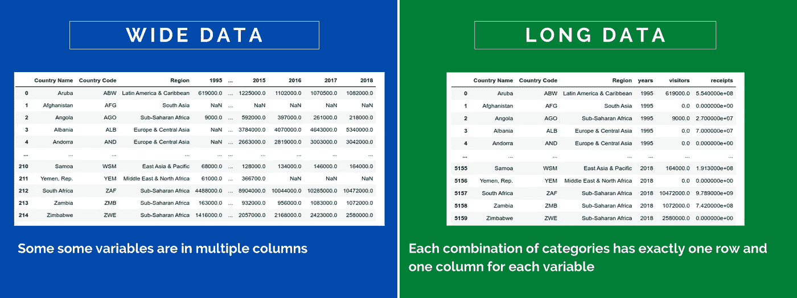

宽长数据格式的相同数据帧(图片由作者提供)

普洛特利。Express 最适合长数据。它被设计成接受一列作为参数。分类列影响元素(线条、条形等)，可以通过样式来区分，而值列影响元素的大小，可以显示为标签和工具提示。

## 广泛数据的有限可能性

您也可以使用 Plotly express 处理大量数据，但是使用案例有限。让我们来探索一下您可以对宽数据集及其限制做些什么。

所有图表的第一个参数几乎相同— `the dataset`、`x`和`y`。x 和 y 可以是 dataframe、`[padnas.Series](https://pandas.pydata.org/pandas-docs/stable/reference/api/pandas.Series.html)`或数组中的列名。我们的旅游数据集有很多列。因为我们将`years`作为列，将`Country Names`作为行，所以我们使用`[pandas.DataFrame.T](https://pandas.pydata.org/pandas-docs/stable/reference/api/pandas.DataFrame.T.html)`在它们之间切换。Express API 使用列。

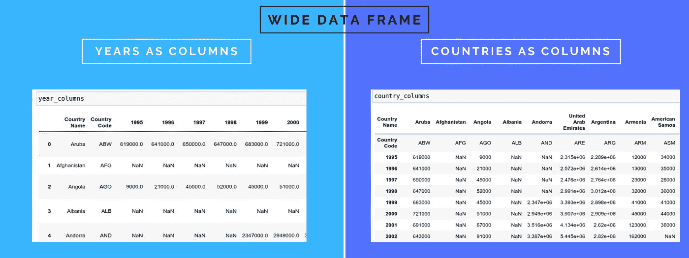

使用熊猫切换行和列。DataFrame.T(图片由作者提供)

下面，三种绘制图表的方法是等价的。自己查，但我觉得第一条最有道理。如果使用列或系列，其名称将显示为轴标签，而对于数组，您必须手动添加标签。

```
"""our dataset comes as a wide dataset with years as column. To turn the country names into the columns, we must set them as index and transpose the frame."""
country_columns = year_columns.set_index("Country Name").T# 1\. I had to reshape the data by transposing
px.line(country_columns
        ,y="Spain"
        ,title="Visitors to Spain")# 2\. you can specify the value as pandas.Series as well
px.line(country_columns, 
        y=country_columns["Spain"],
       title="Visitors to Spain")# 3\. or any array. In this case you must specify y-label. 
px.line(country_columns, 
        y=country_columns["Spain"].to_list(), 
        labels={"y":"Spain"},
       title="Visitors to Spain")
```

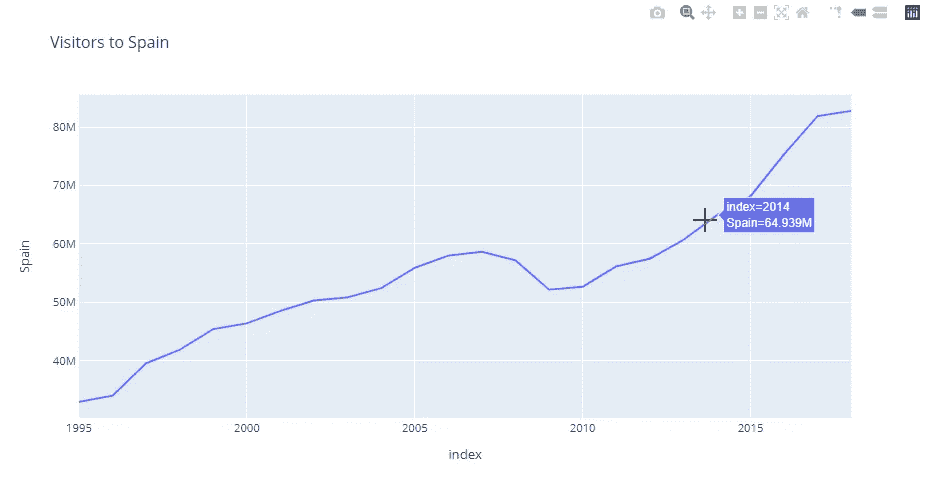

px.line(df，y="column_name "，title="…")创建的最简单的折线图。作者图片

> 拥有一个包含几个描述性列`*Country Name*`、`*Country Code*`、`Region`的数据集，并与数据列(如`*1995*`、`*1996*` — `*2018*`中的访问次数)混合，显示了 Plotly 的一个好处。聪明的做法是只考虑有值的列，忽略其余的。

您可以轻松地在图表中选取多个列。

```
px.line(country_columns, y=["Spain","Italy","France"])
```

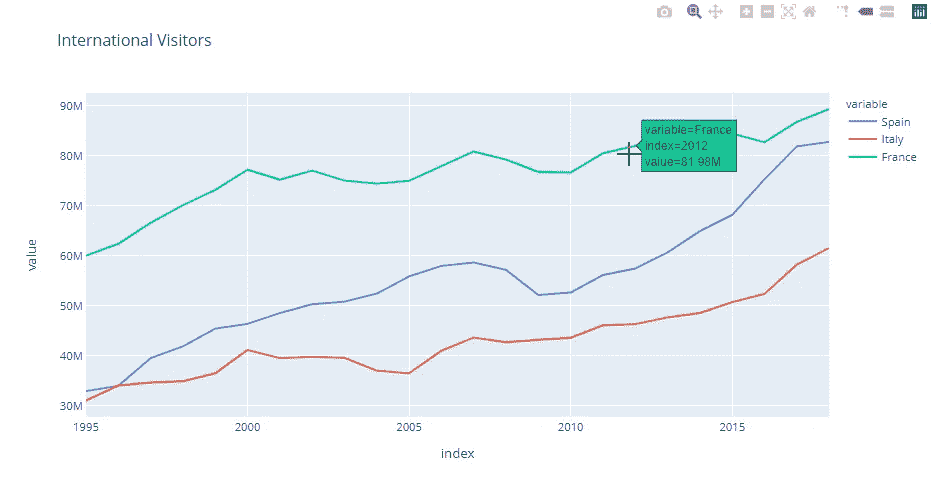

您可以轻松地向图表中添加多列。作者图片

## 宽数据框的限制

在 Plotly 中，您可以对包含许多列的数据集进行一些操作，但该库的真正强大之处在于长数据。**原因**，大部分参数恰好接受一列。它可以有几个不同的(通常是分类的)值，并对它们施展魔法，但不能有一个以上的列。以下代码导致了一个错误:

```
[In]:
try: 
  px.line(country_columns, y=["Spain","Italy","France"], 
          # trying to label the line with text parameter
          **text=["Spain","Italy","France"]**)except Exception as e:
  print(e)[Out]: **All arguments should have the same length. The length of argument `wide_cross` is 25, whereas the length of  previously-processed arguments ['text'] is 3**
```

您可以尝试选择其中一列，但结果是彻底失败。意大利和法国的折线图，标注了西班牙的游客数量。一场灾难。

```
px.line(country_columns, y=["Spain","Italy","France"], 
                text="Spain")
```

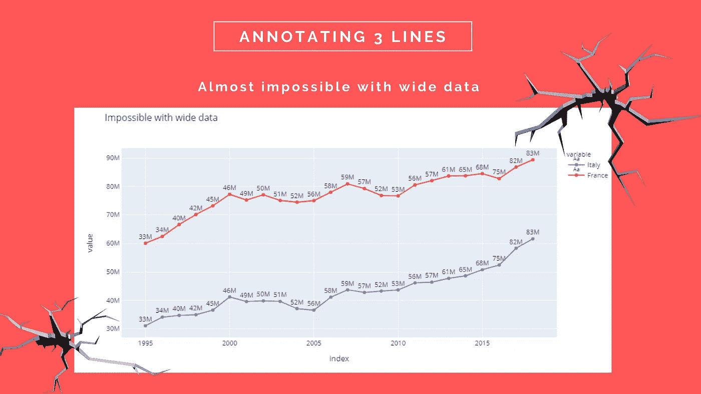

因为所有列都有相同的行数，所以可以用来自西班牙列的文本来注释法国和意大利的值。(图片作者，[图片授权](https://about.canva.com/license-agreements/onedesign/))

## 长数据 Metled 数据框架

普洛特利没有错。要利用这些参数，您必须使用长数据框。从广泛的数据集中，使用`.melt()`函数得到它。我还将只过滤 3 个国家，以免图表过于拥挤。

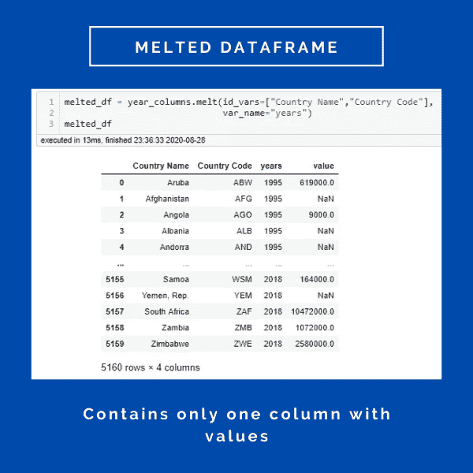

融化数据帧，使其在一列(或多列)中包含类别，在一列中包含值，这样您就可以利用 plotly 的参数。作者图片

```
spfrit = melted_df[melted_df["Country Name"].isin(["Spain","Italy","France"])]px.line(spfrit, 
        **x**="years", 
        **y**="visitors", 
        **color**="Country Name", 
        **text**="visitors",
       title="International Visitors")
```

为每个参数指定一列，让 plotly 确定其余的参数:

*   `x` — x 轴包含来自`year`列的所有不同值(1995 年至 2018 年)
*   `y` — y 轴覆盖从`visitors`栏开始的整个范围
*   `color` —将三种不同的颜色设置为`Country Name`列中的不同值(法国、意大利和西班牙)
*   `text` —给每一行标上每年的访客数量

# 折线图

让我们探索一下基本的折线图，看看使用 Plotly 可以多么容易地创建可视化效果。每个 Plotly 的图表都记录在几个地方:

*   图表类型页面-例如 Python 中的[折线图](https://plotly.com/python/line-charts/)-显示最常见的示例
*   Python API 参考——例如[express . line](https://plotly.com/python-api-reference/generated/plotly.express.line.html)——描述您可以使用的所有参数

在上一节中，您已经看到折线图需要有三种形式的`x`和`y`值，但是对于 Express 来说最常见的是使用列名来指定哪个数据框的列控制图形的功能。

## **折线图参数颜色、虚线、分组**

`color` —是许多图表类型的关键参数。它将数据分成不同的组，并给它们分配不同的颜色。每个组构成一个元素，在折线图中，它是一条单独的线。除非使用以下参数设置确切的颜色，否则颜色将被分配给每一行。

`**color_discrete_sequence**` —选择线条的预定义颜色，如`color_discrete_sequence = ["red","yellow"]`。如果您提供的颜色少于您的系列数量，Plotly 将自动分配剩余的颜色。

`**color_discrete_map**` —允许同上，但以字典的形式为特定系列分配颜色。`color_discrete_map = {"Spain":"Black"}`。

`**line_dash**` —与`color`类似，只是改变了破折号的图案而不是颜色

`**line_group**` —类似于颜色，用于区分分隔线条的值(类别)，但在这种情况下，所有线条都将具有相同的颜色，并且不会为它们创建图例。

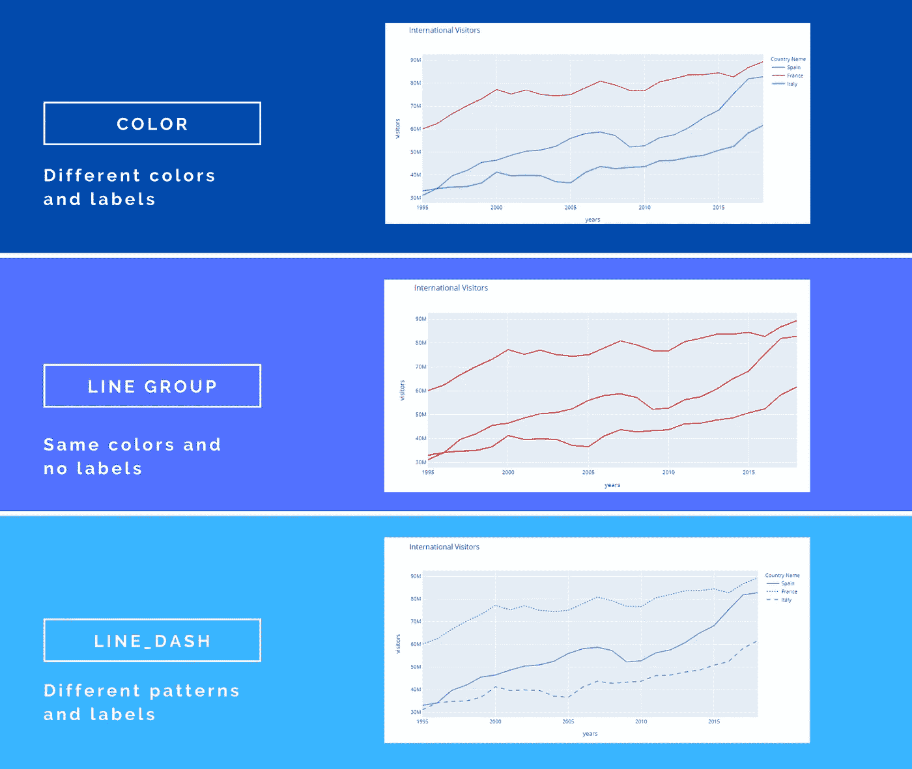

作者图片

## 工具提示

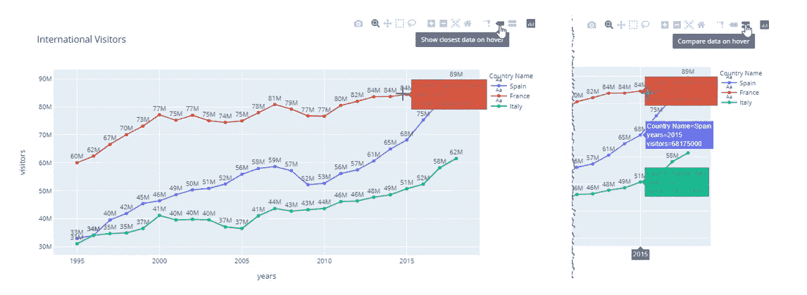

可以在交互式菜单上切换最近工具提示和比较工具提示。作者图片

Plotly 固有地带来了交互式工具提示。上面你可以看到你可以在最近的和所有的数据工具提示之间切换。还有一些参数可以进一步定制这些文本框— `hover_name`在工具提示的顶部突出显示该列的值。`hover_data`允许`True/False`出现在工具提示上的类别或值。`labels` param 让你重命名这些类别。


操作工具提示的选项。作者图片

## 其他有用的参数

我们为每个国家创建了 3 条不同颜色的线。将`color`参数更改为`facet_col`或`facet_row`以创建 3 个独立的图表。保持`facet`和`color`确保每条线有不同的颜色。不然也一样。你可以放大其中一幅图，其他的也会放大。

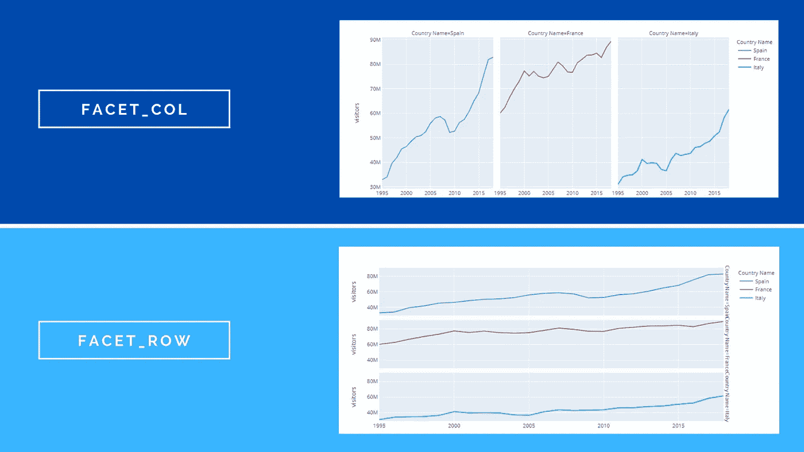

将多面图表分成行或列。作者图片

> 分面**支线剧情**也是用 Plotly.Express 创建支线剧情的唯一方法。不幸的是，你不能用 Express 在条形图顶部创建一个线形图。你需要 Plotly 的底层 API。

`range_x`和`range_y`参数允许放大图表。您可以随时使用交互式控制器查看全部数据。

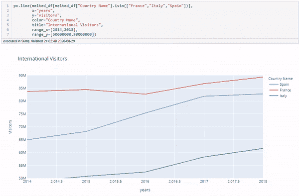

您可以设定默认放大，因为交互式控制器允许您更改它。作者图片

设置为`True`的`log_x`和`log_y`将改变这些轴在笛卡尔坐标中的对数比例。

## 动画片

最后，我们得到了制造 plotly 的参数。表达流行。**动画**。参数`**animation_frame**` 指向用于区分动画帧的列。我不得不稍微更新数据集来创建这个动画。列`years_upto`包含了所有的历史数据。有关更多信息，请参见 github 上的笔记本。

```
year_upto   year country visitors
1995        1995 ESP     30M
1996        1995 ESP     30M
1996        1996 ESP     33M
1997        1995 ESP     30M
1997        1996 ESP     33M
1997        1997 ESP     37M# then I use `year_upto` as the animation_frame parameter
px.line(spfrit, 
        x="years", 
        y="visitors", 
        color="Country Name",
        title="International Visitors",
        range_x=[1995, 2018],
        range_y=[25000000,90000000],
        **animation_frame="year_upto"**)
```

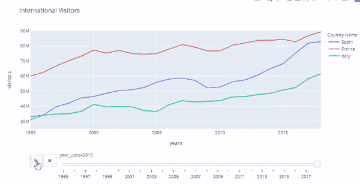

使用 animation_frame 参数的动画。作者图片

# 布局和风格

在我们开始介绍各种 Plotly 图表类型之前，让我们先探讨一下如何更新轴、图例、标题和标签的基本技巧。Plotly 准备了一个[样式指南](https://plotly.com/python/styling-plotly-express/)，但是许多图表类型只允许一些样式选项，这些选项很难从文档中找到。

> 每一张图都是一本字典

在背景上，每个图形都是一本字典。您可以将图表存储到一个变量中，通常是`fig`，并使用`fig.to_dict()`显示这个字典。

```
[In]: fig.to_dict()
[Out]:
{'data': [{'hovertemplate': 'index=%{x}<br>Spain=%{y}<extra></extra>',
   'legendgroup': '',
   'line': {'color': '#636efa', 'dash': 'solid'},
   'mode': 'lines',
...
```

由于这一点，你可以使用 3 种方式更新图表。

*   使用`fig.udpate_layout()`
*   使用特定参数，例如`fig.update_xaxis()`
*   通过改变背景字典

它们中的每一个有时都很棘手，因为您必须真正钻研文档才能理解一些参数。每个参数可以用 4 种不同的方式更新。

```
# Four options how to update the x-axis title
# 1.and 2\. using update_layout
fig.update_layout(xaxis_title="X-axis title",
                  xaxis = {"title": "X-axis title"})# 3\. using update_xaxes
fig.update_xaxes(title_text="X-axis title")# 4\. by modifying the dictionary 
fig["layout"]["xaxis"]["title"]["text"] = "X-axis title"# in the end you show the plot 
fig.show()
```

## 模板

设置图表样式最简单的方法是使用预定义的模板。Plotly 带有几个内置模板，包括 plotly_white、plotly_dark、ggplot2、seaborn，或者您可以创建自己的模板。

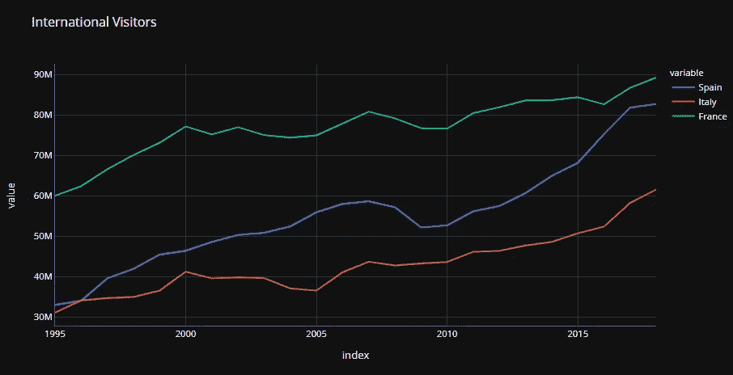

Plotly _ 黑暗主题。作者图片

## 亚西斯和克西斯

我们可以逐个更新其他参数。仅从二维笛卡尔轴的 2D 图表的轴上看，你有许多选择来改变什么(见 plotly [python](https://plotly.com/python/reference/layout/yaxis/) )。我们来看看最重要的。

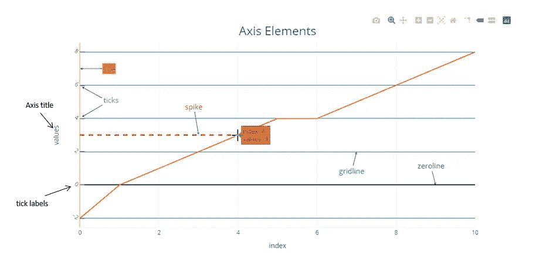

x 轴上显示的 plotly 轴的元素。作者图片

*   `visibility` —轴是否可见
*   `color` —线条、字体、刻度和网格的所有元素
*   `title` —轴标题(参数:文本、字体、颜色、大小、间距)
*   `type` —轴类型:线性、对数、日期、类别或多类别
*   `range` —轴的取值范围([自动量程](https://plotly.com/python/reference/layout/xaxis/#layout-xaxis-autorange)，量程模式，量程)
*   `ticks` —记号和相应的网格线(记号模式、记号值、记号、记号角等)。)
*   `spike`——在点和轴之间画的线

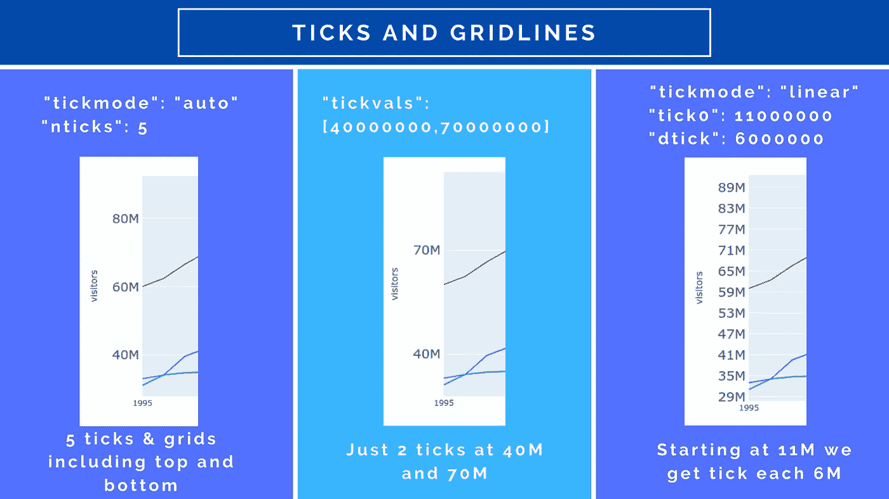

如何格式化轴刻度的各种选项。作者图片

x 轴的一个很酷的选项是范围滑块。您使用`fig.update_xaxes(rangeslider_visible=True)`进行设置，它会突出显示您放大的那部分绘图。它对时间序列非常有用。

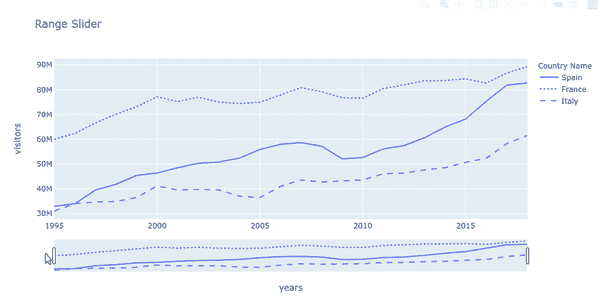

范围滑块让您了解缩放的位置。作者图片

稍后，我将讨论刻度的一些陷阱以及类别和线性模式之间的区别，但是现在，让我们继续，看看另一个用于突出图表关键区域的重要特征。

## 释文

将特定文本添加到图表中称为注释。注释有几个基本的用例:

*   突出重点
*   描述/突出一个地区
*   要标记所需的点
*   而不是一个传说

我们将在下图中展示所有 4 种做法。我们在图表外标注起点值，注释断点，放置一条关于旅游业增长的信息，并在其右端绘制图例。

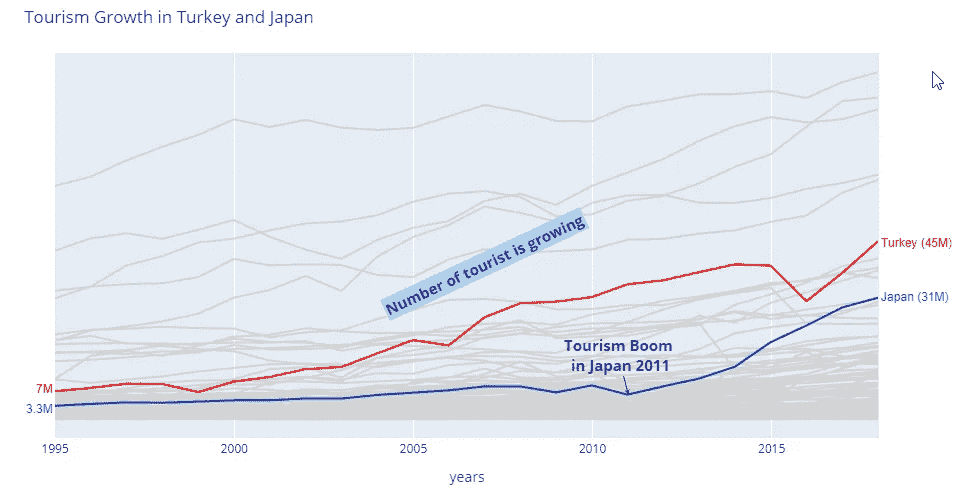

注释的 4 种不同用例。作者图片

上面的图表很棘手。Plotly 按照出现的顺序排列线条，所以数据必须进行排序。还要表达一下从长数据帧中分配颜色有点困难(我知道我说的是长数据帧是理想的解决方案，它们不是 100%)，所以我不得不施点小魔法，你可以研究这个要点或阅读[高亮线图](/highlighted-line-chart-with-plotly-express-e69e2a27fea8)文章中的详细指南。

> 您可能还会注意到，随着行数的增加，Plotly 会自动切换到 [WebGL 格式](https://en.wikipedia.org/wiki/WebGL)，这证明可以提高包含许多数据点的 JavaScript 绘图的可用性。

```
[In]: type(fig.data[0])
[Out]: plotly.graph_objs._scattergl.Scattergl
```

关于注释，您有几个选项可以影响它们的位置。您在`.fig.update_layout(..., annotations=[])`中将所有注释设置为一个列表，它包含一个指定标签参数的字典列表:

```
annotations = \
[{"xref":"paper", "yref":"paper", "x":0, "y":0.15,
  "xanchor":'right', "yanchor":"top",
  "text":'7M',
  "font":dict(family='Arial', size=12, color="red"),
  "showarrow":False}, ... other annotations ...]
```

您可以指定标签和数据点之间的位置、字体和箭头。文本的坐标`x`和`y`既可以指向绘图，也可以指向画布。`"xref"="paper"` `(0,0)`是绘图区的左下角，`(1,1)`是右上角。在图表中，您使用轴上的`x`和`y`值进行引用(例如 2008 年和 10_000_000 访问者)。

位置还取决于`anchor`(上-中-下、左-中-右)、偏移和调整。可以通过设置字体来修改每个注释，或者可以在文本上应用 HTML 标签，如`<b>`或`<i>`。


Plotly 表示注释位置和其他参数。作者图片

# 条形图

现在，当我们知道如何创建一个图表，更新其布局，并包括注释，让我们探索另一个典型的图表类型。我们将从条形图开始，这是另一种流行的显示趋势和比较类别数据的方法。语法保持不变，只有一行代码:

```
px.bar(df, parameters)
```

[条形图 API 文档](https://plotly.com/python-api-reference/generated/plotly.express.bar.html)描述了所有参数。大多数参数与折线图的参数相同。

## 酒吧模式

条形图有三种模式。`Relative`将条形堆叠在一起。`overlay`以较低的不透明度在彼此的顶部绘制线条，而`group`用于聚集的列。

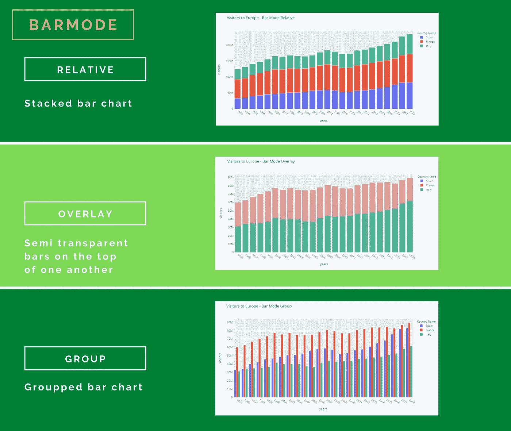

不同的条形码具有相同的数据。作者图片

## 颜色；色彩；色调

像线条一样，线条也可以着色，以产生视觉冲击力。您可以使用`color`参数设置为一个类别(如国家名称)用调色板中的不同颜色给每个条着色，或将颜色设置为一个值(如游客)以区分游客参观的规模。

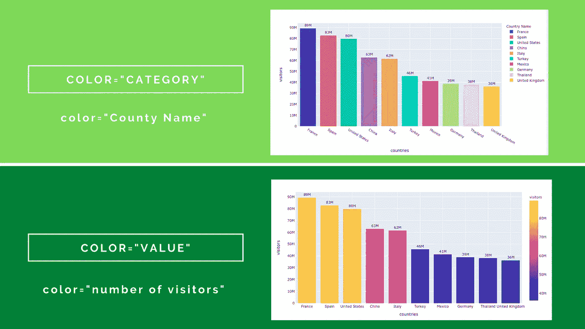

颜色参数的不同应用。您可以在标尺上区分类别或值。作者图片

用`color_discrete_sequence`所有的条可以有相同的颜色，你可以根据规模应用不同的颜色——在我们的例子中使用`color_continuous_scale`的访问者数量。

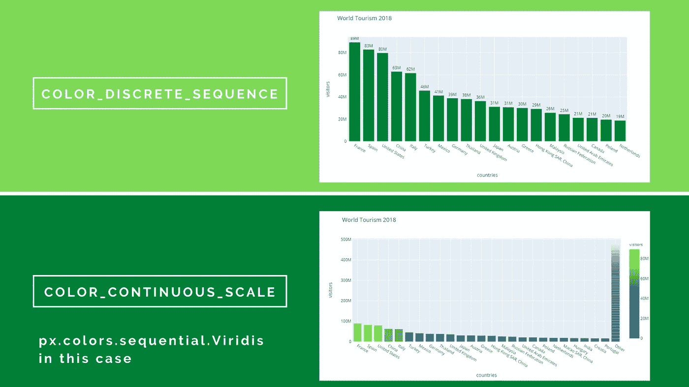

单色条形图或色标。上面的图显示了 2018 年前 20 个最受欢迎的国家，下面的图显示了前 25 名，其余的则堆积在其他列中。代码见笔记本。作者图片

## 组合线条条形图

有一件事很神秘。在组合类型的图表中，快速真的很糟糕。您可以在折线图中添加条形，但不能反过来做。而结果呢，是啊，自己拿主意。

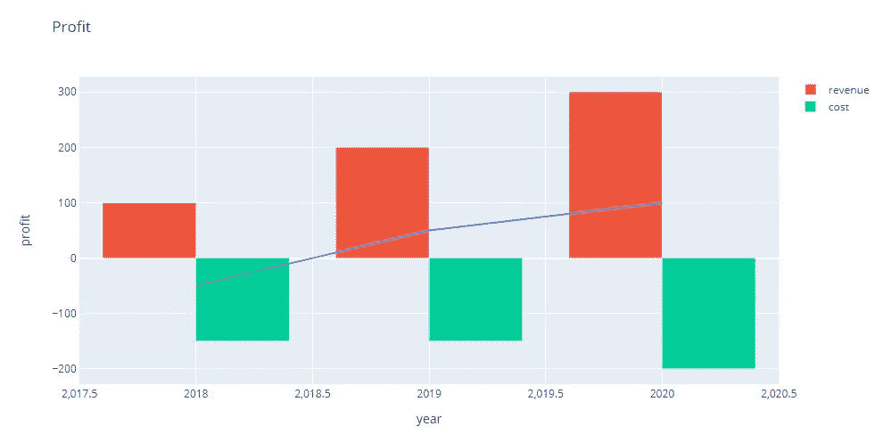

plotly 中的组合图表。表达是一种痛苦。作者图片

> 如果你想用一些混合类型的图形，使用 Plotly 的低级 API。这比 Express 能做的更多，但是代码更长。

## 动画条形图

参数`animation_frame`让你做动画魔术。但闪光的不全是金子。你必须为所有帧设置相同的范围[0-100 米]，但图表仍在跳动，因为尽管 y 轴`standoff`有足够的空间，较长的国家名称仍会移动图表。此外，在第二个动画帧上，原本在条形外部的标签进入了条形内部。这将需要更多的定制是完美的。

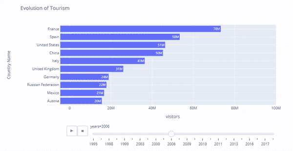

动画条形图显示每年前往十个最热门旅游国家的游客数量不断增长。作者图片

## 柱状图

从技术上讲，直方图是一种没有间隔的条形图。直方图的强大之处在于，它自动将数据分成多个条块，并聚合每个条块中的值。但是它做得还不是很好。

[](/histograms-with-plotly-express-complete-guide-d483656c5ad7) [## 带 Plotly Express 的直方图:完整指南

### 一个数据集，60 多个图表，以及所有解释的参数

towardsdatascience.com](/histograms-with-plotly-express-complete-guide-d483656c5ad7) 

直方图使用类似于条形图的参数。您可以使用`color`按类别分割媒体夹。


每个柱状图都可以用颜色参数分成不同的类别。作者图片

直方图也有自己的参数。`nbins`影响箱柜数量。

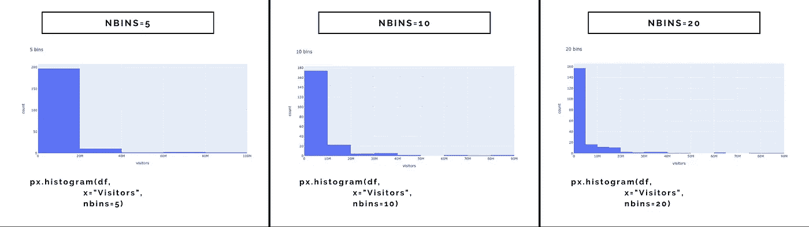

nbins 参数影响直方图的箱数。作者图片

`Histfunc`允许改变聚合函数。当然，当你在 10 和 20 之间的区间上做平均值、最小值或最大值时，这些值将位于这个范围内，所以这样的直方图将创建一个阶梯模式。


除了计数和求和之外，其他历史函数创建了阶梯式模式。它们在分类直方图中有用例，分类直方图在技术上是一个规则的条形图。作者图片

您也可以通过设置`cumulative=True`来创建累积直方图。


常规和累积直方图。作者图片

`Barnorm`让您将每个箱中的值标准化到 0–100%之间。Barnorm 参数在每个 bin 中归一化，因此值`10, 40, 50`形成`10%, 40% and 50%`，而`100, 400 and 500`创建同样高度的图表也是`10%, 40% and 50%`。您可以选择用`barnorm="percentage"`显示百分比或用`barnorm="fraction"`显示小数。

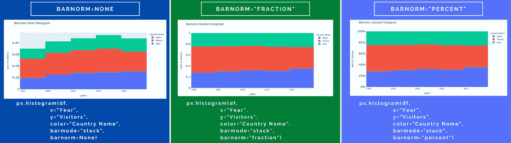

应用于堆积直方图的 Barnorm。作者图片

`Histnorm`参数非常相似，但是归一化不是在一个仓内，而是针对所有仓中的每个类别。如果您的类别 A 在第一个 bin 中出现两次，在第二个 bin 中出现 5 次，在最后一个 bin 中出现 3 次，则 histnorm 将为`20%, 50% and 30%`。

直方图(和散点图)的特定参数是边际图。它可以让你创建一个小的侧图，显示底层变量的分布细节。有四种类型的边际图表— `rug`、`histogram`、`box`和`violin`创建具有相同名称的侧图。

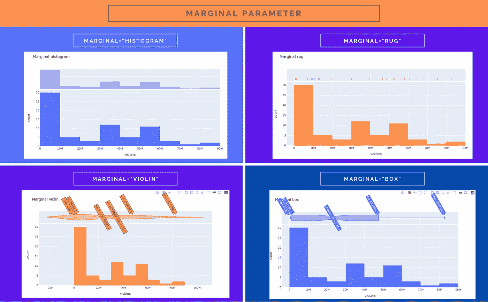

直方图的 4 个马丁戈尔支线图选项。作者图片

通常情况下，您需要对宁滨进行更多的控制，您宁愿自己计算面元并使用`px.bar`和`fig.update_layout(bargap=0)`绘制它们。


使用 px.bar()创建的直方图。作者图片

## 圆形分格统计图表

另一个实现可视化的方法是使用饼图。

```
# syntax is simple
px.pie(df, parameters)
```

当你阅读[文档](https://plotly.com/python-api-reference/generated/plotly.express.pie.html)时，你会了解到饼状图没有`x`和`y`轴，只有`names`和`values`。

## 拉派的痕迹

其中一个很酷的事情是，你可以拉一些情节的片段来突出它们。它不是`.pie()`的参数，但您可以使用`fig.update_traces()`添加它。`Text`轨迹的配置也允许将标签设置为百分比、值或标签(或三者的任意组合，例如`fig.update_traces(textinfo="percent+label")`)

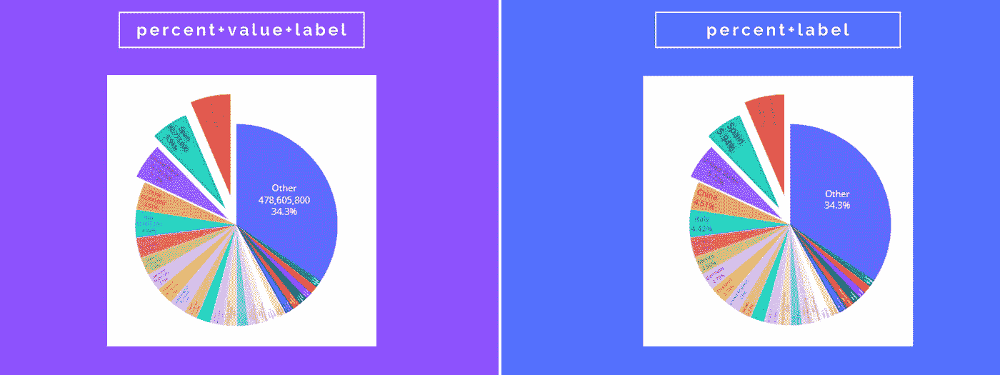

您可以快速更改看到的标签。作者图片

## 圆环图-孔参数

饼状图有点好玩，使用`hole` param 你可以把它变成一个圆环图。像所有以前的图表一样，当您与标签交互时，它会重新计算值。


圆环图是一个带孔的饼图。作者图片

## 旭日图

与饼图非常相似的是旭日图。它可以显示几层数据。例如，在我们的情况下，一个区域和该区域的国家。当你点击任何一个“家长”时，你就会得到那个地区的详细信息。您可以通过输入`names`、`values`、`parents`等创建情节，如下图所示:

```
fig = px.sunburst(
    chart_df,
    path=['Region', 'Country'],
    values='Visitors',
)
```


作者在 Plotly.Express. Image 中的旭日剧情互动

## 树形图

如果在显示大量数据时，饼图和旭日图难以阅读，那么树形图则正好相反。您可以使用颜色，并根据分类列分配离散刻度或连续刻度。

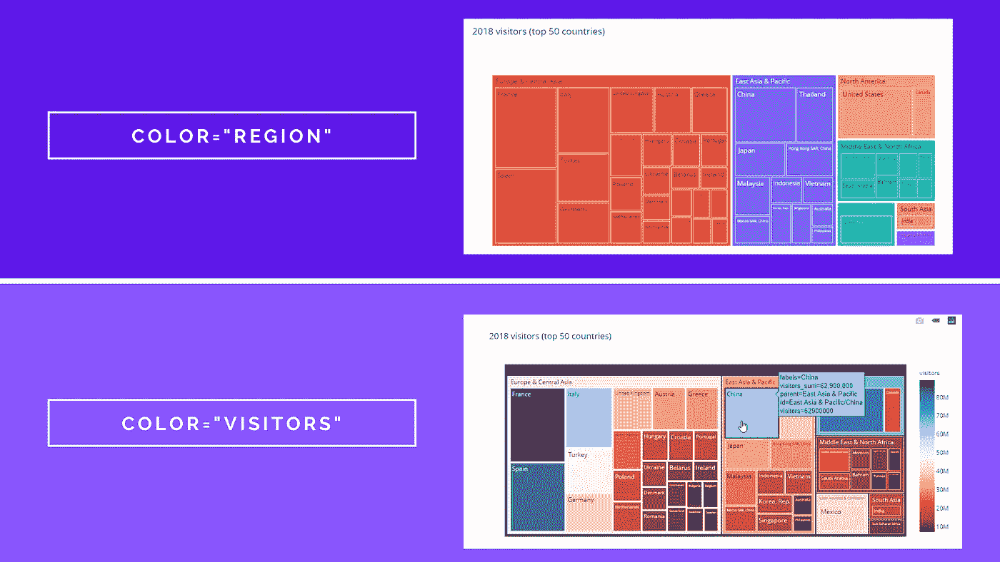

树形图是显示大量数据之间关系的理想选择。作者图片

## Choropleth 使用 plotly 绘制地图

我们正在研究关于世界的数据，在如何显示这些数据方面，使用地图是一个显而易见的选择。Plotly 支持显示地理空间数据，内置国家形状、区域范围以及调整颜色和其他参数的选项。


地理空间数据利用了 Plotly 的地图支持。作者图片

> 根据[文档，](https://plotly.com/python-api-reference/generated/plotly.express.choropleth.html)国家由 ISO-3 代码、国家名称或美国州名识别。如果你想挖得更深，你必须得到你自己的地理坐标`geojson`。

## 散点图

散点图是最常见的图类型之一。它们可以很容易地显示二维数据之间的关系，使用颜色和大小，您可以用更多的信息来包装您的可视化。然而，我们将从我们离开的地方开始。在[地理](/pythons-geocoding-convert-a-list-of-addresses-into-a-map-f522ef513fd6)中使用`scatter_geo`图形。

```
fig = px.scatter_geo(
    melted_df.fillna(0), 
    locations ="Country Code", 
    color="visitors",
    size="visitors",
    # what is the size of the biggest scatter point
    size_max = 30,
    projection="natural earth",
    # range, important to keep the same range on all charts
    range_color=(0, 100000000),
    # columns which is in bold in the pop up
    hover_name = "Country Name",
    # format of the popup not to display these columns' data
    hover_data = {"Country Name":False, "Country Code": False},
    title="International Tourism",
    animation_frame="years"
                     )
fig.update_geos(showcountries = True)
fig.show()
```

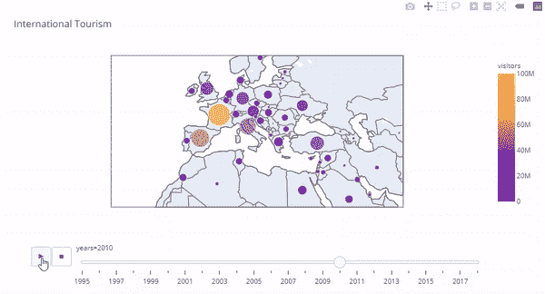

散点 _ 地理图动画。作者图片

重要的`scatter_geo`参数是`max_size`允许设置气泡的最大半径，以及`opacity`确定多少绘图是可见的。

## 散点图

常规散点图通常用于显示两个变量之间的关系。在我们的例子中，游客的数量和他们在这个国家的花费。我只关注 2018 年。`size`参数影响气泡的大小，而`color`参数允许您根据分类或连续变量设置颜色。

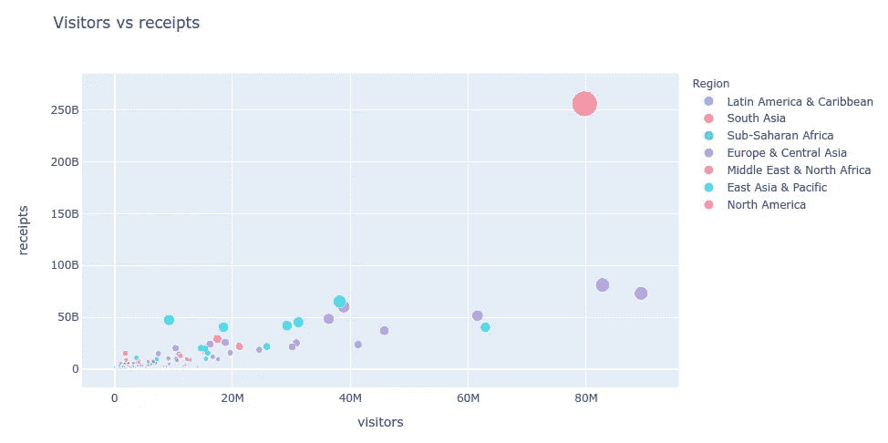

基本散点图，显示游客数量和他们的支出之间的关系。颜色区分每个区域。作者图片

散点图允许很容易地添加边际图，以突出由`color`参数指定的一个变量或几个变量的分布。您可以从 4 种边际地块中选择— `box`、`violin`、`histogram`或`rug`。您只需通过应用`marginal_x`或`marginal_y`参数，例如`marginal_x=”rug”`，即可对其进行设置。您还可以在图表上为每种颜色绘制一条趋势线。

```
px.scatter(df,
          x="visitors",
          y="receipts",
          color="type",
          hover_name="Country Name",
          size="receipts",
          **marginal_x="histogram",
          marginal_y="box",**
          trendline="lowess",
          title="Scatter plot with histogram and box marginal plot and two trendlines")
```

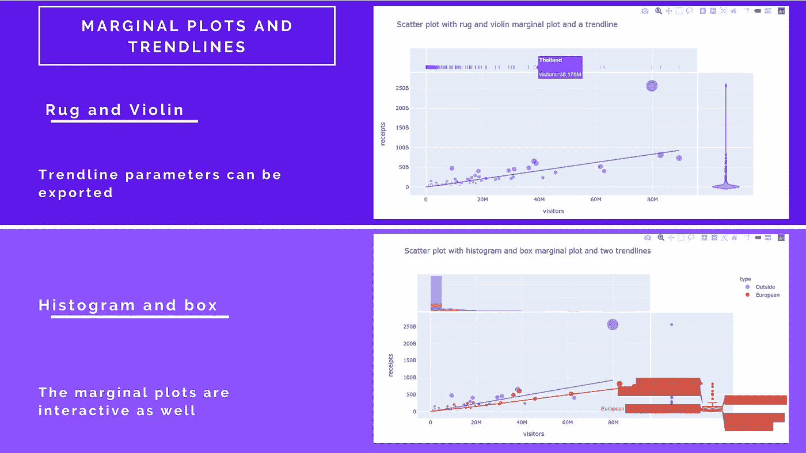

散点图允许通过添加单个参数来添加 4 种边际图和趋势线。作者图片

> 要绘制趋势线，你需要安装 [statsmodel](https://www.statsmodels.org/stable/install.html) 库

```
conda install -c anaconda statsmodels
# or
pip install statsmodels
```

借助`statsmodels`库，您还可以显示用于计算趋势线的回归模型的参数。

```
# get the parameters via `get_trendline_results`
res = px.get_trendline_results(fig)# get the statsmodels data
[In]:
trendline = res["px_fit_results"].iloc[0]
print(type(european_trendline))[Out]: <class 'statsmodels.regression.linear_model.RegressionResultsWrapper'># print the summary
trendline.summary()
```

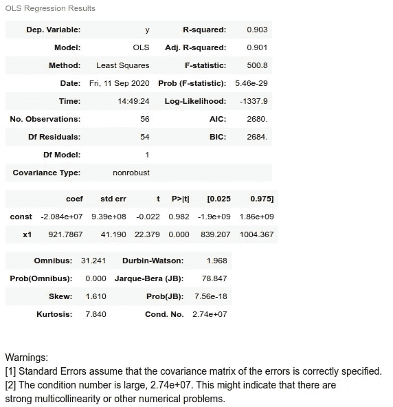

Plotly 使用 statsmodels 来计算趋势线。您可以导出其参数。作者图片

# 交互式按钮

Plotly 的成功可以归功于交互功能。每个图表的右上角都包含一个菜单，可以进行放大和缩小等基本操作，当您将鼠标悬停在图表元素上时会出现什么工具提示，或者您可以通过单击将图保存为图像。

您还可以添加交互式按钮(或下拉菜单),让用户改变图形的外观。您可以使用参数`method`添加四种类型的动作:

*   `restyle` —影响数据或图表类型的外观和感觉
*   `relayout` —改变布局的属性
*   `update` —结合了上述两种方法
*   `animate` —允许控制动画特性

您可以在图表上放置几组按钮。它们可以并排排列(或上下排列)，也可以下拉排列。

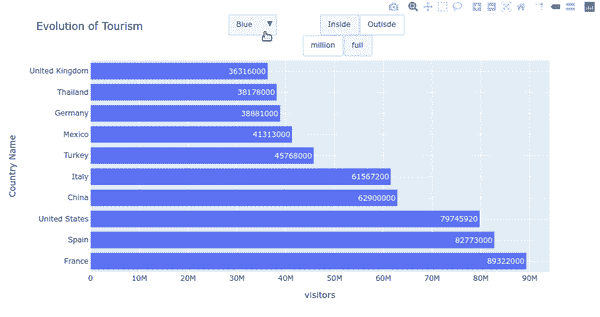

使用 Plotly 按钮更改颜色和标签。作者图片

## 相互作用

[文档](https://plotly.com/python/custom-buttons/#methods)展示了一些基本的交互，但是如果你计划做一些其他的事情，实现它是相当棘手的。最好的技巧是创建你想要达到的最终外观，使用`fig.to_dict()`转储字典，并将字典的相关部分复制到按钮的`arg[{...}]`中，例如:

```
# create the chart and export to dict
px.bar(df, x="visitors", range_x=[0,10]).to_dict()# read the dict to find the relevant arguments for the update 
# arg. xaxis.range of the relayout changes the x_range fig.update_layout(
  updatemenus=[
  dict(
    buttons=list([
      dict(
        args=[{"xaxis.range":[-2,10],
               "yaxis.range":[0,5.6]}],
                label="x:right 1, y:bottom 0",
                method="relayout", 
        )]),           
        type="buttons",
        showactive=True,
        x=1,
        xanchor="right",
        y=0,
        yanchor="bottom"
    )])# see the full example on github for more ideas
```

> 查看 [github](https://github.com/vaclavdekanovsky/data-analysis-in-examples/blob/master/Vizualizations/Plotly/Comperhansive%20Guide/Plotly%20Express%20-%20Comprehensive%20Guide.ipynb) 笔记本，了解更多关于如何使用按钮的想法，或者探索 [Plotly 文档](https://plotly.com/python/custom-buttons/#methods)中的示例。

我成功地更改了标签、颜色和范围，但未能更改输入值(如更改源数据)。

## 按钮的位置

您可以使用坐标系将按钮放置在绘图区的四周，其中 x: 0，y: 0 是图表的左下角(一些像饼图这样的绘图不会填充整个区域)。您也可以将`xanchor`和`yanchor`设置为左-中-右或上-中-下。

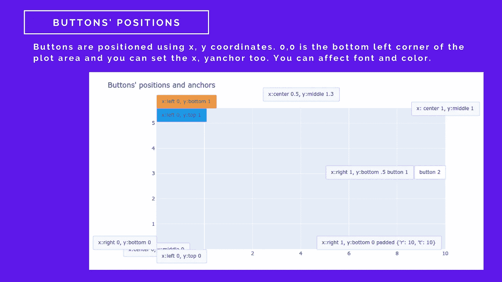

图形按钮的位置、背景颜色和按钮组。作者图片

> 单击按钮有时会改变它们的位置

您可以使用`pad={"r": 10, "t": 10}`微调位置。这些值以像素为单位，您可以填充`r`-右、`l`-左、`t`-上、`b`-下。您还可以更改按钮的字体和颜色。

# 导出 Plotly

您可以将生成的图表导出为一个交互式 HTML 页面，让您完成所有的绘图魔术，如缩放、打开/关闭数据或查看工具提示。

```
fig.write_html(f"{file_name}.html")
```

您可以指定几个参数，指定是否包含 3MB·普洛特利. js，动画是否在打开时启动，或者 html 文档的结构如何— [文档](https://plotly.github.io/plotly.py-docs/generated/plotly.io.write_html.html)。

您也可以使用`.write_image()`将图像导出为**静态图片**。它可以让你导出几种格式，如`.png`、`.jpg`、`.webp`、`.svg`、`.pdf`或`.eps`。您可以更改尺寸和比例。Plotly 使用`kaleido`作为默认引擎，但是你也可以选择一个传统的`orca`引擎。

```
# install caleido
pip install -U kaleido
#or conda install -c plotly python-kaleido# export the static image
fig.write_image(f"{file_name}.png")
```

# 熊猫默认后台

你可以设置 Plotly 作为熊猫默认绘图后端。

```
pd.options.plotting.backend = "plotly"
```

然后将 plotly 参数应用于数据框本身。

```
fig = df.plot(kind="bar", x="x", y="y", text="y")
fig.show()
```

然而，它很容易将 dataframe 作为第一个参数输入，以至于您可能更喜欢 pandas 默认设置，将 matplotlib 作为后端。

```
# return to defaul matplotlib backend
pd.options.plotting.backend = "matplotlib"
```

# 几个陷阱

一旦你熟悉了 Plotly。表示你很少遇到你无法解决的问题。我们已经说过，用支线剧情表达斗争。还有一些其他情况会让你心跳加速。但即使是这些也有一个简单的解决方案。

如果您想要显示整数类别的数值计数，例如 1，2，3 号玩家赢得奖牌的次数，使用 Matplotlib 的标准 padnas 绘图很简单。

```
"""if you want to display which values are the most frequent and these values are integers"""df = pd.DataFrame({"x": [3]*10+[6]*5+[2]*1})
df["x"].value_counts().plot(kind="bar")
```

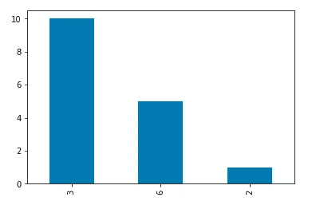

熊猫的价值计算图。作者图片

但是如果你用 Plotly 做同样的尝试，它会自动假设你想在 x 轴上显示一个连续的整数范围。

```
"""it's rather impossible with plotly which always set up the range containing all the numerical values"""fig = px.bar(df["x"].value_counts())
fig.show()
```

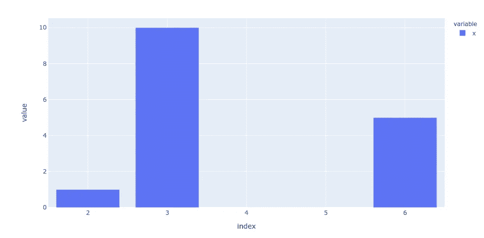

如果您没有指定任何内容，plotly 会自动将看起来像整数/浮点数的数据点转换成整数/浮点数。作者图片

要获得预期的图表，您必须将值转换成类别，尽管在 pandas 中不是这样。

```
df["y"] = df["y"].astype("category")  # or .astype("string")
```

您必须更改 Plotly 布局参数中的轴:

```
fig.update_xaxes(type="category")
fig.show()
```

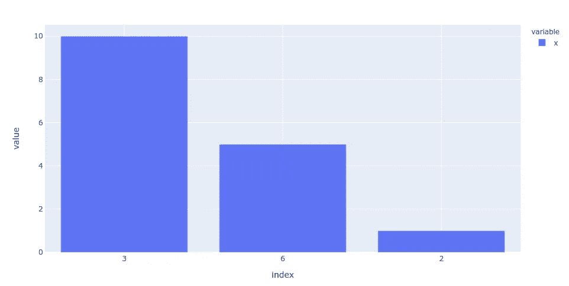

瞧，分类轴显示的数值和你输入的完全一样。作者图片

Plotly 还自动处理日期值，这在季末(年/季度)的情况下特别烦人。

```
"""Also the daterange labels on the x-axis can annoy you when you try to display end of the year/quarter dates. 
Plotly will always turn them into the Jan next year or the beginning of the following quarter"""df = pd.DataFrame({"x":[**"2019-12-31","2019-03-31","2018-12-31","2017-12-31"**],
                   "y":[10,12, 15, 8]})
fig = px.bar(df, x="x", y="y")
fig.show()
```


Plotly 自动缩放日期轴，当您想要显示年/季度的结束并 Plotly 将标签转到下一季的开始时，这很烦人。作者图片

Plotly 自动缩放轴标签以显示时间分布，但是如果您想要显示年末(季度)日期，您将会非常失望地看到下一年的开始。例如，如果你想在每年年底显示公司的财务数据，而你看到的是“2020”，而不是“2019 年底”，你可能会对公司的健康状况产生完全错误的印象。修复是相同的`fig.update_xaxes(type="category")`

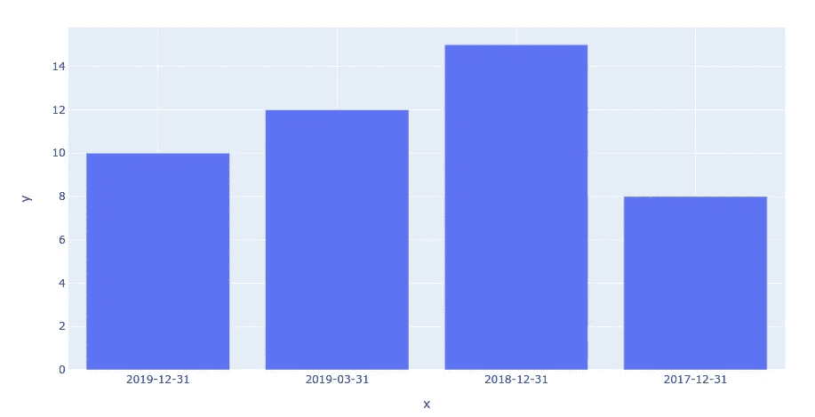

x 轴上的 Plotly 日期作为一个类别。作者图片

Plotly 很聪明，一旦你用一个日期填充轴，它就认为它是一个日期轴。有时，您可能希望在同一轴上显示日期和字符串值。解，又是`.update_xaxes(type="category")`。

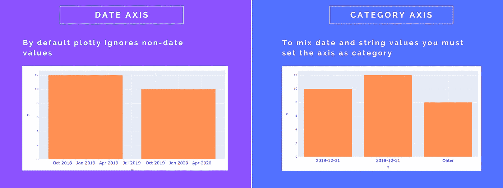

日期轴忽略所有非日期值，而分类轴按原样显示所有内容。作者图片

# 文件摘要

*   散点图— [API](https://plotly.com/python-api-reference/generated/plotly.express.scatter.html) ，示例
*   折线图— [API](https://plotly.com/python-api-reference/generated/plotly.express.line.html) 、[示例](https://plotly.com/python/line-charts/)
*   条形图— [API](https://plotly.com/python-api-reference/generated/plotly.express.bar.html) ，[示例](https://plotly.com/python/bar-charts/)
*   饼图— [API](https://plotly.com/python-api-reference/generated/plotly.express.pie.html) 、[示例](https://plotly.com/python/pie-charts/)
*   旭日图— [API](https://plotly.com/python-api-reference/generated/plotly.express.sunburst.html) ，[示例](https://plotly.com/python/sunburst-charts/)
*   树形图— [API](https://plotly.com/python-api-reference/generated/plotly.express.treemap.html) ，[示例](https://plotly.com/python/treemaps/)
*   Choropleth — [API](https://plotly.com/python-api-reference/generated/plotly.express.choropleth.html) 、[示例](https://plotly.com/python/choropleth-maps/)
*   散点图 _ 地理图— [API](https://plotly.com/python-api-reference/generated/plotly.express.scatter_geo.html) ，[示例](https://plotly.com/python/scatter-plots-on-maps/)
*   散点图— [API](https://plotly.com/python-api-reference/generated/plotly.express.scatter.html) 、[示例](https://plotly.com/python/line-and-scatter/)
*   直方图— [API](https://plotly.com/python-api-reference/generated/plotly.express.histogram.html) ，[示例](https://plotly.com/python/histograms/)
*   [趋势线](https://plotly.com/python/linear-fits/)
*   轴— [API](https://plotly.com/python/reference/layout/yaxis/)
*   文本和注释— [示例](https://plotly.com/python/text-and-annotations/)
*   边际地块— [示例](https://plotly.com/python/marginal-plots/)
*   导出— [write_html](https://plotly.github.io/plotly.py-docs/generated/plotly.io.write_html.html) 或 [write_image](https://plotly.github.io/plotly.py-docs/generated/plotly.io.write_image.html)
*   按钮(更新菜单)— [API](https://plotly.com/python/reference/layout/updatemenus/) ，[示例](https://plotly.com/python/custom-buttons/)

# **结论**

Plotly express 是一种使用单一图表类型快速显示数据的好方法。它有互动和动画等重要功能，但缺乏支线剧情的支持。Express 很聪明，它在大多数情况下用数据的逻辑子集分割数据框。但是如果它猜错了，几乎不可能说服 Plotly 按照你想要的方式显示数据。

有时这需要一点尝试和错误。这通常有助于将图表导出到 dict 中，并尝试找到您想要更新的参数的正确名称。如果无法使用 Plotly 创建所需的可视化效果。Express 你总是可以替换为[更低级的 API](https://plotly.com/) ，它更加仁慈，但是也需要更多的编码。

另一方面，如果你需要更复杂的交互式报告，你会选择 Plotly 的仪表板工具 [Dash](https://plotly.com/dash/) ，这需要更多的编码，但你可以用 Dash 实现真正专业外观的仪表板。

资源:

[Plotly 4.0.0 发行说明](https://github.com/plotly/plotly.py/releases/tag/v4.0.0)

```
If you liked this article, check other guidelines:* [Highlighted line chart with plotly](/highlighted-line-chart-with-plotly-express-e69e2a27fea8)
* [Visualize error log with Plotly](/visualize-error-log-with-pandas-and-plotly-d7796a629eaa)
* [All about Plotly Express Histograms](/histograms-with-plotly-express-complete-guide-d483656c5ad7)
* [How to split data into test and train set](/complete-guide-to-pythons-cross-validation-with-examples-a9676b5cac12)All the pictures were created by the author. Many graphics on this page were created using [canva.com](https://partner.canva.com/vdek) (affiliate link, when you click on it and purchase a product, you won't pay more, but I can receive a small reward; you can always write canva.com to your browser to avoid this). Canva offer some free templates and graphics too.
```

Github repo 中提供了图表和练习。随时尝试、更新和更改— [Plotly Express —综合指南. ipynb](https://github.com/vaclavdekanovsky/data-analysis-in-examples/blob/master/Vizualizations/Plotly/Comperhansive%20Guide/Plotly%20Express%20-%20Comprehensive%20Guide.ipynb)