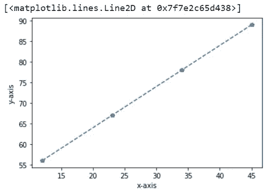
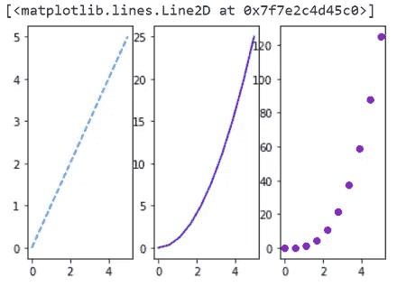
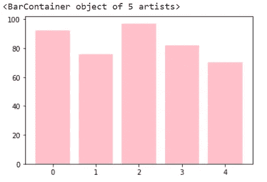

# Matplotlib 可视化

> 原文：<https://towardsdatascience.com/visualizations-with-matplotlib-4809394ea223?source=collection_archive---------47----------------------->

## 了解如何使用 Python 库 matplotlib 可视化数据


在 [Unsplash](https://unsplash.com/?utm_source=medium&utm_medium=referral) 上[庞浩文](https://unsplash.com/@raypang?utm_source=medium&utm_medium=referral)的照片

如果你想用 Python 绘制数据，Matplotlib 是一个非常强大的数据可视化库。最常用的模块是' [pyplot](https://matplotlib.org/tutorials/introductory/pyplot.html) '，它提供了一组函数，让您可以轻松地绘制出数据。

## 装置

使用 conda:

```
conda install matplotlib
```

使用画中画:

```
pip install matplotlib
```

作为先决条件，你必须具备什么是 Python [字典](https://medium.com/@domalajayashree/understanding-python-dictionaries-5639ed677d48)和[列表](https://medium.com/@domalajayashree/understanding-lists-in-python-3ee441d463a5)的基础知识，以及 Python 的 [Numpy](/fundamentals-of-numpy-a7e94d260845) 库的特性和功能。

## 简单线图

导入必要的模块。

```
import numpy as np
import matplotlib.pyplot as plt
```

简单折线图是最常用的绘图，通常用于绘制在一段时间内跟踪的数据，如股票价格。

让我们使用 pyplot 通过传入一个简单的 python 列表来创建相同的内容。

```
plt.plot([2,4,5,10])
```


作者图片

在这里你可以看到我们的 4 个值的图。

如果您向 plot 函数提供单个值列表，matplotlib 将假定它们是 y 值，并自动为您生成 x 值。默认的 x 向量的长度与传递给函数的列表长度相同，但它从 0 开始。上面我们可以看到 x 坐标的值是 0，1，2 和 3。

要绘制 x 与 y 的关系，可以向函数中传递两个列表。首先是 x 向量，然后是 y 向量。

```
plt.plot([1,3,7,10], [2,4,5,10])
```


作者图片

这里我们可以看到一组不同的 x 值和 y 值。第一个 x 值对应于第一个 y 值，依此类推。

## 散点图

散点图使用点来表示两个不同数值变量的值。

您可以向 plot 函数传递第三个参数，以指示颜色的格式和绘图的线型。

为了获得红色的散点图，我们添加“ro”作为第三个参数。

```
plt.plot([1,3,7,10], [2,4,5,10], 'ro')
```


作者图片

这里我们可以看到我们的图从蓝线变成了红圈。

通常，在 matplotlib 中处理绘图时，我们使用 NumPy 数组而不是 Python 列表，如下所示。

```
a = np.array([[12,23,34,45],
              [56,67,78,89]])
plt.plot(a[0], a[1], 'go')
```


作者图片

我们还可以在轴上添加标签。

```
plt.xlabel('x-axis')
plt.ylabel('y-axis')plt.plot(a[0], a[1], 'p--')
```



作者图片

## 图表中的多组数据

要在图形上绘制多组数据，请在 plot 函数中传递多组参数。让我们创建一个数组，其中有几个均匀分布的数字，以了解我们如何做到这一点。

```
t = np.linspace(0, 5, 10) 
plt.plot(t, t**2, color = 'red', linestyle = '--') 
```


作者图片

“linspace”是一个 NumPy 函数，“linestyle”是一个 pyplot 参数。

如果我想在这条线上绘制另一条线，我可以通过再次调用 plot 函数来轻松完成。

```
plt.plot(t, t**2, color = 'red', linestyle = '--')
plt.plot(t, t*3, color='green', linewidth = 2)
```


作者图片

这里，“线宽”是一个 pyplot 参数。正如你所看到的，第二行打印在我们的上一行之上。

## 绘制多个图形

我们可以使用支线剧情功能在一个图中添加多个剧情。这个选项有三个参数:行数、列数和索引。

```
plt.subplot(1,3,1)
plt.plot(t,t,'c--')
```


作者图片

使用相同的支线剧情方法，我们可以在现有剧情旁边创建更多不同类型的剧情。

```
plt.subplot(1,3,1)
plt.plot(t,t,'c--')plt.subplot(1,3,2)
plt.plot(t,t**2,'b-')plt.subplot(1,3,3)
plt.plot(t,t**3,'mo')
```



作者图片

## 条形图

此外，我们可以使用条形图绘制数据，条形图是最常见的图形类型之一。条形图用于显示分成不同类别的数据。例如，如果我想销售不同的产品，我会使用条形图来完成。

```
sales = {'Computers': 92,
         'Laptops': 76,
         'Mobiles': 97,
         'TVs': 82,
         'Speakers': 70}
plt.bar(range(len(sales)), list(sales.values()), color = 'pink')
```



作者图片

在我们的示例中，x 坐标的范围是从 0 到 4，y 坐标显示每个条形的高度。我们可以看到字典中值的条形图。每个条形的高度代表该类别的销售额。

如果我们想将这些数字更改为类别的名称，我们可以这样做，如下所示。

```
plt.bar(range(len(sales)), list(sales.values()), color = 'pink')
plt.xticks(range(len(sales)), list(sales.keys()))
```


作者图片

在这里，我们可以看到，在每个条形下，都有相应的类别名称。同样，如果我们想改变 x 和 y 标签，我们可以使用相同的' plt.xlabel '和' plt.ylabel '函数。

```
plt.bar(range(len(sales)), list(sales.values()), color=’pink’)
plt.xticks(range(len(sales)), list(sales.keys()))
plt.xlabel(“Categories”)
plt.ylabel(“Sales”)
```


作者图片

本文中我们要看的最后一种图表是直方图。当我们查看身高、体重、股票价格等数据时，直方图是一种非常常见的图表类型。在我们的例子中，让我们生成大约 1000 个条目的随机连续数据。

```
x = np.random.randn(1000)
plt.hist(x, color = 'green')
```


作者图片

在这里，我们可以看到直方图的数字分布从-4 到 3。它在 0 附近达到峰值，这意味着我们的大部分区域都在那里。

本文到此为止。

点击[这里](https://github.com/jendcruz22/Medium-articles/tree/master/Visualizations_with_matplotlib)查看本教程的代码。

谢谢你阅读它！

参考

[1] Matplotlib 文档:【https://matplotlib.org/ 