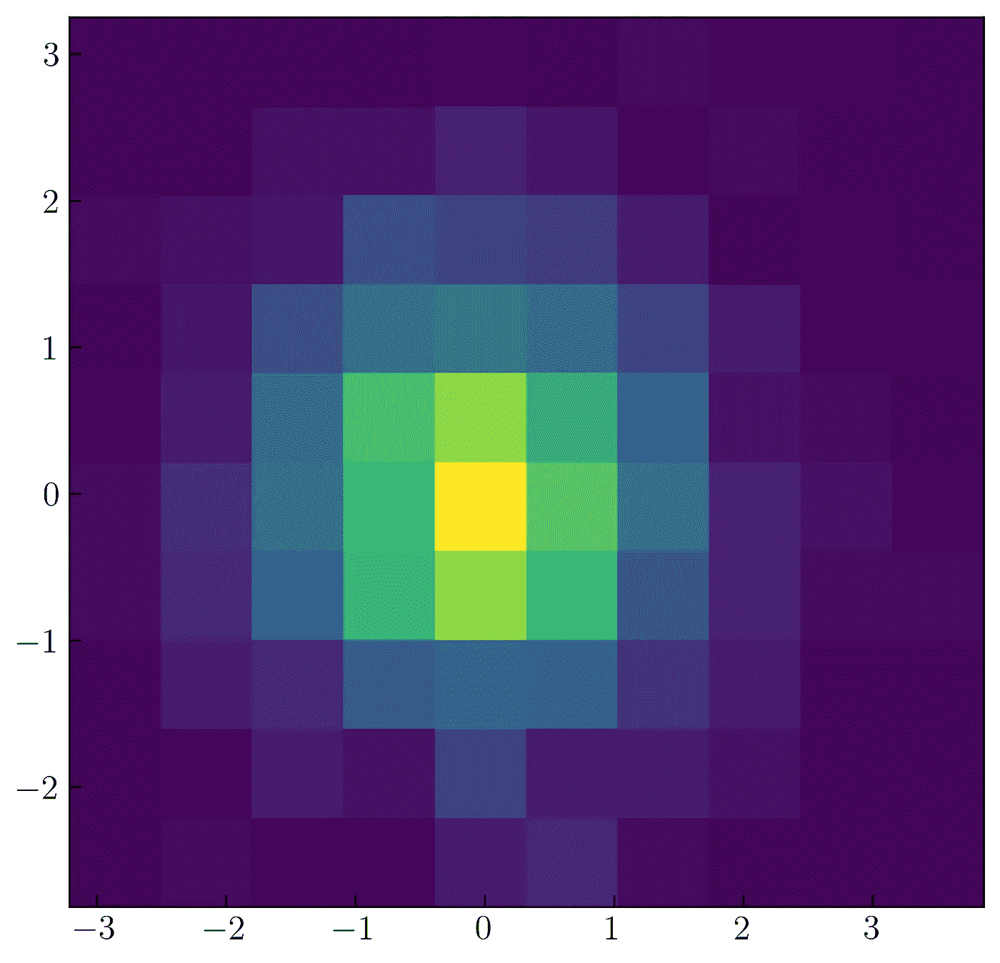

# 使用 Matplotlib 实现 Python 数据可视化—第 1 部分

> 原文：<https://towardsdatascience.com/visualizations-with-matplotlib-part-1-c9651008b6b8?source=collection_archive---------11----------------------->


Jukan Tateisi 在 [Unsplash](https://unsplash.com?utm_source=medium&utm_medium=referral) 上拍摄的照片

## Matplotlib 简介

## 完成了从基础到高级的 Python 绘图的 Matplotlib 教程，包含 100 多个示例

数据可视化旨在将数据以更直观的方式呈现，如散点图、密度图、条形图等。向读者或分析师提供他们数据的全局描述也是有用的。通过可视化您的数据，您可以检测潜在的异常值。在 Python 中，可以使用各种模块或库来可视化数据。其中一个主流模块是 [Matplotlib。](https://matplotlib.org/)您可以使用 Matplotlib 以各种绘图风格可视化数据。但是，Matplotlib 不能显示动态图。如果你想创造一个巨大的动态剧情，可以用 plotly 的 [Dash](https://plotly.com/dash/) (希望下个月用 Dash 完成一个关于完整教程的故事)。

这个故事将指导你如何用 Matplotlib 以各种方式可视化数据。90 个例子也许能启发你从不同的角度创造一个情节。这不是 Matplotlib 在数据可视化方面最完整的教程，但我相信这个故事可以满足许多人的需求，接触到许多要应用的门徒。

正如我之前提到的，我将指导你创建 90 个不同的情节示例。这些示例分布在 11 个不同样式的图中:散点图、折线图、直方图 1D、2D、边际图、条形图、箱线图、小提琴图、饼图、极坐标图、地理投影、3D 图和等高线图。您可以从图 1 中了解这个故事的大致情况。


图一。Matplotlib 中生成的各种类型的绘图(图片由作者提供)。

在这个故事中，我试图专注于创造和定制各种情节。所以，我假设你已经知道它之外的一些技术，例如，在 Matplotlib 中创建多个支线剧情和定制颜色图。如果你还不知道，我会给你一些链接来了解它。

在开始写这个故事的时候，我打算只写 1 个故事。但是，因为阅读时间的原因，我想我需要把它分成几部分。如果我全部写在一个故事里，就要 40 多分钟。我估计你光看一个故事就全看完了会很无聊:)。所以，我把它分成 2 或 3 部分。我会把阅读时间限制在 30 分钟以内。这是第一部分。我们开始吧。

## Matplotlib 简介

要安装 Matplotlib，您可以使用以下代码通过 pip 安装它

```
pip install matplotlib
```

或通过康达

```
conda install -c anaconda matplotlib
```

当我写这个故事时，我安装了 Matplotlib 3 . 3 . 2 版。你可以通过写这段代码来检查它。

```
pip show matplotlib
```

如果你想在 Jupyter 笔记本(以下简称 Jupyter)上查看，可以添加！在 pip 之前，如图 2 所示。


图二。通过 Jupyter 检查 Matplotlib 版本(图片由作者提供)。

如果你想升级你的 Matplotlib 版本，你可以使用下面的代码

```
pip install matplotlib --upgrade
```

还是那句话，可以补充！在 pip 通过 Jupyter 升级 Matplotlib 之前。

如果你用我在这个故事中使用的 Matplotlib 安装了不同的 Matplotlib 版本，也许你会面临不同的结果。请在下面的回复栏中写下您遇到的问题。我建议你保存这个故事。所以，如果时间有限，可以继续读下去。

在我们继续第一部分之前，我需要通知您，我已经定制了我的 Matplotlib 绘图样式，例如使用 LaTeX 字体作为默认字体，更改字体大小和字体系列，更改 xtick 和 ytick 的方向和大小，并在 x 轴和 y 轴上添加次要刻度。要使用 LaTeX 字体作为 Matplotlib 中的默认字体，可以使用以下代码

```
plt.rcParams['text.usetex'] = True
```

如果你面临一些错误，你需要阅读下面的故事。我已经解释了在 Matplotlib 中处理 LaTeX 字体的详细过程

[](/5-powerful-tricks-to-visualize-your-data-with-matplotlib-16bc33747e05) [## 使用 Matplotlib 可视化数据的 5 个强大技巧

### 如何使用 LaTeX 字体，创建缩放效果，发件箱图例，连续错误，以及调整框填充边距

towardsdatascience.com](/5-powerful-tricks-to-visualize-your-data-with-matplotlib-16bc33747e05) 

要定制其他参数(字体大小、字体系列和刻度参数),只需在代码的开头编写以下代码

```
plt.rcParams['font.size'] = 15
plt.rcParams['font.family'] = "serif"tdir = 'in'
major = 5.0
minor = 3.0
plt.rcParams['xtick.direction'] = tdir
plt.rcParams['ytick.direction'] = tdirplt.rcParams['xtick.major.size'] = major
plt.rcParams['xtick.minor.size'] = minor
plt.rcParams['ytick.major.size'] = major
plt.rcParams['ytick.minor.size'] = minor
```

如果你需要更详细地了解它，你可以访问这个故事

[](/create-professional-plots-using-matplotlib-63a6863b7363) [## 使用 Matplotlib 创建专业绘图

### 使用样式表和 rcParams 自定义 Matplotlib，并选择色盲友好调色板

towardsdatascience.com](/create-professional-plots-using-matplotlib-63a6863b7363) 

## 01.散点图

在本节中，有八个散点图示例。在创建散点图之前，我需要使用这段代码生成模拟数据

```
import numpy as np
import matplotlib.pyplot as pltN = 50x = np.linspace(0., 10., N)
y = np.sin(x)**2 + np.cos(x)
```

变量 x 是 50 个数据的数组，从 0 到 10。变量 y 是 sin(x)和 cos(x)的平方之和。我想用这段代码以散点图的形式显示 x 轴上的变量 x 和 y 轴上的变量 y

```
plt.figure()
plt.scatter(x, y)
```

它是如此简单。代码将向您显示一个结果，如图 3 所示。


图 3。Matplotlib 中的默认散点图(图片由作者提供)。

为了使它更漂亮，您可以减少每个数据的大小，并使用以下代码给出标签

```
plt.scatter(x, y, s = 15, label = r'$y  = sin^2(x) + cos(x)$')
```

要更改颜色，您需要在散点语法中添加此参数

```
color = 'r' # r means red
```

如果想使坐标轴刻度处于相同的刻度，可以使用这段代码

```
plt.axis('equal')
```

要为 x 轴和 y 轴创建轴标签，可以添加以下代码

```
plt.xlabel(r'$x$ (rad)')
plt.ylabel(r'$y$')
```

您已经标记了您的散点图，但没有将其显示为图例。为了展示它，您可以使用以下代码

```
plt.legend()
```

要保存您的绘图，您可以使用保存图形语法，如以下代码所示

```
plt.savefig('scatter2.png', dpi = 300, bbox_inches = 'tight', facecolor='w')
```

上面的代码将以 scatter2.png 的名字保存您的绘图，分辨率为每英寸 300 点，紧密的 bbox，白色背景。如果您省略了 bbox_inches 和 face color 参数，这是可以的，但是可能会得到不同的结果。试试吧。

这是完整的代码

该代码将创建一个散点图，如图 4 所示。


图 4。修改了 Matplotlib 中的散点图(图片由作者提供)。

可以看到轴内 x 轴和 y 轴的刻度方向，使用的字体是 LaTeX 格式。如果您想要更改图形大小，您可以在 plt.figure()中添加图形大小参数

```
plt.figure(figsize=(7, 4.5))
```

**改变标记样式**

例如，要更改标记样式，我想将点改为十字，您可以在 plt.scatter 中添加此参数

```
marker = 'x'
```

图 5 是应用上面代码的结果


图 5。用 Matplotlib 修改散点图中的标记样式。

Matplotlib 中有大量的标记样式可以使用。你可以点击下面的链接查看。

 [## Matplotlib . markers-Matplotlib 3 . 3 . 2 文档

### 处理标记的函数；由和的标记功能使用。这里定义了所有可能的标记:标记…

matplotlib.org](https://matplotlib.org/api/markers_api.html) 

如果你已经阅读了上面的文档，你可以意识到你可以使用字母表作为你的标记样式。我将向您展示应用字母表作为标记的示例，如图 6 所示。


图 6。Matplotlib 中的字母标记(图片由作者提供)。

为了生成图 6，我为 x 轴和 y 轴上的参数创建了一个不同的函数。下面是生成它的代码

```
np.random.seed(100)N = 50randx = np.random.random(N) * 100
randy = np.random.random(N) * 100
```

为了可视化变量 randx 和 randy，我运行以下代码

```
plt.figure(figsize=(7, 6))plt.scatter(randx, randy, marker=r'$\beta$', s = 150, color = 'darkorange')plt.axis('equal')plt.xlabel('randx')
plt.ylabel('randy')plt.tight_layout()
```

我使用希腊符号 beta 作为我的标记样式。你可以用不同的字母来改变它，如 ***a、B、C、d、*** 或 ***1、2、3、*** 等。

**定制每个数据的大小**

这一小节将向您展示如何为每个数据创建不同大小的散点图，如图 7 所示。


图 7。在 Matplotlib 中自定义散点图的大小(图片由作者提供)。

为了创建它，我使用下面的代码为变量 randx 和 randy 生成一个从 0 到 100 的随机位置

```
np.random.seed(100)N = 30randx = np.random.random(N) * 100
randy = np.random.random(N) * 100
```

提醒你一下，我使用 Numpy 生成随机数据。在生成随机数时，Numpy 只在 0 到 1 的范围内生成它。据我所知，这是一个产生随机数的惯例(不仅仅是在 Numpy 中)，只是从 0 到 1。要修改，可以乘以 100。所以，你会得到一个 0 到 100 范围内的随机数。

之后，我使用下面的代码为每个数据生成一个从 50 到 200 的随机整数

```
size = np.random.randint(50, 200, size=N)
```

要将其可视化，只需使用以下代码添加将应用于每个数据的大小的参数

```
plt.scatter(randx, randy, s = size, color = 'darkorange')
```

创建图 7 的附加语法是在 x 轴和 y 轴上插入次要刻度。要插入它，您需要使用以下代码导入子模块 MultipleLocator

```
from matplotlib.ticker import MultipleLocator
```

之后，您可以添加以下语法来插入短轴

```
ax = plt.gca()ax.xaxis.set_minor_locator(MultipleLocator(10))
ax.yaxis.set_minor_locator(MultipleLocator(10))
```

下面是生成图 7 的完整代码。

**颜色编码散点图**

您可以使用色彩映射表来更改颜色。这意味着不同大小的数据将用不同的颜色进行颜色编码。您可以像这样在 plt.scatter()中添加颜色参数

```
c = size
```

要嵌入颜色条，您可以使用以下代码

```
plt.colorbar()
```

您将得到一个图，如图 8 所示。


图 8。使用 Matplotlib 修改散点图中的颜色编码(图片由作者提供)。

下面是生成图 8 的完整代码。

**定制彩色地图**

您可以使用此参数更改色彩映射表

```
cmap = 'inferno'
```

您可以查看此链接，了解 Matplotlib 提供的所有色彩映射表

[](https://matplotlib.org/3.3.2/tutorials/colors/colormaps.html) [## 在 Matplotlib 中选择色彩映射表— Matplotlib 3.3.2 文档

### Matplotlib 有许多内置的色彩映射表，可以通过。还有外部库，如[palettable]和…

matplotlib.org](https://matplotlib.org/3.3.2/tutorials/colors/colormaps.html) 

在本教程中，我已经通过结合蓝色和橙色的颜色创建了自己的颜色图，如图 9 所示。


图 9。在 Matplotlib 中自定义色彩映射表(图片由作者提供)。

为了组合它，我使用了以下代码

```
from matplotlib import cm
from matplotlib.colors import ListedColormap, LinearSegmentedColormaptop = cm.get_cmap('Oranges_r', 128)
bottom = cm.get_cmap('Blues', 128)newcolors = np.vstack((top(np.linspace(0, 1, 128)),
                       bottom(np.linspace(0, 1, 128))))
orange_blue = ListedColormap(newcolors, name='OrangeBlue')
```

我创建了自己的色彩映射表，命名为 ***橙 _ 蓝*** 。要了解如何在 Matplotlib 中创建和定制自己的色彩映射表，您可以通过以下链接阅读

[](/creating-colormaps-in-matplotlib-4d4de78a04b8) [## 在 Matplotlib 中创建色彩映射表

### 从颜色列表中创建和定制自己的色彩映射表的指南

towardsdatascience.com](/creating-colormaps-in-matplotlib-4d4de78a04b8) 

要应用它，我只需更改颜色参数 ***c = orange_blue*** 。您可以在图 11 中查看结果。


图 11。使用 Matplotlib 自定义散点图中的颜色图。

下面是生成图 11 的完整代码。

这是本节的结尾，用 Matplotlib 创建散点图。如果您遇到一些错误，您可以在回复栏中留下评论。


## 02.线形图

为了在 Matplotlib 中绘制线图，我将使用以下代码生成模拟数据

```
N = 50x = np.linspace(0., 10., N)
y = np.sin(x)**2 + np.cos(x)
```

要以线形图的形式可视化变量 x 和 y，您需要使用下面的简单代码

```
plt.plot(x, y)
```

上面的代码将生成一个图形，如图 12 所示。


图 12。Matplotlib 中的默认线图(图片由作者提供)。

**定制线条样式**

您可以使用此参数在 Matplotlib 中更改线形图的线型

```
linestyle = '-'
```

上面的参数应插入 plt.plot()语法中。在本教程中，我将向您展示四种不同的线条样式；他们是

```
['-', '--', '-.', ':']
```

为了自动生成它，我使用循环来简化它。这是完整的代码

我将在一张图中分配 4 种不同的线条样式。这意味着我需要在一个图形中创建 4 个轴。在 Matplotlib 中，可以通过使用 GridSpec()、subplot()和 add_subplot()自定义子情节来生成它。在这个会话中，我使用 GridSpec()语法。我创建了 4 个轴(2 行 2 列)，宽度和高度空间等于 0.25(见第 6 行到第 12 行)。正如我在开头提到的，我将只专注于定制剧情。如果你需要更多关于在 Matplotlib 中定制支线剧情的解释，你可以访问这个链接

[](/customizing-multiple-subplots-in-matplotlib-a3e1c2e099bc) [## 在 Matplotlib 中自定义多个子情节

### 使用 subplot、add_subplot 和 GridSpec 在 Matplotlib 中创建复杂 subplot 的指南

towardsdatascience.com](/customizing-multiple-subplots-in-matplotlib-a3e1c2e099bc) 

如果您运行上面的代码，它将创建一个图形，如图 13 所示。


图 13。使用自动化在 Matplotlib 中自定义线条样式(图片由作者提供)。

代码将简单地生成 4 种不同的线条样式，并为每种线条样式添加标签和注释。Matplotlib 提供了许多可供您使用的线条样式。你可以通过这个链接选择你喜欢的线条样式

[](https://matplotlib.org/2.1.2/api/_as_gen/matplotlib.pyplot.plot.html) [## Matplotlib . py plot . plot-Matplotlib 3 . 3 . 2 文档

### 用线条和/或标记绘制 y 与 x 的关系。调用签名:点或线节点的坐标由 x…

matplotlib.org](https://matplotlib.org/2.1.2/api/_as_gen/matplotlib.pyplot.plot.html) 

**定制线宽**

要自定义折线图的线宽，可以使用此参数

```
lw = 2.0
```

我向您展示了 4 种不同线宽，如图 14 所示。


图 14。在 Matplotlib 中自定义线宽(图片由作者提供)。

我使用类似的技术来创建图 14。这是完整的代码。

**创造标记每隔**

本小节将指导您创建每个特征的标记。为了理解它，我将首先展示结果，如图 15 所示。


图 15。在 Matplotlib 中标记每一个(图片由作者提供)。

在图 15 中，我为每 5 个数据创建了一个圆形标记。你可以用这个参数创建它

```
'o'            # shape for each 5 data
markevery = 5  # mark every 
ms = 7         # size of the circle in mark every
```

这是完整的代码

您需要将参数“o”放在第三个位置。

**改变线条颜色**

要更改线条颜色，您可以应用类似的概念来更改散射颜色，如以下代码所示

```
color = 'royalblue'
```

我想向您展示如何使用循环生成 4 种不同的颜色和 4 种不同的标记，如图 16 所示。


图 16。在 Matplotlib 中自定义线条颜色(图片由作者提供)。

您可以用这段代码重现图 16

我用的 4 种不同的颜色是色盲友好的。我是从这个[链接](https://gka.github.io/palettes/#)得到的。要了解如何使用该链接创建色盲友好的调色板，请阅读这个[故事](/create-professional-plots-using-matplotlib-63a6863b7363)。

**在线图中插入错误**

为了演示折线图中的误差线，我需要使用以下代码生成误差

```
np.random.seed(100)
noise_x = np.random.random(N) * .2 + .1
noise_y = np.random.random(N) * .7 + .4
```

该代码将为 noise_x 生成从 0.1 到 0.3 的随机数，为 noise_y 生成从 0.3 到 0.7 的随机数。要为 y 轴插入误差线，可以使用以下代码

```
plt.errorbar(x, y, yerr = noise_y)
```

图 17 是折线图中误差线的示例。


图 17。在 Matplotlib 中创建误差条形图(图片由作者提供)。

您可以用这段代码创建图 17。

要在 x 轴上插入误差线，可以使用此参数

```
xerr = noise_x
```

您可以在图 18 中看到在 x 轴和 y 轴上插入误差线的例子。


图 18。在 Matplotlib 中创建误差条形图(图片由作者提供)。

您可以使用这段代码重现图 18。

如果要直观显示数据而不需要折线图，只需要误差线，可以使用此参数

```
fmt = 'o'    # shape of the data point
color = 'r'  # color of the data point
ecolor ='k'   # color of the error bar
```

这是完整的代码

上面的代码将显示一个图，如图 19 所示。


图 19。在 Matplotlib 中自定义误差栏(图片由作者提供)。

**填充错误区域**

为了直观显示错误，您也可以使用以下代码

```
plt.fill_between(x, y + noise, y - noise, alpha = .5)
```

fill_between 参数是填充区域的 x 轴、上限和下限的数据。在上面的代码中，用 ***y +噪声*** 和***y-噪声*** 来表示。你需要降低填充区域的透明度。这是完整的代码

如果您运行上面的代码，您将得到一个结果，如图 20 所示。


图 20。在 Matplotlib 中的区域之间创建填充。

**插入垂直线和水平线**

你可以用这段代码插入一条水平线和一条垂直线

```
plt.hlines(0, xmin = 0, xmax = 10)
plt.vlines(2, ymin = -3, ymax = 3)
```

您需要在第一个参数中定义水平线，然后是水平线的起点和终点。对于垂直线，它有类似的论点。

图 21 是一个插入水平线和垂直线的例子。


图 21。Matplotlib 中的水平线和垂直线(图片由作者提供)。

要生成图 21，您可以使用以下代码

在图 21 中，图例位于轴的外部。在第 17 行可以体会到。

**两条垂直线之间的填充**

这一小节将指导您在两条垂直线之间创建一个填充区域，如图 22 所示。


图 22。在 Matplotlib 中创建填充区域(图片由作者提供)。

要重现图 22，您可以使用以下代码

你需要知道在 Matplotlib 中创建填充区域的重要之处，你需要设置一个合适的 y 轴限制。


## 03.柱状图

这一节将解释如何在 1D 和 2D 制作直方图。我先给你讲讲 1D 直方图。在可视化 1D 直方图之前，我将使用这段代码制作一个模拟数据，一个正态分布的随机数。

```
N = 1000np.random.seed(10021)
x = np.random.randn(N) * 2 + 15
```

默认情况下，Numpy 将生成一个正态分布的随机数，其均值/中值(mu)等于 0，方差(sigma)等于 1。在上面的代码中，我将 mu 改为 15，sigma 改为 2。要可视化 1D 直方图中的变量 x，可以使用以下代码

```
plt.hist(x)
```

代码将显示一个图形，如图 23 所示。


图 23。Matplotlib 中默认的 1D 直方图(图片由作者提供)。

默认设置下，Matplotlib 将为 1D 直方图生成 10 个柱。如果你想改变仓位的数量，你可以使用这个参数。

```
bins = 40
```

该参数将生成一个有 40 个仓的 1D 直方图，如图 24 所示。


图 24。在 Matplotlib 中修改 1D 直方图(图片由作者提供)。

下面是创建图 24 的完整代码。

```
N = 1000np.random.seed(10021)
x = np.random.randn(N) * 2 + 15plt.figure(figsize=(9, 6))
plt.hist(x, bins = 40, label = r'$\mu = 15, \sigma = 2$')
plt.legend()
```

您也可以使用此参数来限制直方图的范围

```
range = (12, 18)
```

该参数将让直方图只显示从 12 到 18 的数据，如图 25 所示。


图 25。修改 Matplotlib 中 1D 直方图的数据限制(图片由作者提供)。

您可以用这段代码重现图 25。

我还使用一个 ***颜色*** 参数来改变直方图的颜色。

**水平直方图**

您可以创建一个水平直方图，如图 26 所示。


图 25。Matplotlib 中的水平直方图(图片由作者提供)。

您需要使用此参数来创建水平直方图

```
orientation = 'horizontal'
```

要创建图 25，您可以运行以下代码。

如果要显示每个直方图的边框，可以使用该参数。

```
edgecolor = 'k'
```

我想将直方图边框设为黑色，如图 26 所示。


图 26。在 Matplotlib 中自定义直方图边框(图片由作者提供)。

要生成图 26，您可以使用完整的代码。

**重叠直方图**

您可以在一个图中显示许多直方图，如图 27 所示。


图 27。在 Matplotlib 中创建许多直方图(图片由作者提供)。

在图 27 中，我生成了三个正态分布，具有不同的 mu 和 sigma。您可以用这段代码重现图 27。

您可以通过改变直方图的透明度使它更漂亮，如图 28 所示。


图 28。更改 Matplotlib 中直方图的透明度(图片由作者提供)。

如果您需要创建图 28 的完整代码，您可以阅读下面的代码。与前面代码的区别只是在 ***alpha*** 参数上。

您还可以使用循环生成图 28，如以下代码所示

```
N = 1000mu1 = 5
mu2 = 10
mu3 = 15sigma1 = 5
sigma2 = 3
sigma3 = 2x1 = np.random.randn(N) * sigma1 + mu1
x2 = np.random.randn(N) * sigma2 + mu2
x3 = np.random.randn(N) * sigma3 + mu3mu = np.array([mu1, mu2, mu3])
sigma = np.array([sigma1, sigma2, sigma3])
x = np.array([x1, x2, x3])
colors = ['royalblue', 'tomato', 'gray']plt.figure(figsize=(9, 6))for i in range(len(x)):
    plt.hist(x[i], bins = 30, color = colors[i], 
             label = r'$\mu = $ ' + str(mu[i]) + 
             ', $\sigma = $ ' + str(sigma[i]), alpha = .7)plt.legend()
```

在看到上面的代码后，也许你会想象在一个图形中创建许多直方图(多于 3 个)。下面是在一个图中清晰地创建和可视化 10 个直方图的代码。

如果您运行上面的代码，您将得到一个结果，如图 29 所示。


图 29。在 Matplotlib 中干净地创建许多直方图(图片由作者提供)。

仅使用此[链接](https://gka.github.io/palettes/)即可生成多种颜色。生成调色板后，只需将其复制并粘贴到您的代码中。生成调色板的详细过程在[这里](/create-professional-plots-using-matplotlib-63a6863b7363)提供。

**2D 直方图**

您可以使用 Matplotlib 生成 2D 直方图，如图 30 所示。



图 30。2D 直方图与 Matplotlib(图片由作者提供)。

为了创建图 30，我需要用这段代码生成 2 个正态分布。

```
N = 1_000np.random.seed(100)
x = np.random.randn(N)
y = np.random.randn(N)
```

要在 2D 直方图中显示变量 x 和 y，可以使用下面的代码。

```
plt.hist2d(x, y)
```

与 1D 直方图一样，Matplotlib 将生成 10 个柱作为 2D 直方图的默认设置。要更改它，您可以应用与 1D 直方图中相同的参数，如下面的代码所示。

```
bins = (25, 25)
```

您可以在图 31 中看到 2D 直方图中修改后的箱数。


图 31。在 Matplotlib 中修改 2D 直方图的面元数。

您也可以使用此参数更改 2D 直方图的色彩映射表

```
cmap = orange_blue
```

我想将颜色图从 Viridis(Matplotlib 中的默认颜色图)更改为我自己的名为 orange_blue 的颜色图。我已经在前一节解释了如何创建你自己的色彩映射表，或者你可以在这里阅读。

这是修改 2D 直方图中使用的色彩映射表的完整代码。

如果您运行上面的代码，它将创建一个图形，如图 32 所示。


图 32。在 Matplotlib 中更改 2D 直方图的色彩映射表。

通过将该参数应用到 plt.hist2d()中，可以限制每种颜色的计数范围(更改颜色条的限制)。

```
cmin = 5, cmax = 25
```

这是完整的代码

```
N = 10_000np.random.seed(100)
x = np.random.randn(N)
y = np.random.randn(N)plt.figure(figsize=(8.5, 7))
plt.hist2d(x, y, bins=(75, 75), cmap = 'jet', cmin = 5, cmax = 25)
cb = plt.colorbar()
cb.set_label('counts each bin', labelpad = 10)
```

我使用“jet”颜色图，颜色条的下限为 5，上限为 25。代码将生成一个图形，如图 33 所示。


图 33。在 Matplotlib 中设置 2D 直方图的限制。

我尝试使用这段代码将生成的随机数计数从 10000 更改为 100000。

```
N = 100_000np.random.seed(100)
x = np.random.randn(N)
y = np.random.randn(N)plt.figure(figsize=(8.5, 7))
plt.hist2d(x, y, bins=(75, 75), cmap = 'Spectral')
cb = plt.colorbar()
cb.set_label('counts each bin', labelpad = 10)
```

代码将显示一个结果，如图 34 所示。


图 34。用 Matplotlib 可视化 2D 直方图中的正态分布(图片由作者提供)。

图 34 的峰值在 0 左右，分布在-1 到 1 左右，因为我没有改变 mu 和 sigma 的值。

**边缘剧情**

这一小节将告诉如何创建一个边际分布，如图 35 所示。


图 35。Matplotlib 中散点分布和直方图的边际图(图片由作者提供)。

图 35 由散点图和 2 直方图构成。要创建它，你需要了解如何在一个图形中定制支线剧情或轴。图 35 由 25 个轴(5 列 5 行)构成。详情如图 36 所示。您可以用这段代码创建图 36。你需要阅读这个[链接](/customizing-multiple-subplots-in-matplotlib-a3e1c2e099bc)来理解它。

```
rows = 5
columns = 5grid = plt.GridSpec(rows, columns, wspace = .4, hspace = .4)plt.figure(figsize=(10, 10))for i in range(rows * columns):
    plt.subplot(grid[i])   
    plt.annotate('grid '+ str(i), xy = (.5, .5), ha = 'center', 
                 va = 'center')
for i in range(rows):
    exec (f"plt.subplot(grid[{i}, 0])")
    plt.ylabel('rows ' + str(i), labelpad = 15)for i in range(columns):
    exec (f"plt.subplot(grid[-1, {i}])")
    plt.xlabel('column ' + str(i), labelpad = 15)
```


图 36。Matplotlib 中的多个支线剧情(图片由作者提供)。

图 35 显示了图 36 的转换。我将图 36 中的一些网格合并成 3 个更大的网格。第一个网格组合了网格 0 到网格 3(行 1，列 0 到列 3)。我将用直方图填充第一个网格。第二个网格合并了从第 1 行到第 4 行以及从第 0 列到第 3 列的 16 个网格。最后一个网格是通过合并网格 9、14、19 和 24(行 1、2、3、4 和列 4)构建的。

要创建第一个网格，可以使用下面的代码。

```
rows = 5
columns = 5grid = plt.GridSpec(rows, columns, wspace = .4, hspace = .4)plt.figure(figsize=(10, 10))plt.subplot(grid[0, 0:-1])
```

之后，添加下面的代码来插入 1D 直方图

```
plt.hist(x, bins = 30, color = 'royalblue', alpha = .7)
```

要创建第二个网格，您可以将此代码添加到上面的代码中

```
plt.subplot(grid[1:rows+1, 0:-1])
```

添加此代码以在第二个网格中生成散点图。

```
plt.scatter(x, y, color = 'royalblue', s = 10)
plt.axis('equal')
```

下面是生成第三个网格及其直方图的代码。您需要将下面的代码插入第一个网格代码中

```
plt.subplot(grid[1:rows+1, -1])
plt.hist(y, bins = 30, orientation='horizontal', 
         color = 'royalblue', alpha = .7)
```

您可以将它们结合起来，如下面的代码所示。

接下来，我将用 2D 直方图改变第二个网格中的散点图，如图 37 所示。


图 37。Matplotlib 中的边缘情节(作者图片)。

您可以用这段代码重现图 37。

如果您遇到一些错误，请在回复栏中留下一些评论。


## 04.条形图

如果你想用条形图来可视化你的数据，这个很适合你。在我用 Matplotlib 创建条形图之前，像往常一样，我想创建要显示的模拟数据。我想为六个人的数学考试成绩创建数据。为了创建它，我使用下面的代码。

```
name = ['Adam', 'Barry', 'Corbin', 'Doe', 'Evans', 'Frans']np.random.seed(100)
N = len(name)
math = np.random.randint(60, 100, N)
```

我生成的数学考试分数从 60 分到 100 分。为了形象化它，你可以使用这个代码。

```
plt.bar(name, math, alpha = .7)
```

添加一些信息后，我生成一个条形图，如图 38 所示。


图 38。在 Matplotlib 中创建一个条形图(图片由作者提供)。

下面是生成图 38 的完整代码。

```
name = ['Adam', 'Barry', 'Corbin', 'Doe', 'Evans', 'Frans']np.random.seed(100)
N = len(name)
math = np.random.randint(60, 100, N)plt.figure(figsize=(9, 6))plt.bar(name, math, alpha = .7)plt.ylabel('Math Exam')
```

之后，我使用这段代码为物理、生物和化学考试分数创建了一些模拟数据。

```
np.random.seed(100)
N = len(name)
math = np.random.randint(60, 100, N)
physics = np.random.randint(60, 100, N)
biology = np.random.randint(60, 100, N)
chemistry = np.random.randint(60, 100, N)
```

你可以用熊猫创建一个表格，在 Python 中我们称之为 DataFrame。我从模拟数据创建的数据帧如图 39 所示。


图 39。熊猫数据框中的模拟数据(图片由作者提供)。

默认情况下，我没有插入如何创建数据帧的代码。但是，如果你需要的话，你可以把你的请求留在回复栏里。

然后，我将它可视化，如图 40 所示。


图 40。在 Matplotlib 中创建许多条形图(图片由作者提供)。

要创建图 40，您可以使用以下代码。

```
name = ['Adam', 'Barry', 'Corbin', 'Doe', 'Evans', 'Frans']np.random.seed(100)
N = len(name)
math = np.random.randint(60, 100, N)
physics = np.random.randint(60, 100, N)
biology = np.random.randint(60, 100, N)
chemistry = np.random.randint(60, 100, N)rows = 2
columns = 2plt.figure(figsize=(12, 8))
grid = plt.GridSpec(rows, columns, wspace = .25, hspace = .25)plt.subplot(grid[0])
plt.bar(name, math, alpha = .7)
plt.ylabel('Math Exam')
plt.ylim(60, 100)plt.subplot(grid[1])
plt.bar(name, physics, alpha = .7)
plt.ylabel('Physics Exam')
plt.ylim(60, 100)plt.subplot(grid[2])
plt.bar(name, biology, alpha = .7)
plt.ylabel('Biology Exam')
plt.ylim(60, 100)plt.subplot(grid[3])
plt.bar(name, chemistry, alpha = .7)
plt.ylabel('Chemistry Exam')
plt.ylim(60, 100)
```

或者，如果您想使用循环，请使用此代码。

```
name = ['Adam', 'Barry', 'Corbin', 'Doe', 'Evans', 'Frans']
course_name = ['Math', 'Physics', 'Biology', 'Chemistry']N = len(name)rows = 2
columns = 2plt.figure(figsize=(12, 8))
grid = plt.GridSpec(rows, columns, wspace = .25, hspace = .25)for i in range(len(course_name)):
    np.random.seed(100)
    course = np.random.randint(60, 100, N)
    plt.subplot(grid[i])
    plt.bar(name, course, alpha = .7)
    plt.ylabel(course_name[i] + ' Exam')
    plt.ylim(60, 100)
```

**水平条形图**

您可以将水平条形图与此代码一起使用。

```
plt.barh(name, course)
```

我想用横条图的形式和各种颜色来呈现图 40。下面是生成它的完整代码。

```
name = ['Adam', 'Barry', 'Corbin', 'Doe', 'Evans', 'Frans']
course_name = ['Math', 'Physics', 'Biology', 'Chemistry']colors = ['#00429d', '#7f40a2', '#a653a1', '#c76a9f', 
          '#e4849c', '#d0e848']N = len(name)rows = 2
columns = 2plt.figure(figsize=(12, 8))
grid = plt.GridSpec(rows, columns, wspace = .25, hspace = .25)for i in range(len(course_name)):
    np.random.seed(100)
    course = np.random.randint(60, 100, N)
    plt.subplot(grid[i])
    plt.barh(name, course, color = colors)
    plt.xlabel(course_name[i] + ' Exam')
    plt.xlim(60, 100)
    plt.gca().invert_yaxis()
```

运行上面的代码后，您将得到一个结果，如图 41 所示。


图 41。Matplotlib 中的水平条形图(图片由作者提供)。

可以使用此参数在水平条形图中插入误差线

```
N = len(name)
noise = np.random.randint(1, 3, N)plt.barh(name, course, xerr = noise)
```

我使用从 1 到 3 的整数随机数来创建错误，正如变量 noise 中提到的。在为我的水平条形图添加了一些元素之后，我展示了它，如图 42 所示。


图 42。在 Matplotlib 中修改水平条形图(图片由作者提供)。

您可以用这段代码重现图 42。

```
name = ['Adam', 'Barry', 'Corbin', 'Doe', 'Evans', 'Frans']
course_name = ['Math', 'Physics', 'Biology', 'Chemistry']N = len(name)rows = 2
columns = 2plt.figure(figsize=(12, 8))
grid = plt.GridSpec(rows, columns, wspace = .25, hspace = .25)
np.random.seed(100)for i in range(len(course_name)):
    course = np.random.randint(60, 95, N)
    noise = np.random.randint(1, 3, N)
    plt.subplot(grid[i])
    plt.barh(name, course, color = colors, xerr = noise, 
             ecolor = 'k')
    plt.xlabel(course_name[i] + ' Exam')
    plt.xlim(60, 100)
    plt.gca().invert_yaxis()
```

也许，你意识到我的模拟数据(有误差)是不现实的。你不能满足一个考试分数的不确定性。但是，我认为它仍然是理解 Matplotlib 中条形图的一个很好的例子。


## 结论

这是第 1 部分的结尾。正如我之前提到的，我尽量限制阅读时间(30 分钟以内)，这样你就可以享受阅读了。本部分仅涵盖 11 个部分中的 4 个，散点图、线图、直方图和条形图。在下一部分中，我将展示创建箱线图、小提琴图、饼图、极坐标图、地理投影、3D 图和等高线图的教程。如果下一部分是消耗超过 30 分钟，我会再分一次。

在技术时代，数据可视化对于从小数据或大数据中分析数据具有重要意义。我们需要它来全面了解我们的数据。可以与 Matplotlib 一起使用的各种类型的可视化。这只是 python 用 Matplotlib 绘图的一小部分。

## 如果你喜欢这篇文章，这里有一些你可能喜欢的其他文章:

[](/5-powerful-tricks-to-visualize-your-data-with-matplotlib-16bc33747e05) [## 使用 Matplotlib 可视化数据的 5 个强大技巧

### 如何使用 LaTeX 字体，创建缩放效果，发件箱图例，连续错误，以及调整框填充边距

towardsdatascience.com](/5-powerful-tricks-to-visualize-your-data-with-matplotlib-16bc33747e05) [](/matplotlib-styles-for-scientific-plotting-d023f74515b4) [## 用于科学绘图的 Matplotlib 样式

### 为您的科学数据可视化定制 Matplotlib

towardsdatascience.com](/matplotlib-styles-for-scientific-plotting-d023f74515b4) [](/creating-colormaps-in-matplotlib-4d4de78a04b8) [## 在 Matplotlib 中创建色彩映射表

### 从颜色列表中创建和定制自己的色彩映射表的指南

towardsdatascience.com](/creating-colormaps-in-matplotlib-4d4de78a04b8) [](/customizing-multiple-subplots-in-matplotlib-a3e1c2e099bc) [## 在 Matplotlib 中自定义多个子情节

### 使用 subplot、add_subplot 和 GridSpec 在 Matplotlib 中创建复杂 subplot 的指南

towardsdatascience.com](/customizing-multiple-subplots-in-matplotlib-a3e1c2e099bc) [](/introduction-to-big-data-a-simple-code-to-read-1-25-billion-rows-c02f3f166ec9) [## Vaex 大数据简介—读取 12.5 亿行的简单代码

### 用 Python 高效读取和可视化 12.5 亿行星系模拟数据

towardsdatascience.com](/introduction-to-big-data-a-simple-code-to-read-1-25-billion-rows-c02f3f166ec9) 

仅此而已。感谢您阅读这个故事。喜欢就评论分享。我还建议您关注我的帐户，以便在我发布新故事时收到通知。几天后，我将发布 Matplotlib 可视化的第 2 部分。