# 使用 Python 和 Plotly 清晰地可视化和交流不确定性

> 原文：<https://towardsdatascience.com/visualize-and-communicate-uncertainties-with-python-and-plotly-1f30ece540d8?source=collection_archive---------16----------------------->

## 幻想体育实例，以可视化，理解和交流不确定性，概率和结果范围(包括代码和数据)


[Riho Kroll](https://unsplash.com/@rihok?utm_source=unsplash&utm_medium=referral&utm_content=creditCopyText) 在 [Unsplash](https://unsplash.com/s/photos/dice?utm_source=unsplash&utm_medium=referral&utm_content=creditCopyText) 上的原始照片

在这篇文章中，我想展示有效地可视化和交流不确定性和范围是多么容易。更重要的是，我想证明这样做对于获得对数据的直观理解和随后的决策是多么有帮助。

尽管我们大多数人都意识到生活各个方面的不确定性，但我们并不经常看到这些不确定性，或与之共事。信息或数字通常以平均数给出(如果幸运的话，是平均值或中位数)。我们中的许多人从来没有被教授过统计学和概率，少数被教授过的人大多是以可怕、乏味、学术性的方式被教授的，这种方式将公式置于直觉理解之上。因此，即使你对数据中的不确定性有很好的理解，向大多数受众传达也是很棘手的。(试着在会议中引用一个标准差数字，并数一数回来的茫然的目光。)

在理解和交流与不确定性、概率和分布相关的信息方面，数据可视化有着无可比拟的帮助。那么，让我们来看看如何将不确定性可视化，以及如何使用这些数据。

为了更清楚的原因，我将在这篇文章中使用篮球的框架，特别是幻想篮球。一如既往，重点是数据和分析方法，而不是具体运动的分析结果；所以你就算不关心篮球也应该没问题。

# 在开始之前

## 数据

我在我的 [GitLab repo 这里](https://gitlab.com/jphwang/online_articles)包含了代码和数据，所以如果你愿意的话，你应该可以通过下载/克隆 repo 轻松地跟随。

## 包装

我假设您熟悉 python。即使你相对较新，这个教程也不应该太难。

你需要`pandas`和`plotly`。用一个简单的`pip install [PACKAGE_NAME]`安装每一个(在你的虚拟环境中)。

显然，你可以使用任何图形包，但我个人更喜欢你用 [Plotly](https://plot.ly) 得到的简单和强大。

# 组建一个团队/梦幻篮球队

想象一下，通过一些随机事件，有人要求你组建一个梦幻篮球队。

> (你可能会问——什么是**奇幻**体育？简单地说，在梦幻体育中，玩家通过从真实联盟中的所有可用玩家中组建团队来进行竞争，这些玩家根据他们在现实生活中的表现来分配分数。)

你会怎么做？一种方法是简单地挑选最有可能为你的球队贡献最多分数的球员。

我准备了一个基于 2018–2019 NBA 赛季的 csv 文件。数据来自[basketball-reference.com](https://www.basketball-reference.com)，使用[basketball _ reference _ web _ scraper 库](https://github.com/jaebradley/basketball_reference_web_scraper)获得。我已经对它进行了预处理，只包括那些上场时间超过 1000 分钟的球员，以及那些没有在赛季中期被交易的球员。

让我们用以下内容加载数据:

```
season_tot_df = pd.read_csv('srcdata/bballref_1819_season_tots_1000plus_mins.csv', index_col=0)
```

看一看它:

```
season_tot_df.head()
```

这些数据包括来自网站的所有原始列和一个方便的`fan_ppg`列，它是我基于[这个公式](https://fantasydata.com/api/fantasy-scoring-system/nba)创建的。

## 每场游戏的幻想点数

数据是什么样的？每场比赛的点数条形图可以绘制如下:

```
import plotly.express as px
fig = px.bar(season_tot_df, y='fan_ppg', x='name')
fig.show()
```

通过应用一些格式化(为了简洁，我不会在这里显示我所有的格式化代码，如果您感兴趣，请查看 repo)，我们得到:

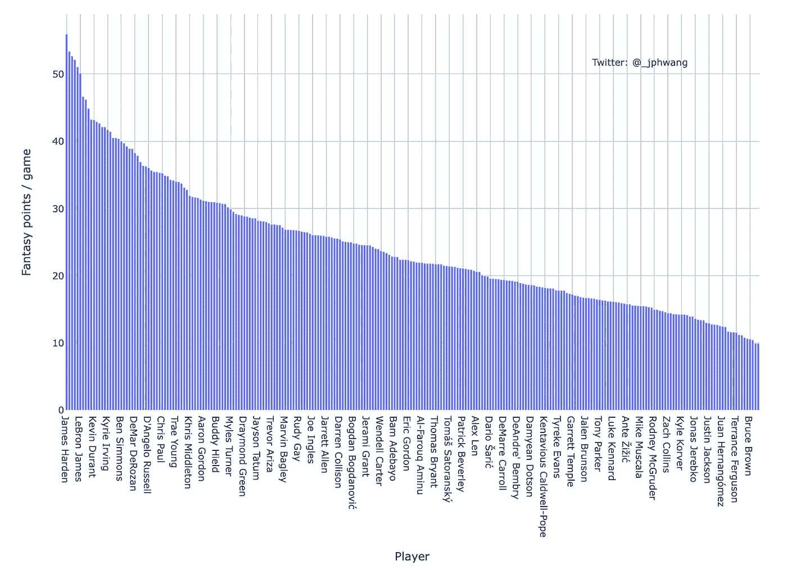

每位玩家平均幻想点数的条形图

从詹姆斯·哈登到布鲁斯·布朗，这张图表描绘了所有 254 名球员的幻想点。所以，当轮到你的时候，简单地选择每场比赛得分第二高的玩家总是最好的吗？

我个人觉得没那么简单。原因如下。

## 同样的，但是不同的

上面的条形图描绘了平均值——更具体地说，是“平均值”，即总分数除以游戏次数。但是，任何看过 JR 史密斯或尼克·杨的人都知道，并不是所有的平均数都是一样的。

有些球员只是比其他人更稳定，而其他人的不稳定会让你对他们每晚的变化感到抓狂。

举个例子，让我们比较一下克里斯·米德尔顿和埃里克·布莱索。顺便说一下，两人都在同一支球队，并且产生了几乎相同的赛季平均得分:

```
>>> print(season_tot_df[season_tot_df['name'].isin(['Eric Bledsoe', 'Khris Middleton'])].fan_ppg)
45    31.905195
49    31.351282
```

但是，正如你将看到的那样，它们的方式大相径庭。为此，让我们加载我们的数据，其中包括 254 名球员的个人比赛统计数据:

```
with open('srcdata/bballref_1819_pl_box.pickle', 'rb') as f:
    pl_data_dict = pickle.load(f)
```

数据采用字典形式，其中键值是球员的 [slug](https://en.wikipedia.org/wiki/Slug_(publishing)) (篮球参考使用的球员标识字符串)。

在做任何事情之前，我们需要收集米德尔顿和布莱索的数据，并将这些信息整合到一个数据框架中:

在这里，我收集了两个玩家的“slugs ”,并将它们用于每个玩家的字典数据。每个玩家的数据都在字典列表中。它们很容易被转换成数据帧(`temp_df`)，它们自己被添加到一个新的列表中(`temp_df_list`)，然后在匹配的列处被连接以产生一个数据帧(`comp_df`)。

将数据绘制成柱状图，我们看到:

```
fig = px.bar(comp_df, y='fan_pts', color='player', facet_col='player', labels={'fan_pts': 'Fantasy Points', 'date': 'Date'})
fig.update_layout(title='Fantasy performance comparison')
fig.show()
```

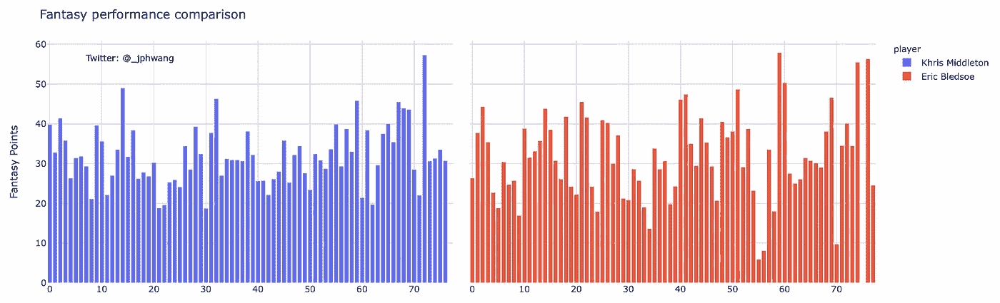

一对年轻雄鹿的幻想点数条形图

每个图表中从低端到高端的整个集合可以称为“结果范围”。也就是说，它们代表了一组结果(我的意思是，它们并不*确切地说是*，但是它是有代表性的，我们现在就让它到此为止)。

从这些柱状图来看，布莱索的数据*可能比米德尔顿的*稍不均衡。有更多的高杠，也有一些明显的差距(低杠)。不过，从这些数据中很难确定。这就是直方图可以发挥作用的地方。直方图绘制了数据点的分布，其中 y 值是适合每个 x“箱”的值的计数。

```
fig = px.histogram(
    comp_df, x='fan_pts', facet_row='player', color='player',
    labels={'fan_pts': 'Fantasy Points', 'count': 'Count'}, nbins=30)
fig.update_layout(title='Fantasy performance comparison')
fig.show()
```

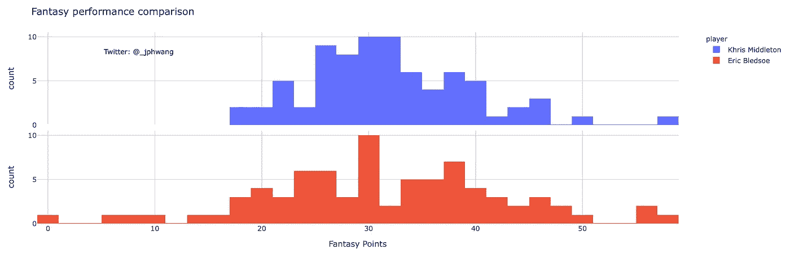

与上面相同的数据，作为直方图

这看起来像是一个响亮的是。

这些直方图告诉我们，不管出于什么原因，布莱索显然比米德尔顿更不一致。他有更多得分较高的比赛，但也有更多得分较低的比赛。因此，即使他们有相同的平均分，布莱索和米德尔顿获得平均分的机会也有很大的不同。

尽管如此，在这里很难看出布莱索比米德尔顿更有可能获得 40+的分数。还有，如果我们想一次比较两个以上的玩家会怎么样？

有许多工具可以轻松查看数据的分布。箱线图可能是一种——它将分布绘制为“盒子”,表示数据集的百分位数分解。试试这个:

```
fig = px.box(comp_df, x='player', y='fan_pts', color='player', labels={'fan_pts': 'Fantasy Points', 'date': 'Date'})
fig.update_layout(title='Fantasy performance comparison')
fig.show()
```

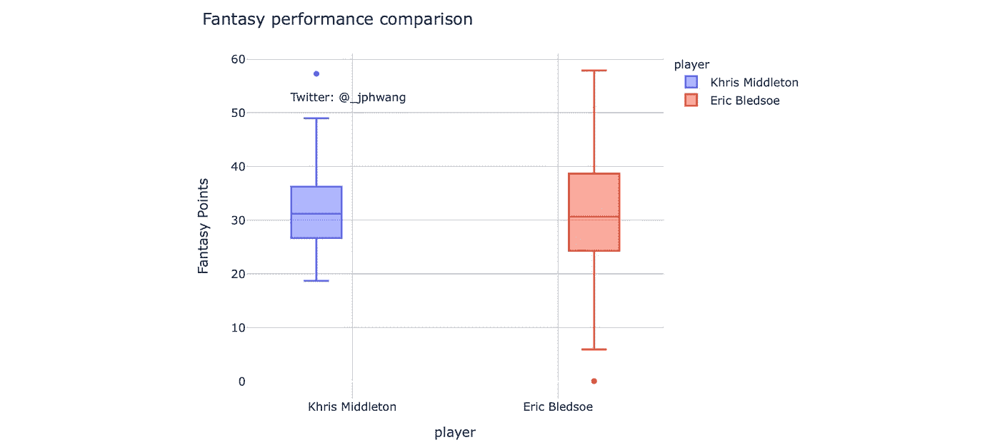

箱线图比较:布莱索和米德尔顿

中间的线表示“中间”值，表示最可能的结果，方框表示所有结果的一半落在哪里，以及大多数结果预期在哪里。圆点表示“异常值”,这是统计意义上的异常结果。

Plotly 还允许以点的形式绘制底层数据，为了更清楚和说明，让我们这样做:

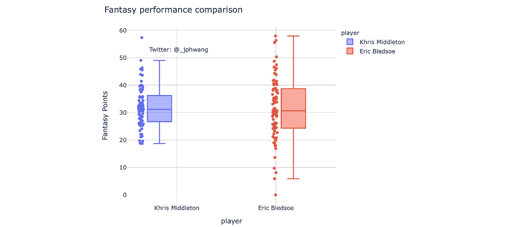

箱线图与数据的比较:Bledsoe 和 Middleton

显然，让布莱索加入你的团队是一个高风险、高回报的策略。

Violin plot 也是一个很好的工具，可以让您更仔细地查看数据的分布:

```
fig = px.violin(comp_df, x='player', y='fan_pts', color='player', labels={'fan_pts': 'Fantasy Points', 'date': 'Date'}, points="all")
fig.update_layout(title='Fantasy performance comparison')
fig.show()
```

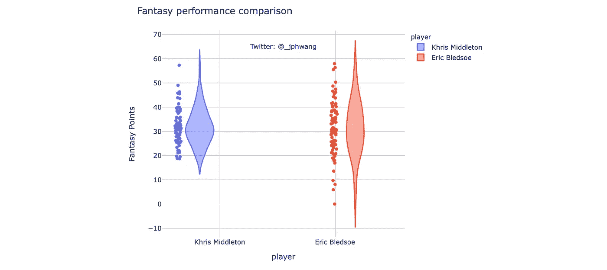

小提琴图与数据的比较:布莱索和米德尔顿

不同于简单的四分位标为直线的箱线图，violin 图本质上是比较直方图，图的宽度代表这些值出现的频率。

这也是小提琴剧情的一个局限。因为宽度在解读小提琴图时至关重要，所以当显示许多数据点时，它们就没那么有用了。随着每个地块的宽度越来越小，它们之间的细微差异变得更加困难。

好了，这可能够了。

让我们回到最初的问题，这个数据如何帮助我们选择球员。

## 比较一群玩家

假设我们剩下的玩家平均幻想点数在 35 到 40 之间，他们中的任何一个都可以加入我们的团队。我们选谁？正如我们之前所做的，我们可以将它们放入直方图或箱线图中:

这段代码与我们上面为 Middleton 和 Bledsoe 所做的非常相似，除了现在我们通过`fan_ppg`值收集玩家的 slugs。

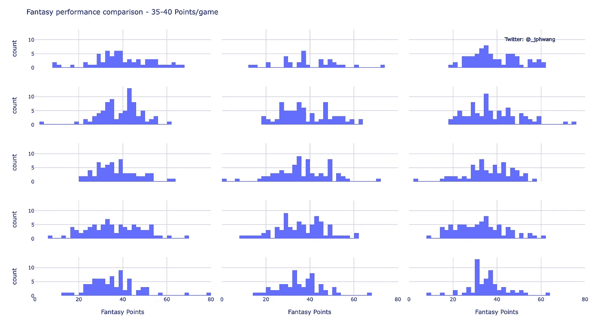

多个玩家的比较—使用直方图

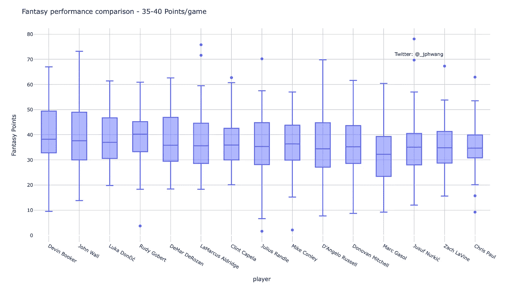

多个玩家的比较—使用方框图

我们在这里可以看到，随着数据点的增加，盒状图的紧凑性有助于它发挥作用。比较更多玩家:

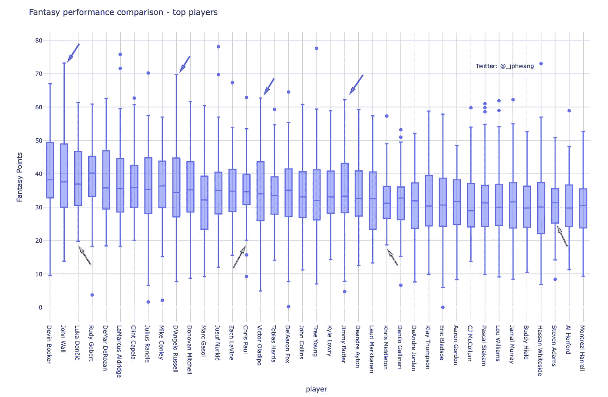

玩家的方块图比较——每场游戏 30-40 点幻想点数

像鲁迪·戈贝尔、克里斯·保罗或克里斯·米德尔顿(用橙色标记)这样的人是我们所说的“低方差”玩家。你会更加确定他们的日常表现。另一方面，像约翰·沃尔、德安杰洛·拉塞尔或维克多·奥拉迪波(标有蓝色)这样的球员变化更大。

所以问题变成了——对你来说什么更重要？也许你玩游戏是为了进入你的联盟的前百分之几，在这种情况下，你可能想要高方差的球员。

或者，如果你的联盟奖励稳定的表现，而不是偶尔闪光的表现，稳定的球员可能是更好的赌注。在现实生活中，这可能更像是你想要的。你能想象有一个玩家团队，却不知道在任何一个晚上你能从他们那里得到什么吗？

我们如何找到一组或另一组？

## 可视化性能*和*一致性

对球员数据进行排序以确定相对一致性的一种方法是使用称为“标准差”或“方差”的测量方法。不用太过数学化，他们基本上是测量*一个分布如何展开*。在上面的例子中，埃里克·布莱索比米德尔顿有更大的标准差。

更进一步，我们可以通过将两个绘制成如下散点图，来确定具有相似平均(均值)表现的玩家在潜在输出*方面可能如何变化。*

让我们简单地看一下代码。再一次，slug 被收集，除了这里的循环简单地覆盖赛季总数据帧中的所有 slug 值(即每个球员)。

然后计算每个玩家的平均值和标准偏差，基于此构建新的数据帧。最后，我产生一个标准偏差与平均值的比率，它被用作颜色变量。

(为便于显示，数字四舍五入。)

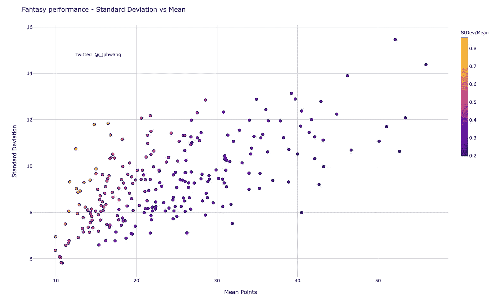

绘制一致性(标准偏差)与平均性能(平均值)的对比图

([我在这里放了一个互动版](https://demo.hindsights.io/202002_viz_uncertainty/var_vs_typ.html)

该图显示了标准差和平均值之间良好的总体相关性，具有较大的分布。也就是说，在相同的平均值下，存在大范围的标准偏差值。

正如我们之前所讨论的，在某些情况下，识别可能偶尔具有高输出性能的数据点是有益的。与许多玩家对抗的梦幻运动无疑是其中之一，在这种情况下，在一个大群体中排名靠前比在群体中间有更大的好处。

这里的巨大差异代表了选择球员的人的重大选择，以优化他们对目标的选择。

看一下同一个图表，其中突出显示了一些球员的数据。

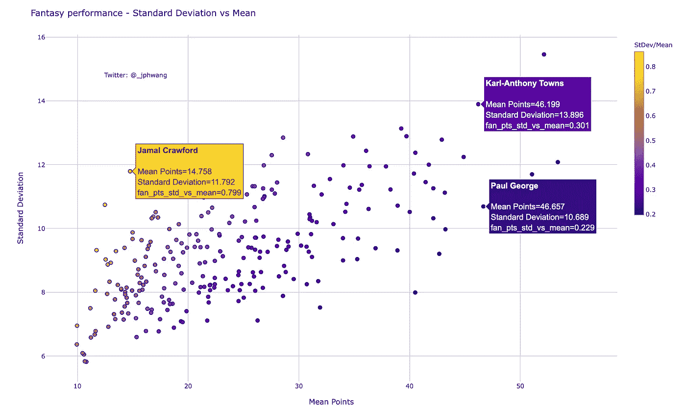

同样的剧情，突出某些玩家。

卡尔-安东尼唐斯和保罗·乔治在这个图中有几乎相同的手段，但凯特的标准差得分要高得多。

另一方面，贾马尔·克劳福德的标准差高于乔治的标准差，尽管他的均值要低得多。如果一个球员在梦幻联盟中的“价格”仅仅是基于他们的平均产量，克劳福德可能会提供一个很好的价值机会来帮助构建一个高天花板的团队。

## 交流和行话

这是个人偏好，但我会在展示统计数据时做一个说明。取决于我的听众，如果可能的话，我通常更喜欢平实的语言，而不是行话。因此，我可能会将“标准差”重新命名为“可变性”。

就我个人而言，我发现像“均值”和“标准差”这样的术语有时会分散(更糟糕的是，疏远)观众的注意力。在这种情况下,“标准差”的统计意义没有任何意义。我们只是在寻找可变性增加的数据点，为什么不这样标注呢？看一下这个图:

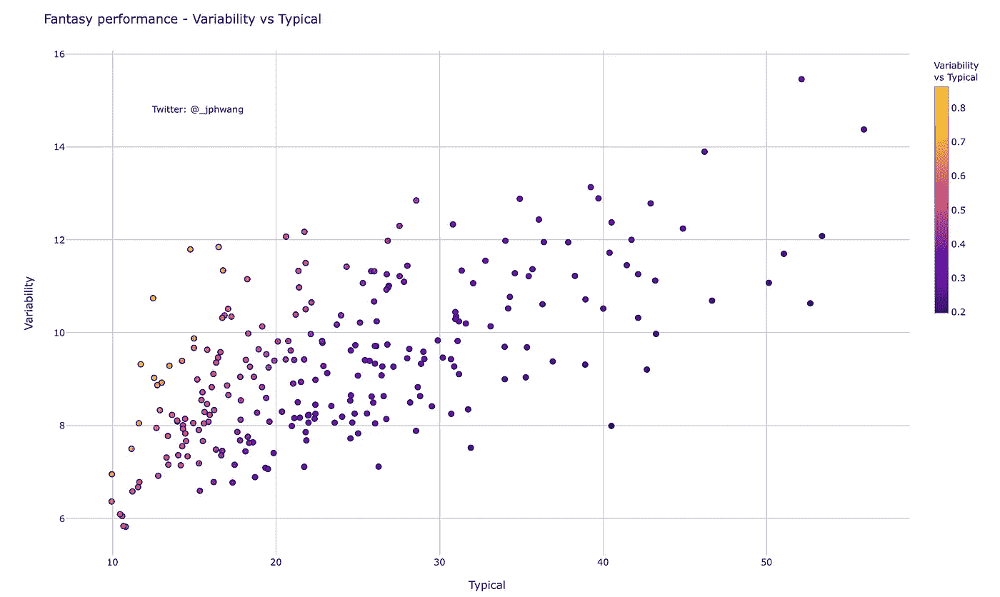

同样的情节，使用平实的语言(ICYMI，[互动版](https://demo.hindsights.io/202002_viz_uncertainty/var_vs_typ.html))

我认为这比上面的方法更好地传达了信息，在上面的方法中，观众经常试图记住什么是标准差——而不是信息的实质。

当然，对于专家或对统计数据友好的观众来说，请尽情使用术语😉。

## 独立/堆叠

我还想谈谈不确定性的独立性。这就是不确定性*线性叠加*的时候(当它们不线性叠加时，就是这样)。

一种直观的思考方式是这样的。假设正在分析两个具有给定不确定性的变量。它们中的一个是高还是低，或者会影响另一个？

如果是这样的话，这两个人将会*依赖*。实际上，想象一下你的整个梦幻篮球队只包括来自同一支球队的球员。这将阻止他们中的许多人拥有职业生涯之夜，因为一个人表现出色可能意味着其他人的机会减少。

我们可以看一个例子。让我们把詹姆斯·哈登的数据和队友克里斯·保罗的数据进行比较。我包括了代码，我们重复了同样的事情来比较 Middleton & Bledsoe 的数据。然后，我们继续将这些数据组合成一个数据框架，这样我们就可以指向它们来绘制散点图。

结果如下图所示:

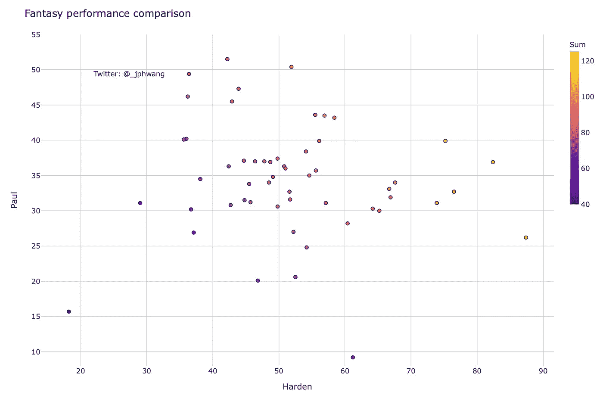

分数相关性——詹姆斯·哈登和 CP3

该图显示了两个人的分数之间经典的 L 型负相关关系。如果我们用一个不在同一个队的相似球员代替 CP3，数据会是什么样的？实际上是这样的:

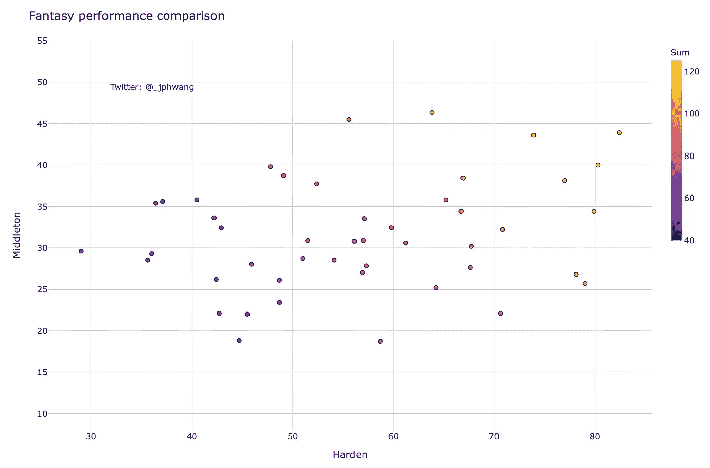

分数的相关性(低得多)——詹姆斯·哈登和克里斯·米德尔顿

这或多或少是一种随机分布。还要注意的是，较低情节的最高综合分数较高，因为一个人的高分并不排除另一个人这样做。

换句话说，当我们处理多个变量的不确定性时，以及当我们可能在寻找组合它们的数据时，相关性是很重要的。

好吧，让我们在那里结束它。

正如你可能已经看到的，不确定性或范围是很容易想象的，对它们的良好理解对于能够充分利用世界固有的可变性是至关重要的。

这不是最容易做到的事情，但我个人发现，有时看到所有的数据(如在我们的散点图中)，并比较分布(通过箱线图、直方图或小提琴)确实有助于我更好地理解它们。

本文使用了一个基于体育的例子，但是它也适用于许多其他领域。我很想听听你所在领域的不确定性类型。

在我即将发表的一篇文章中，我想谈谈预测(作出预测)以及将预测结果可视化。在那之前，放轻松！

如果你喜欢这个，比如说👋/在[推特](https://twitter.com/_jphwang)上关注，或者关注更新。我还写了这篇关于我最喜欢的数据可视化书籍的文章，如果你以前没有读过的话:

[](/create-impactful-data-visualizations-with-these-books-ca9fbfecfde5) [## 用这些书创建有影响力的数据可视化

### 如果没有交流，好的分析没有什么意义。数据可视化会有所帮助。以下是我对…的建议

towardsdatascience.com](/create-impactful-data-visualizations-with-these-books-ca9fbfecfde5)