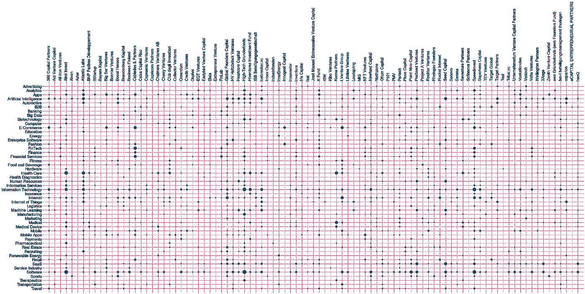
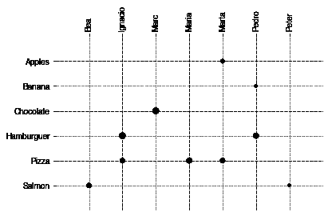
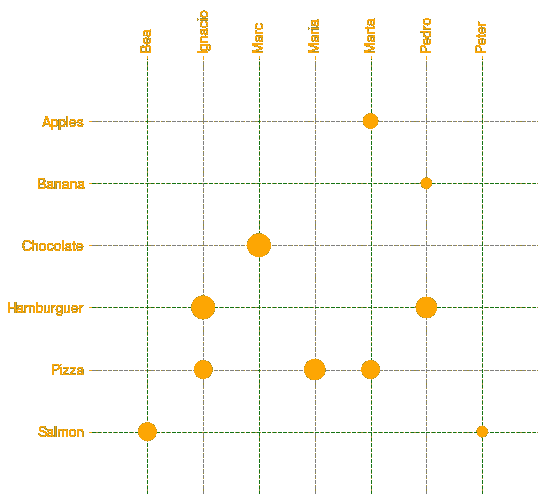
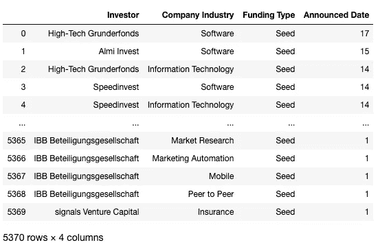

# 使用 Catscatter 可视化分类关系

> 原文：<https://towardsdatascience.com/visualize-categorical-relationships-with-catscatter-e60cdb164395?source=collection_archive---------16----------------------->

## 如果您可以创建分类特征的散点图会怎么样？



2015 年至 2019 年间，欧洲 100 家顶级风投和 50 家顶级行业的种子投资更加活跃

如果你曾经需要一种方法来绘制显示其关系的类别特征，我已经为你建立了[这个](https://github.com/myrthings/catscatter)资源。基于 matplotlib.pyplot 对象构建的 catscatter 函数，使用 pandas 来**可视化类别变量**之间的关系，就像散点图一样。(我知道，这里没有相关性，但它看起来像是建立在散点图上，对吗？).

[](https://github.com/myrthings/catscatter) [## my things/cat scatter

### 我是一名数据分析师，运用一点数据科学和大量的数据可视化。去年 12 月，一位同事给了我…

github.com](https://github.com/myrthings/catscatter) 

# 语境

我是一名数据分析师，运用一点数据科学和大量的数据可视化。去年 12 月，一位同事送给我一本书作为圣诞礼物[《知识是美丽的》](https://informationisbeautiful.net/2014/knowledge-is-beautiful/)，我非常喜欢。它的**数据可视化是惊人的**并且非常复杂。当我想获得灵感时，我喜欢读它。

同时，我在一家 [VC 基金](https://kfund.co/en/)工作，在那里**框架和关系真的很重要**。由于分类变量的“字符串”性质，显示它们之间的关系并不总是一件容易的事情。

这两种情况促使我创建并使用一个 *catscatter* 函数。该函数基于散点图关系，但以一种美丽而简单的方式使用分类变量。实际上，可视化更接近于“邻接矩阵”而不是“散点图”:这意味着**我们对标记在哪里找到相关性不感兴趣，而是对哪些类别相互关联**，或者哪些类别与某个事物的关联度更高。它们可以被视为一种“图形”关系。为此，重要的是不仅要在特征之间的交叉点绘制标记，还要在背景中绘制水平线和垂直线，以便于跟踪连接。

# 绘制您自己的 catscatter

[函数](https://github.com/myrthings/catscatter)是在 Matplotlib 和 Pandas 上为 Python 构建的。它有以下输入:

*   **df:** *熊猫数据框，必选*。它需要至少两列包含您要关联的分类变量，以及两者的值(如果它只是一个相邻的矩阵，请写一列)
*   **colx:** *字符串，必选。*要水平显示的列的名称。
*   **coly:** *string，必选。*要垂直显示的列的名称。
*   **cols:** *字符串，必选。*值介于两个变量之间的列的名称。
*   **颜色:** *列表，可选。*可视化中要显示的颜色，长度可以是两个或三个。前两个是矩阵中线条的颜色，最后一个是字体颜色和标记颜色。*默认['灰色'，'黑色']*
*   **ratio:** *int 或 float，可选*。用于控制标记相对大小的比率。*默认 10*
*   **字体:** *字符串，可选。*矩阵上刻度的字体。*默认‘Helvetica’*
*   **保存:** *bool，可选。*如果为 True，则在与代码相同的路径中保存为图像。*默认假*
*   **保存 _ 名称:** *字符串，可选。*用于保存图像的名称(然后是代码 ads。png) *默认:【默认】*

没有输出。该对象未关闭，因此用户可以在此之前或之后启动或更改它。

## 基本示例

想象一下，你邀请你的一些朋友来家里吃饭。你可以建立一个 *catscatter* 来查看每个人最喜欢的食物，并购买更适合他们的食物。你需要**一个包含你的朋友和食物之间关系的数据框架**。例如，您知道 Ignacio 喜欢 Hamburguers，但也喜欢 Pizza，因此您构建了等级为“5”的“Ignacio”和“Hamburguer”之间的关系，以及等级为“3”的“Ignacio”和“Pizza”之间的关系。你对你所知道的关于你朋友的一切都做了同样的事情，并绘制了一个*猫散点*。

```
import pandas as pd
import matplotlib as plt
from catscatter import catscatter# example data frame
data=pd.DataFrame({‘friend’:[‘Peter’,’Marc’,’Ignacio’,’Marta’,’Marta’,’Ignacio’,’Maria’,’Pedro’,’Bea’,’Pedro’],
 ‘favorite_food’:[‘Salmon’,’Chocolate’,’Hamburguer’,’Pizza’,’Apples’,’Pizza’,’Pizza’,’Hamburguer’,’Salmon’,’Banana’],
 ‘favorite_grade’:[1,5,5,3,2,3,4,4,3,1]})#plot it
catscatter(data,’friend’,’favorite_food’,’favorite_grade’)
plt.show()
```

输出:



这里你可以看到**披萨是最受欢迎的食物**，但是如果你邀请 Bea 和 Peter，也许点三文鱼塔塔基是最好的选择。不要浪费时间买水果。对于 Marc，我肯定你只和他吃过甜点，你应该邀请他共进晚餐来收集更多的数据！

## 个性化示例

这个例子和上一个一样，但是更大更丰富多彩。

```
import pandas as pd
import matplotlib as plt
from catscatter import catscatter# example dataframe
data=pd.DataFrame({‘friend’:[‘Peter’,’Marc’,’Ignacio’,’Marta’,’Marta’,’Ignacio’,’Maria’,’Pedro’,’Bea’,’Pedro’],
 ‘favorite_food’:[‘Salmon’,’Chocolate’,’Hamburguer’,’Pizza’,’Apples’,’Pizza’,’Pizza’,’Hamburguer’,’Salmon’,’Banana’],
 ‘favorite_grade’:[1,5,5,3,2,3,4,4,3,1]})colors=[‘green’,’grey’,’orange’]# create the plot
plt.figure(figsize=(8,8))
catscatter(data,’friend’,’favorite_food’,’favorite_grade’,color=colors,ratio=100)
plt.xticks(fontsize=14)
plt.yticks(fontsize=14)
plt.show()
```

输出:



## 亲例(本文封面)

在我的办公室，我们想知道哪些欧盟种子投资者在哪些行业更活跃。我收集了 2015 年至 2019 年欧洲所有种子轮的信息，并准备了一个数据集**，其中包含每个投资者通过行业达成的交易数量**(如果没有交易，就没有行)。交易的数量是行业和投资者之间关系的强弱。

```
import pandas as pd
import matplotlib.pyplot as plt
from catscatter import catscatter# read the dataframe
df=pd.read_csv(“top-european-investors-seed-rounds-15–19.csv”)
df
```

输出:



```
kcolors=[‘#F73972’,’#F2B3C6',’#144962']# create the plot
plt.figure(figsize=(50,20))catscatter(df,’Investor’,’Company Industry’,’Announced Date’,color=kcolors, ratio=20)plt.xticks(fontsize=20)
plt.yticks(fontsize=20)
plt.show()
```

输出:


我们有 700 名投资者和 600 个行业，但是**为了这个可视化，我只留下前 100 名投资者和前 50 名更活跃的行业**。在我的办公室，我们制作了两张海报，你可以在这里找到，在这里找到。

在这里展示的一个案例中，你可以看到“高科技基金”在几乎所有的顶级领域都有交易，但更多地集中在“信息技术”和“软件”领域。“Innogest Capital”和“Inbox Capital”也达成了几乎相同数量的交易，但“Inbox Capital”是多面手，“Innogest Capital”只专注于“电子商务”和“时尚”。我们还可以看到**“广告”并不常见，但“软件”很常见**，有些投资者关注“医疗”而不是“旅游”

我不能分享上一篇文章使用的 df，但是我希望它能帮助我在更大的范围内看到我的小代码片段的潜力。

如果你想试试 catscatter，这里有代码给你！👇

[](https://github.com/myrthings/catscatter) [## my things/cat scatter

### 我是一名数据分析师，运用一点数据科学和大量的数据可视化。去年 12 月，一位同事给了我…

github.com](https://github.com/myrthings/catscatter) 

*你怎么看？你觉得有用吗？你还有什么其他方法来描绘分类特征之间的关系？请在评论区告诉我！*

*如果你使用它，我也很想知道它*🤗