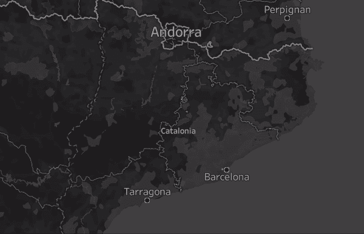
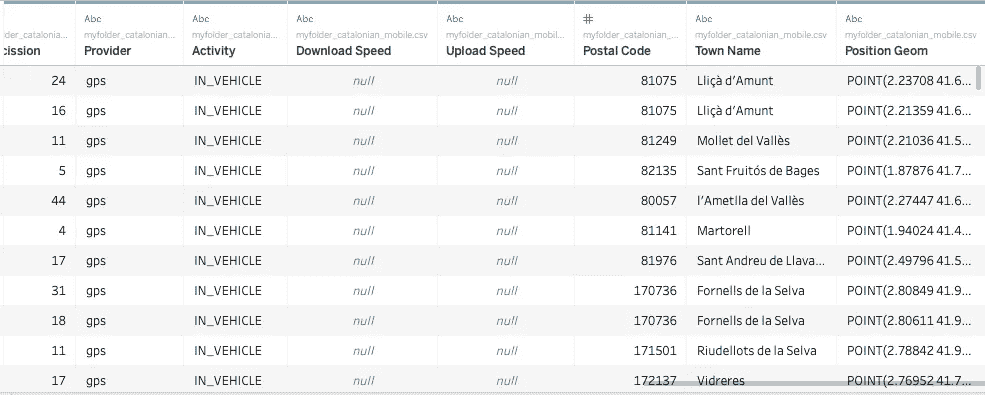
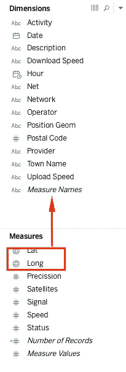
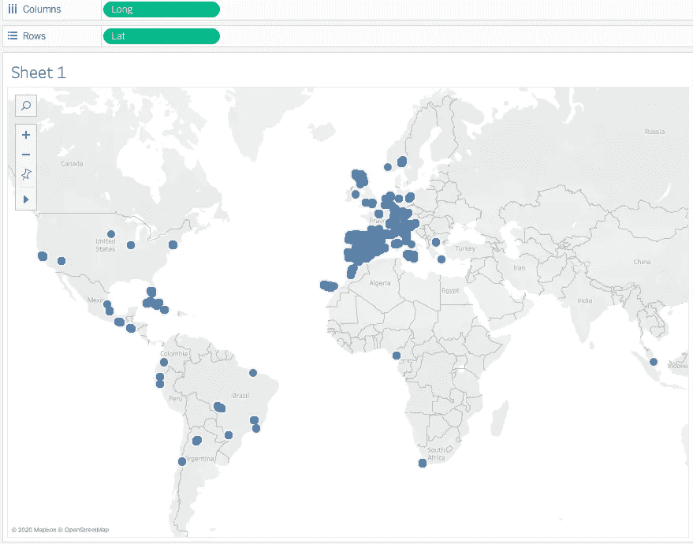
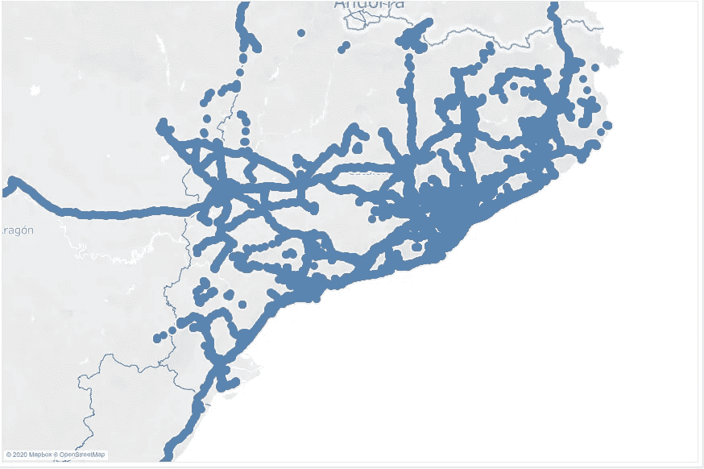
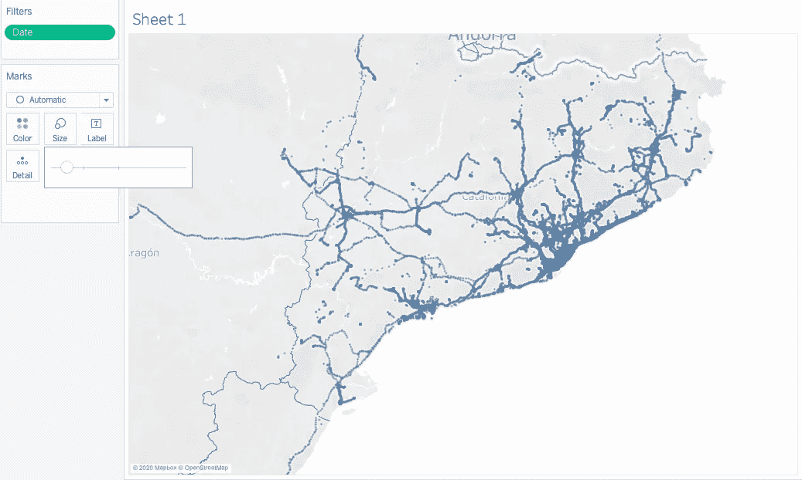
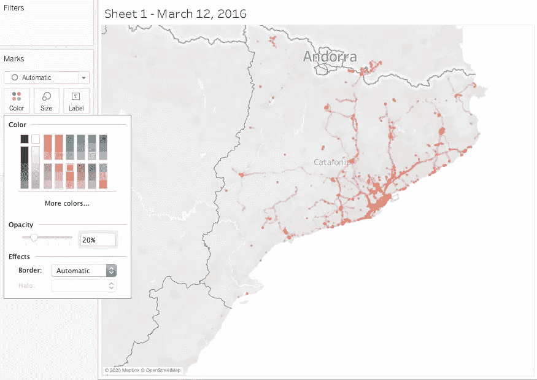
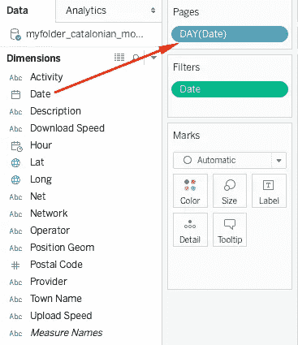
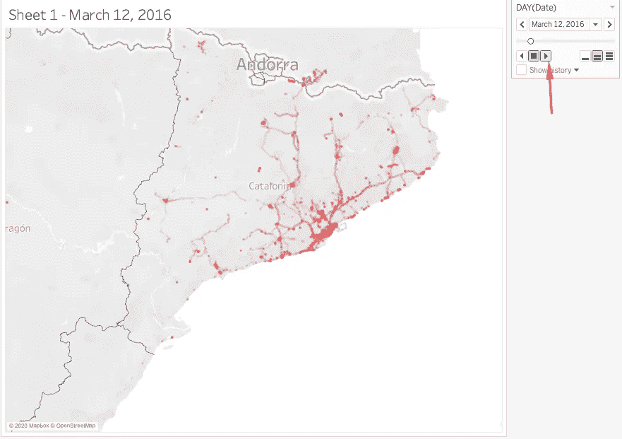

# 使用 Tableau 可视化西班牙巴塞罗那的手机移动性

> 原文：<https://towardsdatascience.com/visualize-cellphone-mobility-in-barcelona-spain-using-tableau-e3f7ab99d7e9?source=collection_archive---------50----------------------->

## 有很多来自手机的地理空间数据…

处理地理空间数据时，直观地查看地图上的数据通常很有用。在本教程中，我们将使用来自加泰罗尼亚政府的真实手机地理空间数据。这些数据存在于谷歌的公共数据集中。

如果你不熟悉谷歌云，请查看我的[水平与谷歌的公共数据集](/level-up-with-googles-public-datasets-5ffce0893ea0)教程，以访问[加泰罗尼亚蜂窝覆盖数据集](https://console.cloud.google.com/marketplace/product/gencat/cell_coverage)。

# 导入数据

一旦数据被加载到 Tableau 中，我们可以看到移动数据有许多地理空间信息的记录。让我们深入画面去想象。

我们的第一步是将纬度和经度从度量转换为维度。通过将 Lat 和 Long 转换为维度，我们告诉 Tableau 分别处理每条记录，而不是将它们聚合在一起。

接下来，我们将双击纬度和经度将数据加载到地图上。正如我们所见，蜂窝数据是全球性的，但主要集中在欧洲，尤其是西班牙。这是因为数据是由位于西班牙巴塞罗那的加泰罗尼亚政府提供的。

# 修改地块设置

放大到西班牙的巴塞罗那，我们可以从我们的数据集中看到大量的地理空间手机数据。似乎有很多重叠的数据点，这使得我们无法完全可视化巴塞罗那的细节。

为了更好地可视化数据，我们可以减小每个数据点的大小。

此外，我们可以改变颜色和减少不透明度为 20%。不透明度为 20%时，地图上的纯色表示有 5 个重叠的数据点

# **想象一段时间内的运动**

由于我们的数据是时间序列，我们可以利用 Tableau 的 Pages 函数来制作地图动画。单击日期维并将其拖至页面，然后将详细程度更改为连续的一天。

地图旁边会出现一个新的控制面板。点击右边的三角形，地图会随着时间向前移动。

瞧啊。您刚刚使用 Tableau 成功地将西班牙巴塞罗那的手机地理空间动画化和可视化。

在 Tableau 地图图层中使用深色样式

# **支持**

谢谢你看我的教程！几股走很远！

对其他酷技术感兴趣吗？查看我的教程[2020 年云上 Jupyter + Spark 入门](/getting-started-with-jupyter-spark-on-the-cloud-in-2020-7f584fba0f3c)