# 用 pandas 和 Plotly 可视化错误日志

> 原文：<https://towardsdatascience.com/visualize-error-log-with-pandas-and-plotly-d7796a629eaa?source=collection_archive---------39----------------------->

## Plotly 和 pandas timedelta 在“数据帧>重采样>绘图”管道中的优势和问题

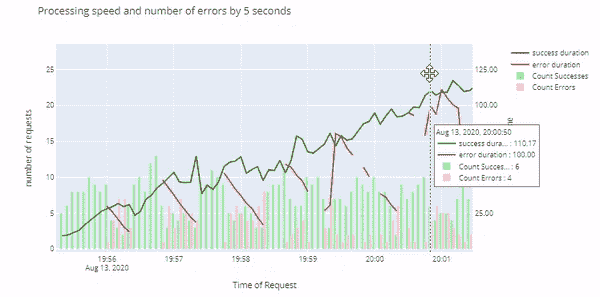

最近，我收到了一个来自性能测量的数据集，其中包含关于处理时间和错误的数据。简单看了一眼后，我想这可能是一个问题；我需要把它形象化，让每个人都看到。视觉化很简单，但是它可以教你一些关于熊猫的概念，以及你可能面临的困难。主要是:

*   与熊猫一起工作`timedelta`列类型
*   熊猫`resampling`(一分钟或 5 秒钟图表)
*   与`Plotly.Express`一起制图
*   多么神秘。用`subplots` 表达斗争(或两轴绘图)
*   对齐 Plotly 的轴

和往常一样，你可以在 [GitHub 笔记本](https://github.com/vaclavdekanovsky/data-analysis-in-examples/blob/master/Error%20Log%20with%20pandas%20and%20Plotly/Error%20Log%20Analysis.ipynb)中看到框架、计算、情节背后的代码。它会带你经历:

1.[错误日志的 EDA](#2ff2)

2.[剧情简介。快递](#8971)

3.【timedelta 的优势和问题

4.[剧情支线剧情](#416e)

5.[共享轴的 Plotly 图表](#e0ac)

# 错误日志

我将错误简化为仅包含 3 列:

*   **陈述** —结果或过程(好或错)
*   **开始时间** —流程开始的时间
*   **结束时间** —流程结束的时间

在我的例子中，应用程序试图将报告呈现到`.pdf`中，但是类似的技术可以用于处理包含`result`和`duration.`的任何类型的错误日志

```
# Example error logState,StartTime,EndTime
Ok,2020-08-13 19:55:22,2020-08-13 19:55:27
Er,2020-08-13 19:55:22,2020-08-13 19:55:30
Ok,2020-08-13 19:55:24,2020-08-13 19:55:30
```

作为第一步，我必须解压日志(也包含在 [Github repo](https://github.com/vaclavdekanovsky/data-analysis-in-examples/blob/master/Error%20Log%20with%20pandas%20and%20Plotly/log.zip) 中)。当然，您可以手动解压缩，但是如果您想要创建一个自动化管道，您应该学习如何用代码来完成。

```
import zipfile# first let's unzip the error log
with zipfile.ZipFile("log.zip", 'r') as zip_ref:
    zip_ref.extractall("")
```

# 探索性数据分析

无论数据看起来有多简单，都要花一点时间在 EDA 上，以确保不会出现诸如丢失值、意外范围或重复等意外情况。

```
# load the data into the pandas's dataframe
df = pd.read_csv("error.log")# run predefined EDA function and optionally style the output
[In]: data_frame_stats(df)\
.style.format({"notnulls%": "{:,.2%}", "unique%": "{:,.2%}"})[Out]: 
          type   notnulls notnulls% unique unique%
State     object 1725     100.00%    2     0.12%
StartTime object 1725     100.00%    733   42.49%
EndTime   object 1725     100.00%    586   33.97%
```

快速概览显示没有价值丢失。`State`包含两个值，而时间戳是非常唯一的，即使有些发生在同一秒钟。

```
[In]: list(df["State"].unique())
[Out]: ['Ok', 'EndedWithError']
```

`State`的现有值为“Ok”和“EndedWithError”。知道我们可以通过将时间戳列转换为日期时间格式，并可选地将状态转换为分类列或 bool 列来润色数据帧。

```
# Convert strings to datetimes using `pd.to_datetime` and specifying the format
df["StartTime"] = pd.to_datetime(df["StartTime"], 
                                 format="%Y-%m-%d %H:%M:%S")# convert the State column into categorical. Mainly to decrease dataframe's memory footprint
df["State"] = df["State"].astype("category")# convert errro column to bool `.map()
df["Error"] = df["State"].map({"Ok": False, "EndedWithError": True}).astype("bool")# If there would be more error types, e.g. Error1, Error2 etc, we can apply if function through lambda expression
# df["Error"] = df["State"].apply(lambda x: False if x =="Ok" else True).astype("bool")# let's have a look on the final sample
df.sample(3)
```

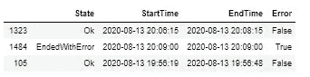

已分析错误日志中的示例行

# 持续时间

我们主要对`StartTime`和`EndTime`都不感兴趣，而是对记录事件的持续时间感兴趣。由于这两列都是 pandas 的数据时间，我们可以简单地将它们相减得到一个`timedelta`列。

```
# calculate the duration
df["Duration"] = df["EndTime"]-df["StartTime"]
```

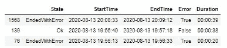

添加 timedelta 类型的持续时间列

# Plotly Express

看起来我们已经拥有了生成一些有趣情节所需的所有列。让我们研究一下错误的数量与事件的数量的对比。我们将使用 Plotly。Express，流行的 [Plotly 库](https://plotly.com/)的高级 API，它创建交互式(使用 JavaScript)图表。普洛特利。Express 以数据帧作为输入非常强大。使用 Plotly express，生成一个简单的图表是一行程序。

```
import plotly.express as px# With Plotly express you can quickly review the counts of varibles in the dataframe, even though I'm not sure which plotly have picked such low contract for their standard chart.**px.bar(df, x="State", title="Count of states")**
```

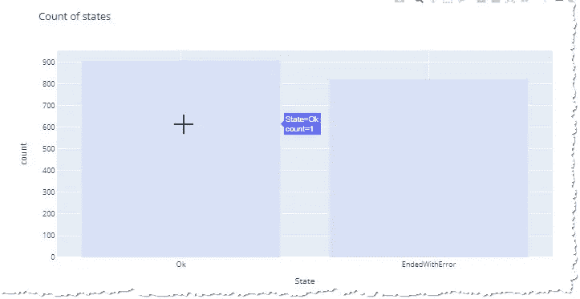

Plotly express 图表。它可以缩放，平移，并提供悬停工具提示。

Plotly 图表提供了许多伟大的功能。它们可以缩放，您可以通过拖动鼠标来平移图表，并且每个元素的数据都会在工具提示中进行汇总，工具提示会在您将鼠标悬停在元素上后出现。不幸的是，闪光的并不都是金子，还有一些令人讨厌的细节。

> Plotly 自动计算你的分类值，但是工具提示显示`count=1`，并且这样的条形图的自动颜色与背景没有对比。`px.pie` piechart 根本不会自动计算发生次数。

# 时间增量及其相关问题

我们知道我们的错误日志包含相当多的错误。它们的总数是惊人的，但是这些错误会持续发生吗？它们会反映在处理时间中吗？为了表明我们可以利用熊猫的`resample`功能，并计算每一分钟的事件。不幸的是，`timedelta`列不容易平均。

```
# you can average time delta for full dataframe
[In]: df["Duration"].mean()
[Out]: Timedelta('0 days 00:01:01.371594')  # ~one minute 
```

但是尝试在重新采样的数据帧上应用`mean`:

```
# but you cannot average it `.mean()
try:
    df.set_index("StartTime")["Duration"]**.resample("1min").mean()**
except Exception as e:
    print(e)[Out]: No numeric types to aggregate
```

您可以`resample`和`.sum()`、`.count()`，但由于某种原因，您无法对重新采样的 timedelta 值求平均值。

> 编程带来了意想不到的问题，但也带来了简单的解决方案。

*   您可以将时间增量转换为秒，然后取平均值
*   因为你可以`sum`和`count`，你也可以平均为`sum/count`

```
# you can turn timedelta into int, which give nanosecond represantation of the time delta which you divide by 1 bilion
df["duration_seconds"] = df["Duration"].astype('int64').divide(1000000000)# or you can use timedelta's .to_seconds() method
df["duration_seconds_2"] = df["Duration"].dt.total_seconds()
```

## 用熊猫重新采样

为了对任何数据帧进行重新采样，最简单的方法是将日期时间列之一设置为索引。我们将为`StartTime`做这件事。

```
stats = df.set_index("StartTime")
```

我们希望看到每分钟错误和成功的计数，以及成功和错误流程的处理时间(持续时间)。

```
stats = stats\
        .groupby("State")\
        .resample("1min")\
        .agg({"State":"count", "duration_seconds": "mean", "Duration": ["sum","count"]})
```

一次执行多个聚合会产生多级列名，我们使用`reset_index`将这些列名转换回一个级别，并根据每个级别对列进行重命名。

```
# State appear in index (due to groupby) and in values, because we count states. We must rename the column before we reset the index
stats = stats\
       .rename(columns={"State":"Count"}) 
       .reset_index(level=[0,1])
```

将两级列名合并成一个:

```
# two level column index turned into single level by joining zipped values from each levelstats.columns = ["_".join(z) for z in zip(stats.columns.get_level_values(0),
    stats.columns.get_level_values(1))]
```

最后，我们通过将`sum`列除以`count`列来计算平均持续时间

```
# calculate the average duration from the sum and count
stats["duration_mean"] = stats["Duration_sum"]/stats["Duration_count"]
```

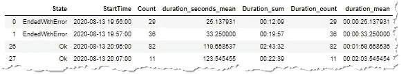

结果统计。每个状态的计数和每分钟的平均持续时间。

产生的数据帧`stats`可以使用单线绘图表达式绘制。

```
fig_count = px.bar(stats, x="StartTime", y="Count", barmode="group", color="State")
fig_count.show()
```

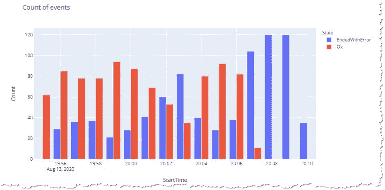

每分钟的事件计数

同样，持续时间可以绘制成折线图。

```
fig_duration = px.line(stats, x="StartTime", y="duration_mean", color="State")
fig_duration.show()
```

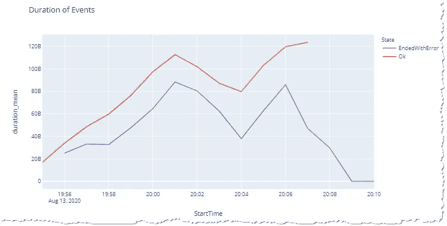

通过 Plotly 持续时间。用 y 轴上的 timedelta 列表示

> 注意 y 轴上的`120B, 100B, etc.`值。`timedelta`值的另一个弱点是许多库，包括 Plotly express 都很难正确使用它们。

因为我知道这个问题，所以我已经提前创建了`duration_seconds_mean`列，并将持续时间显示为`float`。

# 情节复杂的次要情节

关于同一个问题的两个图表就像是分离的恋人。这可能行得通，但合在一起更理想。每个可视化库都可以创建支线剧情，Plotly 也不例外。不幸的是，它不适用于 Plotly。Express 而且你还得用更低级的`go` API。

尽管每个 Plotly 图表的背景都有一个数据字典:

```
# each Plotly chart stores a dictionary of date and settings 
[In]: fig_duration.to_dict()
[Out]: 
{'data': [{'hovertemplate': 'State=EndedWithError<br>StartTime=%{x}<br>duration_seconds_mean=%{y}<extra></extra>',
   'legendgroup': 'EndedWithError', 
...
```

这些字典不能被输入到 Plotly 的支线剧情中

```
import plotly.graph_objects as go
from plotly.subplots import make_subplots# initialize the subplots
fig = make_subplots(rows=2, cols=1, shared_xaxes=True)# traying to add plotly express trace to the subplot will results in an error
try: 
    fig.add_trace(fig_duration)
    # neither the following would help
    # fig.add_trace(fig_duration.to_dict())
    # fig.add_trace(fig_duration.to_dict()["date"])
except Exception as e:
    print(e)**[Out]: Invalid element(s) received for the 'data' property of ...**
```

> 另一个恼人的特点是你不能用 Plotly 制作支线剧情。Express(还没有),你必须回到较低级别的 API，它不能很好地处理数据帧。

要制作一个子情节，你必须使用`Plotly.graph_objects.go`并分别指定每个输入——例如`x=df["StartTime"], y=df["duration]`。Plotly express 可以通过`categorical`列分割数据，但是对于`go` API，您必须手动将它们分开。

```
err = stats[stats["State"]=="EndedWithError"]
ok = stats[stats["State"]=="Ok"]
```

然后初始化子情节:

```
from plotly.subplots import make_subplots
fig = make_subplots(rows=2, cols=1)
```

添加所有跟踪(图表项目)，同时您可以指定细节，如系列的颜色或名称:

```
# add scatter (which includes line charts as well) as the top chart containing duration of successful events
**fig.add_trace**(
    go.Scatter(x=ok["StartTime"], 
               y=ok["duration_seconds_mean"], 
               name="success duration",
               marker_color="Green",
              ),
    row=1, col=1
)
```

最后，您自定义图表的布局并显示它:

```
fig.update_layout(title="Processing speed and number of errors with missaligned x-axis",
                  yaxis_tickformat = '.2f',
                  xaxis_title="Time of Request",
                  yaxis = {"title": "processing time"},
                  yaxis2 = {"title": "number of requests"}fig.show()
```

将所有这些放在一起，制作出普洛特利的围棋支线剧情

我们再次面临一个令人不快的困难:

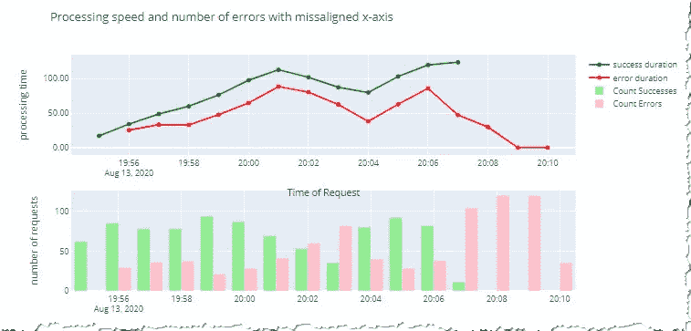

即使 x 轴具有相同的范围，它们在折线图和条形图中也是不对齐的。

> 即使 x 轴具有相同的范围，折线图的 x 轴也不会与条形图中的同一轴对齐。(参见[完整代码](https://github.com/vaclavdekanovsky/data-analysis-in-examples/blob/master/Error%20Log%20with%20pandas%20and%20Plotly/Error%20Log%20Analysis.ipynb)获取证明)

幸运的是，您可以使用`shared_xaxes=True`迅速修复它。这带来了另一个好处，当你放大一个图表时，另一个也会放大。

```
fig = make_subplots(rows=2, cols=1, **shared_xaxes=True**)
```

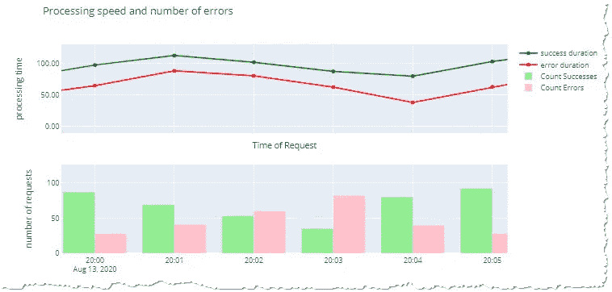

两个图被缩放在一起

# 共享 y 轴的绘图

这一初步探索表明:

1.  最初，没有错误
2.  随着处理时间的增加，错误的数量开始增加
3.  错误数量下降并开始再次增长，而时间继续增加
4.  有一段时间，处理时间减少了，但是成功的事件也减少了
5.  然后会有更多的成功发生，但也需要更长的时间来处理它们
6.  最后，所有请求都以错误结束，开始时需要一些时间，但最终，所有事件都在一秒钟内以错误结束。

你没看到吗？也许我们可以用两个 y 轴一起绘制图表。

> 带有主轴和副轴的图表也是子图，通过参数`specs=[[{“secondary_y”: True}]]`组合。通过`secondary_y=True`或`secondary_y=False`将每个轨迹分配给相关轴

让我们尝试用两个轴绘制带有计数的条形图和显示持续时间的折线图。

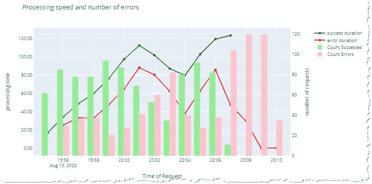

发生了什么，为什么我们的线藏在栅栏后面？

> 我最初将处理时间放在主轴上的决定是错误的，因为 Plotly 总是将副轴(条形图)显示在顶部，所以这条线在背景中消失了。

好了，普洛特利，让我们换一下轴。副轴为线，主轴为条。

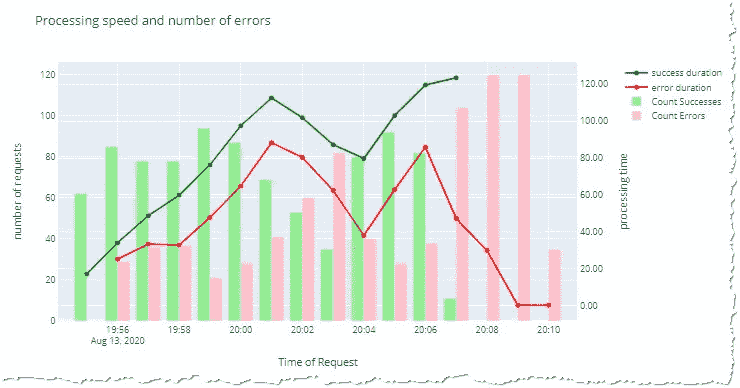

尽管如此，图表并不理想。可以看到每个轴的网格线彼此之间只有几毫米的距离。

如果你希望现在有一个好的图表，你可能会失望。两个轴共享(意外地)非常相似的范围(~[0，130])，但是 Plotly 决定绘制每个网格线，只是稍微偏离另一个轴上的相应网格线。

这种情况也有解决方法。只需强制两个轴使用相同的范围。

```
fig.update_yaxes(range=[0, 130])
```

我已经把图表给开发者看了，他们很快就明白了这个问题。随着事件越积越多，处理它们需要更长的时间，并且越来越多的事件以错误告终。这个系统非常聪明，它决定偶尔终止部分进程，这样我们就不会有错误了。有一次，它甚至试图重新开始整个过程，但由于场景重复，最终，一切都被拒绝。

为了确定模式，不使用`1min`而是使用`5s (seconds).`很容易重新采样数据

```
df.set_index("StartTime").groupby("State")**.resample("5s")**.agg(...)
```

这里，一个轴的事件范围为 0–30，而另一个轴的事件范围为 0–150。Plotly 不会对齐网格线，我们必须试验每个轴的设置，以获得两个轴的相同网格线。

```
# you can specify the range and ticks of any axis
fig.update_layout(yaxis={"range":[0,30]},
                  yaxis2={"range":[0,150],
                         "tickvals": [25,50, 75, 100, 125, 150]}
                 )
```

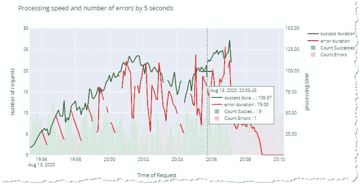

同样的情况样本由 5 秒钟与 Plotly 的美丽的工具提示

由于 Plotly 的交互性，您可以放大图表并探索任何部分。使用单个参数`fig.update_layout(hovermode=”x unified”)`创建了一个包含所有 4 个显示值的漂亮工具提示。


利用 Plotly 的交互性探索 5s 样品的细节

# 结论

在本文中，我们探讨了如何将一个简单的错误日志转换成图表，以帮助我们找到一个可以解释的模式。我们曾经和熊猫`timedelta`和`Plotly`斗争过。不要误解我，Plotly 是一个很棒的库，但有时简单的事情会很复杂。

> 然而，大多数时候，你受益于把复杂的事情变得简单。

如果你想了解股票市场公司的财务状况，请阅读:

[](/stock-fundamental-analysis-eda-of-secs-quarterly-data-summary-455e62ff4817) [## 股票基本面分析:SEC 季度数据汇总的 EDA

### 大熊猫 2020 SEC 申报的探索性数据分析

towardsdatascience.com](/stock-fundamental-analysis-eda-of-secs-quarterly-data-summary-455e62ff4817) 

或者用人工智能进行哲学思考

[](https://medium.com/@vaaasha/can-ai-teach-us-happiness-2629b600a4e0) [## AI 能教会我们快乐吗？

### 如何利用大脑的模式识别能力为我们造福？

medium.com](https://medium.com/@vaaasha/can-ai-teach-us-happiness-2629b600a4e0) 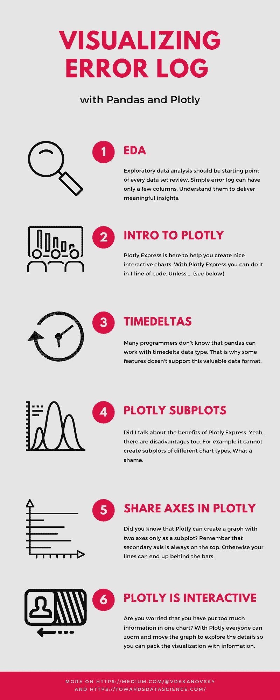