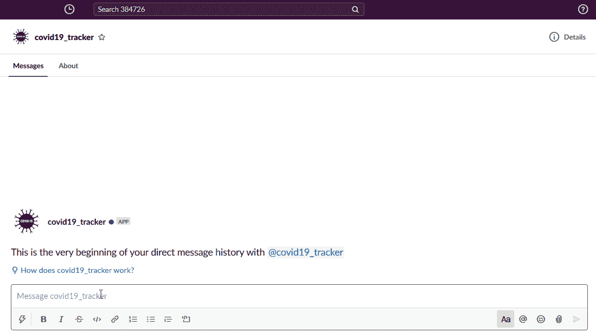
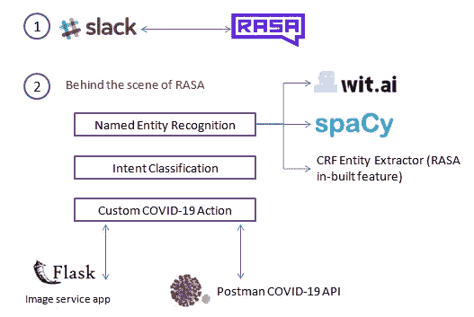
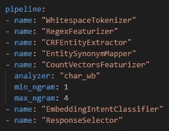
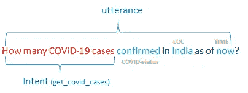
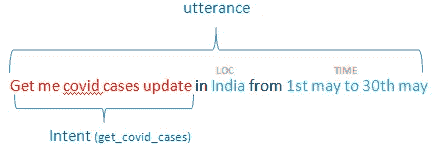
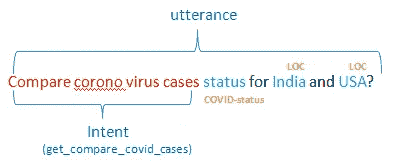
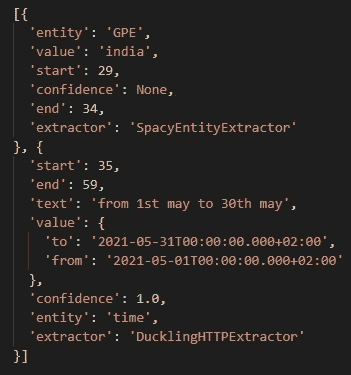
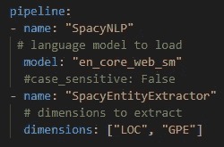
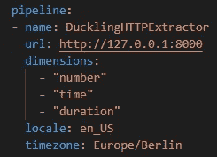

# 从 Slack Bot 的新冠肺炎案例更新的文本中可视化

> 原文：<https://towardsdatascience.com/visualize-from-text-for-covid-19-cases-update-from-slack-bot-2590ea780887?source=collection_archive---------67----------------------->

## 获得最新的新冠肺炎全球跟踪使用人类文本与命名实体识别

新冠肺炎跟踪松弛应用程序。(*图片作者*)

如果我们能在一个地方看到所有的新冠肺炎信息，那该有多好？在这篇文章中，我们将研究如何开发一个系统，通过**问一些自然的问题来提供全世界新冠肺炎病例的更新。**

我们许多人都听说过 Alexa 设备，但有些人经常使用它。它试图通过高级机器学习工作流来解释文本。我们将建立一些类似于 Alexa 的技能，可以回答相关问题。

我们将创建**新冠肺炎跟踪机器人**，它试图理解多种意图，提取命名实体识别(NER)值，实现自定义新冠肺炎视觉响应，并具有松散集成。

# 我们将讨论以下主题:

1.  解决方案架构
2.  意图分类
3.  命名实体识别
4.  新冠肺炎海关行动
5.  松散集成

# 1.解决方案架构

解决方案架构(*图片作者*)

[RASA](https://rasa.com/) 聊天机器人框架提供了与 [Slack App](https://api.slack.com/apps) 连接的最简单方式。让我们看看 RASA 聊天机器人的幕后发生了什么。人类文本作为输入传递到 RASA 框架中的管道，以执行自然语言处理(NLP)操作。以下是 RASA 中用于识别话语的**意图**的示例可配置 NLP 管道。

基本 RASA NLP 管道。(*作者图片*)

**命名实体识别(NER)** 是流行的自然语言处理任务之一**。**从文本中获取特定的 NER 将使用 Spacy，由 [wit.ai](https://wit.ai/) 提供的 duckling，以及使用 CRF 实体提取器(RASA)的自定义实体。

接下来，**我们如何为 RASA Bot 生成动态视觉响应？**是的，可以使用 RASA 进行自定义操作。RASA 提供了一个定制的动作服务器来实现特定的业务逻辑，以便机器人做出响应。我们的新冠肺炎跟踪器逻辑将在自定义操作中实现。自定义新冠肺炎机器人响应将有图像输出。然而，slack 应用程序只会识别可从公共 URL 访问的图像。因此，需要包含来自 RASA bot 响应的公共 URL 图像。

**我如何向 Slack 应用程序提供新冠肺炎视觉图像？**这里使用了一个简单的 flask web 应用程序。整个解决方案部署在 AWS EC2 实例中。RASA 自定义动作生成图像输出，并保存在 flask app 目录的静态文件夹下。Slack 使用这个 flask 端点 URL 来访问图像。下面是样品瓶代码。

Flask web 应用程序访问图像。

# 新冠肺炎案例追踪器示例:

例句 1 ( *图片作者*

例句 2 ( *作者图片*)

例句 3 ( *图片作者*)

在上面的例子中，每个句子都被称为话语。RASA 框架执行配置管道中指定的意图分类和实体识别。让我们看看下面的每个主题:

# 2.意图分类

意图分类是聊天机器人的强大模块之一。这是一个分类问题，输入文本需要分类。RASA 提供各种分类算法来执行意图识别。每个意图都与要执行的特定动作相关联。

# 3.命名实体识别

我们需要将位置名称、日期和自定义实体标识为 COVID 案例类型(活动、已确认、已恢复和死亡)。我们的管道中使用了以下库:

1.  空间
2.  小鸭子
3.  RASA 实体提取器

样本实体提取信息。(*作者图片*)

## 空间

Spacy 库在这里用于标识位置名称，如印度、美国、中国、澳大利亚。有不同的预训练模型可供使用。你可以点击查看空间 NER [演示。您可以在 RASA 管道中使用 Spacy NER，如下所示:](https://explosion.ai/demos/displacy-ent)

RASA 管道中的 Spacy NER。(*作者图片*)

我们可以选择预先训练的模型以及从话语中提取哪种实体。我们指定了 LOC 和 GPE 实体来标识位置名称。

## 小鸭子

[Duckling](https://duckling.wit.ai/) 是一个 Haskell 库，它将文本解析成结构化数据。脸书开发了一个小鸭图书馆。它可以处理多个实体，如时间、日期、持续时间、距离、数量、温度、数量。在我们的场景中，我们使用从文本中提取日期信息。您可以在 RASA 管道中使用小鸭 NER，如下所示:

RASA 管道中的小鸭子 NER。(*图片作者*)

小鸭库怎么安装？

1.  安装 docker。你可以参考[这里的](https://docs.docker.com/get-docker/)进行安装。
2.  RASA 提供了[小鸭码头工人图像](https://hub.docker.com/r/rasa/duckling)。您可以将 docker 图像克隆为`docker pull rasa/duckling`
3.  您可以使用`docker run`命令启动 docker 映像。
4.  使用`docker ps`命令检查状态。

小鸭子在`8000`港口奔跑。你可以在你的 RASA 管道中提到 duckling URL 和具体的实体名称。

## CRF 实体提取器

条件随机字段(CRF)是 RASA 框架的一个组件，用于标识定制实体。我们使用来标识自定义实体，如**电晕状态**(确认、活动、恢复和死亡)。RASA 框架自行训练自定义实体。

# 4.新冠肺炎海关行动

现在，我们如何根据给定的人类文本生成视觉输出？到目前为止，我们从文本中解释了意图和实体。它帮助我们实现自定义新冠肺炎跟踪器逻辑。互联网上有新冠肺炎的开源 API，它提供每个国家的信息。我们将使用来自 API 的新冠肺炎信息来绘制可视化输出。下面是项目中使用的 COVID API:

1.  [邮递员新冠肺炎 API](https://api.covid19api.com)
2.  [小说电晕 API](https://corona.lmao.ninja/v2)

你可以在这里找到自定义动作 Python 代码[。](https://github.com/narendraprasath/COVID-19-Tracker-Bot/blob/master/COVID-19-Tracker-Chatbot_Code/CovidTracker.py#L150)

# 5.松散集成

在 Slack 应用中设置 RASA bot 的最后阶段。

1.  在此创建一个新的 Slack 应用[。](https://api.slack.com/apps)
2.  转到 OAuth 令牌&重定向 URL >订阅 Bot 令牌范围:channels.history，chat:write，groups:history，im:history，mpim:history。
3.  OAuth 令牌&重定向 URL >工作区的令牌。您将获得 OAuth 访问令牌作为`xoxb-xxxxxxxxx.`
4.  点击`Install App to Workspace.`
5.  获取 OAuth 访问令牌，在 RASA 中打开`credentials.yml`文件，并更改值`slack_token: “access-token<xoxb-xxxxxxx>”.`
6.  转到事件订阅>订阅 bot 事件:message.channels、message.groups、message.im、message.mpim。
7.  现在，你已经成功地在 Slack 应用中集成了 RASA bot。

恭喜你！您已成功完成时差集成。**新冠肺炎追踪者机器人**源代码可在 [GitHub](https://github.com/narendraprasath/COVID-19-Tracker-Bot/) 中获得。如果你有什么要说的，请提出你的意见。

感谢阅读！你可以通过 [LinkedIn](https://www.linkedin.com/in/narendra-prasath/) 联系到我。

# **资源:**

 [## covid 19-印度 API

### 一个志愿者驱动的新冠肺炎统计 API&印度病人追踪(非官方)…

documenter.getpostman.com](https://documenter.getpostman.com/view/10724784/SzYXXKmA?version=latest)  [## NovelCOVID API

### 更新:1591782903866，病例:7342359，今日病例:31527，死亡:414124，今日死亡:1152，痊愈…

科罗娜. lmao .忍者](https://corona.lmao.ninja/)  [## Rasa:开源对话式人工智能

### 利用我们的开源机器学习框架，在文本和语音中构建上下文相关的人工智能助手和聊天机器人。缩放它…

rasa.com](https://rasa.com/)  [## 小鸭子

### 用 Clojure 编写的日期解析器

小鸭. wit.ai](https://duckling.wit.ai/)