# 用 Python 从零开始的神经网络

> 原文：<https://towardsdatascience.com/visualize-how-a-neural-network-works-from-scratch-3c04918a278?source=collection_archive---------16----------------------->

## 通过可视化每一步的结果，您可以更好地理解简单的神经网络是如何工作的

神经网络通常被认为是一种黑盒算法。数据可视化可以帮助我们更好地理解这种算法的原理。由于标准软件包没有给出如何找到参数的所有细节，我们将从头开始编写一个神经网络。为了直观地显示结果，我们选择了一个简单的数据集。

# 简单的数据集和神经网络结构

让我们使用这个只有一个特征 x 的简单数据集。

```
import numpy as npX=np.array([[-1.51], [-1.29], [-1.18], [-0.64],
[-0.53], [-0.09], [0.13], [0.35],
[0.89], [1.11], [1.33], [1.44]])y=np.array([[0], [0], [0], [0],
[1], [1], [1], [1],[0], [0], [0], [0]])
```

x 是具有 12 个观察值的单列向量，y 也是具有 12 个值的列向量，这些值表示目标。我们可以将这个数据集可视化。

```
import matplotlib.pyplot as plt
plt.scatter(X,y)
```

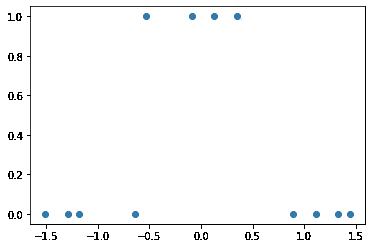

对于那些已经知道神经网络如何工作的人来说，通过看到这个图表，你应该能够找到一个简单的结构。在下一部分中，激活函数将是 sigmoid 函数。

所以问题是:**我们需要多少层和多少个神经元来建立一个适合上面数据集的神经网络？**

如果我们只使用一个神经元，这与进行逻辑回归是一样的，因为激活函数是 sigmoid 函数。我们知道这是行不通的，因为数据集不是线性可分的，简单的逻辑回归不适用于非线性可分的数据。所以我们必须添加一个隐藏层。隐藏层中的每个神经元将导致线性决策边界。

通常，逻辑回归创建一个超平面作为决策边界。由于这里我们只有一个特征，那么这个超平面只是一个点。从视觉上，我们可以看到我们需要两个点来区分两个类。它们的值一个是-0.5，另一个是 0.5。

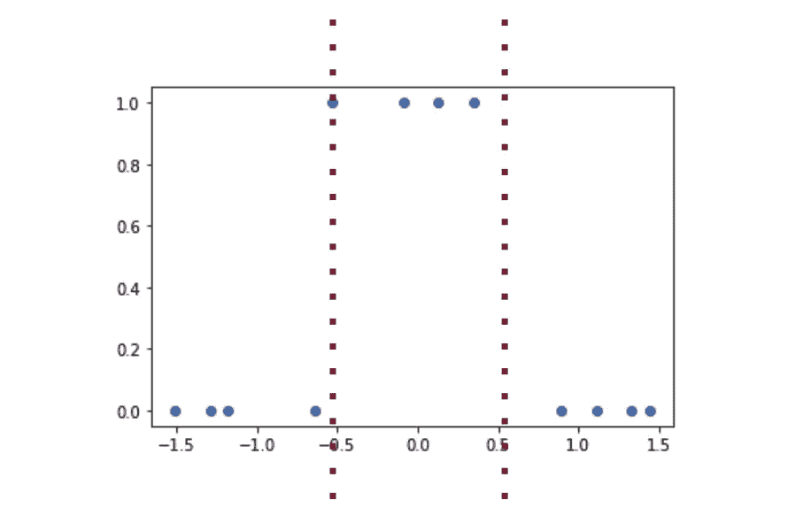

因此，具有以下结构的神经网络将是我们数据集的良好分类器。

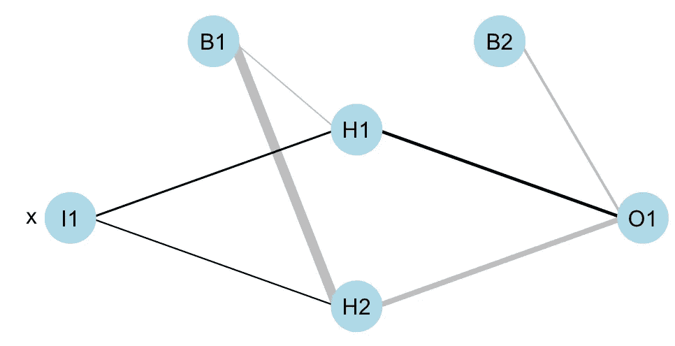

如果你不清楚，你可以看看这篇文章。

[](/intuitively-how-do-neural-networks-work-d7710b602e51) [## 直观来看，神经网络是如何工作的？

### “神经网络”这个术语可能看起来很神秘，为什么一个算法叫做神经网络？它真的模仿真实的…

towardsdatascience.com](/intuitively-how-do-neural-networks-work-d7710b602e51) 

# 使用 scikit 学习 MLPClassifier

在从头开始构建神经网络之前，让我们首先使用已经构建的算法来确认这样的神经网络是合适的，并可视化结果。

我们可以使用 scikit learn 中的 **MLPClassifier** 。在下面的代码中，我们用参数 **hidden_layer_sizes** 指定隐藏层的数量和神经元的数量。

```
from sklearn.neural_network import MLPClassifierclf = MLPClassifier(solver=’lbfgs’,hidden_layer_sizes=(2,), activation=”logistic”,max_iter=1000)clf.fit(X, y)
```

然后我们就可以计算分数了。(您应该得到 1.0，否则，由于局部最小值，您可能必须再次运行代码)。

```
clf.score(X,y)
```

太棒了，怎么才能把算法的结果可视化呢？由于我们知道这个神经网络是由 2+1 逻辑回归构成的，所以我们可以用下面的代码得到参数。

```
clf.coefs_
clf.intercepts_
```

我们如何解释这些结果？

对于 **clf.coefs_** ，你会得到(例如):

```
[array([[-20.89123833, -8.09121263]]), array([[-20.19430919], [ 17.74430684]])]
```

并且对于 **clf.intercepts_**

```
[array([-12.35004862, 4.62846821]), array([-8.19425129])]
```

列表的第一项包含隐藏层的参数，第二项包含输出层的参数。

有了这些参数，我们可以绘制曲线:

```
def sigmoid(x):
    return 1.0/(1+ np.exp(-x))plt.scatter(X,y)
a1_1=sigmoid(xseq*clf.coefs_[0][0,0]+clf.intercepts_[0][0])
a1_2=sigmoid(xseq*clf.coefs_[0][0,1]+clf.intercepts_[0][1])
output=sigmoid(a1_1*clf.coefs_[1][0]+a1_2*clf.coefs_[1][1]+clf.intercepts_[1])plt.plot(xseq,a1_1,c=”red”)
plt.plot(xseq,a1_2,c=”blue”)
plt.plot(xseq,output,c=”black”)
```

我们可以得到下面的图表:

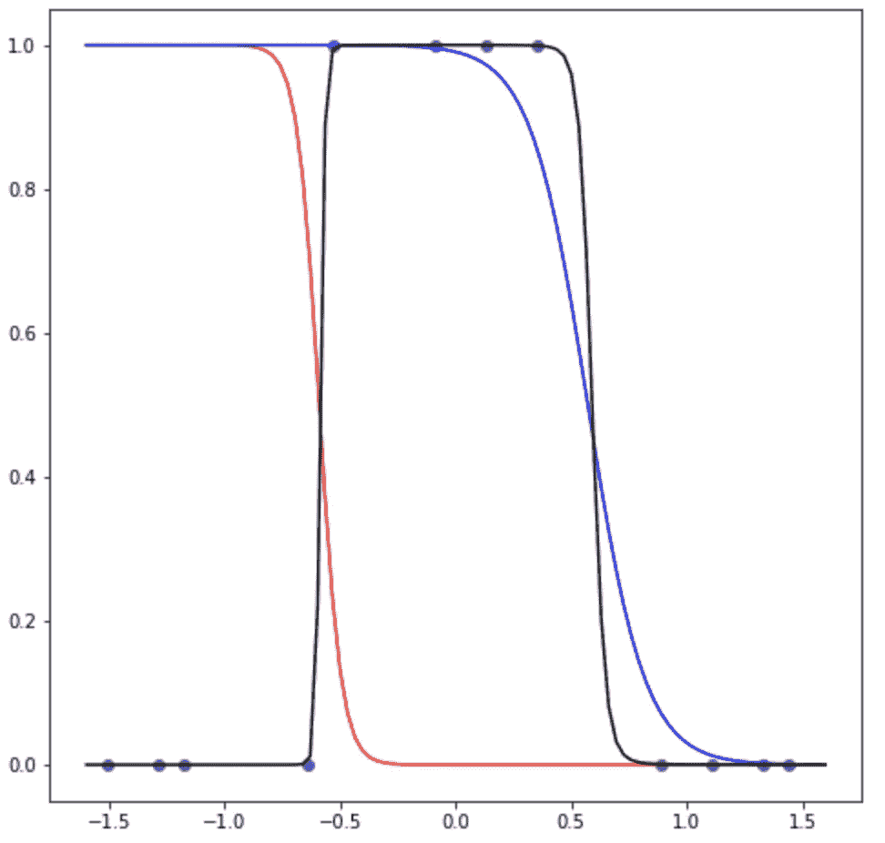

*   红色的是隐藏层的神经元 1 的结果
*   蓝色的是隐藏层的神经元 2 的结果
*   黑色的是输出

如果您运行代码，您可能会得到另一个结果，因为损失函数有几个全局最小值。

在 **keras** 中，当然也可以创建相同的结构:

```
from keras.models import Sequential
from keras.layers import Dense
model = Sequential()
model.add(Dense(2, activation=’sigmoid’))
model.add(Dense(1, activation=’sigmoid’))
model.compile(loss=’binary_crossentropy’, optimizer=’adam’, metrics=[‘accuracy’])
model.fit(X_train, y_train, epochs=300)
```

# 从头开始编码

现在的问题是这七个参数是怎么找到的？一种方法是使用梯度下降。

## 正向传播

首先，让我们做正向传播。

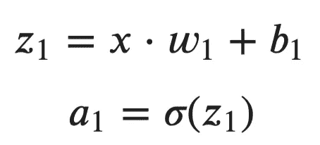

对于每个神经元，我们必须找到权重 w 和偏差 b。让我们尝试一些随机值。

```
plt.scatter(X,y)
plt.plot(xseq,sigmoid(xseq*(-11)-11),c="red")
```

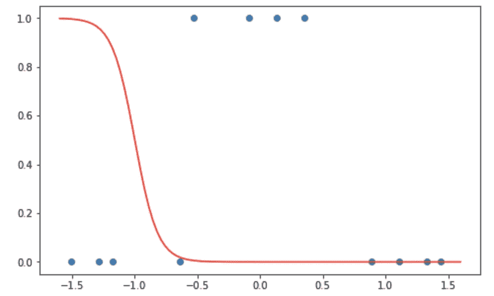

由于有两个神经元，我们可以通过为参数创建矩阵来进行矩阵乘法:

*   权重矩阵应该有两列。(因为这里输入数据有一列，所以权重矩阵应该有一行两列)。我们可以做一个随机的初始化，选择一些值。
*   偏置应该具有相同的结构。

```
w1=np.random.rand(X.shape[1],2) # random initialization
w1=np.array([[-1,9]])
b1=np.array([[-1,5]])z1=np.dot(X, w1)+b1
a1=sigmoid(z1)
```

如果您只是在阅读，而不是同时运行笔记本，可以做的一个练习是回答以下问题:

*   np.dot(X，w1)的维数是多少？
*   z1 的尺寸是多少？
*   为什么做加法可以？如果 b1 是一个简单的一维数组呢？
*   a1 的维数是多少？

如果我们用之前创建的 xseq 替换输入 X，我们可以绘制曲线:

```
a1_seq=sigmoid(np.dot(xseq.reshape(-1,1), w1)+b1)plt.scatter(X,y)
plt.plot(xseq,a1_seq[:,0],c="red")
plt.plot(xseq,a1_seq[:,1],c="blue")
```

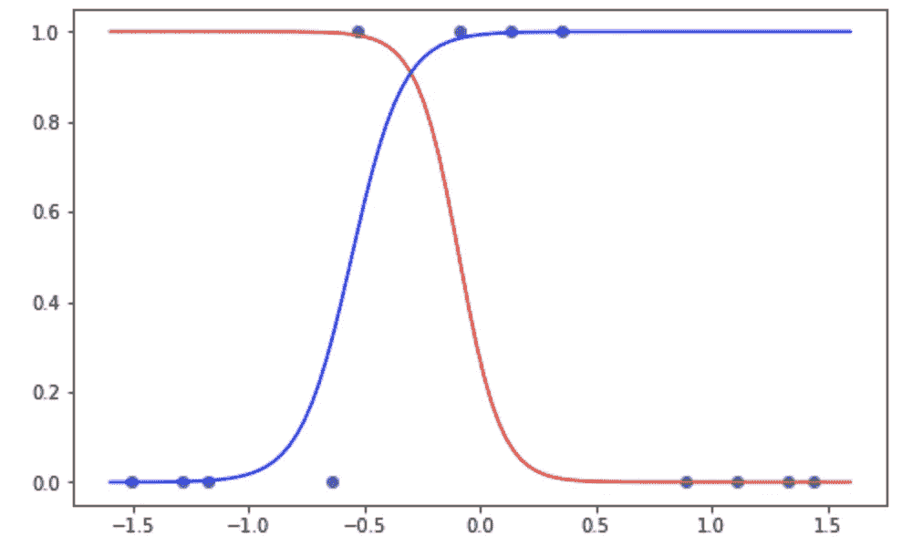

现在对于输出，这是一个非常相似的计算。

*   权重矩阵现在有了行，因为隐藏层产生了两列的矩阵。
*   偏差矩阵是一个标量

```
w2 = np.random.rand(2,1)
b2=0
output=sigmoid(np.dot(a1,w2)+b2)
```

然后我们可以用其他曲线来绘制输出

```
output_seq=sigmoid(np.dot(a1_seq,w2)+b2)plt.scatter(X,y)
plt.plot(xseq,a1_seq[:,0],c=”red”)
plt.plot(xseq,a1_seq[:,1],c=”blue”)
plt.plot(xseq,output_seq,c=”black”)
```

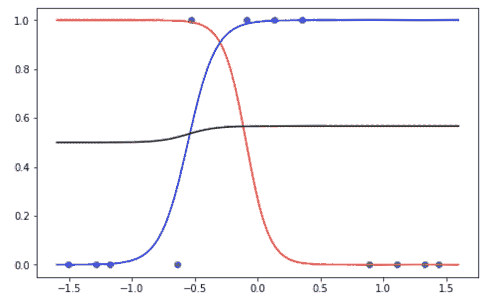

如你所见，随机选择的参数并不好。

总结一下正向传播:

```
def feedforward(input,w1,w2,b1,b2):
    a1 = sigmoid(np.dot(input, w1)+b1)
    output = sigmoid(np.dot(a1, w2)+b2)
    return output
```

## 成本函数的可视化

合适的参数是那些最小化成本函数的参数。我们可以使用交叉熵:

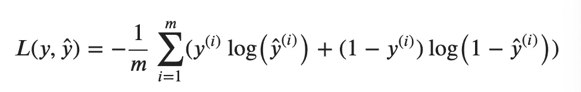

该函数可以编码如下:

```
def cost(y,output):
    return -np.sum(y*np.log(output)+(1-y)*np.log(1-output))/12
```

由于有 7 个参数，可视化成本函数并不容易。我们就选择其中一个来变化吧。例如 w1 中的第一重量。

```
b1=np.array([[16.81,-23.41]])
w2= np.array([28.8,-52.89])
b2=-17.53p = np.linspace(-100,100,10000)for i in range(len(p)):
    w1=np.array([[p[i],-37.94]])
    output=feedforward(X,w1,w2,b1,b2)
    cost_seq[i]=cost(y,output)
```

你可以看到它一点也不凸。

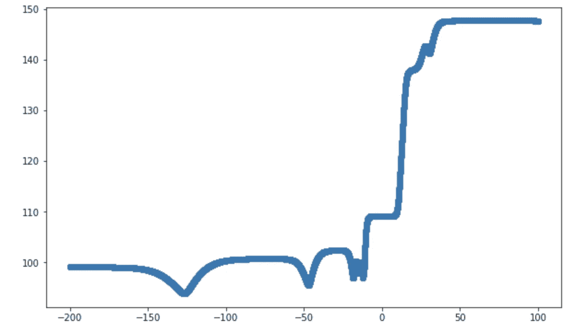

也有可能改变两个参数。

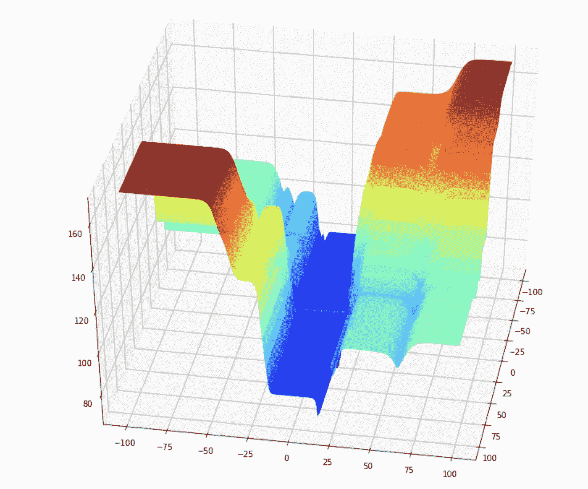

为了更好地形象化成本函数，我们还可以制作一个动画。

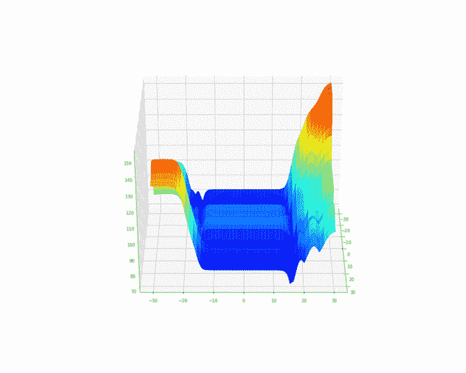

现在让我们用梯度下降法找到这个成本函数的一些合适的全局最小值，这叫做反向传播。

## 反向传播

偏导数可能会很难看，但幸运的是，有了交叉熵作为损失函数，最终的结果会有一些简化。

这又是成本函数:


*   请注意，当您使用成本函数来计算模型的成本时，此函数的输入变量是模型的输出和目标变量的真实值。
*   如果我们试图找到模型的最佳参数，那么我们认为这个成本函数的输入变量就是这些参数。我们要计算成本函数对每个参数的偏导数。

对于 w1 的偏导数，使用链式法则，我们有:

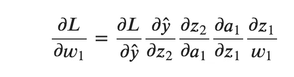

首先，对于 sigmoid 函数，导数可以写成:

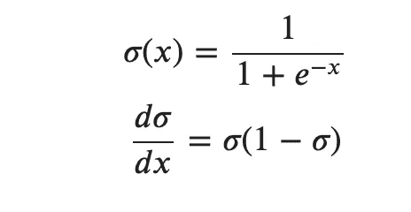

(请注意，代价函数是函数之和，函数之和的偏导数是函数的偏导数之和，所以为了简化记法，我们将去掉和符号，确切地说是均值计算)。

我们先按如下计算前两项:

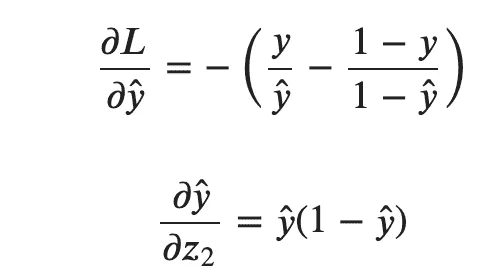

而且我们可以注意到，它们可以简化为(yhat-y)。

然后我们得到 w1 的最终结果:

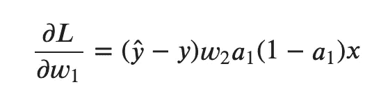

对于 b1，表达式非常相似，因为唯一的区别是最后的偏导数:

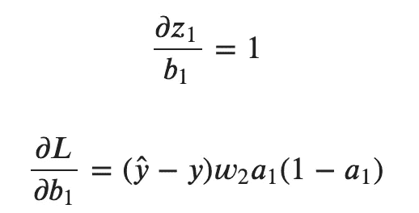

我们将用矩阵乘法对计算进行编码。在编码之前，我们可以问自己一些问题(并回答它们):

*   残差的维数是多少(yhat — y)？它是一个列向量，行数等于总观察数。
*   w2 的维度是多少？这是一个两行一列的矩阵。记住，它是两个隐藏神经元的权重矩阵，用来计算输出。
*   (yhat — y)*w2 的维数是多少？因为维数 w2 是(2，1)，所以我们不能做简单的乘法。我们做什么呢我们可以转置 w1 矩阵。然后(yhat — y)*w2 会给我们一个两列和 12 个观察值的矩阵。这是完美的，因为我们想要计算每一个重量。
*   a1 的维数是多少？这是隐藏层的结果。因为我们有两个神经元，a1 有两列和 12 个观察值。并且与先前矩阵的乘法将是逐元素的乘法。
*   所有这些都是非常一致的，因为最终，我们将得到一个包含 2 列和 12 个观察值的矩阵。第一列与第一个神经元的权重相关联，第二列与隐藏层中第二个神经元的权重相关联。

让我们做一些编码:

```
d_b1_v=np.dot((output-y), w2.T) * a1*(1-a1)
```

这个矩阵代表什么？我们可以再次展示对 b1 的偏导数。

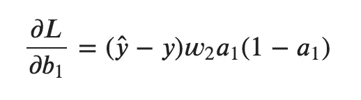

矩阵 d_b1_v 是所有观测值的偏导数。而要得到最终的导数，就要计算那些与所有观测值相关的和(记住，L 是函数的和)，并计算平均值。

```
d_b1=np.mean(d_b1_v,axis=0)
```

对于 w1，我们必须考虑 x。对于每一个观察值，我们必须用 x 的值乘以以前偏导数得到的值，然后将它们全部相加。这就是一个点积。为了得到平均值，我们必须除以观察次数。


```
d_w1 = np.dot(X.T, d_b1_v)/12
```

现在，让我们继续输出层的参数。会简单很多。

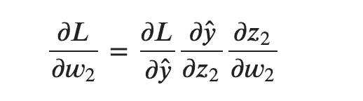

我们已经有了:

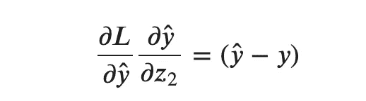

所以 w2 和 b2 的导数是:

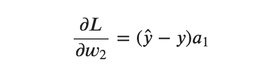

对于 b2，我们只需对残差求和

```
np.sum(output-y)/12
```

对于 w2，它是 a1(层 1 的结果)和残差之间的点积。

```
np.dot(a1.T, (output-y))/12
```

## 包装中的最终算法

现在我们可以创建一个类来包含向前传播和向后传播这两个步骤。

我使用了基于[这篇非常受欢迎的文章](/how-to-build-your-own-neural-network-from-scratch-in-python-68998a08e4f6)的 python 代码。你可能已经看过了。不同之处在于

*   损失函数(交叉熵代替均方误差)
*   添加学习率

```
class NeuralNetwork:
    def __init__(self, x, y):
        self.input = x
        self.w1 = np.random.rand(self.input.shape[1],2)
        self.w2 = np.random.rand(2,1)
        self.b1 = np.zeros(2)
        self.b2 = 0.0
        self.y = y
        self.output = np.zeros(self.y.shape) def feedforward(self):
        self.a1 = sigmoid(np.dot(self.input, self.w1)+self.b1)
        self.output = sigmoid(np.dot(self.a1, self.w2)+self.b2) def backprop(self):
        lr=0.1 res=self.output-self.y d_w2 = np.dot(self.a1.T, res)
        d_b2 = np.sum(res)
        d_b1_v=np.dot(res, self.w2.T) * self.a1*(1-self.a1)
        d_b1 = np.sum(d_b1_v,axis=0)
        d_w1 = np.dot(self.input.T, d_b1_v) self.w1 -= d_w1*lr
        self.w2 -= d_w2*lr
        self.b1 -= d_b1*lr
        self.b2 -= d_b2*lr
```

然后可以在梯度下降过程中存储 7 个参数的中间值，并绘制曲线。


动画是用 R 代码中的图形制作的。所以如果你对神经网络的 R 代码从零开始感兴趣，请评论。

如果你的代码对你来说很难理解，我还创建了一个 Excel (Google Sheet)文件来做梯度下降。如果你感兴趣，请在评论中告诉我。是的，你可能会认为在 Excel 中进行机器学习是疯狂的，我同意你的观点，尤其是在完成了所有七个参数的梯度下降的所有步骤之后。但目的是为了更好地理解。为此，Excel 是一个非常好的工具。

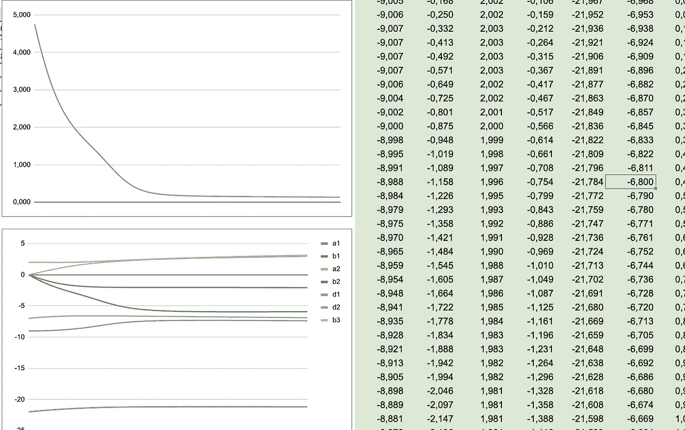