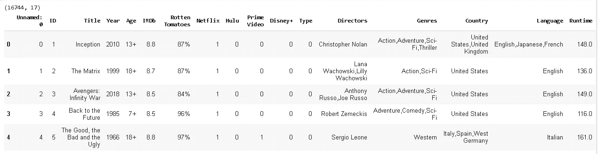
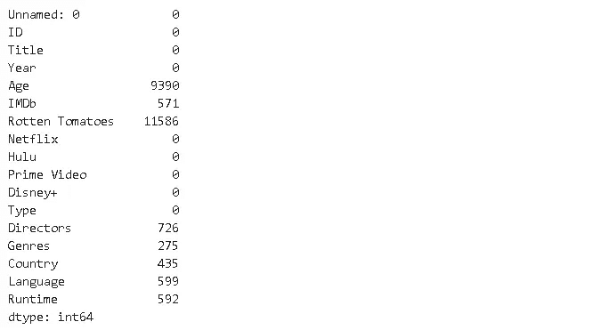
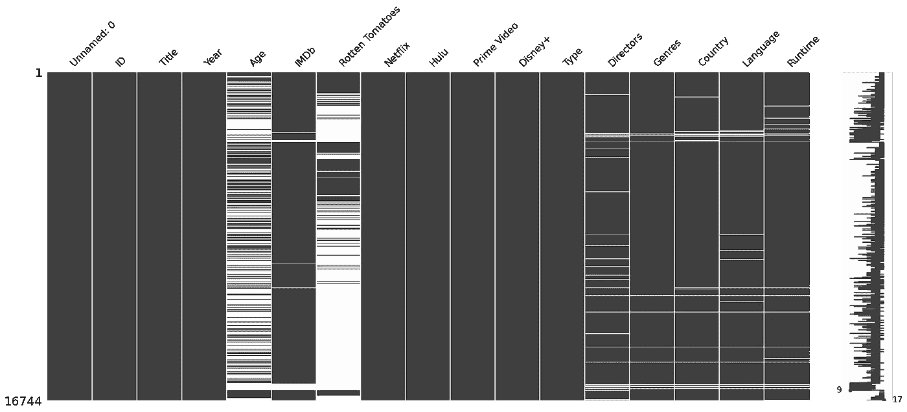
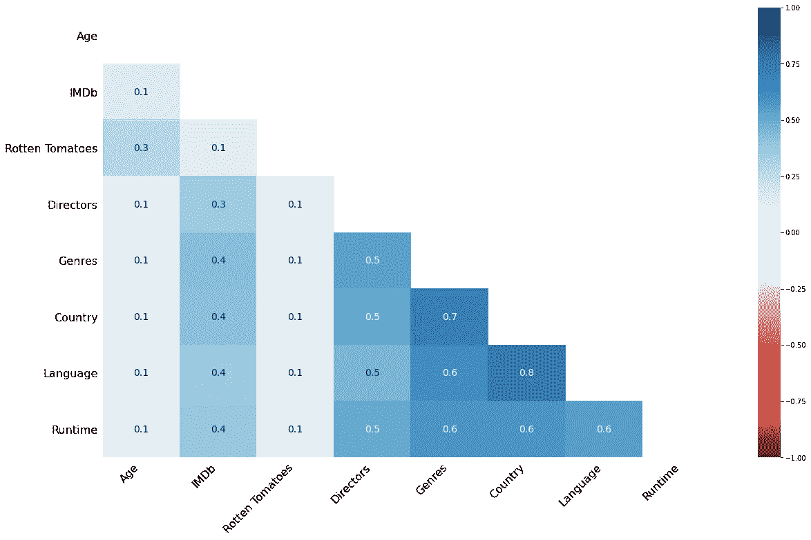
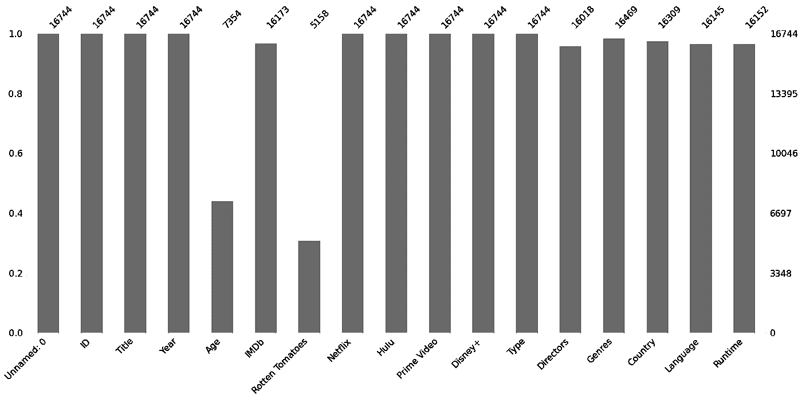

# 可视化缺失值和缺失号

> 原文：<https://towardsdatascience.com/visualize-missing-values-with-missingno-ad4d938b00a1?source=collection_archive---------18----------------------->

## 浏览数据集中缺失的值。


[伊琳娜](https://unsplash.com/@sofiameli?utm_source=unsplash&utm_medium=referral&utm_content=creditCopyText)在 [Unsplash](https://unsplash.com/s/photos/missing?utm_source=unsplash&utm_medium=referral&utm_content=creditCopyText) 上的照片

数据是新的燃料。然而，原始数据很便宜。我们需要好好处理它，从中获取最大价值。复杂的、结构良好的模型和我们提供给它们的数据一样好。因此，需要对数据进行彻底的清理和处理，以建立可靠和准确的模型。

我们在原始数据中可能遇到的一个问题是缺少值。考虑这样一种情况，我们在一些观察值(数据帧中的行)上有特征(数据帧中的列)。如果我们没有特定行列对中的值，那么我们就有一个缺失值。我们可能只有几个丢失的值，或者整个列的一半丢失。在某些情况下，我们可以忽略或删除缺少值的行或列。另一方面，在某些情况下，我们甚至不能丢失一个丢失的值。在任何情况下，处理缺失值的过程都是从在数据集中探索它们开始的。

Pandas 提供了检查数据集中缺失值数量的函数。 **Missingno** 库更进一步，通过信息可视化提供数据集中缺失值的分布。使用**缺失号**的图，我们能够看到缺失值在每一列中的位置，以及不同列的缺失值之间是否存在相关性。在处理缺失值之前，在数据集中探索它们是非常重要的。因此，我认为 missingno 是数据清理和预处理步骤中非常有价值的资产。

在本帖中，我们将通过一些例子来探索无遗漏绘图的功能。

让我们首先尝试探索一个关于流媒体平台上电影的数据集。数据集在 kaggle 上的处[可用。](https://www.kaggle.com/ruchi798/movies-on-netflix-prime-video-hulu-and-disney)

```
import numpy as np
import pandas as pddf = pd.read_csv("/content/MoviesOnStreamingPlatforms.csv")
print(df.shape)
df.head()
```



该数据集包含 16744 部电影和描述每部电影的 17 个特征。Pandas `isna`返回缺失值，我们应用`sum`函数来查看每一列中缺失值的数量。

```
df.isna().sum()
```



“年龄”和“烂番茄”列有许多缺失值。大约有 6 个其他列的缺失值数量超过 200。现在让我们使用 missingno 来看看我们是否能对丢失的值有一个更好的直觉。

```
import missingno as msno
%matplotlib inline
```

我们导入了缺少库。`%matplotlib inline`命令允许在 jupyter 笔记本中渲染可视化效果。我们使用的第一个工具是缺失值矩阵。

```
msno.matrix(df)
```



白线表示缺少值。“年龄”和“烂番茄”列如我们所料被白线所支配。但是，在其他缺少值的列中有一个有趣的趋势。它们通常在公共行中缺少值。如果某行的“导演”列中缺少值，则很可能“流派”、“国家”、“语言”和“运行时间”列中也缺少值。在处理缺失值时，这是非常有价值的信息。

热图用于可视化显示不同列之间值的相关性的相关矩阵。Missingno 库还提供热图，显示不同列中的缺失值之间是否有任何关联。

```
msno.heatmap(df)
```



正相关与蓝色的黑暗程度成比例，如右边的条所示。“导演”、“流派”、“国家”、“语言”、“运行时间”栏目之间存在不同程度的正相关关系。“语言”和“国家”之间的相关性最高，为 0.8。这证实了我们对缺失值矩阵的直觉，因为这些列在相同的行中有缺失值。

missingno 的另一个工具是缺失值的条形图。

```
msno.bar(df)
```



它显示与非缺失值的数量成比例的条形，并提供非缺失值的实际数量。我们知道每一列丢失了多少。

正如我们前面提到的，为了很好地处理缺失值，我们需要理解数据集在缺失值方面的结构。仅仅知道缺失值的数量是不够的。缺少库的情节对理解缺少的值很有帮助。完成这一步后，我们可以开始考虑如何处理丢失的值。

下面的帖子提供了如何处理熊猫丢失值的详细指导。Missingno 和 pandas 可以一起使用，以便建立一个健壮而有效的策略来处理缺失值。

[](/handling-missing-values-with-pandas-b876bf6f008f) [## 用熊猫处理缺失值

### 关于如何检测和处理缺失值的完整教程

towardsdatascience.com](/handling-missing-values-with-pandas-b876bf6f008f) 

感谢您的阅读。如果您有任何缺失值，请告诉我。