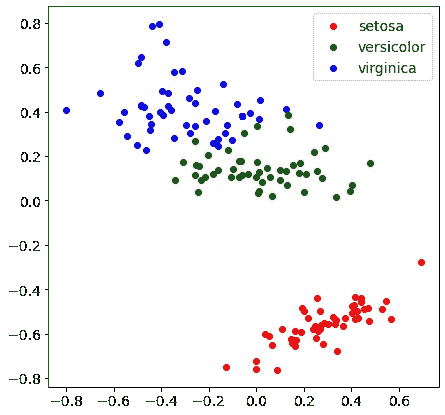

# 使用 MDS 可视化多维数据集

> 原文：<https://towardsdatascience.com/visualize-multidimensional-datasets-with-mds-64d7b4c16eaa?source=collection_archive---------28----------------------->

## 多维标度可以帮助您可视化数据，甚至在二维以上



数据可视化是数据科学中最令人着迷的领域之一。有时候，使用一个好的绘图或图形表示可以让我们更好地理解隐藏在数据内部的信息。我们如何在二维以上的情况下实现它？

只要我们使用二维数据集，一个简单的散点图对可视化模式和事件非常有用。如果我们使用三维数据，仍然有机会使用 3d 绘图来可视化一些东西。

但是如果我们想要可视化更高维的数据集会发生什么呢？事情会变得更加困难。想想聚类问题。如果我们可以在许多维度上可视化数据，以便检查是否存在一些模式，那将是非常美妙的。

当然，我们没有多维的视野，所以我们必须将多维数据转化为二维数据。有一种算法可以做到这一点，那就是 MDS。

# 什么是 MDS？

MDS(多维缩放)是一种算法，它将一个数据集转换为另一个数据集，通常具有更低的维度，并保持点之间的欧氏距离不变。

保持距离是 MDS 的一个非常有用的特性，因为它允许我们合理地保持模式和聚类，例如，如果我们想要执行 K-Means 或其他类型的聚类。

因此，举例来说，如果我们有一个 4 维数据集，并希望将其可视化，我们可以使用 MDS 在 2 维缩放它。点之间的距离保持在原始数据集中，因此，如果数据自组织成簇，即使在缩放过程之后，它们也是可见的。

当然，低维新点的坐标不再有商业价值，是无量纲的。值由散点图的形状和点之间的相对距离决定。

值得一提的是，在将数据集交给 MDS 之前，应该对其进行规范化或标准化。例如，这非常类似于我们对 K 均值聚类所做的工作。原因很简单:我们不希望仅仅因为某些特征的数量级比其他特征高，就赋予它们更多的权重。简单的 0-1 归一化将有效地解决这个问题。

在 Python 中，在包`sklearn`的模块`manifold`下有一个很好的 MDS 实现。让我们看一个使用著名的 Iris 数据集的例子。

# Python 中的一个例子

我们将使用 MDS 对虹膜数据集的 4 个特征进行二维缩放，使其可视化。首先，我们将对特征进行 0-1 的缩放，然后我们将进行二维 MDS 并绘制新数据，根据虹膜数据集的目标变量为每个点赋予不同的颜色。

让我们开始导入一些库。

```
import numpy as np
from sklearn.datasets import load_iris
import matplotlib.pyplot as plt
from sklearn.manifold import MDS
from sklearn.preprocessing import MinMaxScaler
```

现在，让我们加载虹膜数据集。

```
data = load_iris()
X = data.data
```

我们现在可以用`MinMaxScaler`进行 0-1 的缩放

```
scaler = MinMaxScaler()
X_scaled = scaler.fit_transform(X)
```

然后，我们应用 MDS 程序得到一个二维数据集。设置 random_state 是为了使每个图都可以再现。

```
mds = MDS(2,random_state=0)
X_2d = mds.fit_transform(X_scaled)
```

最后，我们可以绘制新的数据集。

```
colors = ['red','green','blue']plt.rcParams['figure.figsize'] = [7, 7]
plt.rc('font', size=14)for i in np.unique(data.target):
  subset = X_2d[data.target == i]

  x = [row[0] for row in subset]
  y = [row[1] for row in subset] plt.scatter(x,y,c=colors[i],label=data.target_names[i])plt.legend()
plt.show()
```

这是结果。


如您所见，“setosa”点距离其他点非常远，它们自己创建了一个集群。如果不以这种方式绘制数据，就很难获得这种洞察力。

# 结论

使用 MDS 可视化多维数据在许多应用中非常有用。例如，它可用于检测某些多元分布中的异常值。考虑一下预测性维护，有些设备的行为会偏离其他设备。另一个有用的用例是集群。在使用 K-Means 或 DBSCAN 之前，查看数据是否自组织成簇是有用的。如果数据集不太大，MDS 计算会非常简单快捷。否则，云架构可以成为加速计算的有用工具。

# 参考

[1]多维标度。*维基百科*。https://en.wikipedia.org/wiki/Multidimensional_scaling