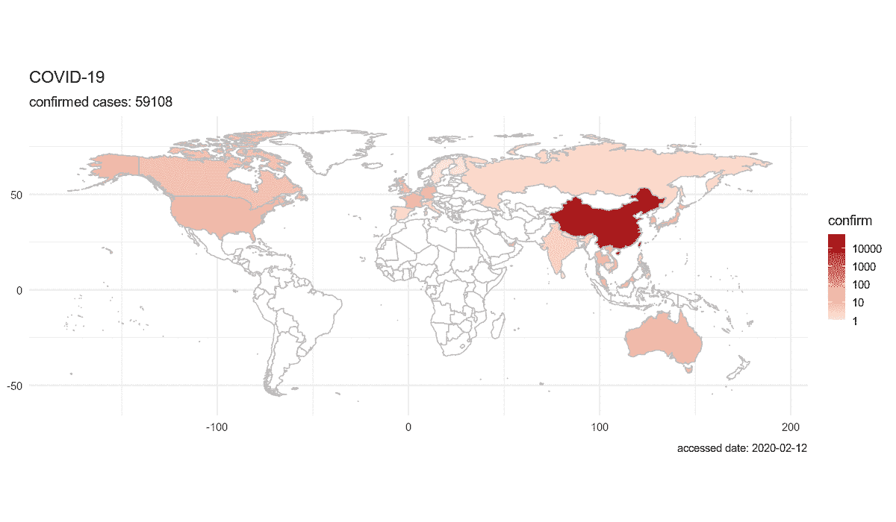

# 用 R #新冠肺炎想象疫情

> 原文：<https://towardsdatascience.com/visualize-the-pandemic-with-r-covid-19-c3443de3b4e4?source=collection_archive---------13----------------------->

## 作为一名数据科学家，你可以用新冠肺炎数据做什么。


资料来源:JHU·CSSE

按照疾病预防控制中心的建议，我们可以做两件事:阅读关于新冠肺炎的新闻，以及被不断增加的病例数压垮。过去几周情况有多糟？我的手机不停地播放着来自世界各地的新闻:首先是我在中国的家乡，然后是亚洲其他地方、欧洲和美国。超过一半的纽约已经停止通勤。我们已经用拳头碰撞代替了握手，现在，新的标准是:社交距离。五天前的 3 月 12 日，世界卫生组织宣布新冠肺炎为疫情。到目前为止，全世界 142 个国家超过 16 万人被确诊患有这种疾病。我觉得有义务用 R 创建一个追踪器来解释这个疫情。

我用的是南方医科大学广创于博士研发的 R 包“ [nCOV2019](https://github.com/GuangchuangYu/nCov2019) ”。这个软件包允许我们访问所有国家案例的最新数据和历史数据，在地图上绘制数据，并创建各种图表。如果你像我一样是一个有抱负的数据科学家，请随意安装该软件包，并按照以下步骤创建可视化:

**部署软件包**

**探索数据**

**创建视觉效果**

*   按国家的折线图
*   gif 中的全球新冠肺炎增长

**影响分析**

*   接下来 10 天我们会有多少病例？
*   冠状病毒正在影响好莱坞吗？
*   我们还在外面吃饭吗？(带 OpenTable 数据)

# 部署包

提取该包中嵌入的数据的基本函数有:

*   `get_nCov2019()`查询网上最新信息
*   `load_nCov2019()`获取历史数据
*   `summary`和`[`访问数据
*   `plot`在地图上显示数据

**安装并部署软件包**

```
remotes::install_github(“GuangchuangYu/nCov2019”)
**require**(nCov2019)
**require**(dplyr)
```

**第一印象**

```
x <- get_nCov2019()
y <- load_nCov2019()> xChina (total confirmed cases): 81134last update: 2020–03–17 21:19:04> ynCov2019 historical datalast update: 2020–03–16
```

跟上时代是非常重要的。简单地打印 x 和 y 将刷新数据。

```
> x['global',]name confirm suspect dead deadRate showRate  heal healRate showHeal1                          China   81134     128 3231     3.98    FALSE 68800    84.80     TRUE2                          Italy   27980       0 2158     7.71    FALSE  2749     9.82    FALSE3                           Iran   16169       0  988     6.11    FALSE  5389    33.33    FALSE4                          Spain   11178       0  491     4.39    FALSE   571     5.11    FALSE5                    South Korea    8320       0   83        1    FALSE  1401    16.84    FALSE6                        Germany    7272       0   17     0.23    FALSE   135     1.86    FALSE7                         France    6650       0  148     2.23    FALSE    28     0.42    FALSE8                  United States    4687       0   93     1.98    FALSE    74     1.58    FALSE9                    Switzerland    2269       0   19     0.84    FALSE     4     0.18    FALSE10                United Kingdom    1950       0   56     2.87    FALSE    52     2.67    FALSE
```

如何创建数据的概览？`x[‘global’,]`返回最新的全球数据，并按确诊病例数自动排序。

# 探索数据

首先，让我们探索当前数据的整体结构。DataExplorer 是一个 R 包，可以快速构建可视化。

```
#explore package
**library**(DataExplorer)
plot_str(x)
```


通过`get_nCov2019()`函数获得的数据包括 3 个列表和 5 个数据帧。这些是中国和世界各地确诊患者、死亡和康复病例的最新数据。

```
plot_str(y)
```


为了研究趋势，我重点研究了历史数据。通过函数`load_nCov2019()`获得的历史数据是一个列表，包括 3 个数据帧。名为“数据”的第一个数据框架是中国城市层面的历史数据，包括确诊病例、死亡、康复和疑似病例的数量。第二个名为“省”的是省级别的聚合数据。第三个数据框架“全球”包括世界各国的确诊病例、死亡和恢复情况。这些历史数据涵盖了从 2 月 15 日到最近更新的时间范围。

```
> summary(x['global',])
     name              confirm           suspect              dead           deadRate        
 Length:131         Min.   :    1.0   Min.   :  0.0000   Min.   :   0.00   Length:131        
 Class :character   1st Qu.:    4.5   1st Qu.:  0.0000   1st Qu.:   0.00   Class :character  
 Mode  :character   Median :   30.0   Median :  0.0000   Median :   0.00   Mode  :character  
                    Mean   : 1223.3   Mean   :  0.8626   Mean   :  45.44                     
                    3rd Qu.:  137.5   3rd Qu.:  0.0000   3rd Qu.:   1.00                     
                    Max.   :81062.0   Max.   :113.0000   Max.   :3204.00                     
   showRate              heal           healRate           showHeal        
 Length:131         Min.   :    0.0   Length:131         Length:131        
 Class :character   1st Qu.:    0.0   Class :character   Class :character  
 Mode  :character   Median :    0.0   Mode  :character   Mode  :character  
                    Mean   :  582.3                                        
                    3rd Qu.:    3.5                                        
                    Max.   :67023.0
```

我使用了 `summary()`函数来获得数据的统计概览。全球确诊病例的中位数是 30 例，而平均数是 1223.3 例。原因是异常值中国对平均确诊病例有很大影响。

# 创造视觉效果

可视化是探索性数据分析的另一个关键方法。通过图像，我们可以很容易地观察到国家和国际层面的疫情趋势。

*   **国别折线图**

上面已经提到了如何使用 x['全球'，]获得确诊病例最多的前 10 个国家。我们还可以绘制折线图，查看每个国家的病例增长情况。

```
#obtain top 10 country
d <- y[‘global’] #extract global data
d <- d[d$country != ‘China’,] #exclude China
n <- d %>% filter(time == time(y)) %>%
 top_n(10, cum_confirm) %>%
 arrange(desc(cum_confirm))#plot top 10
**require**(ggplot2)
**require**(ggrepel)
ggplot(filter(d, country %**in**% n$country, d$time > ‘2020–02–15’),
 aes(time, cum_confirm, color=country)) +
 geom_line() +
 geom_text_repel(aes(label=country),
 **function**(d) d[d$time == time(y),]) +
 theme_minimal(base_size=14) +
 theme(legend.position = “none”)
```


新冠肺炎确诊病例排名前 10 位的国家(不包括中国)

该图显示了中国以外确诊病例最多的前 10 个国家。意大利和伊朗是受感染最严重的国家，并且呈指数增长。与此同时，韩国通过有效的遏制战略，拉平了曲线，放缓了增长速度。其他一些欧洲国家和美国也出现了成千上万的新病例。

*   **gif 中的全球新冠肺炎增长**

全球的整体情况如何？用 plot()函数可以很容易地绘制出全球新冠肺炎确认数地图。

```
x <- get_nCov2019()
x
plot(x) #plot global map
```


新冠肺炎全球 3 月 15 日确诊病例

随着时间的推移会有什么变化呢？如果我们能以 gif 的形式展示这些变化，那将是一个很好的主意。我绘制了从 02-12 到 03-15 每天的全球地图，并用 R 包 magick 创建了一个 gif。

```
#visualize global growth over time
**library**(magick)y <- load_nCov2019()d <- c(paste0(“2020–02-”, 12:29), paste0(“2020–03–0”, 1:9), paste0(“2020–03–1”, 0:5))
img <- image_graph(1200, 700, res = 96)
out <- lapply(d, **function**(date){
 p <- plot(y, date=date,
 label=FALSE, continuous_scale=TRUE)
 print(p)
})
dev.off()animation <- image_animate(img, fps = 2)
print(animation)
```



新冠肺炎全球 2 月 12 日至 3 月 15 日确诊病例

现在我们可以看到冠状病毒是如何从中国开始，在短短一个月内传播到世界上大多数国家的。

# 影响分析

*   在接下来的 10 天内，我们会有多少个案例？

接下来，我们可以使用现有数据预测未来的病例增长。

以美国为例。


新冠肺炎确诊病例在美国增长

通过查看图表，我们可以很容易地发现病例以指数速度增长。在这种情况下，我们可以应用对数线性回归来建模和预测增长。我只考虑确诊病例超过 100 例的时间段，原因如下:

*   早期测试中
*   早期病例大多与旅行有关，而不是社区传播

```
usdata <- d %>%filter(d$country == ‘United States’ & d$cum_confirm>100) %>%select(time,cum_confirm)library(forecast)case <- ts(usdata[,2], start=1,frequency = 1)fit <- tslm(log(case) ~ trend)fc <- forecast(fit, h=10)
```


美国确诊病例对数的时间回归模型

我们的对数线性模型非常适合数据集。0.9974 的调整 R 平方表明 99%的方差可以用我们的模型来解释。

```
Residuals:Min        1Q    Median        3Q       Max-0.095126 -0.036574 -0.000754  0.036861  0.069923Coefficients:Estimate Std. Error t value Pr(>|t|)(Intercept) 4.311641   0.032840  131.29  < 2e-16 ***trend       0.288296   0.004462   64.61 1.92e-14 ***---Signif. codes:  0 ‘***’ 0.001 ‘**’ 0.01 ‘*’ 0.05 ‘.’ 0.1 ‘ ’ 1Residual standard error: 0.05336 on 10 degrees of freedomMultiple R-squared:  0.9976, Adjusted R-squared:  0.9974F-statistic:  4175 on 1 and 10 DF,  p-value: 1.92e-14
```

现在我们可以回答这个问题了，10 天内我们会有多少个案例？

我们可以用`forecast()`来做未来 5 天的预测(h 周期用来设置预测周期)。


```
Forecasts:Point Forecast     Lo 80     Hi 80     Lo 95     Hi 9515       5382.300  4936.042  5868.904  4683.598  6185.23516       7148.845  6541.200  7812.938  6198.094  8245.43617       9495.195  8666.463 10403.174  8199.463 10995.68618      12611.649 11479.941 13854.922 10843.598 14667.98119      16750.966 15204.003 18455.327 14336.190 19572.48420      22248.863 20132.776 24587.365 18948.614 26123.91221      29551.247 26655.278 32761.849 25038.879 34876.81022      39250.374 35286.012 43660.130 33079.244 46572.76423      52132.888 46705.412 58191.072 43692.648 62203.55324      69243.620 61813.326 77567.075 57700.726 83095.642
```

预测结果显示，如果确诊病例继续以指数速度增长，该数字将在 3 天内翻一番，并在 10 天内达到近 70，000 人。

这就是采取预防措施如此重要的原因。在数周的逐渐增长后，受感染人数会突然增加，这在最初似乎是可以控制的。医疗能力将不堪重负，医护人员将处于危险之中。

重要的是，我们都开始社交距离，避免去公共场所，以减缓增长速度，否则就太晚了。

*   **冠状病毒在影响好莱坞吗？**

几个主要城市已经关闭了电影院，以避免人群聚集。然而，大多数北美影院在过去的周末仍然开放。好莱坞受到疫情影响了吗？

我从 boxofficemojo.com 收集了 2019 年和 2020 年的每日票房数据，并将今年的票房表现与去年进行了比较。然后，我将结果绘制在一张线图上。

```
ggplot(boxoffice,
 aes(date, rate))+
 geom_line(color = ‘red’) +
 geom_hline(yintercept=0) +
 theme_minimal(base_size=14) +
 scale_y_continuous(“year-on-year box office”, labels=scales::percent, breaks = c(seq(-1,0.5,0.1)))
```


逐年美国票房对比

结果是惊人的。3 月 5 日的票房与去年相比下降了 60%，3 月 17 日的票房几乎下降了 70%。

据综艺报道，北美影院的票房收入创下二十年来的新低。

随着越来越多的城市开始关闭电影院，我们可能会看到票房收入进一步下降。

*   我们还在外面吃饭吗？(带 OpenTable 数据)


我在推特上看到很多抱怨，尽管疾控中心警告避免人群聚集，人们仍然去酒吧和餐馆。人们还像往常一样在外面吃饭是真的吗？

我看到了在线餐厅预订提供商 Opentable 发布的用餐人数数据。

数据显示了 OpenTable 网络上所有渠道的餐厅年复一年的用餐人数:在线预订、电话预订和上门预订。我绘制了美国和欧洲六个主要城市从 2 月 18 日到今天的食客变化:拉斯维加斯、洛杉矶、纽约、伦敦、多伦多和汉堡。

```
ggplot(opentable,
 aes(date, rate, color=City)) +
 geom_line() +
 geom_text_repel(data = opentable[opentable$date == “2020–03–16”,], aes(label=(City)) +
 theme_minimal(base_size=14) +
 geom_hline(yintercept=0) +
 scale_y_continuous(“year-on-year change”, labels=scales::percent, breaks = c(seq(-1,0.5,0.1))) +
 theme(legend.position = “none”)
```


逐年 Opentable 保留比较

图表显示，自三月份的第二周以来，所有六个主要城市的餐馆顾客数量都在快速下降。每个城市的用餐人数都下降了 50%以上。在洛杉矶，这个数字与去年相比下降了 80%以上。

数据证明，人们外出就餐的次数比平时少了，这对餐饮业尤其有害。由于大多数餐馆的利润率相对较低(3%-5%)，固定成本比率较高，因此收入的小百分比下降就足以扼杀业务，并将员工送上街头。

尽管新冠肺炎没有完全阻止美食家去餐馆，但在未来几周，他们这样做的机会可能会减少。像麦当劳和塔可钟这样的几家食品连锁店正在关闭他们的餐饮服务。与此同时，纽约市和俄亥俄州关闭了该地区所有的酒吧和餐馆。

按照上面的步骤，你可以创造出和我一样的视觉效果，如果不是更好的话。当冠状病毒仍在全球传播时，作为一名数据爱好者，您也可以使用“ncov 2019”R 包探索新冠肺炎数据，并帮助向人们通报您的发现。

我要感谢 [Alice Yang](https://www.linkedin.com/in/zhenghuiwen/) 提供的建设性意见。

— — — — — —

嗨！我叫钱。我是一名数据爱好者，擅长数据分析和数据可视化。我目前正在纽约市攻读营销情报硕士学位。自从今年一月中国武汉爆发冠状病毒以来，我一直在关注它。上个月，我在美国仪表盘中创建了一个新冠肺炎，让人们跟踪美国的最新情况。([查看这里](https://public.tableau.com/profile/xinhan.qian#!/vizhome/visual_15831250365630/Dashboard1?publish=yes))现在我正在寻找实习机会。我很想和你一起喝杯(虚拟)咖啡！

[我的 LinkedIn](https://www.linkedin.com/in/xinhan-qian/)

在 xinhan.qian@outlook.com 联系我

***编者按:*** [*走向数据科学*](http://towardsdatascience.com/) *是一份以数据科学和机器学习研究为主的中型刊物。我们不是健康专家或流行病学家，本文的观点不应被解释为专业建议。想了解更多关于疫情冠状病毒的信息，可以点击* [*这里*](https://www.who.int/emergencies/diseases/novel-coronavirus-2019/situation-reports) *。*