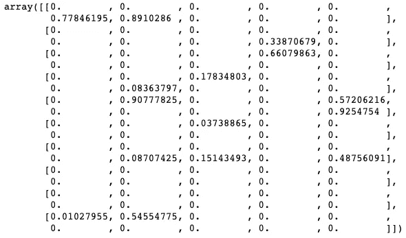
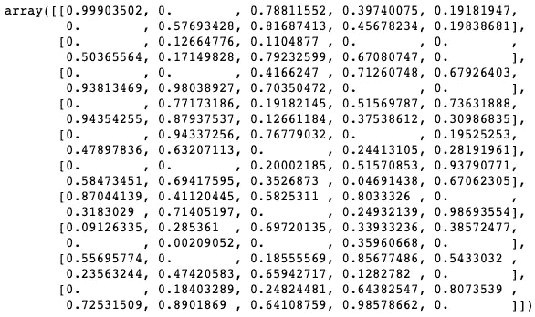
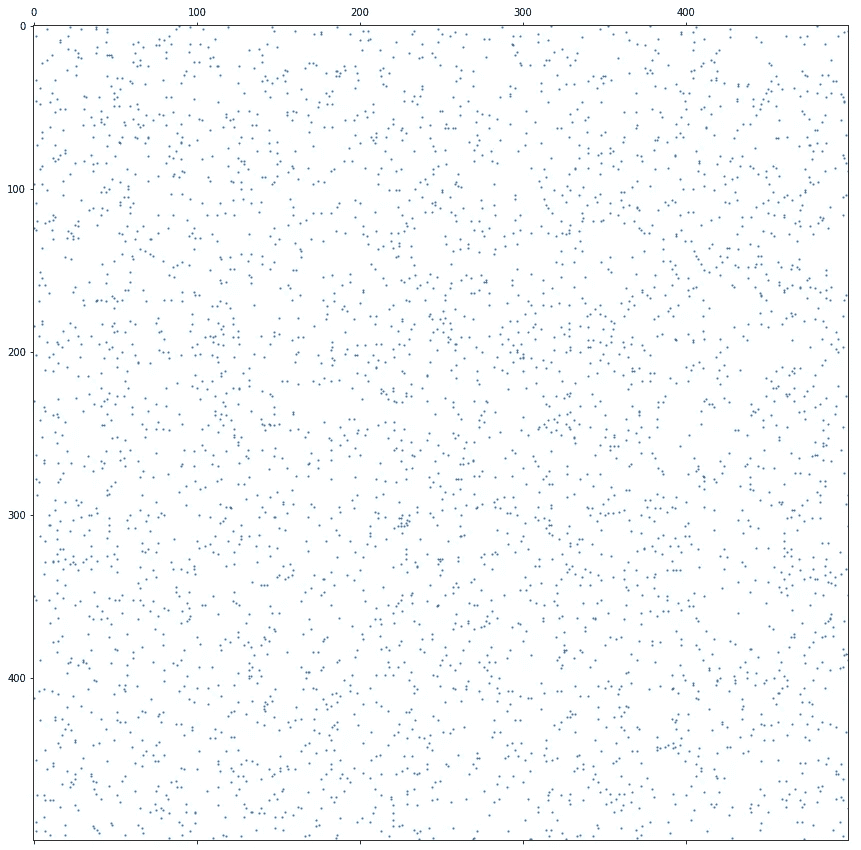
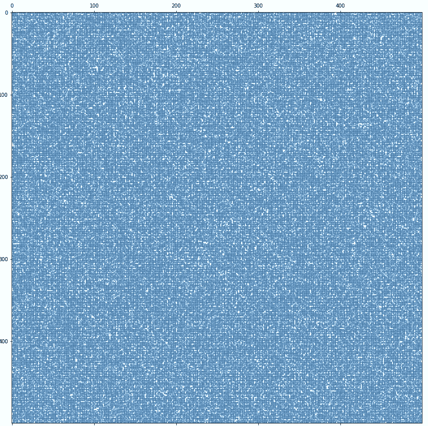

# 可视化稀疏矩阵

> 原文：<https://towardsdatascience.com/visualizing-a-sparse-matrix-1c4c807ea6c9?source=collection_archive---------35----------------------->

## 怎么知道自己有没有稀疏矩阵？想象一下！


亨利&公司在 [Unsplash](https://unsplash.com?utm_source=medium&utm_medium=referral) 上拍摄的照片

机器学习的许多领域通常使用稀疏矩阵。如果你曾经使用 One-Hot-Encoding、CountVectorizing 或 TfidVectorizing 对 NLP 字典进行过矢量化处理，你应该知道我指的是什么。

简而言之，稀疏矩阵包含许多零，而密集矩阵则不包含。

```
import scipy.sparse as sparse
import matplotlib.pyplot as plt*%matplotlib inline*# adjust the density parameter
sparse = sparse.random(10,10, density=0.015)
sparse.toarray()
```



稀少的



稠密的

```
plt.figure(figsize=(15, 15))
plt.spy(sparse, markersize=1)
```



稀少的



稠密的

我目前正在使用一个超过 15，000 个单词的 NLP 字典，我一直想看看这样大小的稀疏矩阵会是什么样子。尽情享受吧！