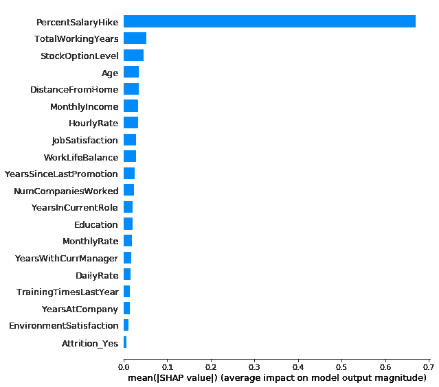
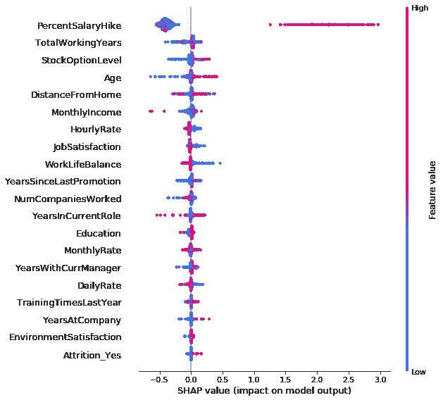
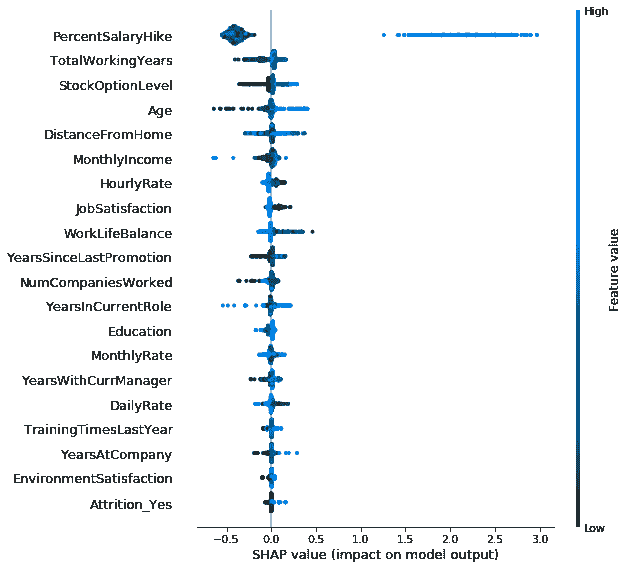
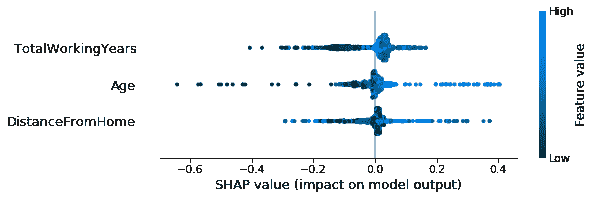

# 可视化人工智能

> 原文：<https://towardsdatascience.com/visualizing-ai-86247fa2a182?source=collection_archive---------31----------------------->

## 解构和优化 SHAP 的概要情节(2/2)


既然你已经理解了 SHAP 概要图的各个组成部分是如何一起工作的( [part 1](https://medium.com/@waion/visualizing-ai-8fad4ea70b87) )，我将提供一个使用它来解释黑盒机器学习模型的例子。此外，我将讨论示例中可视化的一些问题，然后提供一些改进的想法。这些文章的目标是帮助读者解释可视化，优化它，并对结果有更深的理解。

# 示例:了解工作绩效的影响

这个例子的代码可以在 GitHub 的[这里](https://github.com/taspett/SHAP-Summary-Plot-Article)找到。

## 数据:人力资源数据集

我使用的数据是 IBM 的人力资源数据，可以在 [Kaggle](https://www.kaggle.com/pavansubhasht/ibm-hr-analytics-attrition-dataset) 获得。这些数据的最初目的是为了了解人员流失，但在这里我用它来了解工作场所的绩效评定。


IBM HR 数据集的一个片段

为了减少必要的数据准备量，我通过减少特征的数量来简化数据。此外，对数据的检查表明，绩效评级被限制在 3 或 4(满分为 1-4)。因此，为了使用数据来说明回归数据的汇总图的功能，我通过应用一组转换将评级重新调整为 0-9 之间的实数(参见 [GitHub](https://github.com/taspett/SHAP-Summary-Plot-Article) 上的数据文件)。

在下面对结果的讨论中，我将分析这些假定虚构的数据，并假设数据和最终模型背后可能的故事。

## 汇总图

在这个练习中，我使用了 scikit-learn 中的随机森林算法，并使用了 SHAP 树解释器进行解释。

```
model = RandomForestRegressor(max_depth=4, random_state=1,               n_estimators=10)model.fit(X_train, y_train)shap_values = shap.TreeExplainer(model).shap_values(X_train)
```

下图显示了在我们的示例中使用 SHAP 的过程。


下面的条形图显示了要素名称及其对应的平均 SHAP 值。



这种类型的条形图是特征属性算法结果的典型表示。在这里，它根据平均 SHAP 值按重要性降序列出了这些特征。

如上所示，具有最高平均 SHAP 值的要素是“PercentSalaryHike”。这个值是如此的重要，以至于很难说出其他顶尖影响者的相对差异。事实上，“PercentSalaryHike”占主导地位，这表明数据或我们对数据的解释可能有问题。

让我们进一步调查。摘要图如下所示:



上面的汇总图显示，“PercentSalaryHike”的高值(红点)与正 SHAP 值相关，而“PercentSalaryHike”的低值(蓝点)通常与负 SHAP 值相关。


由于原始数据没有指定相对于绩效评定的加薪时间，因此对结果有两种解释:

1.  绩效评分高是因为之前的薪资评估导致薪资大幅提升。
2.  高工资是高绩效评定的结果。换句话说，员工因为出色的工作表现而获得丰厚的加薪。

在我看来，合乎逻辑的解释可能是#2。也就是说，员工因为表现良好而获得高百分比的加薪。当然，这是我的猜测，但它很好地提醒了我们，XAI 工具总体上反映了底层机器学习算法的本质。具体来说，它们在相关性领域中运行，并且它们的结果在[因果方向](https://www.forbes.com/sites/kalevleetaru/2019/01/15/a-reminder-that-machine-learning-is-about-correlations-not-causation/#6c8bc3226161)方面是模糊的。因此，结果并没有告诉我们“PercentSalaryHike”是好的工作表现的原因，它只是告诉我们它是高度相关的。在这种情况下，比模型中的其他特征更明显。

在前五个特征中，“年龄”似乎也遵循一种模式，即高值与高 SHAP 值相关联，低值与低 SHAP 值相关联。这种模式似乎也适用于摘要图中的“StockOptionLevel ”,尽管对比度较小。

其余要素的 SHAP 值似乎聚集在零附近，但由于绘图中需要缩放，因此很难看到细节。也就是说，为了容纳来自第一特征的大值，必须压缩可视化。

# 优化 SHAP 汇总图

显然，尽管汇总图本身是有用的，但有许多问题妨碍我们更容易地理解结果。在这一节中，我将讨论其中一些问题，并提出在 SHAP 解决这些问题的建议。

## 改善对比度和颜色选择

首先也是最重要的是使用红色来表示高价值。红色是一种非常情绪化的颜色。它通常被用作危险的警告，在西方文化中通常有负面的含义。红色的使用和关闭本身并不是问题。然而，在我们的例子中，这是特别成问题的，因为我们处理的是金钱价值、经验和年龄，而高价值可能不是一件坏事。在这种情况下理解一个情节尤其困难，因为颜色和特征值之间的相互作用会产生[认知干扰](https://en.wikipedia.org/wiki/Stroop_effect)。

第二个问题是，由于[对颜色不敏感](https://accessibility.psu.edu/accommodations/audience/colorblindness/)，从蓝色到红色的过渡可能会对一些用户造成差异问题。特别是，蓝色和紫色的使用要避免相互重叠。

摘要图设计者犯的错误类似于那些使用“彩虹色”方案进行数据可视化的错误(例如在“热图”中)。也就是说，彩虹色调色板看起来很吸引人，但在感知和语义上[有问题](https://ieeexplore.ieee.org/document/736450)。

已经有[讨论](https://github.com/slundberg/shap/issues/62)关于为“点”类型提供定制调色板(主要作为处理业务需求的一种方式),但是到目前为止它仍然是即将到来的。为了解决所讨论的问题，我调整了源代码并删除了红色的使用。我也选择了单一的颜色，但改变了亮度，使其更容易看到色差。

新的汇总图如下所示:



我认为由此产生的图更容易一眼解析，因为有更少的颜色需要破译。此外，切换到更亮的蓝色作为高数字的指示，使更高的值更加突出。但是，对于习惯于将蓝色视为低数字的用户来说，这可能是一个问题。如果是这种情况，我会推荐翻转两端颜色。

## 减少特征的数量

遵循一个众所周知的[设计策略](https://sites.google.com/site/tufteondesign/examples)，我剔除了一些没用的信息。由于要素的大多数值彼此非常接近，并且大多数 SHAP 值都接近于零，因此我们有必要通过设置 max_display 参数来关注顶部的要素集:

```
shap.summary_plot(shap_values, X_train, max_display=5)
```


## 移除不明确的特征

如上所述，不清楚“PercentSalaryHike”是绩效评级的事前衡量还是事后衡量。如果员工因良好的绩效评级而获得加薪，那么这就不那么令人感兴趣了，因为我们感兴趣的是有助于良好绩效的因素。虽然观察以前的加薪是否对绩效评级有任何影响也很有趣，但鉴于不清楚加薪的时间，谨慎的做法是完全消除这种影响。

上面关于“PercentSalaryHike”模糊性的评论也可以应用于与货币值相关联的其他特征。对于前 5 名，这包括“StockOptionLevel”。在我们的分析中，我们可以假设其他因素(如工作距离、年龄)保持相对相似，无论它们是工作绩效评定的后评估还是前评估。

## 更好的缩放

由于“PercentSalaryHike”占主导地位，x 轴的刻度必须扩展以适应值的大小。因此，很难看出 SHAP 值是如何分布的。

幸运的是，从前五个特性中删除“PercentSalaryHike”和“StockOptionLevel”可以自动解决这个问题。我们模型的新汇总图如下所示，放大倍数更合适。



由此产生的情节更简单，更容易理解。该图显示，较高的总工作年限和年龄值与较高的 SHAP 值相关(这反过来意味着较高的绩效评级)。此外，低值也与低 SHAP 值相关。这支持了成熟度和工作经验有助于良好工作表现的想法。

第三个特征更难解释。较高的“离家距离”(即住得离工作地点较远)似乎与较高的 SHAP 值相关。如果不了解在家工作的政策以及员工对在家工作的感受，就很难解释这个结果。此外，色标之间的对比度不是特别明显，因为该图显示一些高值也会对性能评级产生负面影响(左侧的浅蓝色点)。这一结果表明，这是一个值得研究的领域，并建议人力资源部门在通勤领域以及在家工作政策的总体影响方面开展进一步的研究。

当然，这是虚构的数据，因此这里的任何解释都纯粹是为了演示可以完成的潜在分析。除了 SHAP 值的大小和它们之间的微小差异之外，摘要图显示大多数值倾向于聚集在零附近的事实也提醒我们，最好谨慎地解释结果，并且需要收集额外的确证证据。

# 关于 XAI 改进的一些设想


亚当·诺瓦克斯基在 [Unsplash](https://unsplash.com/) 上的照片

虽然设计更好的 XAI 系统，一般来说，超出了本文的范围，但我想简要地讨论一些当前工具可以立即做出的改进的设想；尤其是在用户体验和数据可视化设计领域。

*   提供更好的对比度和颜色选择。不仅要避免可能引起混淆的颜色(例如，使用红色来表示好的结果)，还要在调色板中提供易于识别的选择，并且对所有用户都是通用的。
*   能够交互式地从可视化中移除特定特征。[来自社会科学的研究](https://arxiv.org/abs/1706.07269)表明“解释是被选择的”,从这个意义上说，我们从一组可能的原因中挑选一两个原因作为解释。对于最终用户使用的 XAI 工具，可视化需要变得更具交互性。它们需要允许用户轻松地选择一组特性并关注它们，而不需要以编程方式明确地这样做。
*   支持迭代探索。最近的一项研究表明，寻找解释的过程是反复的。事实上，上述定位少数有影响特征的过程遵循了寻找解释的迭代分析模式。能够看到结果，探索不同的可能性，对比不同的特征，检查它们的相互作用，等等。反复地做这件事对于接受解释的用户来说是非常有价值的。
*   支持从高级视图到功能级别的单个视图的转换。在前面的基础上，放大/缩小、从聚焦一个功能或对比一组功能的能力将允许用户跟踪他们的调查以及处理我们在示例中遇到的缩放问题。

无需等待 XAI 的重大研究突破，我认为可以立即做出一些具体的改进，以便它们可以用来更好地解释机器学习模型的结果。希望以后能多写点这个话题。

# 总结和结论

在本文中，我使用了 SHAP 摘要图来解释黑盒模型输出背后的影响。利用可视化，我假设了数据和最终模型背后的一个可能的故事。在讲述一个假设故事的过程中，我发现了一些数据中的模糊之处，以及 SHAP 概要情节设计中的问题。然后，我提出了一些改进可视化的想法，并确定了澄清数据所需的进一步工作。最后，我为 XAI 系统提供了一些尝试性的想法，这样它们就可以适应用户寻求解释时的行为方式。

SHAP 带来了许多丰富的可视化效果，值得比现在更多的关注。如果您是负责向最终用户交付系统或报告的数据科学家，那么希望本文能够帮助您做出必要的调整，以便更有效地使用可视化。如果您是最终用户决策者或最终用户消费者，您现在应该对 SHAP 汇总图有了更好的理解。反过来，这将有望使你能够要求以一种更容易理解的方式呈现结果。