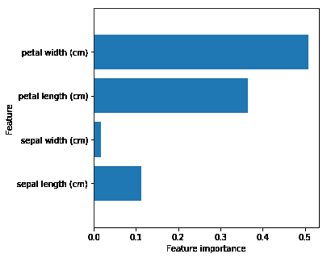
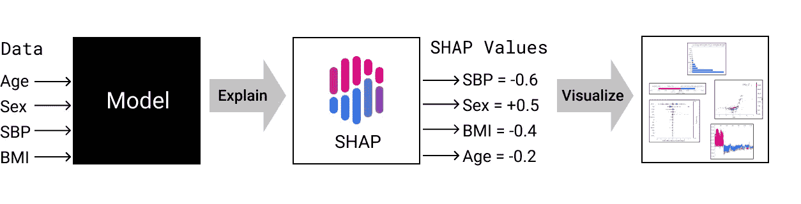
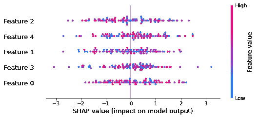
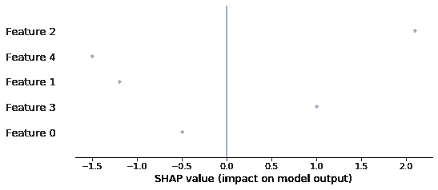
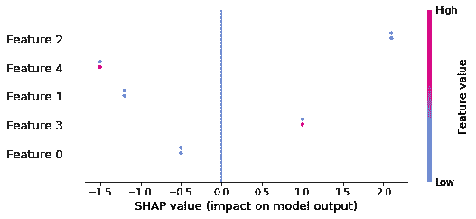
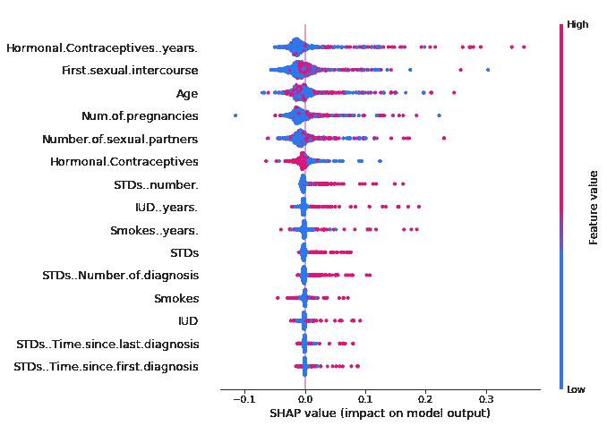

# 可视化人工智能

> 原文：<https://towardsdatascience.com/visualizing-ai-8fad4ea70b87?source=collection_archive---------24----------------------->

## 解构和优化 SHAP 的概要情节(1/2)


[照片](https://stocksnap.io/photo/MVXFOGU8DF)由[负空格](https://stocksnap.io/author/4440) / [CC 由 2.0](https://creativecommons.org/licenses/by/2.0/)

人工智能中的可解释性目前是一个热门话题。随着人工智能系统在决策中发挥越来越大的作用，人们普遍认为这些系统需要提供支持其决策或建议的信息。

现在有一个新兴的行业和大量的研究兴趣来提供可解释的人工智能(XAI)工具和服务，旨在帮助人工智能系统向用户解释他们的决策和行动。与此同时，政府开始要求向可能受到自动决策影响的个人提供解释。事实上，欧洲的[通用数据保护条例](https://gdpr-info.eu/art-22-gdpr/)规定，当个人受制于“完全基于自动处理的决定”并产生“法律效力”或类似意义的结果时，个人有权获得“有关所涉逻辑的有意义的信息”。

值得注意的是，最后一句话提出了一个想法，不仅这些系统需要提供解释，而且个人应该能够清楚地理解所提供的信息。毫无疑问，监管的这一部分将在未来引起激烈的争论。然而，从眼前的实际角度来看，这(以及其他正在制定的立法)应被视为一种呼吁，不仅呼吁这些系统提供关于结果如何得出的信息，而且呼吁我们密切关注它们是如何呈现的，以便受影响的个人能够有效地理解它们。

# 理解可视化



过去，XAI 工具的结果通常以初级形式呈现。例如，用数字表和/或某种条形图。

这些结果很容易解释，但它们的解释力有限。这部分解释了为什么这些工具经常被归类为“可解释的”人工智能，而不是“可解释的”人工智能，因为它们揭示了底层算法正在做什么，但没有以一种全面的方式传达正在发生的事情，以便用户可以带着对解释的“有意义的”理解离开。

最近，一些 XAI 工具已经开始解决这个问题。例如，通过提供丰富的可视化作为对结果的更全面解释的一部分。这些可视化功能非常强大，因为它们超越了传统的基本图形类型的汇总统计。然而，对于门外汉来说，他们更难解释和理解。

在本文的第 1 部分，我将描述 SHAP，一个流行的 XAI 工具，如何展示它的结果。具体来说，我将重点描述它附带的丰富的可视化之一:摘要情节。在[第 2 部分](https://medium.com/@waion/visualizing-ai-86247fa2a182)中，在提供一些改进可视化的想法之前，我将给出一个使用它来解释黑盒机器学习模型的例子。目标是帮助读者解释可视化，优化它，并对结果有更深的理解。

本文面向对机器学习概念有基本了解，并且有兴趣更彻底地了解 XAI 工具的结果的任何人。就用户类型而言，这篇文章对于负责向最终用户提供报告的数据科学家，或者将要接收 XAI 工具结果的最终用户决策者或最终用户消费者最有用。

# SHAP

SHAP 主张沙普利附加解释。它属于一类被称为特征属性或特征重要性的 XAI 工具。这些工具通过揭示不同的输入特征对输出的强烈影响来展示机器学习模型的工作方式。SHAP 使用的方法是合作博弈理论中的一个解决方案，称为沙普利值(以提出这一想法的美国数学家和诺贝尔奖获得者劳埃德·沙普利的名字命名)。

关于 SHAP 是什么，它做什么，如何使用它，以及 Shapley 值背后的数学基础，有很多很好的文章，所以我不会在这里试图详细重复它们。

SHAP 已经在许多平台上实现，但是使用 SHAP 的一般过程如下:



1.  使用机器学习模型(例如随机森林、神经网络)对数据建模。
2.  将生成的模型和你的数据输入 SHAP。
3.  SHAP 计算模型的影响(使用沙普利值)并输出一组 SHAP 值。
4.  然后，您可以使用 SHAP 提供的可视化工具显示输出。

SHAP 并不是唯一实现沙普利价值观的工具集(例如 [IML](https://github.com/christophM/iml) )。然而，在我看来，它与众不同的一点是它提供了一系列有趣的可视化效果。不幸的是，目前大多数谈论 SHAP 的文章对它们以及它们如何帮助用户理解结果说得很少。

# 汇总图

我不会详尽地浏览每一个 SHAP 的可视化，我会把重点放在一个叫做概要图。选择这个的原因是因为我觉得这是最有趣的可视化之一，也因为它因为难以理解而受到了一些批评。我将首先一步一步地彻底描述 SHAP 摘要情节，然后在一个例子中使用它来解释[第二部分](https://medium.com/@waion/visualizing-ai-86247fa2a182)中的黑盒机器学习模型。

## 什么是 SHAP 摘要情节？

目前有四种类型的摘要图:点、条、小提琴和紧凑点。在本文中，我将关注“点”类型，这是单个输出模型的默认汇总图。

SHAP 汇总图提供了一个高层次的复合视图，显示了要素的重要性及其 SHAP 值在数据中的分布情况。汇总图是[沼泽图](https://seaborn.pydata.org/generated/seaborn.swarmplot.html)和[小提琴图](https://mode.com/blog/violin-plot-examples)的结合，显示了所有实例，结果图形显示了数据的频率和分布。



要显示汇总图，只需使用要解释的数据及其相应的 SHAP 值调用汇总图函数:

```
shap.summary_plot(shap_values, X)
```

在这里，我使用的是 Python 版本的 [SHAP 包](https://github.com/slundberg/shap)。上面的图是使用一个 100 乘 5 的随机数矩阵生成的:

```
shap.summary_plot(np.random.randn(100, 5), np.random.randn(100, 5))
```

所以你看到的是一个有 100 个实例的模型，每个实例有 5 个特征。该模型有一个实数输出，正如您对回归模型的期望。

## 解构概要情节

我们如何开始理解这种视觉化？这个模型告诉了我们什么？让我们从斧头开始。在 y 轴上，功能按重要性降序排列。换句话说，影响最大的特性列在顶部，影响最小的列在底部。

在 x 轴上，有一个 SHAP 值的刻度，垂直线为零。正值在线的右边，负值在线的左边。点在图中的位置表示实例的特定特征的 SHAP 值。将模型预测值拉低的值在左边，将预测值拉高的值在右边。



上面的图显示了一个具有 5 个特性的数据实例。这表明特征 2 是最有影响力的特征。下一个最有影响力的是特性 4，以此类推。特征 2 的 SHAP 值为正值，约为 2.1。特征 4，尽管它是第二大影响力，却是一个负数，大约为-1.5。这是因为特征重要性是关于特征的绝对影响，而不是它们是否以某种方式影响模型的输出。所以在这个例子中，这两个特征将模型的输出拉向相反的方向。

如果另一个实例具有相同的 SHAP 值，那么它将垂直堆叠。然而，垂直堆叠仅在行的边界内进行一定的距离。之后，它开始重叠。通过这种方式，汇总图可以在一个小空间内有效地缩放到数十万个数据点。



现在让我们来看看颜色和它们的含义。颜色区分实例之间特征值的相对大小。高值(相对于其他实例)显示为红色；低值显示为蓝色；根据图右侧的颜色图，中间值为紫色阴影。

随着更多数据点的添加，它们的位置显示了每个要素的 SHAP 值的范围和分布。例如，它是像正常曲线一样聚集在中间(但也是镜像的)，还是向一端倾斜？

具有相似值的要素的聚类在图中创建了“颜色斑块”。面片的位置让用户了解值的大小如何影响模型的输出。例如，如果红色斑块(高值)位于零的左侧，则意味着高特征值共同将模型的输出拉向一个较低的数值。如果他们在右边，那就意味着他们正在把模型的输出推向一个更高的数字。类似地，根据其位置，蓝色补丁(低值)可能会影响模型的输出变低或变高。

这里有一个[例子](https://christophm.github.io/interpretable-ml-book/)来说明色标。



如果我们看第一个特征，该图显示激素避孕药年数的低值(蓝色斑块)与较低的预测癌症风险相关，高值(红色点)与较高的风险相关。

就像 Seaborn Swarm 情节和 Violin 情节一样，SHAP 摘要情节可以被认为是情节中的情节。我们可以将数据作为一个整体进行检查，也可以查看每个类别(在本例中是要素)并检查其中的细节。例如，我们可以在上面的图中看到，第一个要素(激素避孕药年数)的值的分布向左倾斜，这表明总体而言，该要素正在影响模型的输出，使其数值变小。

SHAP 值聚集在零附近的要素通常意味着大多数值对模型的输出没有太大影响(此时忽略要素之间的交互)。上图中的下半部分特征就是这样，这也是为什么它们没有上半部分特征那么有影响力的原因。

# 摘要

总而言之，摘要图回答了以下问题:

*   哪些特性对模型的输出影响最大？

特性在图的左侧按重要性降序排列。

*   某个特性会影响输出值的大小吗？

如果点的聚类位于零线的右侧，则该特征会影响模型的输出，使其成为更大的数字。如果点簇位于左侧，则该特征会影响模型的输出，使其成为一个较小的数字。

*   这些影响有多强？

点的聚类越靠右，对输出的影响就越大。点簇越靠左，对输出的影响就越大，输出的数值就越小。

*   SHAP 值的分布是什么？

点的形状表示每个要素的 SHAP 值的分布。也就是说，这些值是服从正态分布、偏态分布还是分散分布。

*   特征值的相对大小如何影响模型？

蓝色色标(小特征值)或红色色标(大特征值)的位置显示了特征值的不同大小，以及它们是否影响模型的输出为较高的数值或较低的数值。

摘要图是在紧凑的空间内快速回答这些问题的有效可视化工具。

# 结论

我希望这篇文章对组成 SHAP 概要情节的各种组件以及它们如何协同工作提供了有益的讨论。因此，您能够通过这种可视化快速理解机器学习模型输出背后的影响。

当理解不同的输入特征如何影响模型的输出时，我发现摘要图是对其他可视化的非常有用的补充。然而，概要情节的设计并非没有挑战。在本文的第 2 部分中，我将通过一个例子来解释黑盒机器学习模型，然后提供一些解决一些挑战的想法。

[1] S.M. Lundberg，G. G. Erion 和 S. Lee，(2019)，华盛顿大学。

[2] H. Michael，[解释可解释的 AI](https://xrds.acm.org/article.cfm?aid=3313096) (2019)，XRDS: Crossroads，2019 年 4 月。

[3] S.M. Lundberg，S. Lee，[解释模型预测的统一方法](https://arxiv.org/abs/1705.07874) (2017)。