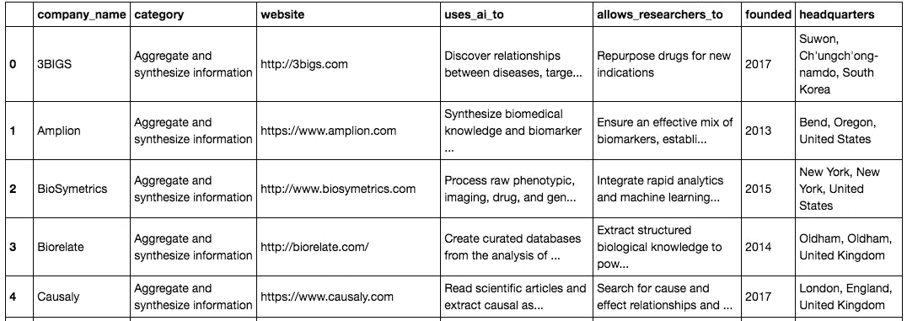
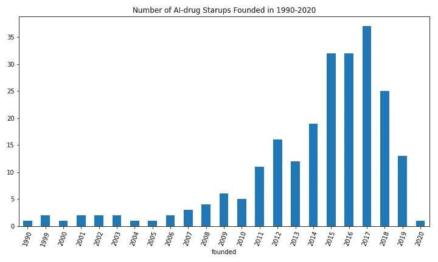
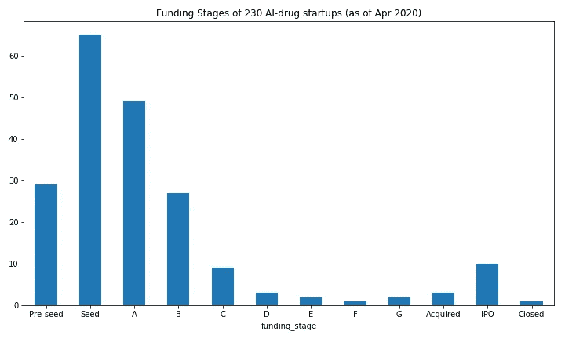
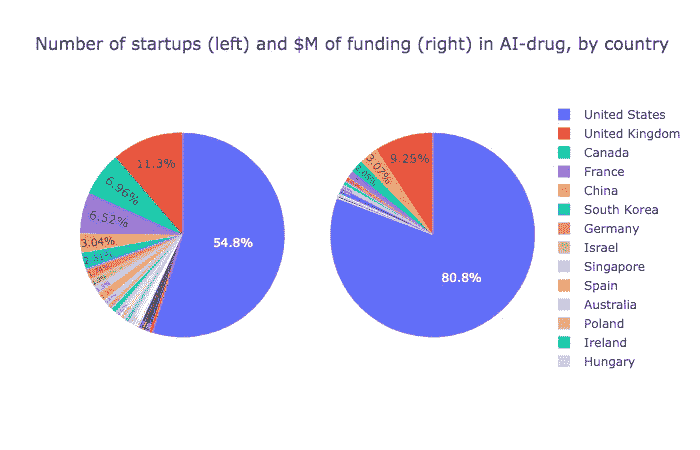
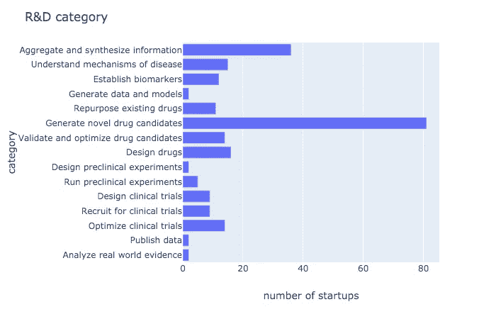
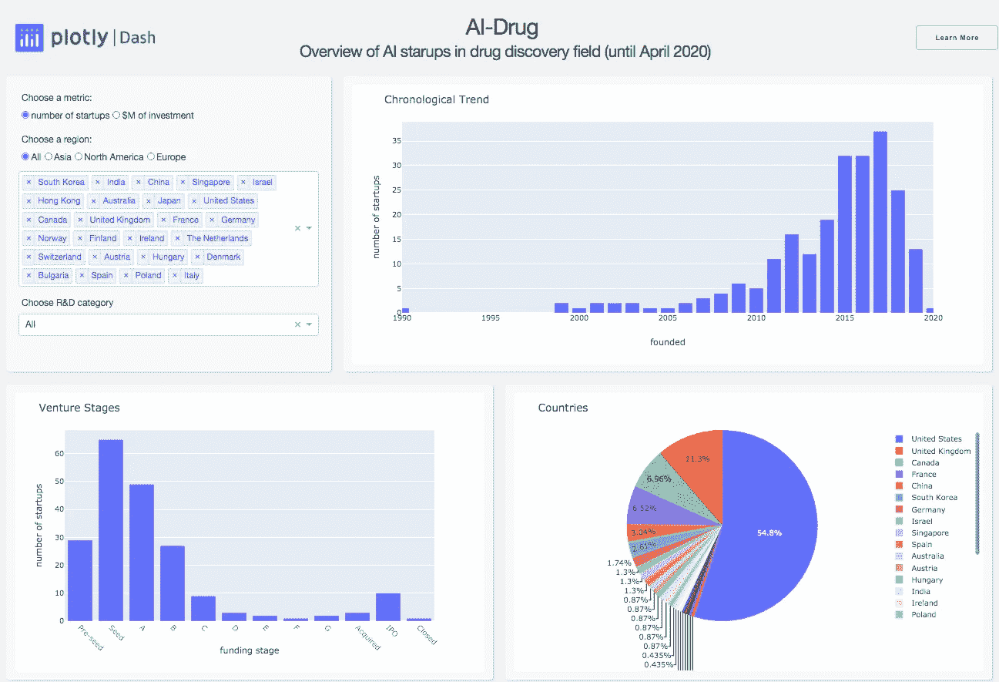

# 在药物发现中可视化人工智能初创公司

> 原文：<https://towardsdatascience.com/visualizing-ai-startups-in-drug-discovery-cb274eea2792?source=collection_archive---------52----------------------->

## 药物发现中人工智能初创公司的数据分析和交互式仪表板


克里斯汀·三都在 [Unsplash](https://unsplash.com?utm_source=medium&utm_medium=referral) 上的照片

作为一名生物学领域的机器学习研究人员，我一直在关注最近新兴的人工智能药物发现领域。我本人住在多伦多，这个领域的许多“明星”公司都是在那里成立的(Atomwise、BenchSci、Cyclica、Deep Genomics、protein qure……仅举几例！)，我和这个领域的很多人聊过，也参加过一些关于这个话题的 meetup 活动。据我所知，这一领域正以如此快的速度发展，要跟踪这一领域的所有公司并对它们有一个全面的了解变得越来越困难。因此，我决定利用我的数据科学技能来跟踪和分析这个领域的公司，并建立一个交互式仪表板(【https://ai-drug-dash.herokuapp.com】)来可视化我的分析中的一些关键见解。

# 资料组

BenchSci(多伦多“明星”人工智能药物初创公司之一)的首席战略官西蒙·史密斯(Simon Smith)是人工智能药物发现领域的优秀观察者和沟通者。我一直在关注他关于行业趋势和新公司的播客和博客。他在 2017 年写了一篇[博客](https://blog.benchsci.com/startups-using-artificial-intelligence-in-drug-discovery#understand_mechanisms_of_disease)，列出了人工智能药物发现领域的所有初创公司，并从那时起一直在更新这份名单。这个博客是我发现的该领域最全面的公司列表(截至 2020 年 4 月共有 230 家初创公司)，因此我决定使用他的[博客](https://blog.benchsci.com/startups-using-artificial-intelligence-in-drug-discovery#understand_mechanisms_of_disease)作为我的主要数据来源。

# 数据预处理

由于博客只是简单地将公司列为不同的段落，所以我首先使用[美汤](https://www.crummy.com/software/BeautifulSoup/bs4/doc/)从博客中刮出公司信息。然后，我使用 Pandas 将收集到的数据转换成 DataFrame 格式。数据帧看起来像这样:



为了在地图上显示这些公司的位置，我使用 [Geopy](https://geopy.readthedocs.io/en/stable/) 将该表中的地址信息转换为纬度和经度:

```
# match address to latitude and longitude.
from geopy.geocoders import Nominatim
locator = Nominatim(user_agent="ai_drug")
lat, lng = [], []

for i, row in df.iterrows():
    location = locator.geocode(row.headquarters) or locator.geocode(row.city+','+row.country)
    lat.append(location.latitude)
    lng.append(location.longitude)

df['latitude'] = lat
df['longitude'] = lng
```

博客中没有这些初创公司的融资信息，因此我在 [crunchbase](https://www.crunchbase.com/) 和 [pitchbook](https://pitchbook.com/) 上搜索了所有 230 家公司，并将这些信息添加到我的数据集中。

# 探索性数据分析

我对清理后的数据集做了一些探索性的数据分析，并注意到一些有趣的事情。

# 1.自 2010 年以来，创业公司激增

我们可以看到这个地区直到 1999 年才真正开始存在。开发化学模拟软件的薛定谔公司成立于 1990 年，并在这里上市，但我不确定他们的药物发现平台是否已经在 1990 年开始使用人工智能……创业公司的爆炸开始于后 2010 年时代，大约与“人工智能炒作”开始的时间相同，并在 2017 年达到顶峰。



# 2.大多数风险投资都处于早期阶段

我们可以看到大多数获得资金的公司仍处于风险投资的早期阶段(A 轮前种子)，这可能是因为大多数人工智能药物初创公司仍处于探索商业模式和开发技术和产品的阶段，而不是扩大公司规模。



# 3.美国正在统治世界其他地区

这可能并不令人惊讶，但美国在这一领域统治着世界。超过一半的公司总部设在美国；超过 80%的风投资金流向了美国初创公司！英国在公司数量和资金方面排名第二。加拿大在公司数量上排名第三，但不是在资金上——中国才是。在这个领域有不少有前途的中国创业公司。例如，苏州的抗体发现和开发公司 Adagene 刚刚在 2020 年 1 月筹集了 69，000，000 美元的 D 系列资金。



# 4.新型候选药物的产生是人工智能应用的焦点领域

我们可以看到，吸引最多注意力和资金的 R&D 类别是产生新的候选药物。就我个人而言，我也认为这是人工智能可以发挥其最大威力的地方，即通过利用大量现有的测试数据，利用机器学习来预测目标药物的相互作用。



# 交互式仪表板

我使用 Plotly Dash 构建了一个交互式仪表板，以可视化我的数据集并提供分析见解。Dash 是基于 Python 的框架，用于构建分析型 web 应用程序，而且是免费的！完成的仪表板可以在 https://ai-drug-dash.herokuapp.com/的[查看，你也可以在我的](https://ai-drug-dash.herokuapp.com/) [GitHub repo](https://github.com/haocai1992/AI-drug) 中查看代码。

如何使用这个仪表板？

首先，从左上方的控制面板中选择一个可视化指标。您可以在所有可视化绘图中使用公司数量或投资金额。

接下来，选择一个地区或国家。这可以通过从控制面板中选择，或通过在地图绘图中单击/框选择来完成(要重置您的选择，请单击地图中的空白点)。

最后，选择一个 R&D 类别。这可以通过从控制面板中选择，或者通过单击左下方类别图中的一个栏来完成，这也将更新该类别的关键字图。中间的公司信息表也将根据这些选择进行更新，以便您可以缩小公司列表的范围进行研究。

玩得开心！



***参考文献*** :

[1] Simon Smith，230 家在药物发现中使用人工智能的创业公司。【https://blog . bench sci . com/startups-using-artificial-intelligence-in-drug-discovery # understand _ mechanisms _ of _ disease
【2】[https://www.crunchbase.com/](https://www.crunchbase.com/)
【3】[https://pitchbook.com/](https://pitchbook.com/)
【4】大卫·康弗，如何使用 Dash 和 Plotly 构建报告仪表盘。[https://towards data science . com/how-to-build-a-complex-reporting-dashboard-using-dash-and-plotl-4f 4257 c 18 a 7 f](/how-to-build-a-complex-reporting-dashboard-using-dash-and-plotl-4f4257c18a7f)