# 可视化贝叶斯先验

> 原文：<https://towardsdatascience.com/visualizing-bayesian-priors-cec2fea3e386?source=collection_archive---------34----------------------->

## 想过先验如何影响你的贝叶斯模型吗？弄清楚！

我一直在玩参数估计和贝叶斯统计，并认为我应该做一个快速的小可视化先验信念如何影响我们的后验分布。在本教程中，我们将思考硬币是否公平。当我们获得更多的数据并尊重我们先前的信念时，我们将想象我们对硬币公平性的估计是如何变化的。我们开始吧！

# 问题

你在维加斯看着人们对掷硬币的结果打赌。如果是正面，你赢得双倍赌注，如果是反面，赌场拿走你的钱。这听起来很划算，所以你马上就怀疑了。赌场不想给你好价钱。所以你决定计算你看到每个结果的次数，并确定硬币的价值。设 ***H*** 为使用赌场硬币获得正面的概率，设 ***D*** 为我们投掷的数据集。让我们假设我们看到了 100 次投掷硬币，在这 100 次投掷中，有 40 次是正面。硬币的重量是多少？自然你会说 ***H*** = 40/100 = .4 但是你是怎么得到那个数的呢？我们来走一遍推导！

# 最大似然估计

我们正在估计一次掷硬币，这意味着我们的数据将采用两个值中的一个，概率为 ***p*** 和 1 - ***p*** 。因此，我们将假设我们的数据是由伯努利分布生成的，或者换句话说，在给定特定正面概率的情况下，数据的可能性为:

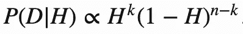

现在我们想弄清楚什么值的 ***H*** 最大化这个似然函数。因为自然对数不会影响我们的最大值，所以我们可以求解对数的最大值。相信我，这会让数学变得简单。

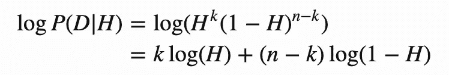

现在回到你的微积分 I 课，求导并设为 0，以识别临界点。

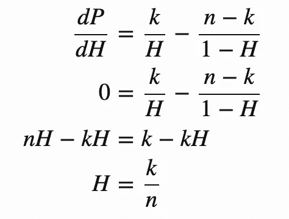

硬币的最大似然估计

看来我们的直觉是正确的，对正面概率的最佳估计是投掷总数中投掷的正面数。

# 传道者

等等，我们不是在拉斯维加斯赌博吗？我们知道这些赌场是见不得人的。我们需要将这些信息整合到我们的模型中。在我们的模型中，我们假设参数可以以相等的概率取 0 到 1 之间的任何值。这种关于我们的参数取值的假设被称为先验，对于这种分析，我们假设一个统一的先验。

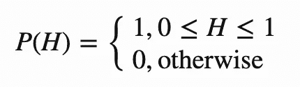

我们不知道这有多公平

这个特别的先验说我们完全没有关于正面概率应该是什么样子的信息。如果我们对我们的参数一无所知，这是一个很好的假设，但在普通硬币的情况下，这可能是一个糟糕的假设，因为我们知道普通街道硬币非常接近公平。使用 Baye 规则将先验与似然相结合以生成后验分布。

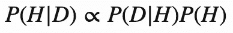

当样本量很小时，这些先验对我们的模型有重要的影响，当样本变大时，它们的影响会减弱。让我们看看这种效果在几个不同的先验中的作用。

我们已经知道了均匀先验下的后验概率是什么样的，但是如果我们假设赌场遵守规则并且使用普通的街道硬币呢？那么我们可以假设一个均值为 0.5 的高斯先验和一个小的标准差。那么我们的后验分布就是:

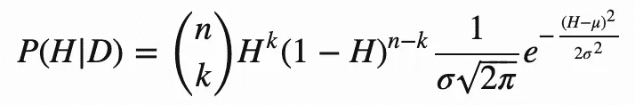

公平街硬币的高斯先验

对于这个实现，我选择了 0.5 的平均值，因为公平硬币应该接近偶数，标准偏差为 0.05，这样如果硬币碰巧不公平，它将位于 0.4 和 0.6 之间。

让我们来看看另一个可能的先验，我们认为硬币极有可能是极端偏向的。在这种情况下，我们可以使用贝塔分布，这将使我们的后验概率:

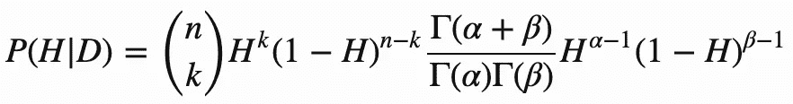

对于一个硬币，我们怀疑有这样或那样的偏见。

α=0.1 和β=0.1 时，该函数的 pdf 为:

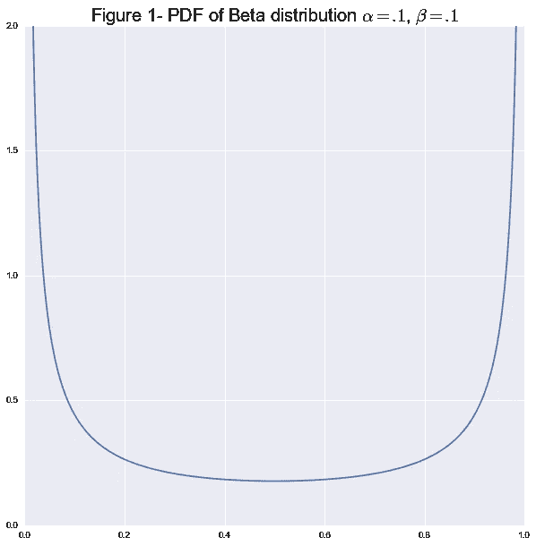

α=0.1 和β=0.1 时的β分布

注意大部分概率是如何集中在极端情况下的。这与硬币很可能全是正面或全是反面的观点相吻合。你也可以看到这个分布没有太大的偏差，事实上方差在 0.2 左右。远高于高斯分布的 0.05 或均匀分布的 0.08。

我们可以使用以下函数在 python 中生成这些后验概率:

上述后验的实现。

现在让我们看看先验知识是如何直观地影响我们的参数估计的。在这个实验中，我们用 Python 创建了一个有偏向的硬币，正面的概率等于 0.3。这枚硬币明显偏向，通常会抛尾。然后，我们以 0 到 512 次翻转之间的间隔对硬币的翻转进行采样。这些翻转模拟了对我们一直在讨论的赌博游戏的观察。你可以把这些情节中的一个想象成在*翻转之后我们对硬币的公平性有多确定，以及我们之前的信念。*

*下面我用越来越多的证据(观察到更多的翻转)绘制了后验概率的演化图，让我们看一看，看看我们能学到什么。如果我们假设我们完全没有关于这枚硬币的信息，我们可以假设一个统一的先验。我们可以看到，我们对硬币重量的估计是一个没有翻转的均匀分布。这是有意义的，因为我们没有数据，只有我们对硬币的假设。大约四次翻转后，我们得到了一个看起来像高斯分布的东西，可能有点偏向 0.3，但很难分辨。在大约 64 次翻转后，我们非常确信硬币是有偏差的，在 128 次后，我们或多或少地收敛到硬币的真实偏差权重。*

*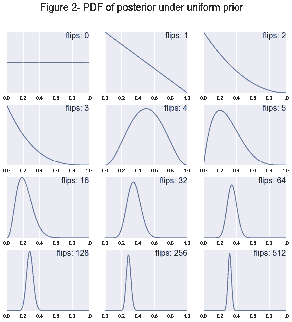*

*接下来，我们通过使用高斯分布来检验如果我们假设硬币是公平的会发生什么。在零翻转时，我们只有先前的信念。在最初的几次翻转中，这种分布几乎没有变化。这是因为我们的硬币是公平的假设是一个相当强的假设，因此需要大量的数据来影响这一信念。在大约 32-64 次翻转后，我们可以看到分布逐渐向真正的权重左移。但是直到 256-512 次翻转，我们才真正达到真正的重量。*

*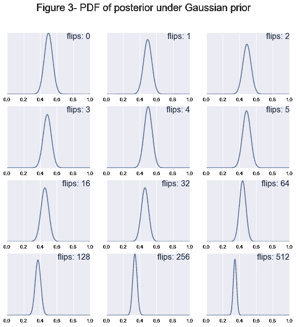*

*最后，我们通过使用 beta 先验来检验硬币是有偏差的，我们在一个肮脏的赌场。我们看到，这与均匀分布非常相似，但它更早地向左摆动。*

*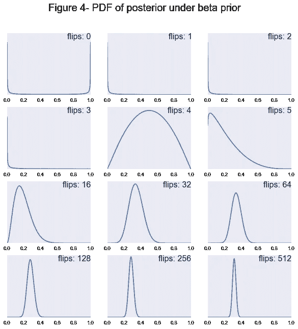*

*还有一些有趣的事情需要注意，随着样本量的增加，所有的后验概率都趋向于以 0.3 为中心的正态分布。你可以清楚地看到，当样本量很小时，先验有很大的影响。此外，随着样本量的增加，可能性开始占主导地位，先验变得不那么重要。注意先验如何影响后验的收敛速度。例如，对于 64 次翻转后的均匀先验和贝塔先验，硬币的真实偏差落在我们 95%的置信区间内，而对于高斯，我们的真实偏差直到大约 256 次翻转才出现在我们的区间内。*

*这里要传达的信息是，如果我们一开始不太了解我们的参数、均匀性或贝塔分布，就很容易让模型相信硬币是有偏差的。然而，如果我们的模型坚信硬币是公平的，即高斯先验，那么它将需要更多的数据来说服它硬币实际上是不公平的。如果你喜欢这种数学可视化，你可能也会喜欢我关于高斯消去法的帖子。*

**最初发表于*[T5【http://www.nbertagnolli.com】](http://www.nbertagnolli.com/jekyll/update/2016/03/05/Visualizing_Priors.html)*。**