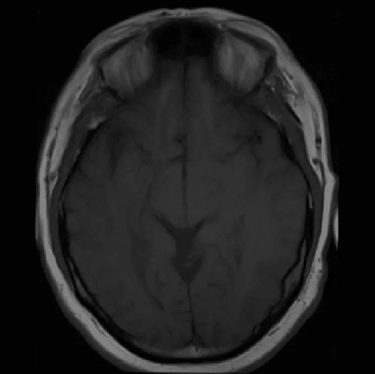
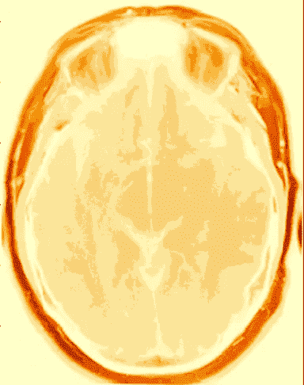
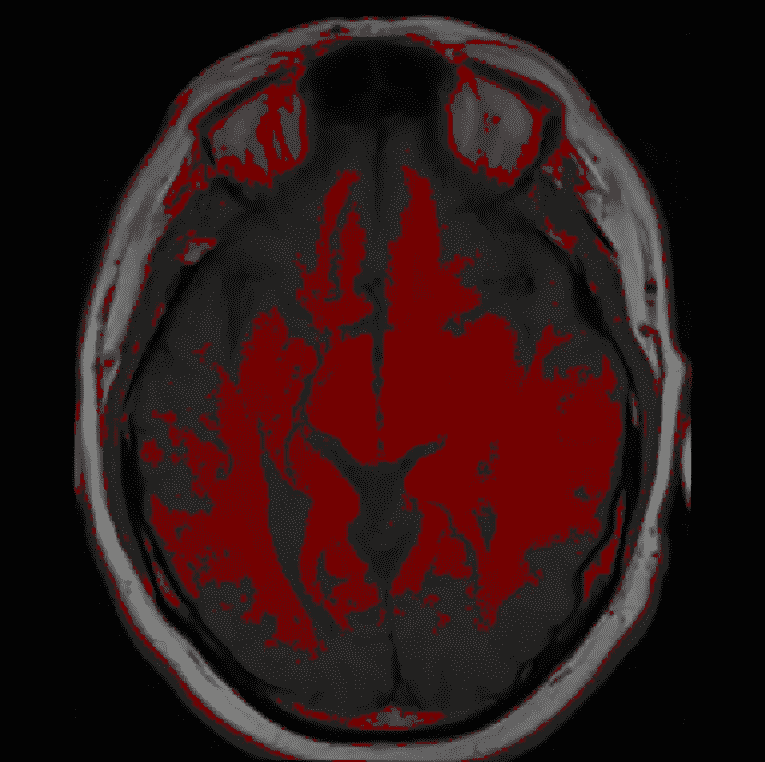
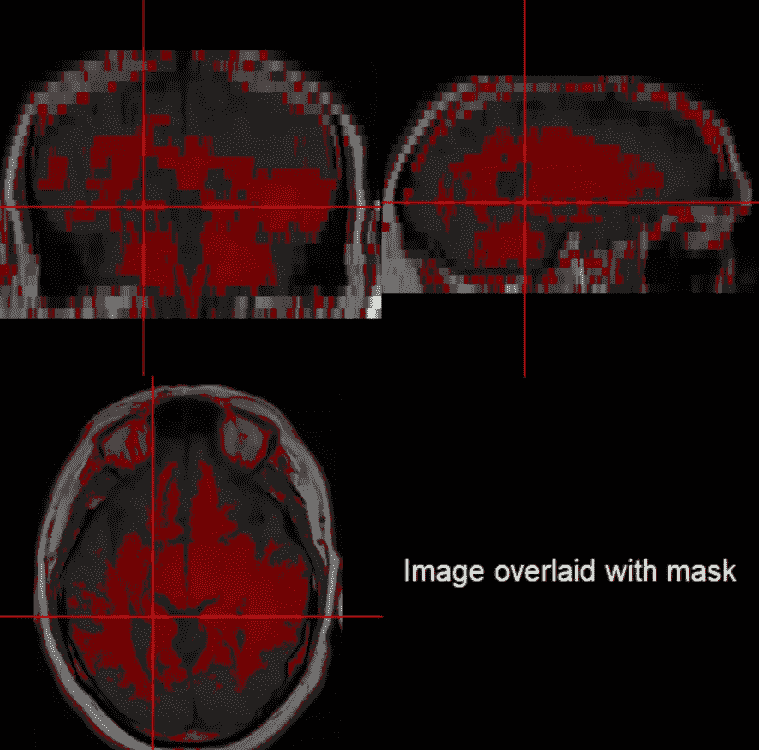
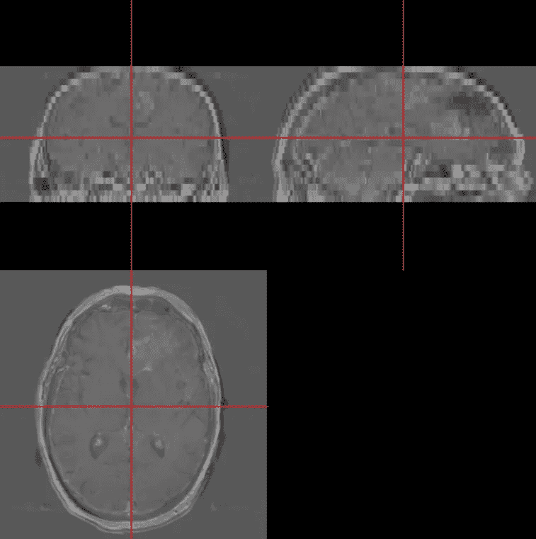
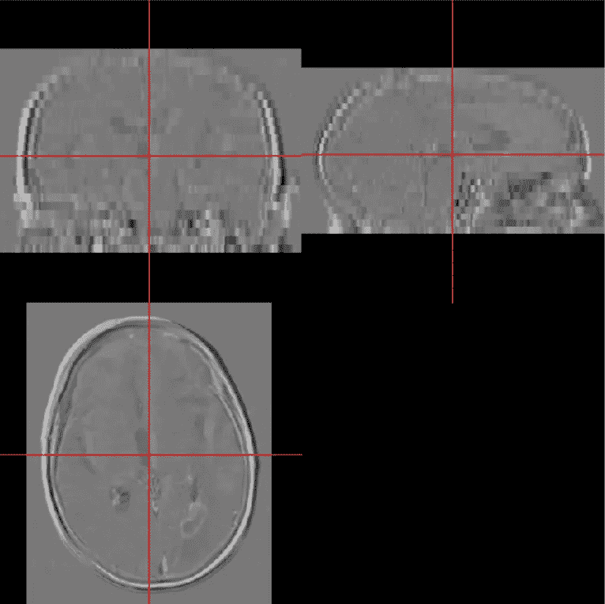
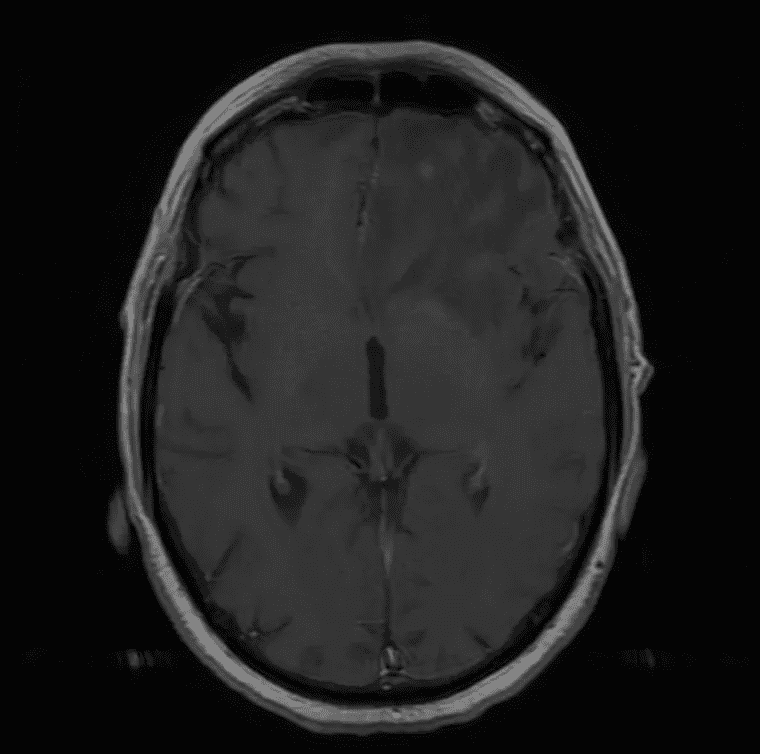
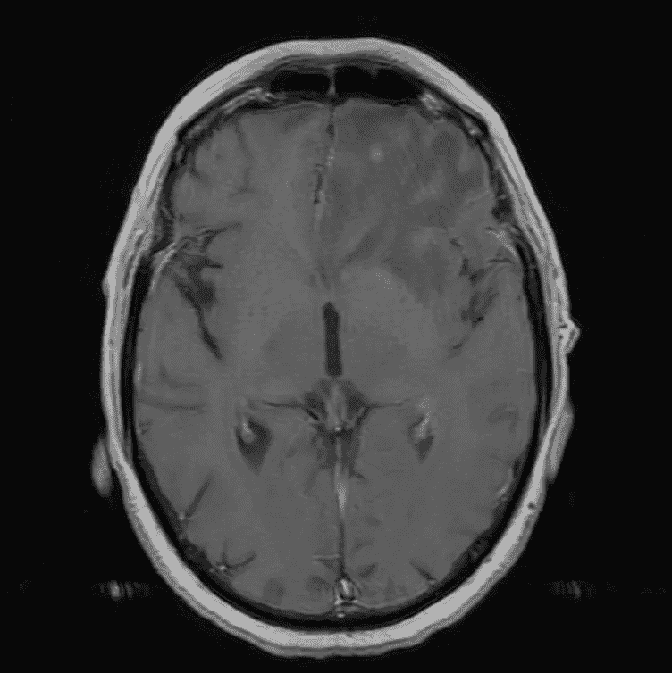
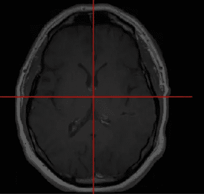

# 用 R 可视化大脑

> 原文：<https://towardsdatascience.com/visualizing-brains-using-r-606fa0fb9fdf?source=collection_archive---------40----------------------->

## 如何使用 R 可视化和分析大脑的 MRI 扫描

Robina Weermeijer 在 [Unsplash](https://unsplash.com?utm_source=medium&utm_medium=referral) 上的照片

# 介绍

最近，我在大学一年级上了一门心理学入门课，在这门课中，我们学习了心理学的其他基本原理，包括大脑，我们使用不同类型的扫描来可视化大脑的方法，以及医生如何使用这些扫描来检测和监控疾病。这让我想知道——有没有一种简单的方法可以让我可视化并分析大脑？

大量的研究促使我在 Coursera 上开设了“神经黑客入门”课程。这门课程帮助我收集了背景信息和可视化大脑所需的构建模块，只使用了两样东西:开源 MRI 扫描和 R。鉴于 Python 通常被认为是深度学习和图像分析的首选语言，我想挑战自己使用 R 并解决我的问题。

# 资料组

我在 Kaggle 上找到的一个名为“脑瘤进展”的数据集上测试了我的知识。它由 20 名胶质母细胞瘤患者的 MRI 扫描组成。每名患者相隔 90 天接受两次 MRI 检查，以监测肿瘤的进展。

# 我回答的问题

## 问题 1:如何将扫描结果转换成适合分析的格式？

大多数医院以二维 DICOM 格式存储 MRI 扫描数据，其中大脑的每个轴向切片都是一个 DICOM 文件。这样做是为了保护健康信息。为了使这些图像适合 R 进行分析，第一步是将 DICOM 转换为 NifTI 格式，它将所有 DICOM 文件合并到一个文件夹中，以获得大脑的 3D 图像(NifTI 格式！).假设我们想看一下 1 号病人大脑的第 11 个轴向切片，我们得到了这个。

患者 1 大脑第 11 层的轴向视图

## 问题 2:有没有办法用强度值来可视化大脑的某些组织/部位？

当我告诉 R 用 300 到 400 之间的亮度值(不包括边界值)高亮显示大脑第 11 个切片的区域时，它将所有这些区域都染成红色，就像这样。

红色区域表示强度值在 300 和 400 之间

第一幅图像是轴向视图，第二幅图像代表冠状、矢状和轴向视图。当将突出显示的区域与现有文献进行比较时，红色部分代表大脑的白质和颅骨的少数区域。由此，我们可以得出结论，大脑的所有白质和头骨的少数区域的强度在 301 和 399 之间。

我们可以使用这种技术来突出具有特定强度范围的大脑的不同部分/组织，将它们与文献进行比较，并获得对大脑整个结构的更好理解。

## 问题 3:有没有一种方法可以将同一患者相隔一段时间的两次扫描相减，以监测大脑的变化？

在数据集中，每名患者间隔 90 天进行两次 MRI 检查，以监测肿瘤的进展。除了手动比较每个患者的两次扫描，有没有一种方法可以“减去”扫描，以便我们准确地知道在过去 90 天里大脑发生了哪些变化？幸运的是，我们可以在 r 的帮助下实现这一点。这个函数的优点是，现在我们不再需要对变化进行近似。我们确切地知道每个病人的肿瘤是如何在大脑中发展的。

在这项研究中，我决定比较 2 号病人和 20 号病人的大脑变化。从后续扫描中“减去”初始扫描，我对每个患者的结果如下。

**左:**患者 2 的脑在 90 天内的变化，**右:**患者 20 的脑在 90 天内的变化

我们看到，虽然两个病人大脑的变化发生在不同的区域，但组织生长的数量相当相似。因此，我们可以得出结论，对于数据集中的所有患者，疾病的进展都是相似的。

## 问题 4:怎样才能让大脑的某些特征更加突出？

有两种方法可以让大脑的特定区域突出更多，看起来更亮或更暗(取决于我们想要什么)。

***选项一:反向映射***

每个 MRI 扫描都是灰度图像，图像的大部分是黑色背景(强度=0)。在反向映射技术中，我们告诉 R 只考虑大于或小于阈值的强度，以帮助我们更好地看到图像。例如，对于非常暗的图像，我们将告诉 R 绘制所有大于 50 的亮度。这将帮助我们摆脱不必要的黑暗区域，使整体图像更明亮。另一方面，包含强度为 1300 的点的图像将使得强度为 200 的点很难看到。在这种情况下，我们告诉 R 只考虑小于 900 的亮度，以使图像的基本特征更容易看到。

***选项 2:变换和平滑***

我们可以变换图像，使大脑的特征更加清晰可见。在这项研究中，我使用了一个**线性传递函数和线性样条变换**。这些是单调的传递函数，这意味着灰色阴影只是变成了其他灰色阴影，白色保持白色，黑色保持黑色，只是它们的相对强度发生了变化。下面的图片显示了原始图像和转换后的图像。很明显，转换后的图像在显示大脑特征方面做得更好。

**左:**原始图像，**右:**变换后的图像

如果图片有太多噪点，平滑可以帮助减少一些噪点，使图像看起来更清晰。在这种情况下，我使用了**高斯平滑**。结果如下所示。

**左:**原始图像，**右:**平滑图像

在比较原始图像和平滑图像时，似乎没有太大的差别。这大概是因为数据非常干净。在真实世界的数据中，扫描结果并不清晰，而且有很多噪音。在这种情况下，平滑会做得更好。需要注意的是，过于平滑会导致重要特征丢失，所以内核大小要合适。

# 未来的研究

这项研究帮助我利用 r 更好地理解了大脑的结构。那些想要复制这项研究结果的人可以在这里找到代码。

从这里我们可以有两种主要的方法。第一，通过分析有其他异常的大脑 MRI 扫描来进一步探索大脑。第二，根据开源数据的可用性，将这项研究扩展到其他器官。

# 参考

1.  **Coursera 课程——约翰·霍普金斯大学《R 中的神经黑客入门》**:[https://www.coursera.org/learn/neurohacking](https://www.coursera.org/learn/neurohacking)
2.  **“脑瘤进展”数据集来自 ka ggle:**[https://www.kaggle.com/andrewmvd/brain-tumor-progression](https://www.kaggle.com/andrewmvd/brain-tumor-progression)

*数据集的原始来源*:施梅达 KM，Prah M (2018)。脑瘤发展的数据。癌症影像档案。[http://doi.org/10.7937/K9/TCIA.2018.15quzvnb](http://doi.org/10.7937/K9/TCIA.2018.15quzvnb)