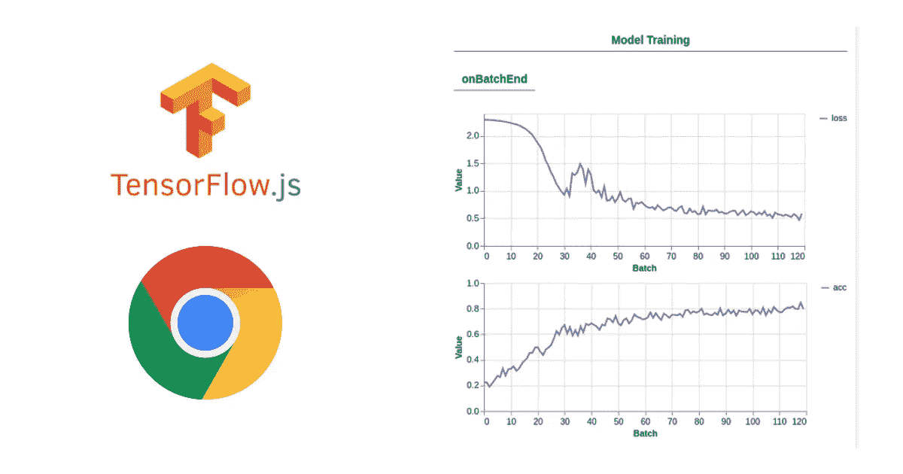
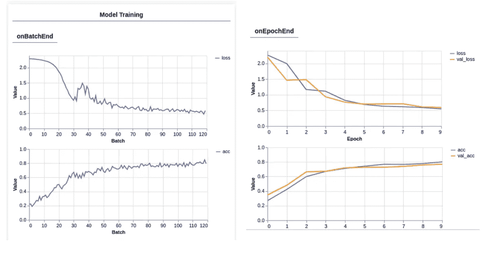
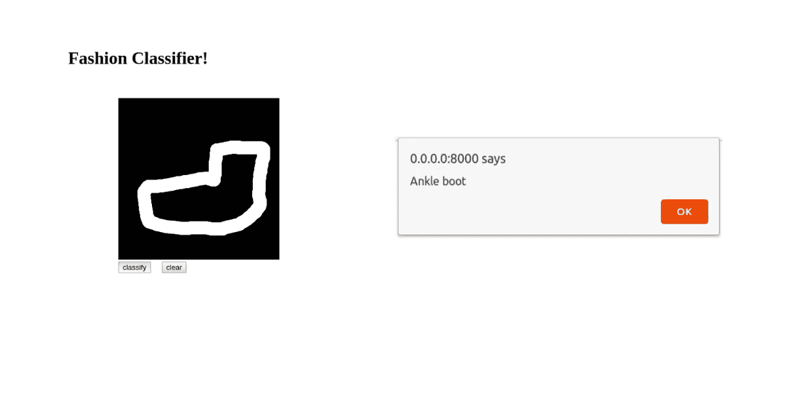

# 使用 TensorFlow visualizer 可视化基于浏览器的模型训练过程

> 原文：<https://towardsdatascience.com/visualizing-browser-based-model-training-process-using-tfjs-vis-810e8c91d4b7?source=collection_archive---------47----------------------->

## 观察神经网络训练过程同样重要，因为它有助于观察每个时期的损失和准确性等。



可视化批处理值

在 python 中训练模型时，tensorboard 库使可视化成为可能。类似地，如果您正在使用 tensorflowjs 在浏览器上训练您的模型，您将需要一些东西来观看训练过程。可以使用 tensorflowjs 可视化工具。利用这一点，我们可以在训练时可视化每个时期或批次的训练损失/准确度。我们可以在评估时可视化每个职业的准确度和混淆矩阵等等。

我将使用 tfjs 为谷歌 chrome 浏览器上的 10 个标签使用时尚 MNIST 数据集训练一个分类器，并在训练时可视化模型。一旦模型被训练，我们就可以在画布上画出正确的类。

是的，你没听错，我们将在画布上绘制一个输出，并告诉我们的分类器识别图像类。我不会深入研究编码，因为我写这个故事的主要目的是在我们的 js 代码中实现 tfvis 库，并展示 visualizer 如何为基于浏览器的模型工作。我在这个故事的底部包含了我的 Github 代码的链接。

为了更好地理解这个故事，你可以参考我以前的博客
[**如何使用 tensorflow.js**](/how-to-train-a-neural-network-on-chrome-using-tensorflow-js-76dcd1725032) 在 Chrome 上训练神经网络

# 导入 tfjs-vis 库

超级简单，只需在你的 Html 文件的`<head>`中添加链接。此外，您可以在 nodejs 上从源代码构建。

```
<script src="[https://cdn.jsdelivr.net/npm/@tensorflow/tfjs@latest](https://cdn.jsdelivr.net/npm/@tensorflow/tfjs@latest)"></script><script src="[https://cdn.jsdelivr.net/npm/@tensorflow/tfjs-vis](https://cdn.jsdelivr.net/npm/@tensorflow/tfjs-vis)"></script>
```

就像 python 中的 train.py 一样，我们将使用单独的 java 脚本来编写构建和训练模型的代码，以及下载时尚 MNIST 数据集 **sprite sheet** 。

> **什么是雪碧片？** Sprite sheet 包含成千上万的图片组合在一个文件中。游戏开发人员使用这种技术，通过从文件中分割部分图像而不是多次调用图像来简化数据获取过程。当我们在实时环境中需要大量图像处理时，这使得处理速度更快。
> 
> **我们为什么要使用雪碧表？** MNIST 有成千上万的图片，如果你要打开 http 连接成千上万次来下载这些图片，可能会有问题。所以不像 python 中的训练，你可以一个接一个地加载 10，000 张图片，你不能在网络浏览器中这样做。劳伦斯·莫罗尼，深度学习

# 定义回调指标

让我们创建用于观察**损失**、**验证损失**、**准确性、**和**验证准确性**的指标，我们可以将这些指标传递给 tfvis 的 fitCallbacks 函数。

```
const metrics = ['loss', 'val_loss', 'acc', 'val_acc']
```

还有定义容器名称和大小的规定，这也是 fitCallbacks 函数的必需参数。

```
const container = { 
             name: 'Model Training', 
             styles: { 
                  height: '1000px' 
             }};
```

# 设置 tf-vis 显示

让我们用我们的度量和容器大小设置一个可视化工具。

```
const fitCallbacks = tfvis.show.fitCallbacks(container, metrics)
```

# 在训练函数(model.fit)中设置可视化工具

```
model.fit(trainXs, trainYs, {
        batchSize: BATCH_SIZE,
        validationData: [testXs, testYs],
        epochs: 10,
        shuffle: true,
        callbacks: fitCallbacks
});
```

# 一旦一切都设置好了，你就可以在训练时在网页上看到 visualizer。



训练时浏览器上显示的可视化工具输出。

上面的值是我们在传递给 tfvis fitCallbacks 函数的度量中设置的损失和准确性。

除了训练，你还可以使用 tfvis 来评估模型。对于像这样的分类任务，我们可以使用“perClassAccuracy”和“混淆矩阵”函数。

# 查看我的模型输出

附注:忽略我的画😛



# 想试试吗？

[](https://github.com/novasush/visualizing-fashion-mnist-on-browser) [## novas ush/visualizing-fashion-mnist-on-browser

### 使用 tensorflowjs 在浏览器上训练时尚 MNIST 数据集，使用 tfvisualizer js 可视化模型训练…

github.com](https://github.com/novasush/visualizing-fashion-mnist-on-browser) 

从这里参考我的 GitHub 库。它包含用于在浏览器中对时尚 mnist 数据集训练分类器并显示可视化效果的代码。

# 参考

1.  [**Tensorflow tfjs-vis 库**](https://github.com/tensorflow/tfjs/tree/master/tfjs-vis)
2.  [**用 tfjs-vis 进行可视化训练**](https://storage.googleapis.com/tfjs-vis/mnist/dist/index.html)
3.  [**查看数字识别器内部**](https://storage.googleapis.com/tfjs-vis/mnist_internals/dist/index.html)