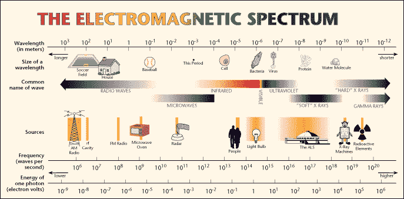
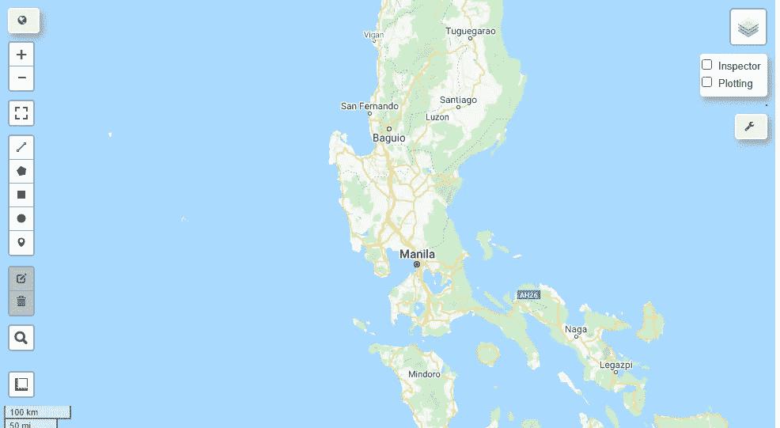
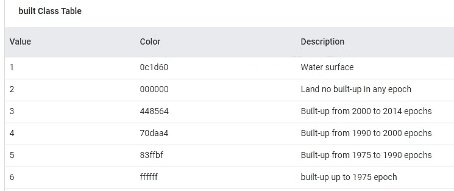
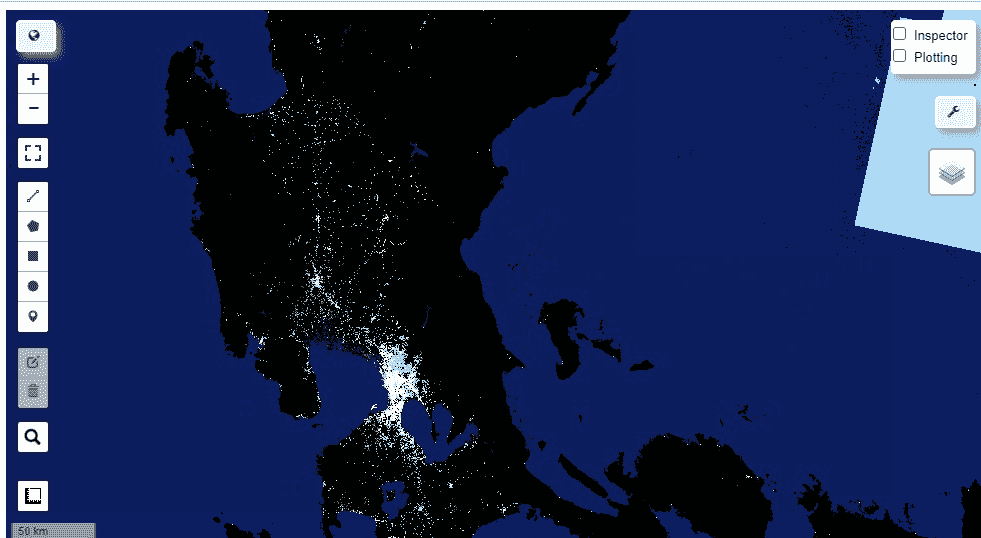
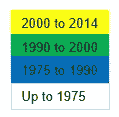
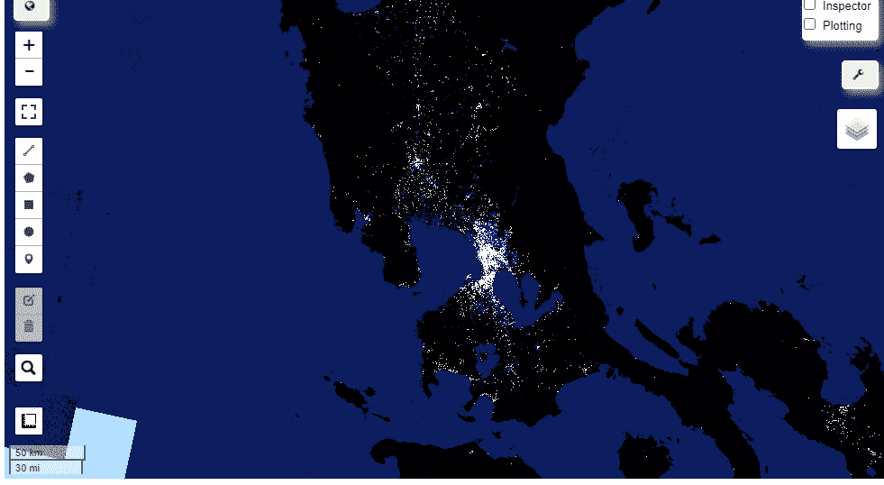

# 利用卫星图像可视化建筑区

> 原文：<https://towardsdatascience.com/visualizing-built-up-areas-using-satellite-images-18d43f34f0b3?source=collection_archive---------36----------------------->

## 地理可视化/菲律宾/遥感

## 使用谷歌地球引擎的卫星图像来观察一段时间内的建筑区域


美国宇航局在 [Unsplash](https://unsplash.com?utm_source=medium&utm_medium=referral) 拍摄的照片

大数据太不可思议了！大数据设法将科学和商业领域带到新水平的方式几乎有点神奇。它允许我们利用各种途径来获取我们通常不会获取的信息，以便获得新的见解。

卫星图像是一个惊人的非常规来源，可以挖掘这些新的见解。城市规划者、环保主义者和地理空间数据科学家通常会从卫星图像中寻找全局视角，并从这一实践中找到见解，从而将他们的预期解决方案提升到一个全新的水平。

**卫星图像分析速成班又名遥感**

如果你曾经在网上文章中遇到过“遥感”这个术语，很可能指的是利用卫星观测地球的过程。之所以这样称呼它们，是因为它们有远程测量的能力。

这些遥感仪器感知什么？简答就是辐射。更专业的说，这些仪器感应电磁辐射。

这些电磁辐射的波长和频率各不相同，在这个光谱中，我们肉眼能看到的一小部分被称为“可见光谱”。



电磁波谱。来自鲍勃-edu 天文学

这就是卫星发挥作用的地方。环绕地球运行的卫星的透镜不仅可以探测可见光，还可以探测红外波长(最接近可见光谱的波长)和微波。

当来自太阳的光到达地球表面时，每个物体都不同地反射、吸收或传输这种能量。例如，绿色植物吸收所有颜色，但反射绿色。这就是为什么当我们看植物时，绿色是可见的。在某些情况下，同一类型的植物可能没有同等的水分，虽然这种微小的差异不会被肉眼看到，但这两种植物反射光线的方式会有所不同。

如你所知，并不是所有反射的光都是可见的。

由于表面反射光线的方式不同，多年来，卫星一直被用于研究植被、洪水易发区，甚至分析一个地方的建筑面积。

虽然任何人都可以去查看和下载卫星图像，但它们可能不包含来自反射的数据，而反射会立即产生如此多的见解。

这是我们要找的数据。在我们稍后要做的可视化中，颜色的不同代表了被反射的辐射的不同。由于这是一个多时相可视化(*多个时间段*)，颜色将代表一个地方不同时间序列的建筑区表面。

**预赛**

要继续学习本教程，请确保首先完成以下工作:

1.  用[谷歌地球引擎](https://earthengine.google.com/)创建一个账户。这是免费的，并将在您的 Jupyter 笔记本中进行验证。
2.  安装谷歌地图(pip install *geemap* )和地球引擎(pip install *ee* )。
3.  使用 ee 初始化地球引擎。初始化()

**数据集**

在这个练习中，我们将访问谷歌地球引擎数据库中的“GHSL:全球人类居住层”数据集。

**全球人类住区** (GHS)框架生成**全球**关于人类在地球上长期存在的空间信息。这包括物理沉降，因此这反映了一段时间内的建筑面积。

**我们来码！**

```
#Preliminaries
import geemap
import ee#After importing, it is important to initialize this.
ee.Initialize()
```

初始化树叶地图:

```
Map = geemap.Map(center=[15.222871,120.574440], zoom=7)
Map
```



加载数据集并将其存储为对象。

```
#Note that ee.Image and ee.ImageCollection can both access datasets but you need to check which one is applicable for your intended datasetimage = ee.Image('JRC/GHSL/P2016/BUILT_LDSMT_GLOBE_V1')
```

选择“已建”波段作为我们想要的已建区域。

```
builtUp = image.select('built')
```

定义 Vis 参数。

```
visParams = {
  'min': 1.0,
  'max': 6.0,
  'palette': ['0c1d60', '000000', '448564', '70daa4', '83ffbf', 'ffffff'],
}
```

为了使这有意义，让我们参考这些最小值和最大值所指的内容:



取自地球发动机数据目录

最小值和最大值指的是上面构建的类表中的值列。为了获得最佳观看效果，您应该选择最小值=1，最大值=6。您不希望遗漏水域和陆地的价值，因为对于一些不擅长阅读地图的读者来说，您的可视化可能没有清晰的形式。

调色板只是给类值分配一种颜色。建议的颜色可以在构建的类别表中看到。您可以使用十六进制代码，但不要使用“#”。

```
#.addLayer method adds this on top of your initialized Map above
Map.addLayer(builtUp, visParams, 'Built-Up Multitemporal')
```

这是建议颜色的显示方式。



考察菲律宾的建筑用地面积



建议颜色的图例

或者，您可以直接为调色板使用颜色名称。确保对其进行排列，以便第一种颜色与构建的类表的值 1 相匹配。

```
visParams = {
  'min': 1.0,
  'max': 6.0,
  'palette': ['0c1d60', 'black', 'yellow', 'green', 'blue', 'white'],
}
```

请注意，您可以使用 inspector 函数来检查点的值:



使用调色板的颜色名称。使用检查器来显示点的值

因此，从本练习中，您可以看到大部分建筑区位于菲律宾首都及其附近区域，如区域 III 和区域 IV-A。同样，您可以追踪一个模式并回答“特定时期内开发发生在何处”这一问题。

我们还可以为此做其他修改，例如将可视化限制在一个城市或省份。

有了谷歌地球引擎，你也可以访问其他数据集。

请随意探索其他数据集。编码快乐！

点击[此处](https://github.com/francisadrianviernes/GeoVisualization)查看 Github 上的 Jupyter 笔记本。