# 可视化冠状病毒爆发

> 原文：<https://towardsdatascience.com/visualizing-coronavirus-outbreak-da835608fb88?source=collection_archive---------36----------------------->

## [数据新闻](https://towardsdatascience.com/data-journalism/home)

## 对这种疾病在全世界传播的深入观察

由[杰克·布拉德利](https://unsplash.com/@jakebradley?utm_source=medium&utm_medium=referral)在 [Unsplash](https://unsplash.com?utm_source=medium&utm_medium=referral) 上拍摄的照片

> "如果不加以控制，它会像病毒一样传播."——丽斯·麦克布莱德

我已经很久没有在媒体上写东西了。我觉得目前的疫情给我带来了完美的机会，让我期待已久的复出。让我们开始吧。

# 概观

2020 年初，冠状病毒(新冠肺炎)爆发将成为全球各大报纸的头条。截至 2020 年 2 月 28 日，这种臭名昭著的病毒已经影响了 84124 人，并导致 2867 人死亡。病毒的中心是位于湖北 Mainland China 的武汉市。与 SARS 爆发相比，中国这次确实反应更快，以限制疾病向其他地区的传播。然而，尽管他们尽了最大努力，在许多其他国家还是出现了一些疑似和确诊病例。这篇博客文章将作为对病毒爆发的具体观察。

*免责声明:所有数据都是截至 2020 年 2 月 28 日的最新数据。*

# 数据源

使用的数据集可以在 [Github](https://github.com/CSSEGISandData/COVID-19) 上找到。它由约翰·霍普金斯大学系统科学与工程中心(CSSE)出版。数据每天更新两次。

# **探索性数据分析(EDA)**

数据源有三种类型的数据，已确认、死亡和已恢复，在三个单独的文件中可用。让我们来看看。

## 结构

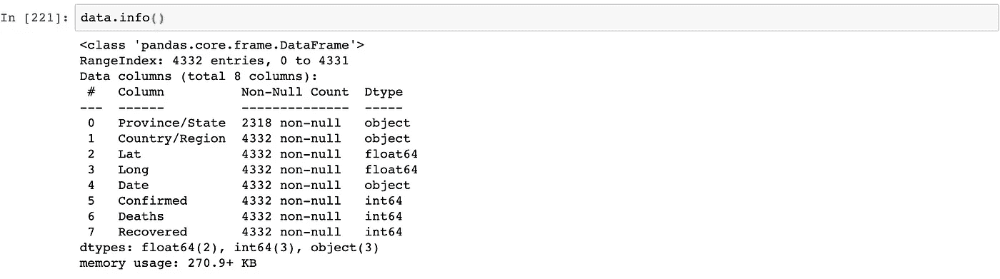

在观察我们的数据结构时，我们看到它具有地理数据集的常见嫌疑(州、国家、纬度、经度)。每行的粒度仅在状态之前可用。在检查 State 列时，我们看到它缺少值。让我们对此进行调查。

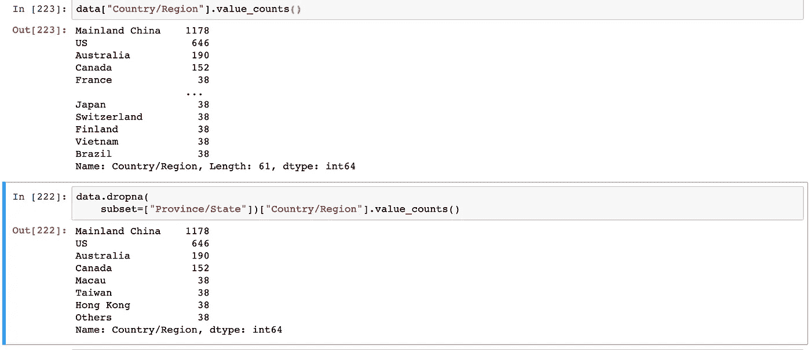

我们看到，当删除 State 列中的空值时，唯一国家的数量有所不同。大多数州数据来自 Mainland China，其次是美国。让我们来看看汇总统计数据。

## 汇总统计数据

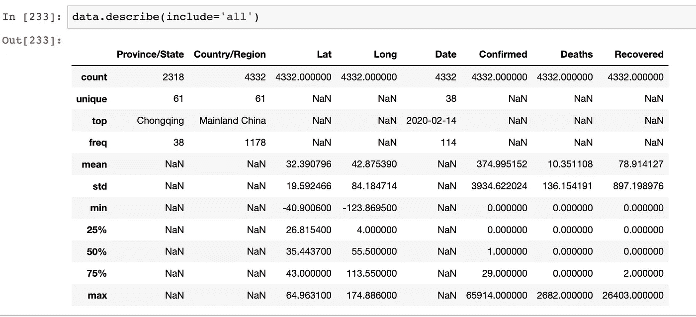

这里没有太多惊喜。我们的数据有 4332 行。一切似乎都很简单。让我们更深入地进行一些分析和可视化。

## 中国

我们知道冠状病毒爆发源于中国。因此，它应该是我们的首选。让我们看看中国的一些地区是如何受到影响的。

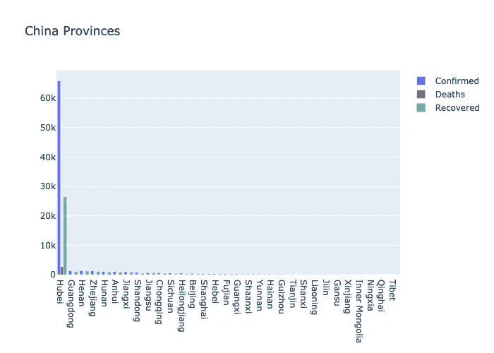

我们看到湖北地区显然是该病毒的高发区。如前所述，武汉市是湖北区的首府。难怪我们在湖北看到大量确诊病例。确切数字是 65914。这尤其令人着迷，因为全球确诊病例总数为 84，124 例。这意味着仅湖北区就占确诊病例总数的 78.35%！

让我们来看看中国湖北以外的情况。

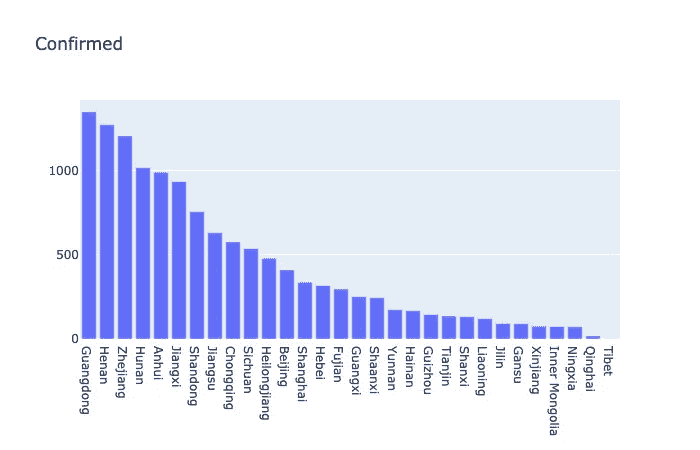

广东的确诊病例数(1348 例)仅次于湖北。其次是河南省(1272)。

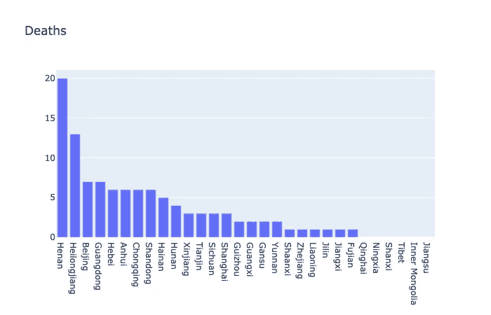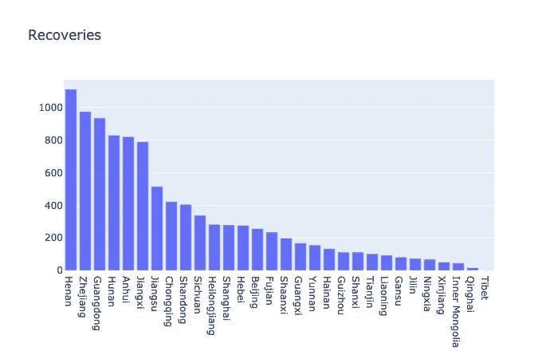

从死亡和康复图表中，我们可以看到河南区的死亡和康复人数最多。快速的谷歌搜索显示，与广东相比，河南实际上离湖北更近。或许，邻近可能是造成这些高数字的一个因素？对这些假设进行统计测试会很有趣。也许我们应该在以后的博客文章中重新讨论这个问题。

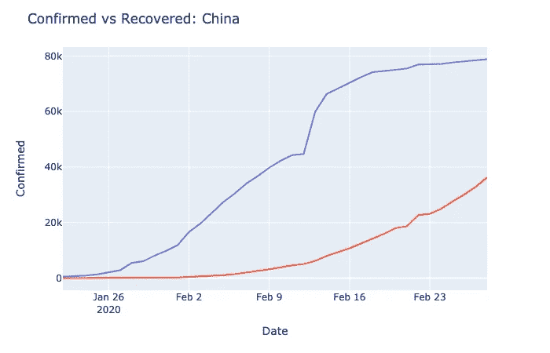

这张图是中国冠状病毒病例的时间序列图。我们可以看到，在 2 月 12 日至 2 月 13 日期间，确诊病例数量突然激增，随后斜率变平。也许关于诊断和治疗的信息在这个时候得到了改善？这一假设得到了以下事实的支持，即红色回收线的斜率在图表的后半部分变得更陡，表明回收的案件数量有所增加。🙂

让我们慢慢把注意力从中国转移到世界其他地方。

## 世界其他地方

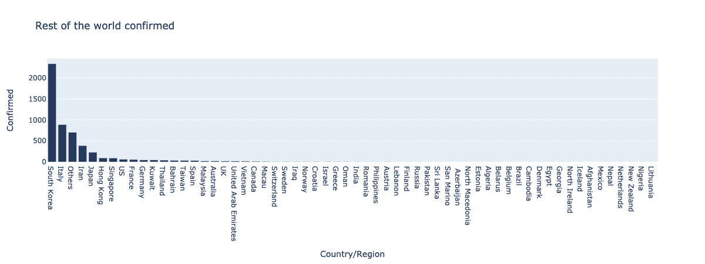

韩国是中国以外确诊病例最多的国家。全国冠状病毒病例 2337 例。

值得注意的一个非常有趣的数字是，在韩国之后，意大利的确诊病例最多，为 888 例。几个小时前，我收到消息，一场大型的意大利足球联赛由于努力应对病毒而被推迟。[意大利米兰](https://www.theguardian.com/world/2020/feb/28/coronavirus-may-have-been-in-italy-for-weeks-before-it-was-detected)的一名传染病教授表示，在最初几个病例被发现之前，病毒可能已经在欧洲国家存在了数周。看起来意大利可能还有很长的路要走。

让我们看看在中国以外有多少病例被证明是致命的。

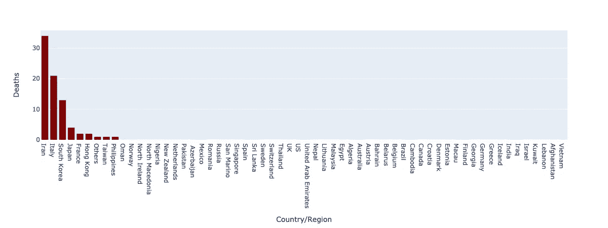

伊朗(34 人)其次是意大利(21 人)在中国境外因该病毒而伤亡人数最多。据来自中东国家的报道，一名伊朗议员死于该病毒。随后，一些国家已经决定[禁止航班](https://www.theguardian.com/australia-news/2020/feb/29/coronavirus-queensland-beauticians-clients-may-have-been-exposed-to-covid-19)往返伊朗。

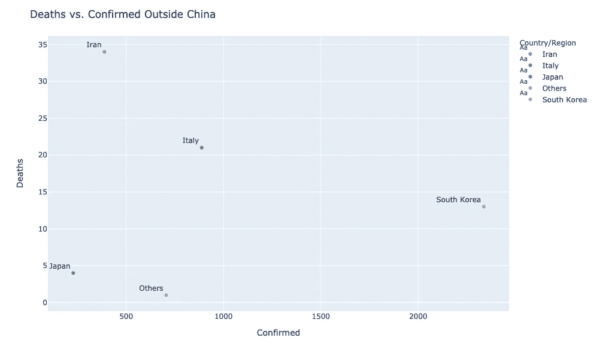

尽管韩国是中国以外病例最多的国家，但该病毒在该国的死亡率相当低。

到目前为止，我们只研究了世界各地的死亡人数。让我们来看看世界各国抗击这种病毒的情况。

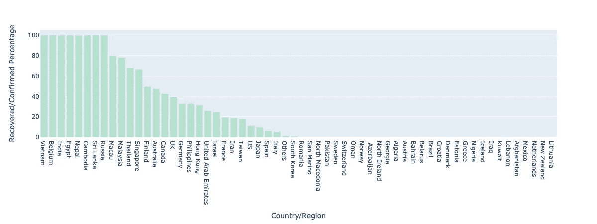

我们可以看到，一些国家似乎有 100%的病毒恢复率。乍一看，似乎是越南、比利时、印度等。对疾病爆发表现出了惊人的反应。然而，百分比在很大程度上取决于分母，在这种情况下，分母恰好是确诊病例的数量。让我们看看当我们过滤掉复苏百分比最高的国家时会发生什么。

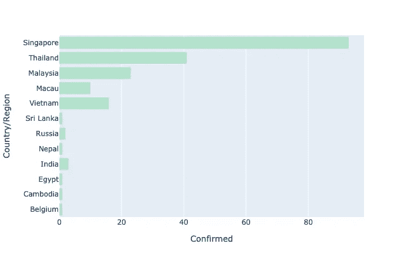

所有治愈率为 100%的国家的确诊病例数都少于 20 例。相比之下，新加坡(93 人)和泰国(41 人)的病例都要高得多。新加坡的回收率为 68%，而泰国为 66%。这两个相邻的亚洲国家似乎在治疗这种病毒方面做得非常好。好消息！👍🏼

现在，让我们将我们在中国使用的时间序列图复制到世界其他地方。

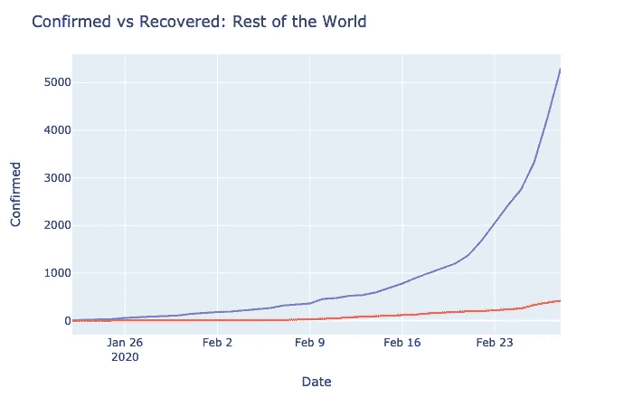

我们可以看到，自 2 月 23 日以来，确诊病例数量急剧增加。最近有[新闻报道](https://nypost.com/2020/02/26/more-new-coronavirus-cases-reported-outside-china-than-inside-who/)提到世界范围内病例数量的快速增长。

最后，这是一个显示病毒在全球传播的动画地图。

最初，我们只在中国和周边地区看到斑点。在 2 月 20 日左右，欧洲的病例数量大幅上升。这和前面提到的这篇博文的观察结果是一致的。

# 结论

冠状病毒是当今媒体最热门的话题之一。记者称之为致命的。由于担心疫情爆发，全球市场已经看到[7 万亿美元化为乌有](https://www.marketwatch.com/story/what-in-the-world-can-the-fed-do-to-cure-a-coronavirus-stricken-stock-market-that-erased-43-trillion-in-7-sessions-2020-02-29)。流行病学家对这种病毒的致命性没有把握[。](https://www.bbc.com/news/health-51674743)

尽管这篇文章提供了很多真知灼见，但世界各地可能还有更多未被发现的病例。

> “没有证据并不是不存在的证据”——卡尔·萨根

如果你在受病毒影响的地区或去中国旅行，确保遵循这些指示以保持安全。

我希望你们都喜欢这篇文章。所有的图表都是使用 [Plotly](https://plot.ly/graphing-libraries/) 创建的。Plotly 是一个非常棒的可视化库，用于构建交互式的图形。他们有 Python、R 和 JavaScript 的图形库。我鼓励我所有的读者去尝试一下。

文章中使用的所有代码都可以在[这里](https://github.com/Sayar1106/COVID-19/blob/Notebook-Visualizer/Corona%20Virus%20Visualizer.ipynb)找到。

如果你喜欢这篇博文，请在 [Medium](https://medium.com/@sayarbanerjee) 和 [LinkedIn](https://www.linkedin.com/in/sayarbanerjee/) 上关注我，并与你的朋友分享这篇博文。下次见。✋

## 参考资料:

[【1】https://www . ArcGIS . com/apps/ops dashboard/index . html #/BDA 7594740 FD 40299423467 b48e 9 ECF 6](https://www.arcgis.com/apps/opsdashboard/index.html#/bda7594740fd40299423467b48e9ecf6)

[【2】https://www . ka ggle . com/imdevskp/新冠肺炎-分析-viz-预测-比较](https://www.kaggle.com/imdevskp/covid-19-analysis-viz-prediction-comparisons)