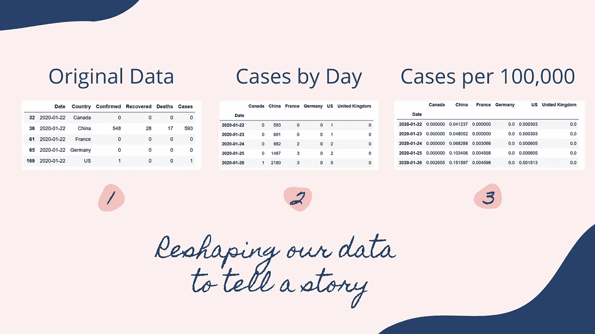

# 用 Python 漂亮地可视化新冠肺炎数据(不到 5 分钟！！)

> 原文：<https://towardsdatascience.com/visualizing-covid-19-data-beautifully-in-python-in-5-minutes-or-less-affc361b2c6a?source=collection_archive---------8----------------------->

## 让 Matplotlib 不那么痛苦！

让我们用 Python 创建一些漂亮的数据可视化！资料来源:Nik Piepenbreier。

Matplotlib 可能是 Python 事实上的数据可视化库，但它并不总是最漂亮的。在这篇文章中，我们将探索如何把一个单调的默认 Matplotlib 图变成一个漂亮的数据可视化。我们将研究新冠肺炎的数据，看看病毒是如何在不同国家传播的。

# 让我们载入数据

我们将使用来自[这个美妙的 Github 库](https://github.com/datasets/covid-19/blob/master/data/countries-aggregated.csv)的数据，它每天自动更新数据。我们将根据 URL 把我们的数据加载到熊猫的数据框架中，这样它将每天为我们自动更新。

加载我们的数据并创建汇总变量。资料来源:Nik Piepenbreier

*   在上述要点的第 1 节 中，我们正在加载我们的库。在本教程中，我们将使用 Pandas 和 Matplotlib。
*   在 ***第 2 节*** 中，我们将数据读入数据帧`df`，然后只选择列表`countries`中的国家。选择数据使结果可视化更具可读性。
*   在第 3 节 的 ***中，我们创建了一个汇总列，汇总了所有确诊病例、已康复病例和任何因新冠肺炎而死亡的个体的病例总数。***

# 为数据可视化准备数据框架

现在我们已经将数据存储在一个数据帧中，让我们准备另外两个数据帧，将数据保存在交叉表中，这将使我们能够更容易地可视化数据。

为可视化准备数据。资料来源:Nik Piepenbreier

让我们更详细地探讨一下我们在这里做了什么:

在 ***第 4 节*** 中，我们旋转我们的数据框架`df`，创建国家的列，以案件数量作为数据字段。这个新的数据帧被称为`covid`。然后，我们将数据帧的索引设置为日期，并将国家名称分配给列标题。

在 ***第 5 节*** 中，我们复制了我们的数据帧`covid`，称之为`percapita`。我们使用存储所有国家人口的字典，将每个值除以人口，再乘以 100，000，得出每 100，000 人中的病例数。

如果你想学习如何解透视数据，看看[这篇关于熊猫融化功能的教程](https://datagy.io/using-the-pandas-melt-function-in-python-to-unpivot-data/)。

让我们来看看我们的数据从开始到现在是如何变化的:

我们如何重塑数据来讲述一个故事。资料来源:Nik Piepenbreier

# 创建我们的第一个可视化—案例随时间推移

让我们首先创建第一个可视化视图，展示不同国家/地区一段时间内的病例总数:

创建我们的第一个可视化。资料来源:Nik Piepenbreier

让我们更详细地探究一下我们对她做了什么:

在 ***第 6 节*** 中，我们创建了一个包含不同国家十六进制值的字典。将它存储在字典中可以让我们稍后在 for 循环中轻松调用它。我们还分配了 FiveThirtyEight 样式来添加一些通用格式，我们将在此基础上进行大量构建。

在 ***第 7 节*** 中，我们使用 Pandas 的 plot 函数创建了我们的第一个可视化。我们使用 colors 参数将颜色分配给不同的列。我们还使用`set_major_formatter`方法来格式化带有千位分隔符的值。

然后，在 ***第 8 节*** 中，我们创建一个 for 循环，为各个国家生成标签文本。这个 for 循环以列表的形式从字典中的关键字获取每个国家的名称，并遍历这个列表。它将包含国家名称的文本放置在最后一个 x 值的右侧(`covid.index[-1]` →数据帧中的最后一个日期)，在当天的 y 值处(它将始终等于该列的最大值)。

最后，在 ***第 9 节*** 中，我们添加了一个关于图表的标题、副标题和源信息。我们再次使用变量来定位数据，因此当图形更新时，这些位置会动态更新！

这是我们第一张图表的最终结果:

我们的第一个可视化结果——各个国家的案例。资料来源:Nik Piepenbreier

# 创建我们的第二个可视化——每 100，000 人中的病例

为了创建我们的第二个可视化，我们将使用下面的代码:

创建我们的第二个可视化——每 10 万人中的病例。资料来源:Nik Piepenbreier

这一部分主要遵循我们为第一个图表所做的。这表明，一旦使用 Python 设置了图表，更新不同数据集的可视化效果是多么简单！

这是我们的可视化结果:

我们的第二个设想——每个国家每 10 万人中的病例。资料来源:Nik Piepenbreier

# 结论:用 Matplotlib 实现漂亮的 COVID 可视化

感谢阅读！资料来源:Nik Piepenbreier

在这篇文章中，我们学习了如何使用 Github 上的新冠肺炎数据集生成漂亮的数据可视化。我们可以利用 Python 的强大功能，根据今天的数据自动更新我们的图表。

非常感谢你花时间阅读这篇文章！