# 使用 Julia 可视化新冠肺炎数据

> 原文：<https://towardsdatascience.com/visualizing-covid-19-data-using-julia-7731a524cf49?source=collection_archive---------28----------------------->

## 探索 Python 和 R 的强大替代品

[克莱班克斯](https://unsplash.com/@claybanks?utm_source=medium&utm_medium=referral)在 [Unsplash](https://unsplash.com?utm_source=medium&utm_medium=referral) 拍摄的照片

朱莉娅在科学计算领域相当有名。继 2018 年发布稳定的 1.0 版本后，逐渐成熟为一种功能强大的通用编程语言。Julia 是动态类型的，被设计得和 C 一样快(参见[基准测试](https://julialang.org/benchmarks/))，并且使用了令人印象深刻的数学友好语法。我最近完成了 Coursera 上的一门入门课程，之后开始将 Julia 纳入我的日常工作流程。作为一个小项目，我决定利用 Julia 中的 DataFrames 来可视化新冠肺炎时间序列数据。在这个过程中，我意识到关于使用和排除 Julia 故障的信息相对较难找到，这可能会提高像我这样的新用户的准入门槛。因此，我决定把我分享的过程、代码和结果放在一起。

我通常使用 Jupyter 笔记本，它们很容易使用并能完成工作。我没有包括在您的系统上设置 Julia 的详细步骤，这是相对简单的。请记住:

*   您需要有一个工作的 Jupyter 安装，强烈推荐使用 Anaconda
*   Julia 二进制文件可以在线获得，[不要忘记验证 sha256 校验和](https://julialang.org/downloads/)
*   你需要“IJulia”包来让 Julia 使用 Jupyter 笔记本，这些[指令](https://www.scivision.dev/install-julia-in-jupyter-notebook/)对我起作用了！我可以很容易地在[初级操作系统](https://elementary.io/)(基于 Ubuntu)中建立一个工作的 Julia 环境。

## 让我们开始吧:加载基本包

与 Python 类似，Julia 也使用了许多可以加载到 Jupyter 笔记本中的包。不像 Python，大部分都是用 Julia 本身写的！“Pkg”是 Julia 中内置的软件包管理器，处理它们的安装、更新和删除。“Pkg”带有一个 REPL(读取-评估-打印-循环)。在茱莉亚·REPL 上按`]`进入“Pkg”REPL。要返回到 Julia REPL，请按退格键或^C.

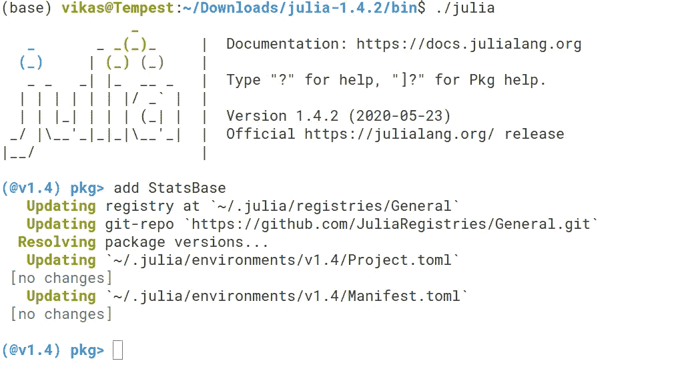

在朱莉娅 REPL 中添加 StatsBase 包。这一个已经被添加，因此没有做任何改变。

可以如上所示添加包。或者，您可以直接在 Jupyter 笔记本中添加它们，例如通过执行:import PkgPkg.add("假设检验")。因为软件包会定期更新(错误修复、新特性等)。)，这篇文章中链接的一些代码可能会在不同的时间点对您不起作用。不过不要担心，朱莉娅有一个非常聪明的解决方案。“Pkg”创建两个额外的文件——“project . toml”和“Manifest.toml”，这两个文件包含关于依赖项、版本、包名、UUIDs 等信息。这些文件可以很容易地共享，并让您重新创建我所拥有的确切的工作环境。

使用笔记本第一个单元格中的“InstantiateFromURL”包直接从我的 GitHub 库下载这些文件。它还激活所需的环境。

现在可以在下一个单元格中编译包，如下所示。包版本将完全一样，我在这个项目工作时使用。

在第一个单元中一次执行(加载和编译)所有包，这需要一段时间(2-3 分钟)

## 导入数据

在这个练习中，我使用了来自著名的 GitHub 库的新冠肺炎数据，该库由约翰霍普金斯大学系统科学与工程中心(CSSE)维护。数据为 CSV 格式，每天更新。它可以直接导入到文件中，如下所示:

从 GitHub 存储库导入 CSV 数据

## 第一眼

在继续之前，让我们看一下我们的数据。我想知道更多关于它的结构，大小和类型。

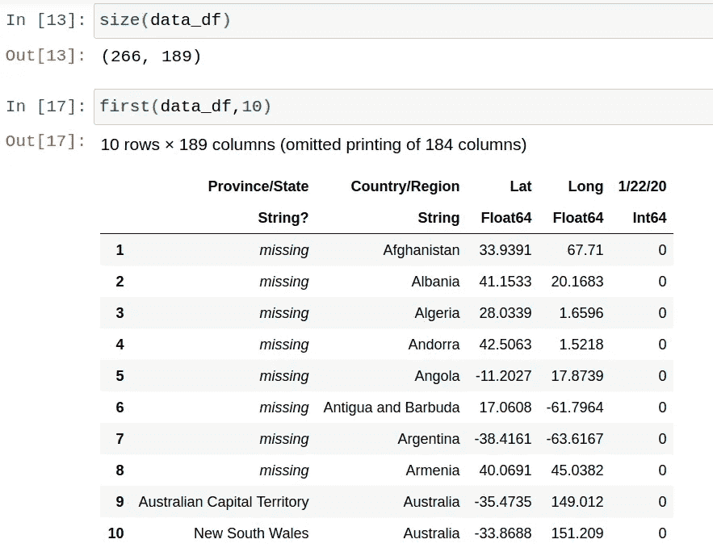

探索数据框架

*   size(data_df)返回数据帧中的行数和列数。由于每天都会添加新列，因此根据检索数据的日期，输出看起来会有所不同。有一列是国家名称，另一列是日期。
*   使用 names(data_df)列出所有列名，请参见下面的输出示例。这在以后会很方便！

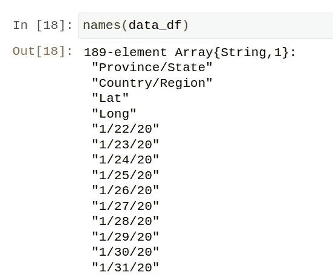

数据帧中所有列名的列表

*   快速调查显示，我们有一个国家名称列和许多包含所有日期的列。在 Julia 中，缺失的条目用一个特殊的*缺失*对象来表示。

## 在数据框架内选择一个国家

我希望能够从数据框架中选择给定国家的时间序列数据。有些国家还列出了“省/州”,这对我来说不是很有用。但是，列为*的“省/州”行缺少*，包含该国家所有地区的总和。

我将编写一个函数，只选择“省/州”*缺少*的行，并丢弃其余的行。然后，我可以通过将“国家/地区”条目与我提供的关键字进行匹配，轻松找到该国家。在浏览数据时，我已经注意到提到的国家名称有澳大利亚、德国、印度等，所以我的输入关键字应该相同。

函数返回带有与国家名称匹配的关键字的数据行

## 处理日期

日期可以直接从列名中读取。为了绘制时间序列数据(x 轴上的日期)，我们需要以正确的日期-时间格式显示它们。看看下面的代码片段:

## 为国家列表创建输入数据

到目前为止，我已经创建了用于绘制时间序列中 x 轴的数据。在 y 轴上，我们可以绘制该特定日期每天的确诊病例总数。然而，我想为我选择的一系列国家这样做，这将有助于比较它们之间的感染传播。回想一下，我之前创建了一个函数，它返回特定国家的一行数据。我们可以使用这个函数遍历用户指定的国家列表。

“find_country”函数从原始数据帧中返回行。然后，从第 5 列开始，也就是第一个日期 22/01/2020 开始，将它堆叠成垂直布局。请注意，Julia 中的索引从 1 开始。

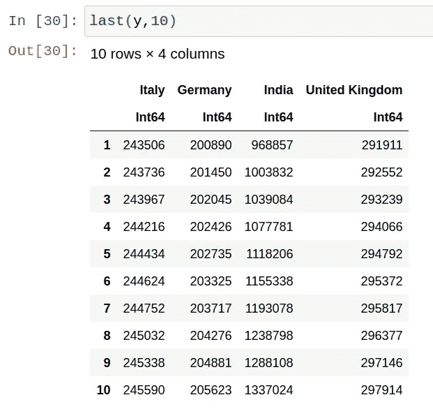

“y”数据帧的最后 10 个条目，最新条目为 2020 年 7 月 24 日。

## 将所有内容整合在一起—是时候开始策划了！

我们现在有了适合各个国家的时间序列图的 y 轴数据(“y”数据帧)。Julia 允许使用宏' @df '直接从数据帧绘图。我们之前已经加载了“Plots”包，它使用“gr()”后端来生成图形。

用指定的绘图选项绘制 y(所有列)与 x，如图所示。剧情！(称为爆炸)将添加到相同的数字，在这种情况下，虚线标记 100 万个报告的病例。

当返回到单元格时，绘图输出内联显示。这里，我使用了“显示”来明确显示用红色虚线覆盖的原始图(使用 plot！)标志着一百万计数(至少可以说是一个令人担忧的数字)。添加了额外的打印选项以改善打印外观。关于绘图的综合指南可以在[这里](http://julia.cookbook.tips/doku.php?id=plotattributes#frames_and_thickness)找到。

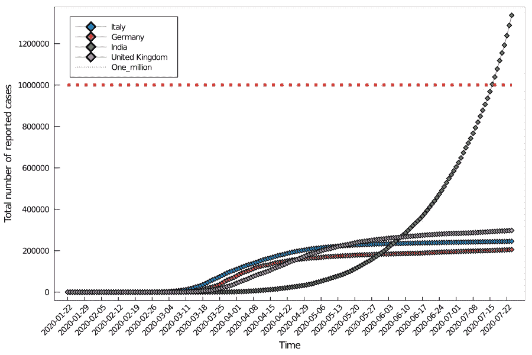

前面代码块的输出，红色虚线表示一百万标记

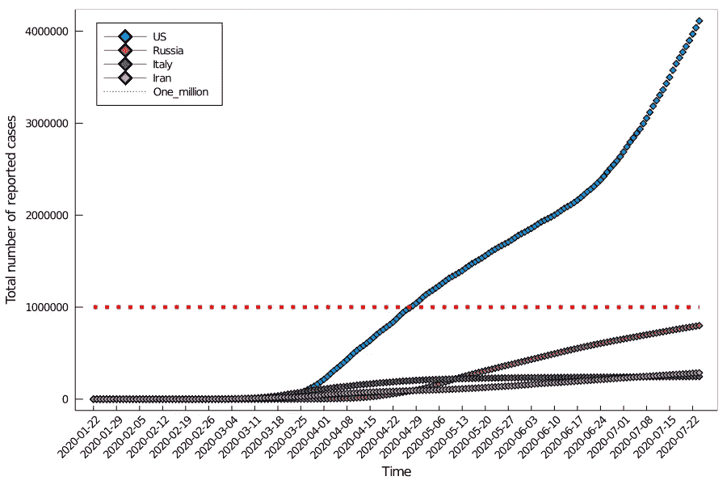

另一组国家的先前代码块的输出

## 计算每日报告的病例数

另一个值得关注的指标是每天报告的案例数量。我们已经有了一个包含给定日期报告病例总数的数据框架，每天的增加只是任何两个连续日期之间的差异。这种操作可以很容易地全天进行。请参见下面的代码片段:

计算并绘制每日报告病例的增加

在这种情况下，条形图通常能提供更多信息。对于报告病例总数开始饱和的国家，我们可以看到每日病例的增加开始下降。一旦没有新的病例报告，这一数字最好为零。意大利、德国和英国已经设法限制了增长，而印度目前正经历指数增长。

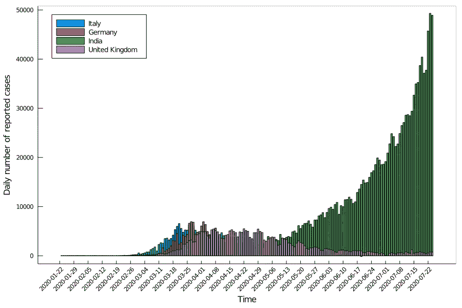

印度每日确诊病例数持续上升

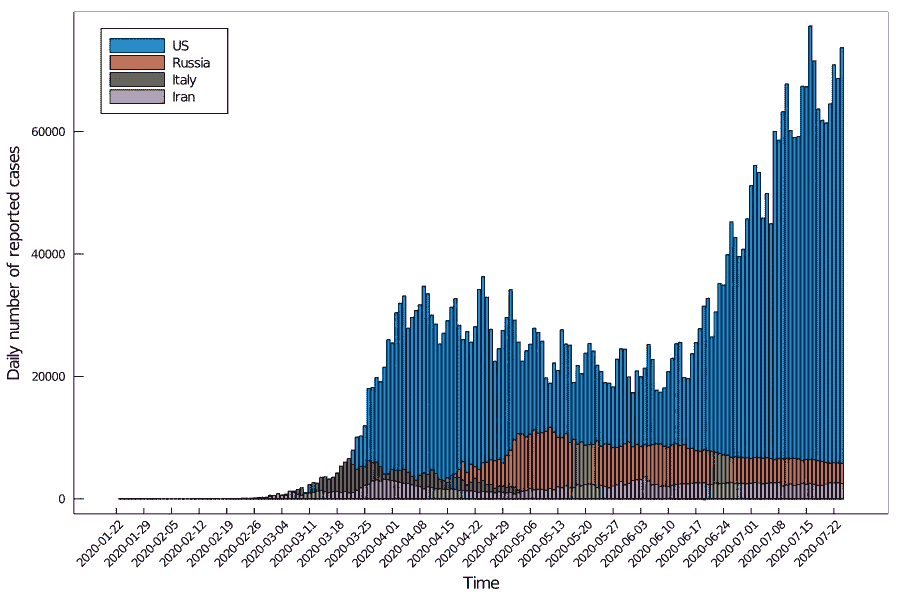

美国每天确诊的病例数最初在下降，然后又开始增长

## 查找报告病例数最多的前五个国家

为了找到确诊病例数量最多的国家，我们可以根据最后(最近)日期列中的值对原始数据帧“data_df”进行排序。排序是使用“sort！”完成的功能(bang 版，就地排序)降序排列。

对原始数据框架“data_df”进行排序，以确定确诊病例数量最多的国家，并绘制一个水平条形图

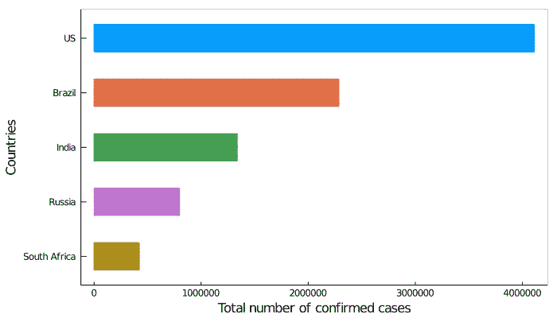

截至 2020 年 7 月 24 日确诊病例数最多的前五个国家

随着时间的推移，可视化哪些国家占据了前五名的位置可能会特别有用。幸运的是，Julia 允许我们使用“@animate”宏轻松生成动画。我们只需要遍历这些日期，并为每一天生成一个排名前五的国家的图表(如上所示)。然后将这些图组合成动画，可以以任何所需的帧速率运行。之前使用的代码块需要放在动画循环中，如下所示:

通过循环浏览日期并绘制每个日期的前五个国家来生成动画。fps=2 '设置所需的帧速率，在本例中为每秒 2 帧(2 个日期)。

截至 2020 年 8 月 14 日，新冠肺炎确诊病例最多的前五个国家的动画。执行完代码块后，视频会自动开始在你的 Jupyter 笔记本上播放。

## 死亡、康复和当前感染的人数

CSSE GitHub 库还包含死亡和康复病例数的时间序列数据。我们可以使用前面所示的相同代码将这些 CSV 数据导入两个新的数据帧:“data_df_recovered”和“data_df_deaths”。

导入附加 CSV 数据

我们可以从这些新的数据框架中收集数据，再一次收集一些国家的数据。下面显示的代码创建了新的数据帧“y_r”和“y_d ”,它们分别包含恢复病例和死亡人数的数据。y '包含确诊病例数，与早前相同。

“find_country”函数从原始数据帧中返回行。然后，从第 5 列开始，即第一个日期 22/01/2020 开始，将其堆叠成垂直布局。请注意，Julia 中的索引从 1 开始。

成组的条形图是可视化一系列国家的多个数据集(确诊、恢复、感染、死亡数)的有用方法。回想一下，我们已经在上面创建了数据帧“y_r”和“y_d”。既然知道了确诊病例总数，我们也可以计算出目前感染人数=确诊病例数(痊愈病例数+死亡人数)。

为了制作柱状图，我们需要从所有单独的数据框架中收集数据。下面的代码将最后一个 DataFrame 行(最近的日期)转换成一个向量，然后作为列添加到二维数组“Y”中。该数组的大小为:行(国家名称列表)×列(=4，对应于确认、恢复、死亡和感染数据)。

请注意，“Y[:，1] = deaths”将一维数组“deaths”分配给“Y”的第一列。类似的赋值用于“已确认病例”和“已恢复病例”。

二维数组“Y”的每一行现在包含给定国家的 4 个数据点。绘图类型“groupedbar”允许我们直接读取这些数据，并使用下面的代码根据国家排列条形组。额外的绘图选项控制条形的外观。

使用 x 轴上的国家名称(names(y))和 Y 轴上的二维数组“Y”中的数据制作一个分组条形图

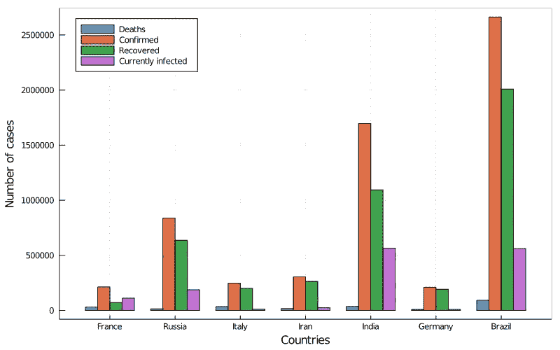

包含截至 2020 年 7 月 31 日数据的各个国家的分组条形图

德国似乎在管理疫情方面做得很好，类似的“已确认”和“已恢复”数字就证明了这一点。对于印度和巴西等国来说，复苏看起来很有希望，尽管仍有相当一部分工作要做。与痊愈人数相比，法国感染人数更多。

## 查找康复病例数和死亡人数最多的前五个国家

为了找到恢复案例数量最多的国家，我们可以根据最后(最近)日期列中的值对数据帧“data_df_recovered”进行排序。排序是使用“sort！”完成的函数(bang 版本，就地排序)按降序排列，类似于前面所做的。使用“数据 _ df _ 死亡”数据帧，死亡人数遵循相同的逻辑。

对数据框“数据 _ df _ 恢复”进行排序，以确定确诊病例数最高的国家，并绘制一个水平条形图

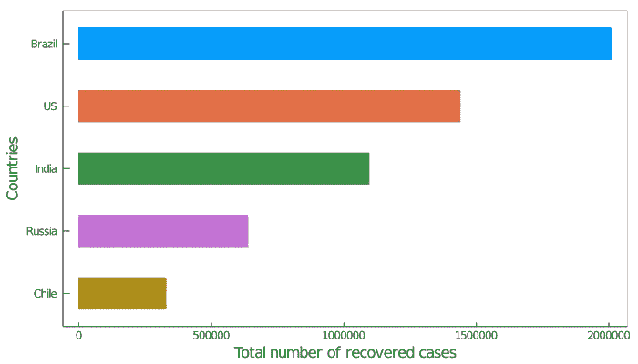

截至 2020 年 7 月 31 日，恢复案例数量最多的前 5 个国家

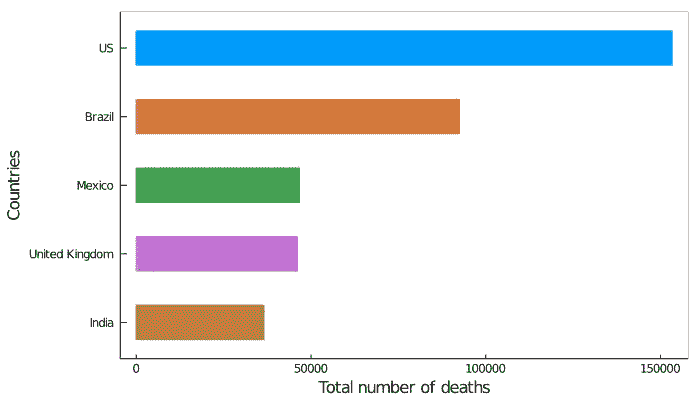

截至 2020 年 7 月 31 日死亡人数最多的前 5 个国家

## 结论:Julia——解决数据科学问题的通用工具

通过这篇文章，我试图展示一个初学者使用 Julia 解决数据科学中一些基本问题的经验。完整代码可以在这里找到[。我意识到我可能错过了一些细节，这是意料之中的，因为这绝不是一个权威的指南。其他资源也存在于网络上，尽管这样的指南可能很难找到。我对 Julia 的世界还很陌生，很乐意收到一些反馈，甚至是改进代码的建议。我将继续探索高级的 Julia 库，并使用它们来创建使用大型复杂数据集的更有洞察力的可视化。请继续关注更多这样的指南。感谢你花时间阅读这篇文章！请随时在](https://gist.github.com/vnegi10/962855cace3f4dbd86b30d7408068591) [LinkedIn](https://www.linkedin.com/in/negivikas/) 上与我联系。

## 参考资料:

1.  链接完成茱莉亚代码[要旨](https://gist.github.com/vnegi10/962855cace3f4dbd86b30d7408068591)
2.  [https://syl 1 . git book . io/Julia-language-a-concise-tutorial/language-core/getting-started](https://syl1.gitbook.io/julia-language-a-concise-tutorial/language-core/getting-started)
3.  [https://julialang.org/](https://julialang.org/)
4.  另一个使用 Python 的优秀数据可视化教程

 [## 使用 Python 实现新冠肺炎数据可视化

### 什么是数据可视化？

towardsdatascience.com](/covid-19-data-visualization-using-python-3c8bcfaeff5f)