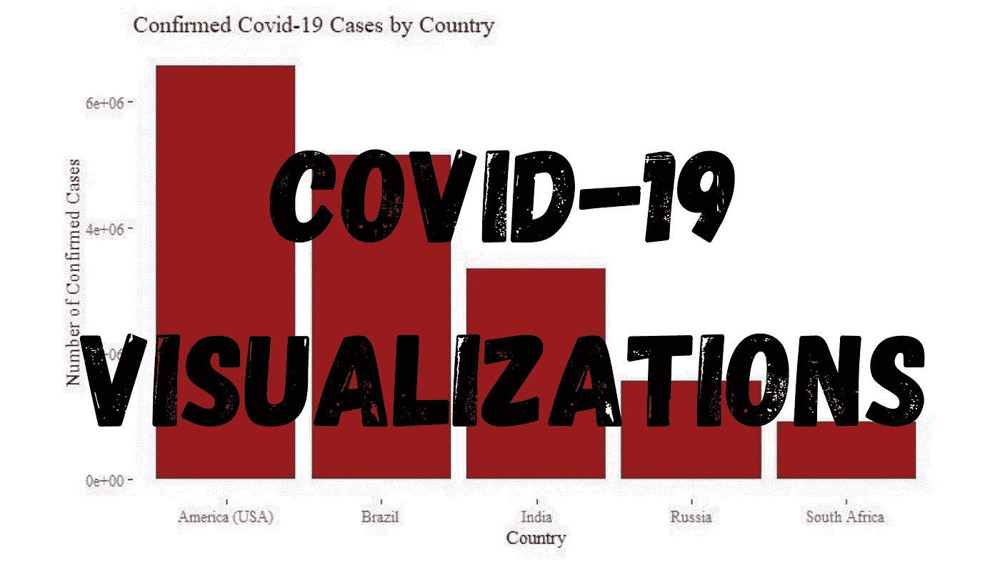
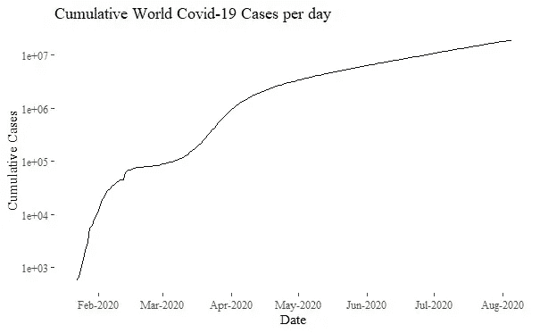
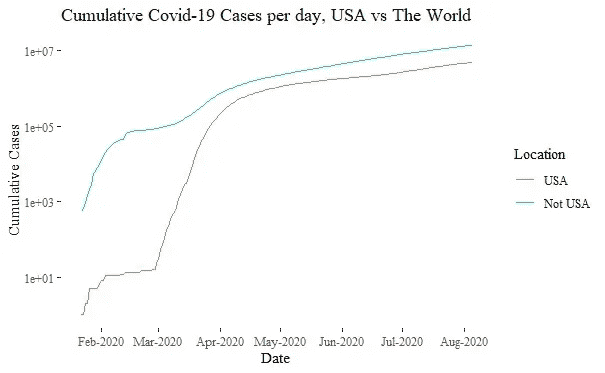
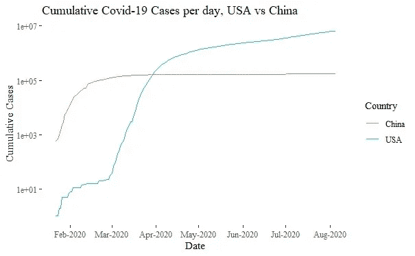
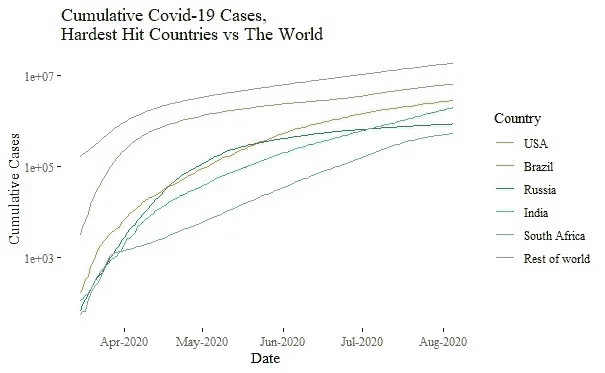
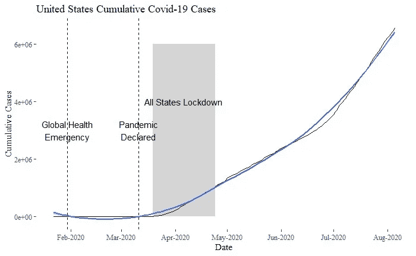

# 想象 2020 年 8 月的新冠肺炎

> 原文：<https://towardsdatascience.com/visualizing-covid-19-in-august-2020-9e08cc1e489d?source=collection_archive---------47----------------------->

## 通过一个案例研究来展示新冠肺炎的发展



图片作者:特里斯特·约瑟夫

自 2019 年 12 月底在中国首次记录以来，新冠肺炎已传播到世界各地，并被世界卫生组织宣布为疫情。正因为如此，数十亿人被封锁，卫生服务部门疲于应付。现在，在 2020 年 8 月，学生是否应该亲自回到学校度过新学期，餐馆等企业是否可以恢复正常运营，以及各国是否应该加强之前的封锁措施，这些都有很多问题。

这些决策中的许多需要由数据保健专业人员来指导，而不应该在没有数据的真空中做出。数据分析过程有许多方面，数据可视化是一个非常重要的方面。数据可视化是获取信息并将其转换为可视化上下文(如图表)的过程。大多数人倾向于同意，看一个图表并理解潜在的信息比通读一个数字表要容易得多，特别是对于大型数据集。因此，为了了解新冠肺炎病例在各个国家的分布情况以及新冠肺炎是如何在这些国家传播的，我将进行一次数据可视化练习。


图片作者:特里斯特·约瑟夫

所有分析都将在 R 中使用 tidyverse 进行，数据可以从一个公开可用的数据库中检索(参考资料部分中的*链接)。*

```
library(tidyverse)
library(ggthemes) # contains the theme used for the graphs
```

第一步是将数据加载到我的环境中，并确保它的结构适合可视化分析。

```
covid_df <- read_csv('file_path'+'file_name')
glimpse(covid_df)
```

该数据集包含日期、国家、省份、经度、纬度、给定日期的病例数以及这些病例是确诊阳性病例、痊愈还是死亡等变量。对于这一分析，我感兴趣的是确诊阳性病例的日期、国家和数量。因此，我将选择这些列，并创建一个仅包含感兴趣的变量的新数据框。

但是，在检查来自`glimpse(covid_df)`的输出时，发现日期变量被解析为字符类型而不是日期类型，并且 case 类型也被解析为字符，而它应该是因子。因此，我将把变量转换成适当的数据类型，然后创建新的数据框。

```
covid_df$date <- parse_date(covid_df$date, format="%m/%d/%Y")
covid_df$type <- parse_factor(covid_df$type)confirmed_cases <- covid_df%>%
  filter(type=="confirmed")%>%
  select(c("date", "country", "cases"))
```

现在我有了感兴趣的数据，这将对了解新冠肺炎的全球增长很有价值。由于数据框包含许多国家/地区，并且多个国家/地区在同一天出现确诊阳性病例是合理的，因此需要按日期对数据进行分组，然后进行汇总，以找到每天的病例总数。此外，为了了解增长情况，还应该计算一段时间内案例的累计总数。

```
confirmed_cases_total <- confirmed_cases%>%
  group_by(date)%>%
  summarise(Total_cases= sum(cases))%>% #aggregates by day
  mutate(Cumulative_cases = cumsum(Total_cases)) #calc cumulativeggplot(confirmed_cases_total, aes(x=date, y=Cumulative_cases))+
  geom_line()+
  scale_y_log10()+
  scale_x_date(date_breaks = "months", date_labels = "%b-%Y")+
  ylab("Cumulative Cases")+
  xlab("Date")+
  ggtitle("Cumulative World Covid-19 Cases per day")+
  theme_tufte()
```



图片作者:特里斯特·约瑟夫

该图显示，全球新冠肺炎病例在 1 月至 2 月间迅速增加，在 3 月初放缓，然后在 3 月中旬后再次迅速增加。还可以看出，目前的新增病例率低于 3 月中旬至 4 月的比率，但世界范围内的病例仍在增加。

尽管在疫情爆发的早期，病例主要集中在中国，但美国很快成为关注的地区。因此，我接下来将绘制美国与世界其他地区的对比图，以收集关于 3 月份及以后案件上升的见解。

```
------------------ # Data 
UnitedStates_confirmed_cases <- confirmed_cases%>%
  filter(country=="US")%>%
  group_by(date)%>%
  summarise(Total_cases = sum(cases))%>%
  mutate(Cumulative_cases = cumsum(Total_cases))UnitedStates_confirmed_cases$Location <- as.factor(rep("USA", nrow(UnitedStates_confirmed_cases))) #creating memebership variableNotUnitedStates_confirmed_cases <- confirmed_cases%>%
  filter(country!="US")%>%
  group_by(date)%>%
  summarise(Total_cases = sum(cases))%>%
  mutate(Cumulative_cases = cumsum(Total_cases))NotUnitedStates_confirmed_cases$Location <- as.factor(rep("USA", nrow(NotUnitedStates_confirmed_cases)) #memebership variableusa_vs_world <- rbind(UnitedStates_confirmed_cases, NotUnitedStates_confirmed_cases) #combining the two df's------------------ # Graph
ggplot(usa_vs_world, aes(x=date, y=Cumulative_cases, color=Location))+
  geom_line()+
  scale_y_log10()+
  scale_x_date(date_breaks = "months", date_labels = "%b-%Y")+
  xlab("Date")+ 
  ylab("Cumulative Cases")+ 
  ggtitle("Cumulative Covid-19 Cases per day, USA vs The World")+
  theme_tufte()
```



图片作者:特里斯特·约瑟夫

这两条曲线具有相似的形状；它表明，美国国内确诊病例的数量在 3 月份期间迅速增加，并且这种迅速增加一直持续到 4 月份。尽管这确实为第一个图中出现的病例激增提供了洞察力，但也可以看出，世界其他地区在 3 月期间和之后仍出现了确诊病例数量的快速增加。

正因为如此，我将比较美国和中国，以确定这两个国家的疫情之间的异同。

```
------------------ # Data
UnitedStates_confirmed_cases$Country <- UnitedStates_confirmed_cases$LocationUnitedStates_confirmed_cases$Location <- NULLChina_confirmed_cases <- confirmed_cases%>%
  filter(country == "China")%>%
  group_by(date)%>%
  summarise(Total_cases= sum(cases))%>%
  mutate(Cumulative_cases = cumsum(Total_cases))China_confirmed_cases$Country <- as.factor(rep("China", nrow(confirmed_cases_China)))USAvsChina <- rbind(China_confirmed_cases, UnitedStates_confirmed_cases)------------------ # Graph
ggplot(USAvsChina, aes(x=date, y=Cumulative_cases, color=Country))+
  geom_line()+
  scale_y_log10()+
  scale_x_date(date_breaks = "months", date_labels = "%b-%Y")+
  xlab("Date")+ 
  ylab("Cumulative Cases")+
  ggtitle("Cumulative Covid-19 Cases per day, USA vs China")+
  theme_tufte()
```



图片作者:特里斯特·约瑟夫

图表显示，随着美国确诊病例的持续增长，中国相对趋于平稳。因此，中国的情况无法解释前面图表中看到的跳跃。

那么是哪些国家导致了新冠肺炎病例的持续增长呢？理想的做法是确定哪些国家在确诊阳性病例总数方面名列前茅。

```
Hardest_hit_Countries <- confirmed_cases%>%
  group_by(country)%>%
  summarise(Total_cases = sum(cases))%>%
  arrange(desc(Total_cases))%>%
  top_n(5)
```

`Hardest_hit_Countries`的输出显示了确认阳性病例总数排名前 5 位的国家的表格。从该表可以看出，美国是这方面最多的国家，共有 4，823，890 起案件。美国之后是巴西，为 2859073 例；印度，1964536 例；俄罗斯 864948 例；南非有 529，877 个病例。

为了了解这些国家在一段时间内对全球新冠肺炎病例增长的相对贡献，可以绘制一个图表，比较这些国家与世界其他国家的增长情况。如果这些国家是前面图表中出现的凸起的原因，那么与前面图表中的同一条线相比，代表世界其他地区的线将会平坦得多。



图片作者:特里斯特·约瑟夫

图表显示，受打击最严重的国家在 3 月期间和之后的病例上升中占了相当大的一部分，其中美国占了 3 月份病例的大部分。然而，在三月份，世界其他地方仍然存在着明显的颠簸。一个原因是，受打击最严重的过滤器决定了哪些国家目前新冠肺炎病例最多，而这些国家可能不是 3 月份的同一批国家。

为了确定在此期间哪些国家是受打击最严重的，我将更新受打击最严重的过滤器，并确定哪些国家现在名列前茅。

```
Hardest_hit_Countries_before_may <- confirmed_cases%>%
  filter(date <= "2020-04-01")%>%
  group_by(country)%>%
  summarise(Total_cases = sum(cases))%>%
  arrange(desc(Total_cases))%>%
  top_n(5)
```

这个数据框的输出现在显示，美国仍然是排名第一的国家，有 214，205 例。然而，美国现在以 110，574 例紧随其后的是意大利；西班牙 104118 例；中国 82361 例；德国有 77872 例。

这些数字还表明，在 4 月 1 日至 8 月 5 日期间，美国确诊阳性病例的数量增加了 2000%以上。疯狂。

那么，现在知道了美国确诊的阳性病例大幅增加，那么美国占全球病例的比例是多少呢？事实上，了解每个国家在确诊病例中所占的比例将是令人感兴趣的。

```
share_of_cases <- confirmed_cases%>%
  group_by(country)%>%
  summarise(Total_cases = sum(cases))%>%
  mutate(p_of_total_cases = (Total_cases/sum(Total_cases))*100)%>%
  arrange(desc(p_of_total_cases))%>%
  mutate(cumulative_p_of_total_cases = cumsum(p_of_total_cases))
```

`share_of_cases`的输出显示，3 个国家的病例目前约占全球确诊阳性新冠肺炎病例的 50%,其中美国的病例约占 26%;巴西的病例占~ 15%；印度的病例约占 10%。这尤其令人担忧，因为该数据集包含 188 个国家。因此，这意味着该数据集内不到 2%的国家占全世界病例的 50%。

结果还显示，14 个国家的病例目前占全球确诊阳性新冠肺炎病例的 75%。现在，这一指标仍然表明病例集中在少数几个国家，但这比占全球病例约 50%的 3 个国家的病例要好。

我要做的最后一件事是创建一个图表来显示美国境内确诊阳性病例的增长情况，同时标注关键事件，例如何时宣布疫情以及何时所有州都处于封锁措施之下。

```
------------------ # Data
usa_events <- tribble(
  ~date, ~event, 
  "2020-01-30", "Global Health\nEmergency", 
  "2020-03-11", "Pandemic\nDeclared",
)%>%
  mutate(date = as.Date(date))------------------ # Graph
ggplot(confirmed_cases_USA) +
  geom_line(mapping=aes(x=date, y=Cumulative_cases)) +
  geom_smooth(mapping=aes(x=date, y=Cumulative_cases), method="loess")+
  geom_vline(aes(xintercept = date), data=usa_events, linetype="dashed")+
  geom_text(aes(x=date, label=event), data=usa_events, y=3000000)+
  annotate("rect", xmin =as.Date("2020-03-19", "%Y-%m-%d"), xmax=as.Date("2020-04-24", "%Y-%m-%d"), ymin=0, ymax=6000000, alpha=0.25)+
  annotate("text", x=as.Date("2020-04-06", "%Y-%m-%d"), y=4000000, label="All States Lockdown")+
  theme_tufte()+
  scale_x_date(date_breaks="months", date_labels="%b-%Y")+
  xlab("Date")+
  ylab("Cumulative Cases")+
  ggtitle("United States Cumulative COVID-19 Cases")
```



图片作者:特里斯特·约瑟夫

该图显示，尽管此前采取了封锁措施，美国确诊的新冠肺炎阳性病例数量仍在以二倍的速度增长。由于一些州反对继续(或重新实施)封锁措施，这一点更令人担忧。

由于它涉及前面提到的关于学生、餐馆和类似企业以及其他国家的问题，决策者应继续监测其管辖范围内的案件，并根据其情况做出最佳决定。冠状病毒肯定没有消失，任何关于健康和安全的决策都需要高度的数据驱动。

**参考文献:**

数据仓库:[github.com/RamiKrispin/coronaviru](https://github.com/RamiKrispin/coronavirus)s

代号:[github.com/trisxcj1/visualizing-covid19](https://github.com/trisxcj1/visualizing-covid19)

[tidyverse.org/](https://www.tidyverse.org/)

**其他有用的素材:**

【tidyverse.org/learn/ 

[r-bloggers.com/why-learn-the-tidyverse/](https://www.r-bloggers.com/why-learn-the-tidyverse/)

[linkedin.com/learning/learning-the-r-tidyverse](https://www.linkedin.com/learning/learning-the-r-tidyverse)

[dplyr.tidyverse.org/](https://dplyr.tidyverse.org/)

[linkedin.com/in/rick-scavetta/](https://www.linkedin.com/in/rick-scavetta/)