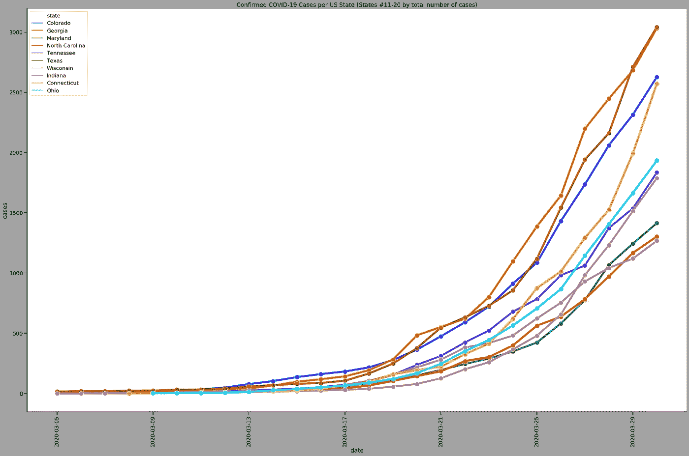
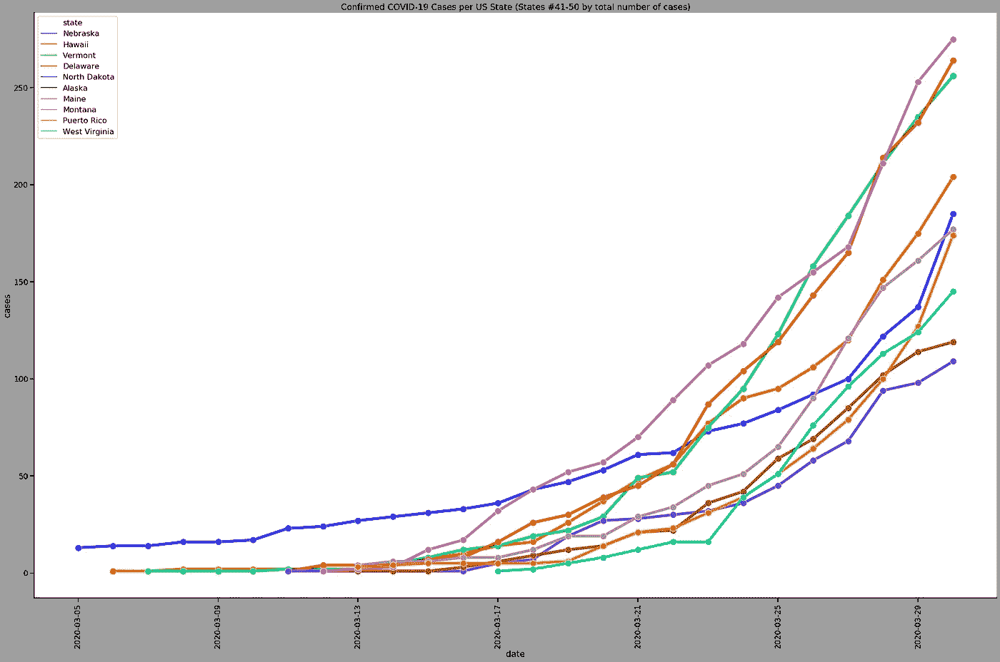
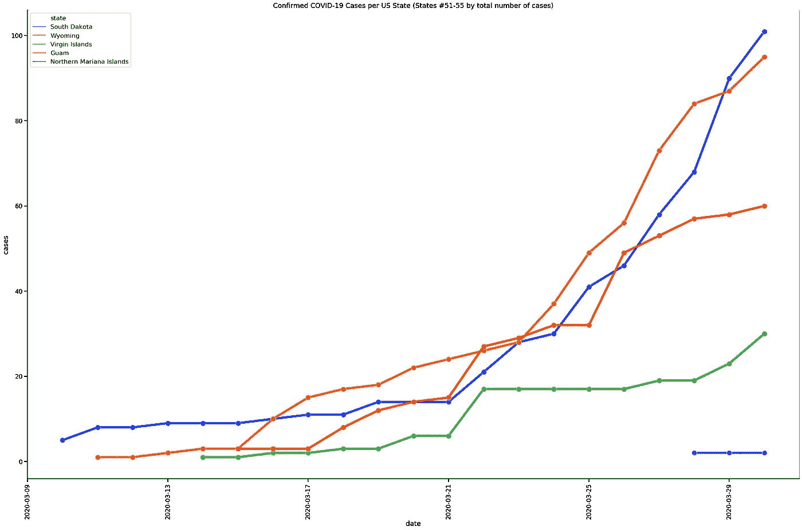

# 新冠肺炎:隔离措施在加州奏效了。我们需要全国范围内更多的承诺。

> 原文：<https://towardsdatascience.com/visualizing-covid-19-isolation-measures-are-working-we-need-more-ca1012ff269e?source=collection_archive---------42----------------------->

随着美国最近声称全球大多数冠状病毒病例的不良区分(根据官方统计)，纽约时报提供了一个全国所有确诊新冠肺炎病例的数据集，在州和县一级进行跟踪，并每天更新。

虽然承认数据永远不会完美，但真实的案例数量可能要大得多，并且测试频率和有效性因地区而异，以下是我迄今为止的发现。

为了保持简短和可操作性，我将只限制两个要点，概述如下 ***(请注意，我不是流行病学家、医生或医疗保健专业人士):***

*   几个星期以来，安东尼·福奇博士等专家一直鼓励我们保持社交距离，与他人隔离，以使曲线变平，减缓新冠肺炎病毒的传播，让压力过大的医疗系统有机会迎头赶上。最近来自加利福尼亚的报道表达了谨慎的乐观，认为这些努力在减缓病毒传播方面是有效的。下面分享的我的数据分析，支持了这个观点。
*   因为目前没有有效的治疗方法或疫苗，更不用说新冠肺炎病毒会在它存在的任何地方呈指数级传播。这个国家的不同地区只是位于指数曲线的前部或后部。与其坐等疫情在适当的时候爆发，让医疗系统不堪重负，病例数量较少的州和管辖区应该抓住机会，在局势更加可控的时候实施隔离:

继续分析…

# 由于早期采取了积极的隔离措施，加州似乎正在减缓新冠肺炎的传播。

下图显示了在撰写本文时美国十个州每 100，000 人的新冠肺炎病例数。

除了纽约和新泽西非常需要我们的帮助这一事实之外，这张图表中更微妙的观察和一线希望是，与其他州相比，加州的病例增长相对缓慢，尽管加州是早期震中的所在地。该州采取了果断的行动，在纽约事件发生前 5-7 天下令“避难所就位”,这似乎产生了巨大的影响，尽管显然不是唯一的影响因素。

鉴于新加坡和台湾等国家使用积极的检测和隔离措施成功控制了病毒的传播，有理由认为，及早采取积极的隔离措施有助于加州控制传播，并将有助于全国其他州。

虽然对许多人来说，积极的隔离措施显然是有效的，但一些国家仍然没有执行任何就地安置/留在家中的命令，或任何其他形式的强力隔离。

实施这些隔离措施可能是我们在世界上抗击病毒传播的最佳机会，因为美国目前是世界上确诊病例最多的国家。

# 案例数较少的州应实施隔离。新冠肺炎到处呈指数传播。

第二个要点:所有州似乎都遵循类似的指数增长模式，正如你将在下面看到的那样——即使是那些病例数量较少的州。

鉴于他们中的许多人似乎处于曲线的早期，当务之急是在他们的情况可能更加可控的时候，抓住机会采取行动和实施隔离措施。

下图显示了“前 10 名”之外的各州案件总数的增长情况。你会注意到所有的曲线都有相似的形状。为了便于查看，我将每个图表限制在不超过 10 个状态。

社交距离和隔离可能是我们目前在全球抗击新型冠状病毒的最佳工具，根据数据，当正确实施时，它们正在发挥作用。

我希望那些处于领导地位的人将迅速采取必要的行动，我们每个人都将认真对待这一问题，尽我们的努力，尽我们最大的能力留在家里。

当然，所有这些隔离并不是没有代价的。我们还需要社会解决方案、政府干预、新的创新和大量的同理心来相互帮助，度过这个在精神上、精神上和经济上极具挑战性和毁灭性的经历，特别是对我们人口和经济中最脆弱的部分。

怀着谨慎的乐观，我相信我们有能力应付这一局面，但我不想在这里探讨这些问题。在我的公寓里，我将和我的家人呆在一起，祝愿我们一切都好。

*想进一步了解我分析背后的细节，或者想看背后的 Python 代码，可以* [*访问我的 Github 这里*](https://github.com/muoyo/covid-19-data/blob/master/analysis.ipynb) *。*

*请理解这是一项正在进行的工作，不要指望我清理任何东西*😆

***编者按:*** [*走向数据科学*](http://towardsdatascience.com/) *是一份以数据科学和机器学习研究为主的中型刊物。我们不是健康专家或流行病学家，本文的观点不应被解释为专业建议。想了解更多关于疫情冠状病毒的信息，可以点击* [*这里*](https://www.who.int/emergencies/diseases/novel-coronavirus-2019/situation-reports) *。*