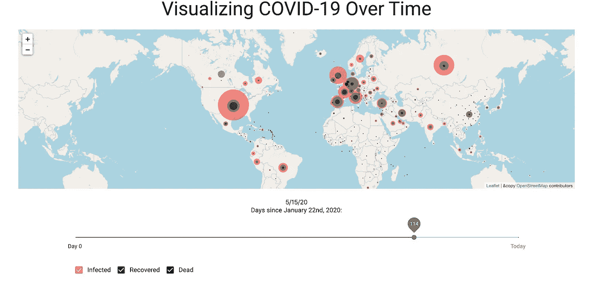
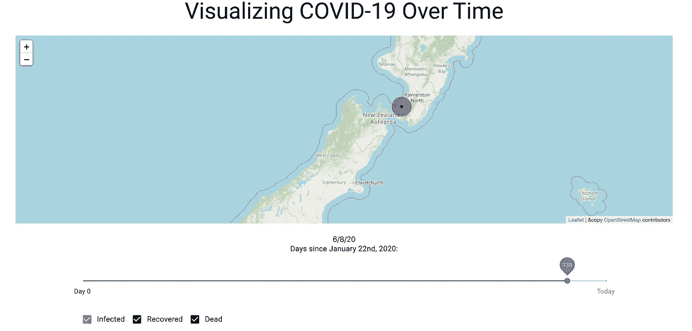

# 使用 React 可视化新冠肺炎随时间的变化

> 原文：<https://towardsdatascience.com/visualizing-covid-19-over-time-using-react-92ccf9a3354e?source=collection_archive---------45----------------------->

## 如何创建同时显示地理和时态数据的工具。

 [## 新冠肺炎（新型冠状病毒肺炎）

### 可视化电晕超时

neerajcshah.github.io](https://neerajcshah.github.io/corona/) 

当我在二月份第一次看到 Johns Hopkins 拼凑了一个新冠肺炎可视化工具时，我也想看看我能做些什么。我意识到，我不可能制作出比现有的在线地图好得多的实时地图，但我开始回答一个不同的问题:我们能看到日冕在地理和时间上是如何传播的吗？



追踪新冠肺炎的基于时间的地图的屏幕截图

从那以后，我制作了一个 React 可视化程序来监控电晕的传播，我想我会分享它，以防它能让其他人受益。它从约翰霍普金斯大学 CSSE 分校提取数据，并允许用户查看从 1 月 22 日起任何日期的病毒状态(这是 JHU 有数据的第一天)。您可以拖动地图下的滑块来查看案例如何随着时间的推移而改变世界。

可视化是基本的，但它帮助我更好地理解一些由研究人员表达的东西。

首先，它告诉我，美国现在是危机的中心，但以前，中国和意大利拥有这个头衔。

它还帮助我理解，在像中国这样的国家，测试或报告方面的差距肯定存在，那里的数据已经几个月没有变化了。

最后，如果我们在 2020 年 6 月 8 日检查新西兰的所有方框，我们可以看到“感染”圈与“恢复”圈几乎完美重叠。也是在这一天，新西兰宣布在其境内消灭了该病毒。



新西兰宣布零病例的那一天

用 python 开发这种交互式的东西可能会很有挑战性，也不那么完美。相反，React 是自然的选择，因为它被设计成通过简单、响应迅速的 UI 组件来呈现变化的数据。在本文的其余部分，我将介绍使用 React 开发这个项目的关键部分。

## 1-获取数据

任何可视化的一个挑剔的部分可能是处理输入数据，在这种情况下尤其如此，因为数据由另一方(Johns Hopkins)拥有和更新。这意味着当他们改变他们的组织风格时，我也必须适应。我选择依赖他们的数据库，因为这意味着我不必担心自己存储和维护实时数据。

他们目前每天在世界协调时 23:59 分左右上传一次时间序列数据到 Github。csv 文件。我希望我的应用程序在启动时提取数据，这样我们就可以始终显示世界的当前状态。

每当您从托管文件中提取内容时，获取原始内容是一种很好的做法。我们可以在 Github 上通过点击任何文件右上角的“Raw”按钮来实现。


始终提取“原始”内容，以便于后期处理

我使用了一个名为“ [Axios](https://github.com/axios/axios) ”的基于 promise 的 HTTP 客户端，用这个原始内容的 URL 执行“get”请求。这个异步操作的结果可以用“then”关键字来处理，它接受一个成功完成的承诺，并对其执行一个函数。

```
static pullAndParseUrl(url) {
    return axios.get(url).then(response => 
                               Papa.parse(response.data,
                                         { header: true }));
}
```

如上所示，“then”函数获取“axios.get”的结果，并用浏览器内的 csv 解析器“ [Papa Parse](https://www.papaparse.com/) ”解析内容。

Johns Hopkins 将数据存储在 csv 中，其中行映射到国家，列映射到日期。因为第一行包含列名，所以我们在调用“Papa.parse”时指定“header : true”。Papa.parse 生成一个与国家对应的字典列表。每个字典都允许我们按日期索引感染人口规模，这对于稍后的 slider 集成非常重要。这整个行动的结果是一个承诺，一旦它完成，我们将有我们想要的形式的数据！

## 2-传单地图

为了制作地图，我们将使用[传单](https://leafletjs.com/)，这是我选择的一个 JavaScript 交互式映射库，因为它有很好的文档，并且不需要任何 API 键或令牌。还有一个 react 库叫做 [react-leaflet](https://react-leaflet.js.org/) ，它是带有 React 组件的 leaflet 库的抽象。

我们将从导入“Map”和“TileLayer”组件来显示一个简单的地图开始。

```
import { Map, TileLayer } from 'react-leaflet';
```

作为反应的快速复习，组件接受参数，这些参数被称为“道具”。每当组件的属性改变时，组件就更新它的显示。组件之间的嵌套允许数据流经应用程序的各个部分。

我们现在将创建一个新的传单类，它扩展了“React。组件”。注意，构造函数只接受一个参数——“props”——它包含所有传入的参数。作为参考，要访问传递给组件的特定参数，我们可以编写“this.props.parameterName”。

```
export default class Leaflet extends React.Component {
  constructor(props) {
    super(props);
  }
  render() {
     //TODO: Return map you wish to display.
  }
}
```

传单地图可以用很少的代码显示在屏幕上。我们只需用纬度/经度和缩放级别实例化地图组件。我们还应该添加 TileLayer，为开放街道地图团队增光添彩。

我们将用我们希望类返回的内容填充 render 方法。每当传递给类的参数发生变化时，就会调用 render 方法。

```
render() {
  const position = [35, -40];
  const zoom = 2;
  return (
    <Map center={position} zoom={zoom}>
      <TileLayer
        url={"[https://{s}.tile.openstreetmap.org/{z}/{x}/{y}.png](https://{s}.tile.openstreetmap.org/{z}/{x}/{y}.png)"}
        attribution={contributors}
      />
    </Map>
}
```

我们有地图！

## 3-表示数据

我们将使用 react-leaflet 中的圆形组件在地图上描绘人口。圆是一种有点粗糙的地理数据可视化方式，因为它们可能无法很好地反映地理事实。例如，我们知道美国的大多数病例都发生在沿海地区，但如果我们只能画一个圈来代表美国的新冠肺炎病例，我们会将它放在国家的中心。解决方案应该是拥有更细粒度的数据，并利用这些数据构建详细的热图，但不幸的是，我们受到数据稀疏性的限制。

```
import { Circle } from 'react-leaflet';
```

地图上圆圈的大小代表了感染、康复或死亡人口的数量。我们可以通过指定半径来控制圆组件的大小。因为增加半径会导致圆的面积以平方的方式增加，所以我们需要小心不要将人口直接映射到半径上。相反，我们通过取每个群体的平方根并乘以某个常数来计算半径。

我们将在传单组件中添加一个名为“MyCircles”的组件，它将处理圆圈的创建。它将接收数据(在第 1 节中构造)、选定的日期和所需的圆圈颜色——所有这些都传递给了传单。

```
// Within the Map tags in Leaflet.
<MyCircles data={this.props.data} 
           date={this.props.date} 
           color="red"/>
```

下面实现了一个简化的 MyCircles 类。

```
const MyCircles = (props) => {
  return (
    props.data.map((row, i) => {
      if (row["Lat"] != null && row["Long"] != null) {
        return (
          <Circle
            key={i}
            center={[row["Lat"], row["Long"]]}
            radius={1000 * Math.sqrt(row[props.date])}
            fillColor={props.color}
          />)
        }
      }
    )
  );
}
```

回想一下，props.data 由一个列表组成，其中的每一项都是一个字典，按日期表示一个国家的病例数。MyCircles 遍历 props.data 中的每个国家/地区，并读取该国家/地区在 props.date 的事例数。如果事例数不为零，它将返回一个在给定纬度/经度处具有计算半径的圆组件。

## 4 —滑块

React 的一个核心概念是将 UI 分割成几部分。正如我们为地图构建了一个名为“传单”的组件一样，我们也将为滑块构建一个组件。我们通过使用“material-ui”中内置的“Slider”组件来实现它。我在下面包含了一个对 slider 组件的简化调用:

```
<Slider
  defaultValue={0}
  onChange={this.handleChange}
  marks={marks}
  max={difference_in_days}
/>
```

如您所见，它有不同的参数，如“默认值”、“标记”和“最大值”。我们将第 0 天(2020 年 1 月 22 日)指定为默认值。“标记”是指滑块上带标签的“记号”,在这种情况下，我们只标记开头和结尾。“max”设置的“difference_in_days”变量指的是第 0 天和今天之间的天数(这是动态计算的，并保持可视化为最新)。最后，“onChange”被分配给一个名为“this.handleChange”的函数，如下所示。每当滑块移动时，React 都会调用它。

```
handleChange(event, newValue) {
    var result = new Date("01/22/2020");
    result.setDate(result.getDate() + newValue);
    this.props.handleDateChange(formatDate(result));
}
```

这个函数基于从滑块传入的值更新日期，并调用“this.props.handleDateChange”，我们将在下一节讨论它。

## 5 —管理状态

到目前为止，我们已经看了道具。Props 是不可变的，用于从高层组件向下传递数据。为了利用 React 的响应能力，我们还将查看状态。状态是可变的，不应由子组件直接访问。

状态帮助我们将组件之间的交互联系在一起。如前所述，我们将看看滑块的 onChange 方法如何修改地图。

下面，我在 React 项目中加入了顶级“App”组件的简化版本。如图所示，它在“state”中有一个名为“date”的条目。

```
class App extends React.Component {
  constructor(props) {
    super(props)
    this.state = {
      date: "1/22/20",
    };
    this.handleDateChange = this.handleDateChange.bind(this);
  }
}
```

您还会注意到，构造函数提到了“handleDateChange”方法，在上一节中，我们将该方法传递给了 slider 组件。“bind”函数将方法的“this”关键字设置为总是引用“App”，即使我们将方法传递给不同的类。

“handleDateChange”方法的简短实现如下所示。

```
handleDateChange(selectedDate) {
    this.setState({ "date": selectedDate });
};
```

它调用名为“setState()”的 React 生命周期方法来设置新的日期。“setState”函数更新组件的状态，并告诉该组件及其所有子组件再次呈现它们自己。

我们将这个方法传递给 slider，这样它的“onChange”方法就可以改变父组件的状态。

```
<DateSlider
  handleDateChange={this.handleDateChange}
/>
```

现在，每当我们拖动滑块时，父“App”组件将更新其状态的日期。

由于我们将“this.state.date”作为道具传递给了 Leaflet 类，因此每当日期发生变化时，地图都会动态更新，从而满足我们在地理和时间上显示日冕分布的愿望。

```
<Leaflet
  date={this.state.date}
/>
```

这种结构有助于应用程序具有流动性，也用于帮助复选框修改地图。它允许您编写少量代码来促进引人注目的 UI 交互。

## 结论

通过将这些案例可视化，我已经能够观察到一些趋势，否则我会发现很难理解这些趋势。这个工具帮助我确认我正在阅读的报告，但它偶尔也会让我有新的惊喜，因为它可以一次显示大量的全球数据。我所介绍的框架可以用于任何项目，在这些项目中，您希望在不同的时间灵活地查看某些内容。我建议将它应用到您感兴趣的另一个数据集并共享结果！

如需进一步参考，可在此处找到代码[。](https://github.com/neerajcshah/corona)

[1] ReactJs， [React 顶级 API](https://reactjs.org/docs/react-api.html) (2020)。Reactjs.org