# 可视化新冠肺炎传播与 Tableau 动画

> 原文：<https://towardsdatascience.com/visualizing-covid-19-spread-with-tableau-animations-75890dda23bb?source=collection_archive---------41----------------------->

## 动画地图，赛车条形图，和 Python 合并，天啊！

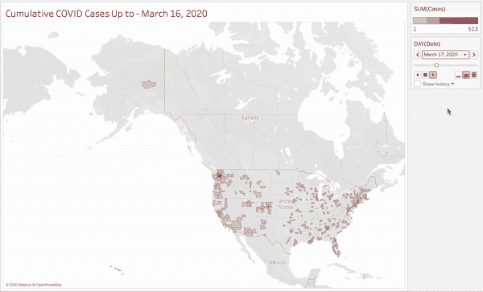

绘制从美国首次爆发到 2020 年 7 月 1 日的新冠肺炎病例传播图。作者 GIF。

这个项目产生于一种兴趣，即想象新冠肺炎的热点是如何随着疫情的发展而变化的。自从看了[这个视频](https://www.youtube.com/watch?v=8WVoJ6JNLO8)之后，我就对视频中显示的“赛车条形图”这样的基于时间的动画产生了兴趣，还有动画地图。

由于 COVID 的爆发与地理高度相关，我将创建一些动画地图和赛车条形图，看看我们可以了解到什么。在此过程中，您将了解如何将数据集与 Python 相结合，以及如何使用 Tableau Public 创建基于时间的动画。如果你只是想跳到已完成的项目，[在这里查看](https://public.tableau.com/profile/christopher.woodard4874#!/vizhome/COVIDbyCountyAMosaic/COVIDbyCountyAMosaic)。

**🚨强制性公共卫生咨询🚨远离拥挤的海滩，去和后院的游泳池做朋友吧😉(当然，只要他们的测试结果是阴性的……而且他们没有邀请其他朋友……你知道吗，只要洗个放松的澡就可以了)**

我将在这里使用两个数据集:

1.  来自《纽约时报》的数据显示了美国各县的新冠肺炎病例。它每天都在更新，但我下载的数据只到 2020 年 7 月 1 日。 ***注:*** *COVID 病例在此列为截至给定日期的累计总数，包括无症状病例、有症状病例和已痊愈病例。换句话说，病例数可能高估了在给定时间点实际患有 COVID 的人数，所以请记住这一点。*
2.  人口普查局的美国各县[人口数据表。](https://www.census.gov/data/tables/time-series/demo/popest/2010s-counties-total.html#par_textimage)

# 数据清理和混合(也是每个数据科学家最喜欢的部分，❤️)

我不仅希望看到哪些县的病例最多，而且希望看到哪些县的感染率最高。虽然像佛罗里达、加利福尼亚和纽约这样的地方有大量的病例(主要是因为人口较多)，但是它们就一定有最高的感染率吗？

NYT 数据集不包括县人口信息，所以我将使用 Python 和`pd.merge()`将两个数据集合并为一个。如果您对 Python 不感兴趣，也可以通过在 Excel 中使用 SQL JOIN 或 VLOOKUP 来完成。在此之前，我们首先需要清理数据，使其成为最适合合并的格式。

*我不会用清理数据的所有细节来烦你——如果你想看到我的数据清理的全部，请查看 Github repo* [*这里*](https://github.com/ChrisWoodard43/COVID-Animations/blob/master/COVID-19%20by%20U.S.%20County.ipynb) *。然而，我确实遇到了一些意想不到的障碍。*

路易斯安那州有教区而不是县，阿拉斯加州的县名与“斯卡圭市”、“诺姆人口普查区”和“德纳里自治市”完全不一致。这使得隔离这些地区的名称以便 Tableau 可以正确地识别它们来构建地图成为一项***~有趣~*** *(阅读:两个痛苦的小时)的任务。*

```
import numpy as np
import pandas as pdcovid = pd.read_csv('covid-us-counties.csv')
cpop = pd.read_excel('co-est2019-annres.xlsx',skiprows=2)df = pd.merge(covid,cpop,left_on=['county','state'],right_on=['County','State'],how='inner')
dfm = df[['date','County','State','cases','deaths','Population Estimate 2019']]dfm.to_excel('covid-us-county-population.xlsx')
```

注意，我已经执行了一个**内部合并**，这意味着两个数据集将只在 county 和州的值匹配的行上连接，所有不匹配的行将被丢弃。现在我们的数据看起来像这样，只有我们需要的行:

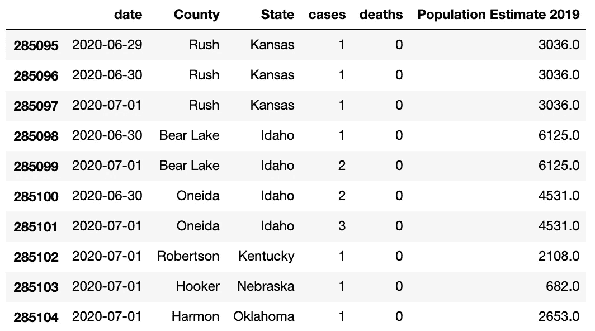

按县数据集合并新冠肺炎病例。图片作者。

# Tableau 动画

Tableau 是最强大的数据可视化平台之一，他们的免费版本 [Tableau Public](https://public.tableau.com/s/) 拥有我们完成这一分析所需的所有功能。Tableau 的团队和保罗·艾萨克斯在解释如何实际制作[动画](https://www.tableau.com/about/blog/2020/2/bring-your-data-life-viz-animations)和[赛车条形图](https://www.youtube.com/watch?v=bD3clS575wg&feature=emb_logo)方面做得比我好得多，所以我会让他们告诉我如何做，并更多地关注我们可以从数据中提取哪些见解。

让我们从用动画地图可视化各县的新冠肺炎案例开始，如下图所示。

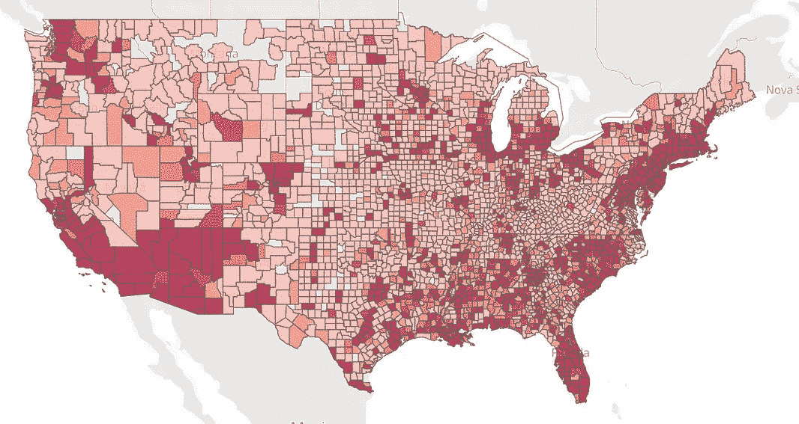

一段时间内各县的累计 COVID 病例(左)，以及 2020 年 7 月 1 日的最终分布(右)。作者图片。

当我第一次创建地图时，颜色之间的对比度太小，地理上的小县如纽约县(基本上只是曼哈顿)和少数其他暗红色。为了使地图阅读起来更有趣，并显示更大的颜色梯度，我设置了最大值(在加利福尼亚和新英格兰的暗红色)，这样 20%的县将被暗红色覆盖。(病例数的第 80 百分位恰好是 513 例。)

关于这张地图的一些观察立刻引起了我的注意:

*   无论是由于缺乏足够的检测资源，缺乏报告病例，还是真正没有冠状病毒，**相当多的县*似乎*没有冠状病毒**病例。加利福尼亚州、内华达州和华盛顿州的这些县可能是灰色的，因为周围的县往往有大量病例，因此缺乏报告。
*   另一方面，**整个中西部的灰色县可能*真正*没有报告病例**，因为周围的县都是浅红色阴影，表示病例很少。
*   虽然加州、纽约州和德克萨斯州一直占据着新闻报道的中心，但很明显，其他几个州也受到了重创，尽管受到的关注相对较少:亚利桑那州、科罗拉多州、密歇根州、北卡罗来纳州以及新英格兰的大部分地区。

让我们更仔细地看看病例数最多的 10 个县。

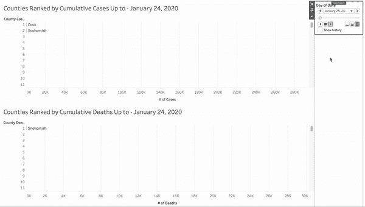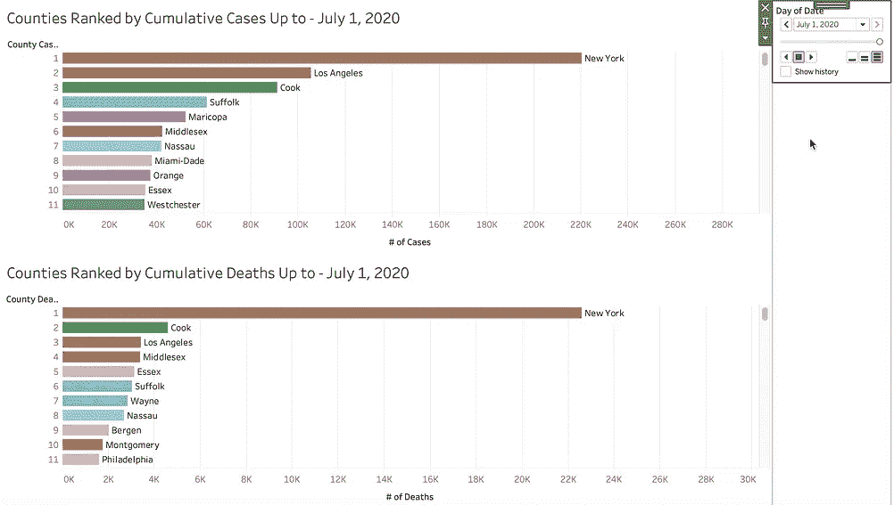

按一段时间内累计病例和死亡人数排名的县(左)，以及 2020 年 7 月 1 日的最终排名(右)。作者图片。

根据 [Worldometer 对纽约市](https://www.worldometers.info/coronavirus/coronavirus-death-rate/)COVID 病例和死亡病例的分析，平均感染死亡率为 **1.4%** 。人们很容易看到 1.4%这样的数字，并认为它在任何地方都适用，这将使比较各县的病例和死亡人数变得完全没有意思。换句话说，很容易假设:

(病例数)*(1.4%) =(死亡数)

在上面的图表中，我们开始发现事实并非如此。例如，洛杉矶县在病例数量上排名第二，但在死亡人数上排名第三。另一方面，米德尔塞克斯郡在病例数量上排名第六，但在死亡人数上排名第四。

也许洛杉矶县比米德尔塞克斯县拥有更多的医院床位和更好的优质医疗服务，所以感染 COVID 的人很少到达危急阶段。另一种可能的解释是，洛杉矶县的年轻人比例高得多，他们死于 COVID 的风险较小，因此更愿意外出冒险，这使他们感染 COVID 的风险更大。老年人可能更不愿意去公共场合，但当他们感染了 COVID，他们更有可能死亡。

在下面的州一级，同样的趋势也很明显。加利福尼亚州在病例数上排名第二，但在死亡率上排名第七，而另一方面，马萨诸塞州在病例数上排名第七，但在死亡率上排名第三。

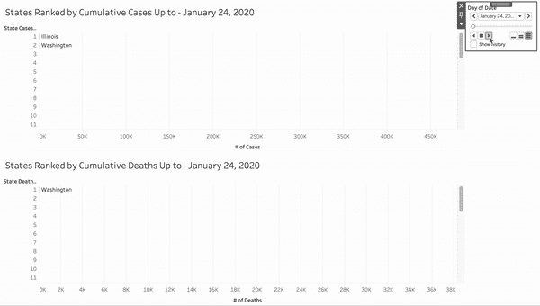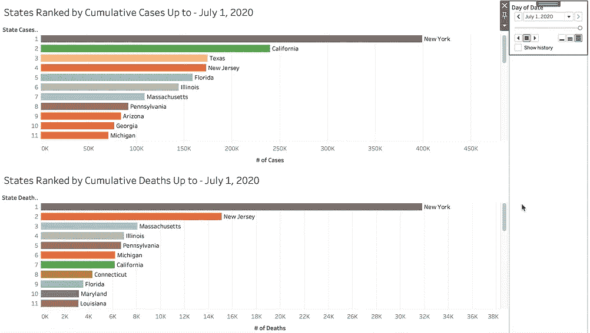

各州按一段时间内的累计病例和死亡人数排名(左)，2020 年 7 月 1 日的最终排名(右)。作者图片。

## 各县受感染人口的百分比

尽管病例数在纽约和洛杉矶等地继续以惊人的速度攀升，但我在新闻中没有听到的一项统计数据是，这些县的人口中有多少百分比**实际上受到了感染。我使用人口普查局的数据创建了下面的地图和条形图。**

**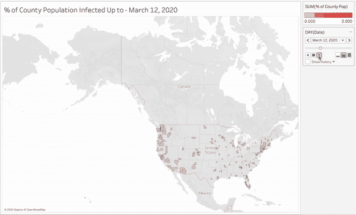****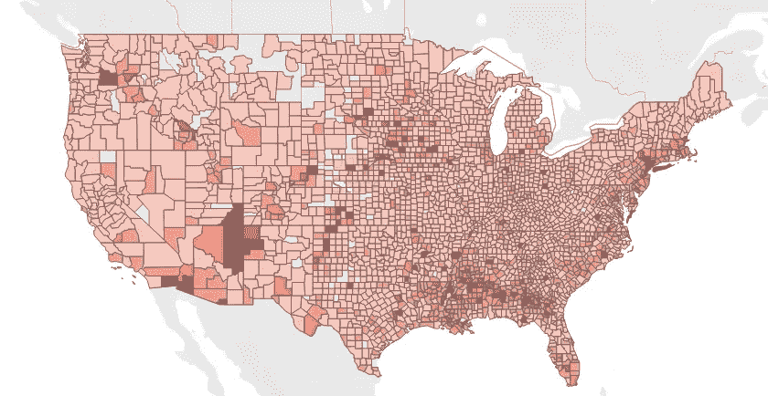**

**随着时间的推移，县人口感染的百分比(左)和 2020 年 7 月 1 日的最终分布(右)。作者图片。**

**暗红色县的聚集似乎从主要的大都市地区急剧转移到人口密度较低的农村地区。突然间，洛杉矶县看起来相当受控制，而亚利桑那州、密西西比州和中西部的一些县看起来受到了破坏。**

**用数字来说明:**

*   ****洛杉矶县只有 1.05%的人被感染**，而亚利桑那州的马里科帕县(凤凰城州府所在地)的感染率为 **3.3%。****
*   **纽约县(曼哈顿)感染率 **13.52%** 依然惊人！**
*   ****人口只有 7816 人的田纳西州特鲁斯代尔县，感染率高达 13.2%** 。住在这里而不知道至少一个被感染的人是不可能的。**

**想象一下这些感染率超过 5%的县正在经历的灾难，然后结合这些地方获得高质量医疗保健的机会可能比洛杉矶或纽约少的事实，我们面临着一个相当严峻的局面。**

**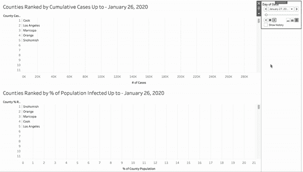****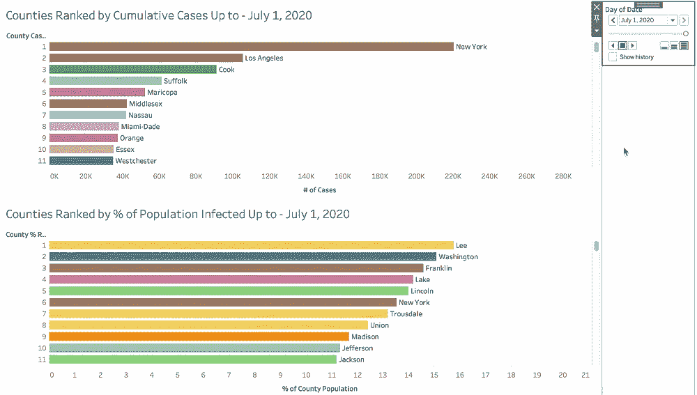**

**按累计病例数和县人口感染百分比对各县进行排名(左)，最终排名于 2020 年 7 月 1 日。作者图片。**

****免责声明:我不分享这些见解来贬低像洛杉矶和纽约这样有大量病例的城市。我只是想指出一些事实，揭示另一个没有受到关注的故事:获得优质医疗服务较少的农村地区的故事，他们遭受的痛苦可能超出我们大多数城市居民的想象。****

# ***有待改进的领域***

## ***#1:将固定的 x 轴改为动态轴***

***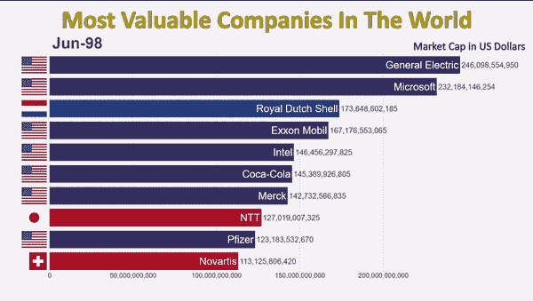***

***动态 x 轴示例。视频由 RankingTheWorld 制作([https://www.youtube.com/watch?v=8WVoJ6JNLO8](https://www.youtube.com/watch?v=8WVoJ6JNLO8))。***

***在经典的赛车条形图(如上所示)中，排名第一的条形占据了屏幕的整个宽度，每隔一个条形占据的宽度与排名第一的条形成比例。然而，目前所有的赛车条形图的 x 轴都是固定的，这使得分辨率太低，无法看到 4 月份之前的真实情况。***

***这里有一个关于如何修复这个[的教程](https://gravyanecdote.com/tableau/how-to-build-a-bar-chart-race-in-tableau/)，它适用于非聚合的原始数据，但是因为我们的原始数据是预聚合的，所以他们对 WINDOW_MAX 的修复不起作用。*(如果你能想出如何让它工作就加分！)****

## ***#2:创建实时连接***

***我在 2020 年 7 月 1 日从 NYT 的 Github 页面下载了这个数据集，从那以后出现了相当多的案例和新趋势，这些都没有被这些动画捕捉到。目前，我使用的是 [Tableau Public](https://public.tableau.com/s/) (Tableau 的免费提供)，它不允许与数据集进行实时连接。如果我升级到完整版的 Tableau Desktop，我可以与 NYT 的 Github 页面建立实时连接，这样数据每天都会自动更新，可视化效果也会随之更新。***

## ***#3:速度***

***这个数据集有大约 280k 行，所以每次放大或缩小地图时，整个地图都需要重新绘制，这使得界面有时非常滞后。我不知道这是否可以用 Tableau 来修复，但我很想知道是否有人知道如何修复。***

******

***[疾控中心](https://unsplash.com/@cdc?utm_source=medium&utm_medium=referral)在 [Unsplash](https://unsplash.com?utm_source=medium&utm_medium=referral) 上拍照。***

***希望你喜欢这个分析，即使它有点令人沮丧…要查看完整的可视化，请查看我的 Tableau 公共简介[这里](https://public.tableau.com/profile/christopher.woodard4874#!/vizhome/COVIDbyCountyAMosaic/COVIDbyCountyAMosaic)，我也期待看到你观察到的！***