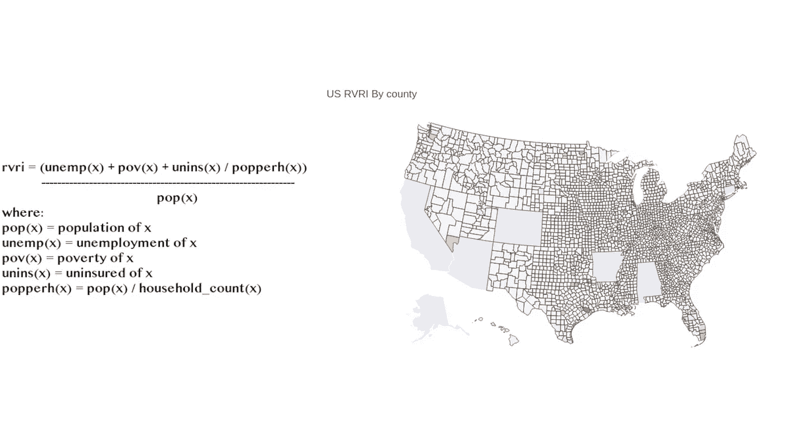
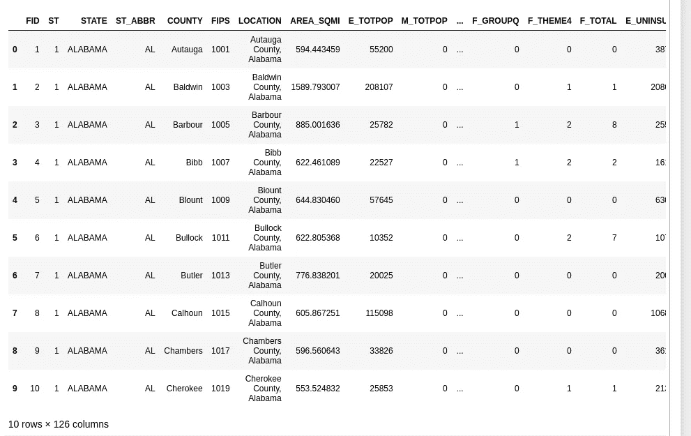
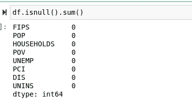
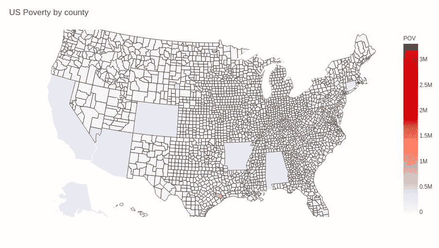
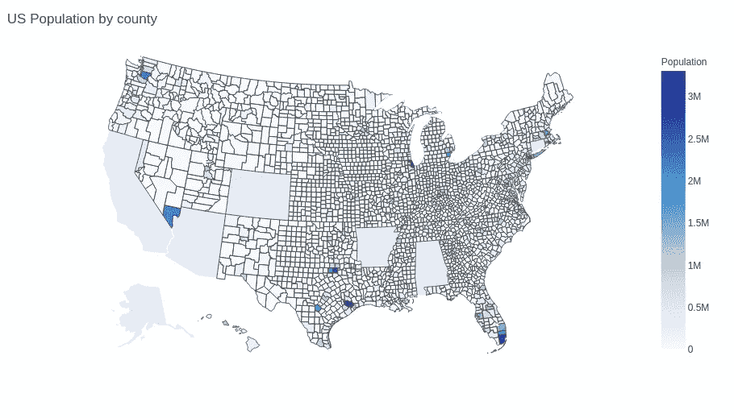
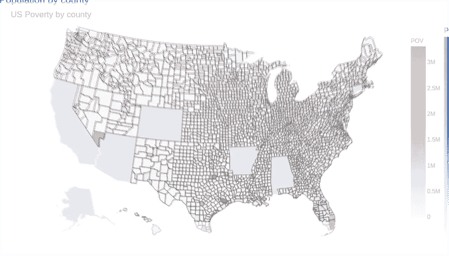
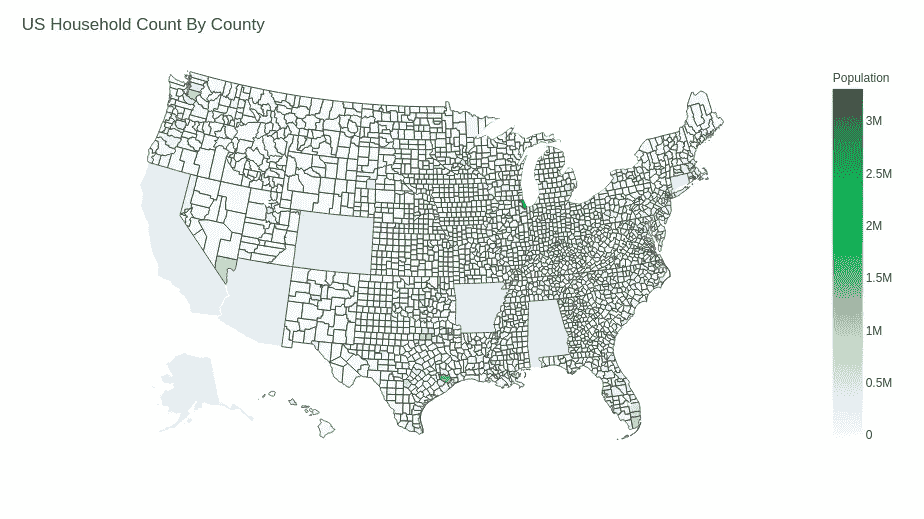
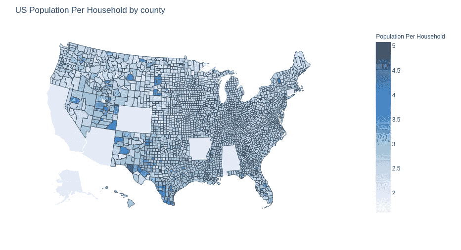
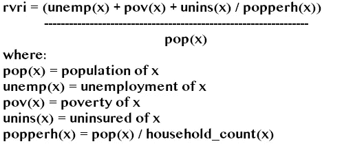
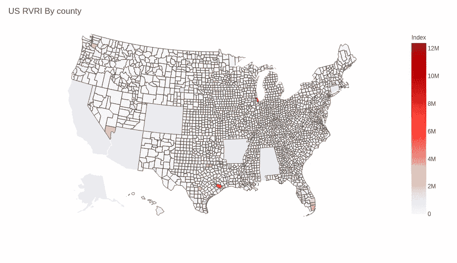

# 使用 Plot.ly For Python 可视化新冠肺炎漏洞

> 原文：<https://towardsdatascience.com/visualizing-covid-19-vulnerability-with-plot-ly-for-python-bce308dd58?source=collection_archive---------17----------------------->

## 使用 Python 的 Plot.ly 模块创建 choropleth 的快速演练。



(图片由作者提供)

# 介绍

随着新冠肺炎病例在美国再次上升，一个有趣和令人兴奋的发展可能被忽略了，那就是每个州对这种性质的病毒的实际威胁程度。当我决定用 Python 的 Plot.ly 绘图库写一篇可视化地理数据的简介时，我很快意识到这是我想做的项目。因此，今天我们将通过 Plot.ly 创建 choropleth 地图并可视化 FIPS 数据，同时了解有关我国整体的有趣信息。与往常一样，数据和笔记本都可以通过以下链接获得:

> [数据](https://coronavirus-disasterresponse.hub.arcgis.com/datasets/cdcarcgis::cdc-social-vulnerability-index-2018-usa?layer=1&showData=true)
> 
> [笔记本](https://github.com/emmettgb/Emmetts-DS-NoteBooks/blob/master/Python3/Visualizing%20COVID%20Geodata%20with%20Plotly.ipynb)

# 数据读取和清理

幸运的是，对于今天的工作来说，数据已经准备好了——虽然我们也可以查询 API，但我决定使用 CSV 数据，所以让我们使用 Pandas 库中的 read_csv()函数来读取它:

```
import pandas as pd
import numpy as npimport plotly.express as pxdf = pd.read_csv("data/CDC_SVI.csv")
```

接下来，我们将使用 head()函数来查看我们的数据帧:

```
df.head(10)
```



(图片由作者提供)

> 那可是好多列啊！

所有这些特征都需要一千年才能完成。幸运的是，使用在获取数据的网站上找到的描述，我们可以删除不需要的列。我最初是通过删除列来实现这一点的，当列数超过 100 时，这很快就变得乏味了——所以我决定构建一个全新的数据框架。

```
df = pd.DataFrame({"FIPS": df["FIPS"], "POP": df["E_TOTPOP"], 
                  "HOUSEHOLDS": df["E_HH"], "POV": df["E_POV"], "UNEMP": df["E_UNEMP"],
                  "PCI": df["M_PCI"], "DIS": df["E_DISABL"], "UNINS": df["E_UNINSUR"]})
```

我使用的功能如下:

*   FIPS —给定辖区的联邦 ID。(我们需要这个来绘制 choropleth。)
*   POP——对给定县的总人口的估计。
*   家庭——给定县的估计家庭数量。
*   POV —该县生活在贫困线以下的估计平民人数。
*   UNEMP——该县失业美国人的估计人数。
*   PCI——估计的人均收入。
*   DIS——辖区内残疾平民的估计人数。
*   unis——该县未投保的美国人的估计人数。

接下来，我得到了这些数据中所有潜在缺失值的总和。幸运的是，这些数据非常干净！实际上没有丢失值:



(图片由作者提供)

# 特征是氯过多

首先，我们需要可视化我们的美国县是一组 JSON 数据，它将告诉 Plot.ly 对应于正确的 FIPS 的地图区域。我们可以从 Plot.ly Github 获得这一点:

[https://raw . githubusercontent . com/plot ly/datasets/master/geo JSON-counties-FIPS . JSON](https://raw.githubusercontent.com/plotly/datasets/master/geojson-counties-fips.json)

我们可以获取这些数据，然后用 JSON 甚至 Pandas 读取，或者我们可以简单地使用 URLLib 用 Python 请求数据:

```
from urllib.request import urlopen
import json
with urlopen('[https://raw.githubusercontent.com/plotly/datasets/master/geojson-counties-fips.json'](https://raw.githubusercontent.com/plotly/datasets/master/geojson-counties-fips.json')) as response:
    counties = json.load(response)
```

接下来，我将创建一个名为 current_feature 的新变量，它将代表我们要可视化的数据帧中的特征。这只是我为了使事情变得简单一点而加入的一个步骤，因为从这一点开始所要做的就是复制、粘贴和更改值来创建一个新的 choropleth。我们还需要这些数据的最小值和最大值，作为我们 choropleth 色标的参数。

```
current_feature = "POV"
curr_min = min(df[current_feature])
curr_max = max(df[current_feature])
```

现在，我们将把我们创建的所有数据插入 px.choropleth():

```
fig = px.choropleth(df, geojson=counties, locations='FIPS', color=current_feature,
                           color_continuous_scale="reds",
                           range_color=(curr_min, curr_max),
                           scope="usa",
                           labels={current_feature: current_feature}
                          )
```

接下来，我将使用 fig.update_layout()函数添加一个标题:

```
fig.update_layout(title_text = "US Poverty by county")
```

最后，展示新的 choropleth:

```
fig.show()
```



(图片由作者提供)

进一步考察，我们说美国在贫困问题上是相当平衡的。也就是说，有一些异常值，如德克萨斯州的哈里斯县。这是休斯顿所在的地方——就传播和住院率而言，这几个月来它实际上已经深陷泥潭。接下来，让我们用同样的方式想象我们的其他特征。

首先，让我们看看人口:

```
current_feature = "POP"
curr_min = min(df[current_feature])
curr_max = max(df[current_feature])fig = px.choropleth(df, geojson=counties, locations='FIPS', color=current_feature,
                           color_continuous_scale="blues",
                           range_color=(curr_min, curr_max),
                           scope="usa",
                           labels={current_feature: "Population"}
                          )
fig.update_layout(title_text = "US Population by county")
fig.show()
```



(图片由作者提供)

比较这两种可视化，似乎人口和贫困是相互关联的——至少在某些县是如此。回到德克萨斯州的休斯顿/哈里斯县，情况确实如此。我决定在 GIMP 中的另一张地图上叠加一个不透明版本的地图，我们看到大多数非白色的区域变成了紫色，是红色和蓝色的混合:



(图片由作者提供)

这可能是需要记住的事情，但让我们看看它与家庭的关联程度:

```
current_feature = "HOUSEHOLDS"
curr_min = min(df[current_feature])
curr_max = max(df[current_feature])
fig = px.choropleth(df, geojson=counties, locations='FIPS', color=current_feature,
                           color_continuous_scale="greens",
                           range_color=(curr_min, curr_max),
                           scope="usa",
                           labels={current_feature: "Population"}
                          )
fig.update_layout(title_text = "US Household Count By County")
fig.show()
```



(图片由作者提供)

定性地说，我们可以说，人口和共享住房肯定是新冠肺炎感染的一个风险因素。话虽如此，贫困和普遍差异也肯定是一个因素。利用这一点，我们可以构建一个新的探索基础。

# 特征工程

一个很好的方法是使用我们自己的特征来重新想象这些数据的真实表现。我想调查的第一个指标是共有家庭的人口。为了做到这一点，我认为将人口中的居民数量除以家庭数量是有意义的，它给出了一个大约有多少人一起生活在一个地点的数字。为了设计这个特性，我创建了一个快速 Lambda 函数:

```
POPPERH = lambda pop, hh: pop / hh
```

然后将我们传递的列的返回设置为 dataframe 上的一列。

```
df["POPPERH"] = POPPERH(df["POP"], df["HOUSEHOLDS"])
```

如果你想了解更多关于使用 Python 的 lambda 来做像这样又酷又简单的事情，我也有一篇文章详细介绍了它是如何工作的:

[](/scientific-python-with-lambda-b207b1ddfcd1) [## 带 Lambda 的科学 Python

### Python Lambda 函数的正确用法:Python 科学编程的最佳语法。

towardsdatascience.com](/scientific-python-with-lambda-b207b1ddfcd1) 

现在让我们以同样的方式来想象这个特征:



(图片由作者提供)

有趣的是，通过设计这一特征，我们发现，尽管美国某些地区的人口和贫困率很高，但这两个属性并不一定与生活在一起的大家庭相关。当然，这不能说是客观事实，而很可能是一个粗略的估计；但有趣的是，这可能是一个潜在的风险因素，就像我们今年早些时候在意大利看到的那样。

对于我的最后一个想法，我想通过结合所有这些特征来创建一个任意值，该值可以指示某个区域构成的风险有多高。当然，这个数字将是任意的，并且可以是基本上任何东西的计算结果，只要这些值在具有统计显著性的特征上呈现不同的结果。话虽如此，请允许我向您介绍我的新的任意风险测量系统:

> RVRI

*   呼吸的
*   病毒
*   风险
*   索引

让我们为这个值建立一个公式:



然后，我们将像以前一样创建一个新的 lambda 函数，并将其应用于数据帧:

```
# (unemp + POV + UNINS / POPPERH) + POV 
RVRI = lambda df: (df["UNEMP"] + df["POV"] + df["UNINS"] / df["POPPERH"]) + df["POP"]df["RVRI"] = RVRI(df)
```

现在，我们将像之前一样可视化这些数据:



(图片由作者提供)

# 结论

使用 Plot.ly API，这些数据的可视化变得相对简单明了。Plot.ly 是一个很棒的工具，我以前讲过很多，最近在本文中更具体地讲过:

[](/10-of-my-favorite-python-libraries-for-data-analysis-597e09cca026) [## 用于数据分析的 10 个我最喜欢的 Python 库

### 一些你应该在 Python 中使用的优秀分析包的快速概要。

towardsdatascience.com](/10-of-my-favorite-python-libraries-for-data-analysis-597e09cca026) 

我认为我们可以从这些视觉化图像和任意的 RVRI 值中得出一些有趣的见解。对我来说，有趣的是，在没有保险的美国人、贫困和其他被调查的特征方面，看到了最大的风险群体。更有趣的是，这些价值中有多少是相关的，因为更多的人口意味着更多的贫困，而更多的贫困意味着更多的患病风险。

明确地说，这一武断的特征还假设，在平民没有保险、贫困且居住密集的情况下，所讨论的病毒要危险得多。也就是说，对于(美好的)2020 年，这个计量单位当然是适用的。