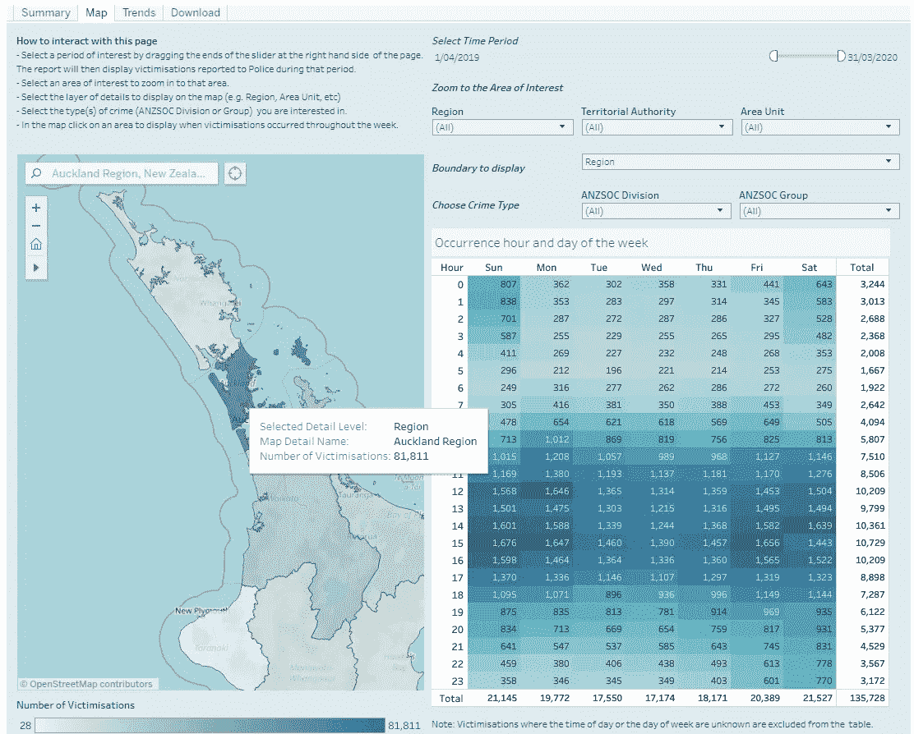
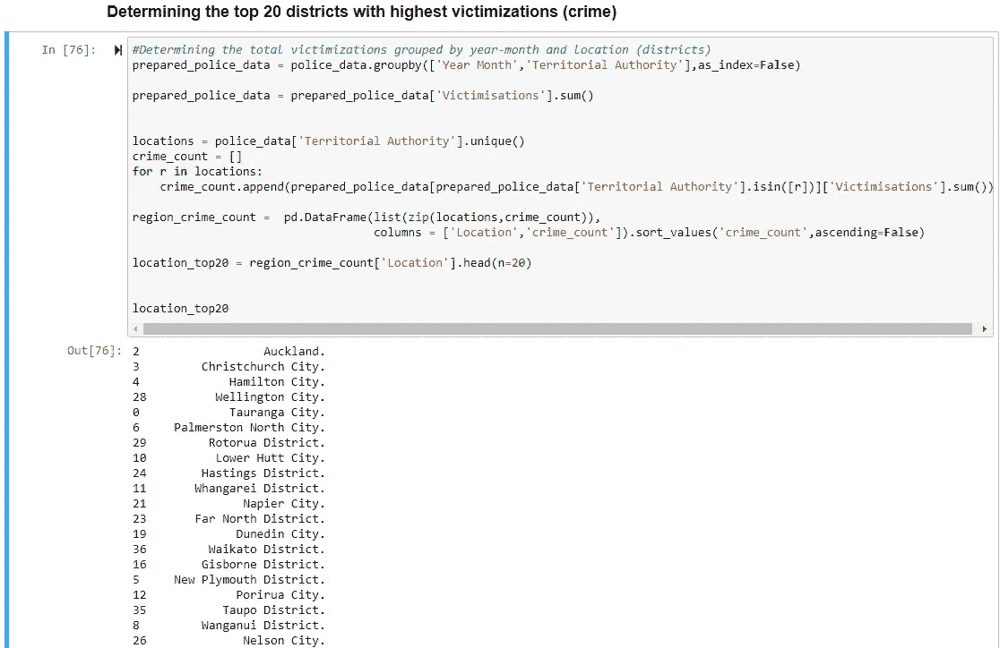
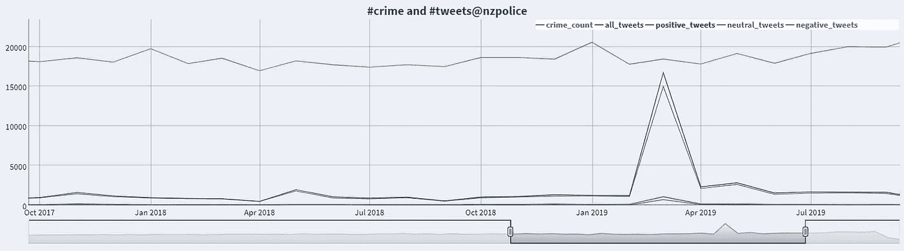
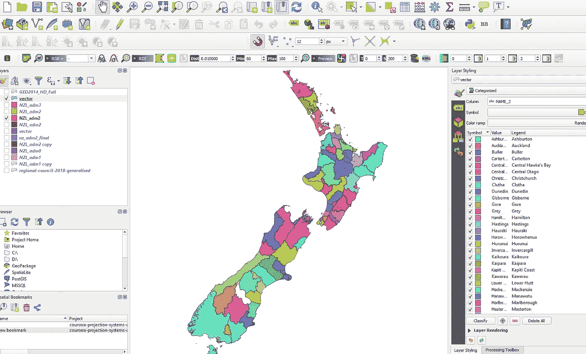
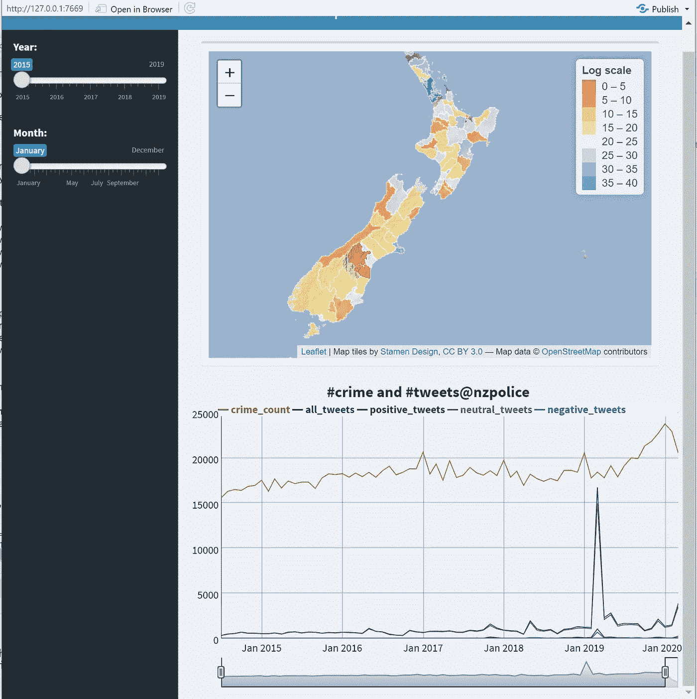

# 可视化新西兰的犯罪和 Twitter 数据

> 原文：<https://towardsdatascience.com/visualizing-crime-and-twitter-data-for-new-zealand-e79aa5b759ed?source=collection_archive---------63----------------------->

## ***推特科学***

## 用 R，Shiny，Python 和 QGIS3 开发的可视化 app。

## 推特和执法

新西兰警方的目标是提高公民参与度，同时提高警务效率。量化公民参与度的方法之一是观察他们的 twitter 习惯，以确定其与该地区犯罪的相关性。

这项工作背后的基本想法是通过分析他们的推文来可视化特定地点的犯罪和该地区人民的情绪。显然，对于像新西兰这样一个人口稀少的国家来说，选择分享地理位置的人太少了，这种分析不可信。

因此，我们使用了 5 年内发送到 https://twitter.com/nzpolice[的推文总数以及新西兰各地区的犯罪数据。本文描述了开发可视化的方法。检查短视频，看看它看起来怎么样。](https://twitter.com/nzpolice)

分析犯罪和推特数据

## 提取推文

我试图获得 Twitter 开发者的帐户，但它被拒绝，声称它不符合他们的条款和条件，这是愚蠢的。因为我既没有做任何商业目的的事情，也没有试图窃取私人数据。这只是一个小实验。所以我用了 [TweetScraper](https://github.com/jonbakerfish/TweetScraper) ，它实际上工作得很好，尽管它不是没有错误。

我摘录了 2015 年到 2020 年初发给新西兰警方的推文。下面的命令是一个典型的例子。

```
scrapy crawl TweetScraper -a "query=@nzpolice near:Auckland since:2014-07-01 until:2020-03-31"
```

这个查询并没有真正的用处，因为在这段时间的 80，000 多条推文中，只有几百个用户允许从奥克兰进行地理定位访问。用它来分析毫无意义。

## 推文感悟

我在寻找深度学习来进行适当的情感分析，但并不热衷于在这个方向上做更多的研究。这是一个单独的话题，NLP 的深度学习是一个正在增长的领域，但还没有接近与视觉相关的应用。因此，我决定使用非常简单易用的[Vader presentation](https://github.com/cjhutto/vaderSentiment)。

```
import re
from vaderSentiment.vaderSentiment import SentimentIntensityAnalyzer
from tqdm import tqdm_notebook
analyser = SentimentIntensityAnalyzer()sentiment = []for i,tweet in enumerate(tqdm_notebook(tweets)):
    string = tweet
    string = re.sub(r'https?:\S+', "", string) #Removes Hyperlink
    string = re.sub('@[^\s]+','',string) #Removes Usernames
    string = re.sub('#[^\s]+','',string) #Removes Hashtags

    score = analyser.polarity_scores(string)
    score.pop('compound')
    sentiment.append(max(score, key=score.get))
```

## 警方犯罪数据

从[警方网站](https://www.police.govt.nz/about-us/publications-statistics/data-and-statistics/policedatanz/victimisation-time-and-place)提取受害数据。顺便说一句，他们已经用 Tableau 实现了可视化。



来自新西兰警方网站

## 数据准备

说到数据准备，没有什么能打败熊猫。因为这是一个已经被警方清理和管理过的结构化数据，所以任务相当简单。下面是代码片段。



代码快照

## 闪亮的应用仪表板

所以这个练习的真正乐趣就是去做。由于我对这些工具很熟悉，我选择了 R 和 Shiny 来开发可视化。闪亮的仪表板使得制作高质量的交互式可视化效果变得非常容易。

Shiny 将这个过程分解为用户界面和服务器。逻辑驻留在服务器中，而 UI 可以单独管理。很容易在侧面板上设置控制面板。

可视化由两部分组成。第一个是 choropleth。维基百科对 choropleth 的定义是:

> **choropleth 地图**(来自[希腊语](https://en.wikipedia.org/wiki/Greek_language) χῶρος“区域/地区”和πλῆθος“大众”)是一种[主题地图](https://en.wikipedia.org/wiki/Thematic_map)，其中区域按照统计变量的比例进行阴影化或图案化，该统计变量代表每个区域内地理特征的汇总，例如人口密度或[人均收入](https://en.wikipedia.org/wiki/Per-capita_income)。

如上所述，这基本上就是警方网站上显示的内容。

第二个是推特和犯罪的时间序列数据。R 中 Dygraph 的使用使其成为一个交互式的情节。以下是它的快照。



新西兰犯罪和推特活动的时间序列

注意，2019 年 3 月有一个峰值。这是新西兰历史上不幸的一天，克赖斯特彻奇发生了枪战。

新西兰警方的推特账号上还有其他一些推特活动高峰，对此进行调查会很有趣。总的来说，我看不出推特活动和犯罪活动之间有任何联系。虽然我在刑事案件中看到了某种循环。我想知道它是否比实地的实际事件更具行政性。

## 使用 QGIS3 创建矢量文件

最有趣的部分是在 QGIS 中，多边形被准备好放在地图上。很难确定一个载体形状文件，其中包含的区域与警方用于管理的区域相同。更重要的是有相同的名字。例如，警察数据集将奥克兰称为奥克兰市。

网上有许多矢量文件。例如[链接](https://freevectormaps.com/new-zealand)

QGIS 使得根据需要合并不同区域和重命名要素变得非常容易。它肯定不如商业版的 ArcGIS，但进步很快。我已经在不同的项目中使用它两年了，我已经看到新版本有了很大的改进。



QGIS3 在运行

这是最终应用程序的样子。请注意，不同地区的犯罪数量差异很大。因此，颜色编码很困难。因此，使用对数标度。

此外，滑块会导致不必要的计算，因为滑块中的每个增量都会重新计算贴图。应该使用更好的输入部件。



最终可视化的快照

## 后续步骤

这只是一个简单的可视化，并没有提供任何尚未知晓或预期的见解。这些是我在扩展这项基础工作时可能会用到的一些想法。首先，我收集了 Twitter 数据。很多都是对一系列事件的反应。

了解人们在什么水平上参与这些活动并量化他们的情感投入将会很好。目前，情绪只是积极，消极和中性的。这将是有用的分配学位，这是一个极其困难的问题。

此外，通过给犯罪添加更多类别来使这种可视化更有用也是不错的。虽然不可能确定地理位置，但量化人们对这些到来的参与度会很好。举例来说，它可以让我们了解与金融犯罪相比，人们对毒品的担忧程度。

在[https://github.com/deepakkarunakaran/nzpolice](https://github.com/deepakkarunakaran/nzpolice)找到代码