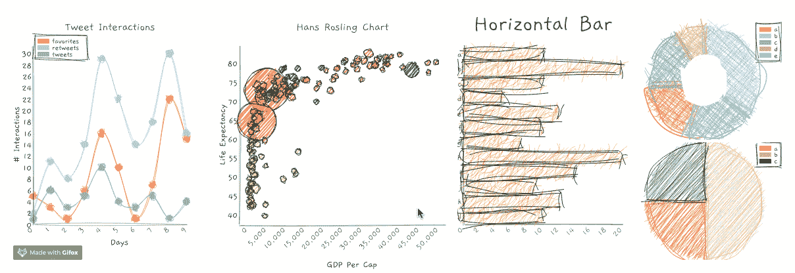
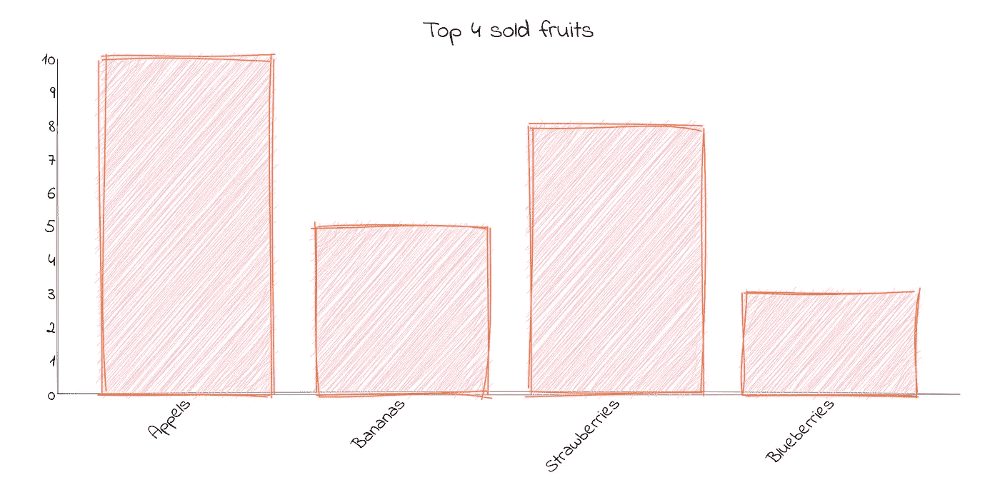
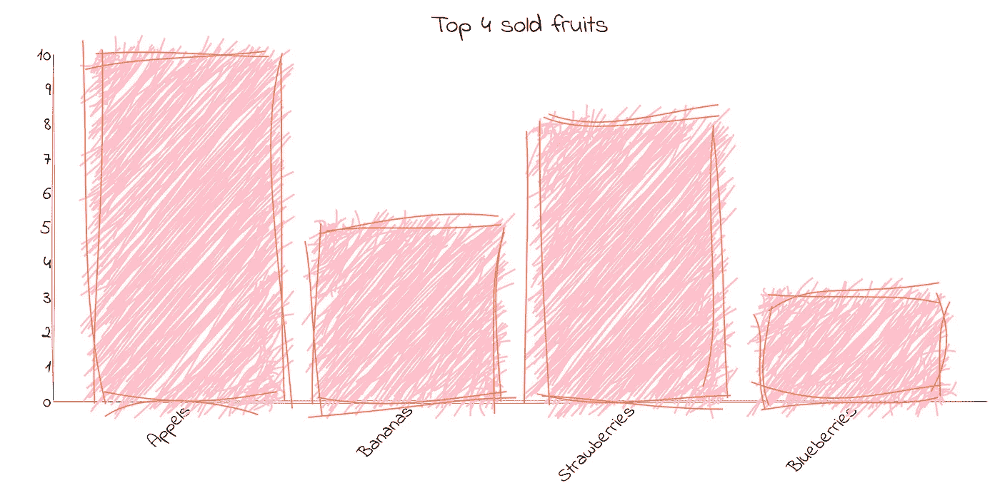
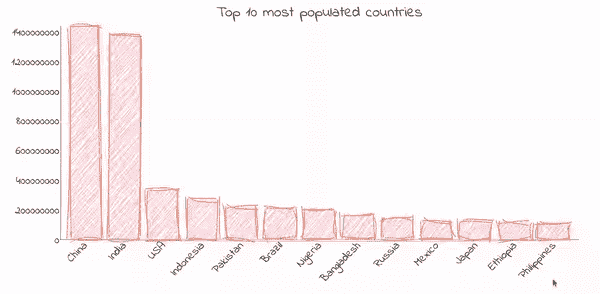
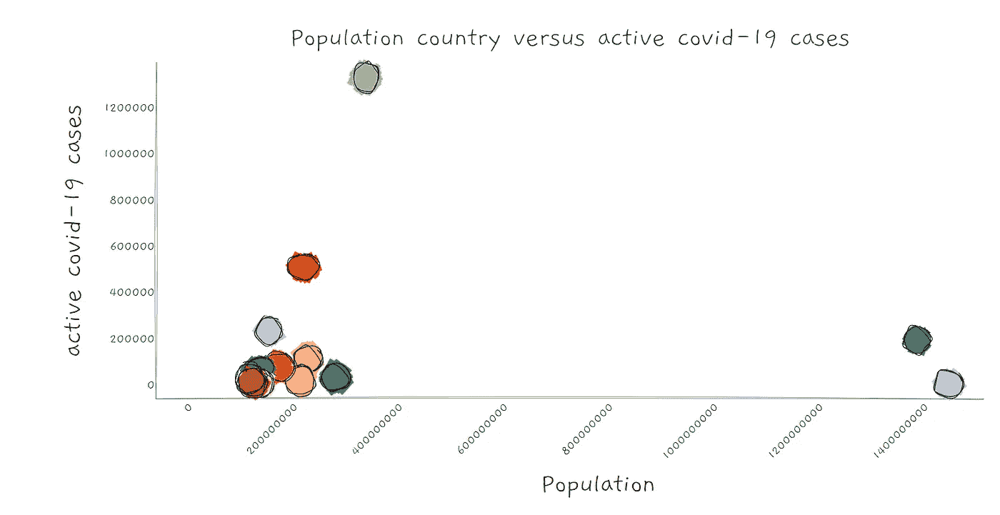
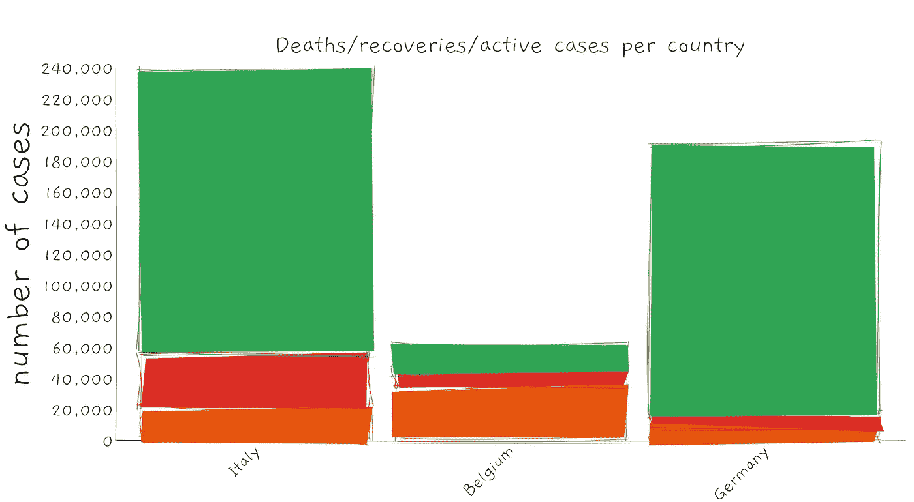

# 用 RoughViz.js 可视化数据

> 原文：<https://towardsdatascience.com/visualizing-data-with-roughviz-js-77b8f96331e9?source=collection_archive---------57----------------------->

## 使用 RoughViz.js 让您的图表更有趣、更具互动性

在本教程中，我们将深入到 [RoughViz.js](https://github.com/jwilber/roughViz) 来可视化数据。有了它，你就能画出具有草图视觉效果的图形。对于本教程，我们将使用**[**disease . sh**](https://disease.sh/v2/countries)API**来可视化各个国家的人口和新冠肺炎数据。我选择这个库的原因是对如何可视化数据有一个更开放的想法。随着每一次数据可视化，我们用不同的艺术风格讲述一个故事可以极大地改变人们对它的看法。对我来说，这也是一个实验，看看使用 RoughViz.js 这样的工具的数据可视化是否可以因为本库使用的视觉效果而使看起来枯燥的主题变得更有趣。****

********

****[RoughViz.js](https://github.com/jwilber/roughViz) 示例图****

# ****设置我们的开发人员环境****

****对于本教程，我们将使用 React 创建一个项目。建立 react 项目最简单的方法是通过[创建 React 应用](https://create-react-app.dev/docs/getting-started)。如果您还没有安装 create react 应用程序，请检查他们的[文档](https://create-react-app.dev/docs/getting-started/)以准备好工具开始使用。我们将使用以下命令创建并运行项目:****

```
**npx create-react-app rough-vizcd rough-viznpm start**
```

****文件夹的名字可以是你喜欢的任何名字，但这是我在本教程中选择的。执行`npm **start**`应该显示一个带有旋转 react 标志的运行页面。现在让我们安装 RoughViz.js，这样我们就可以在我们的项目中使用它了。因为我们使用 react，所以我们将安装 react 包装器。****

```
**npm install react-roughviz --save**
```

****我们现在可以开始在`app.js`中导入库了。从起始项目中移除所有代码，并添加导入。你的`app.js`应该是这样的:****

```
**import React from 'react';
import { Bar, StackedBar, Scatter } from 'react-roughviz'
import './App.css';function App() {return (<div className="App">
      <header className="App-header">

      </header>
    </div>
  );
}export default App;**
```

# ****创建我们的第一个条形图****

****我们现在可以开始 bij 建立我们的第一个图表。现在，我们将使用一个硬编码的数组来向您展示 RoughViz.js 的功能。不要担心，在我们设置完第一个图表后，我们将使用来自 API 的数据。对于第一张图表，我们将使用条形图。使用下面的代码，你应该能够看到一个有 4 个条的条形图。****

```
**<Bar
    data={{
        labels: ['Appels',
            'Bananas',
            'Strawberries',
            'Blueberries'    
              values: [10, 5, 8, 3],
            }}
    color="pink"
    title="Top 4 sold fruits"
    stroke='coral'
    axisFontSize={"1.5rem"}
    tooltipFontSize={"2rem"}
    roughness={5}
    labelFontSize={'3rem'}
    strokeWidth={2}
    fillStyle="hachure"
    fillWeight={1}
    margin={{ top: 70, right: 50, bottom: 80, left: 150 }}
    padding={0.2}
    height={700}
    width={window.innerWidth - 100}
    font={1}
/>**
```

********

****图 1:条形图销售的前 4 种水果****

****我添加了一些额外的可选属性，如`fillWeight`、`axisFontSize`、`roughness`和`padding`。我添加了这些属性，以便您可以随意使用。更改这些值，并查看它对图形的影响。增加`roughness`和`fillWeight`特别有趣，因为它允许我们将图表从图 1 变成类似下面的图 2。****

********

****图 2:粗糙度和填充重量增加的相同条形图****

# ****用 API 数据填充图表****

****在这个例子中，我们将使用 [Disease.sh](https://disease.sh/v2/countries) API 来显示人口最多的 10 个国家。让我们首先设置 API 调用，以便用来获取我们想要的数据。首先导入`useState`和`useEffect`，因为我们将使用它们来存储我们的数据。****

```
**import React, { **useState, useEffect** } from 'react';**
```

****接下来用`useState`初始化变量以存储数据。我们还需要为人口和姓名初始化一个单独的数组，因为我们需要两个数组，一个用于标签，另一个用于人口字段。****

```
**const [data, setData] = useState([]);let population = [];let names = [];**
```

****接下来，我们将创建一个`fetchData`函数，该函数将调用 API 来检索数据。检索之后，我们可以将这个响应存储在上面初始化的`setData`中。尝试控制台记录数据，看看是否能从 API 获得数据输出。如果一切就绪，我们可以开始过滤数据，只显示人口最多的前 10 个国家。我们将使用 ES6 中的过滤功能来只检索这些国家，并将它们从最高到最低排序。****

```
**useEffect(() => {
    fetchData();
  }, [])const fetchData = () => {
    fetch(`[https://disease.sh/v2/countries`](https://disease.sh/v2/countries`))
      .then(response => response.json())
      .then(json => setData(json))
  }**
```

****完成后，我们将把它存储在。将函数映射到我们上面初始化的人口变量中。最后，我们还将填充上面的 names 数组，以在图表的标签字段中显示每个国家的名称。****

```
**let dataCut = data.filter(*a* => (*a*.population > 106932753) && data.sort((*a*, *b*) => *b*.population - *a*.population));population = dataCut.map((*a*) => *a*.population);
names = dataCut.map((*a*) => *a*.country);**
```

****我们现在可以用新检索到的数据填充图表。图形的代码看起来应该是一样的，唯一不同的是数据属性。****

```
**<Bar
    *data*={{
     labels: names,
     values: population
    }}
    color="pink"
    title="Top 4 sold fruits"
    stroke='coral'
    axisFontSize={"1.5rem"}
    tooltipFontSize={"2rem"}
    roughness={5}
    labelFontSize={'3rem'}
    strokeWidth={2}
    fillStyle="hachure"
    fillWeight={1}
    margin={{ top: 70, right: 50, bottom: 80, left: 150 }}
    padding={0.2}
    height={700}
    width={window.innerWidth - 100}
    font={1}
/>**
```

********

****图 3:拥有 API 数据的前 10 个人口大国****

****如果操作正确，您的图表应该如图 3 所示。****

# ****显示前 10 个活动新冠肺炎案例的散点图****

****现在我们可以尝试另一个图表。散点图的代码大致相同。这里最重要的区别是，我们将数据存储在 x 和 y 属性中，而不是标签和值中。我们仍将使用人口数组，但添加了一个活动数组来显示每个国家有多少活动病例。接下来，我们还应该设置地图上显示的每个圆圈的`radius`。我把我的设置为 40，但你可以设置为任何你想要的。接下来，我们还添加了一个`colors`属性来添加颜色数组。这是用来确定什么颜色的一个圆的基础上的价值****

```
**let population = [];
  let names = [];
 ** let active = [];** useEffect(() => {
    fetchData();
  }, [])
const fetchData = () => {
    fetch(`[https://disease.sh/v2/countries`](https://disease.sh/v2/countries`))
      .then(response => response.json())
      .then(json => setData(json))
  }let dataCut = data.filter(a => (a.population > 106932753) &&  data.sort((a, b) => b.population - a.population));population = dataCut.map((a) => a.population);**active = dataCut.map((a) => a.active);**<Scatter
    data={{
        x: population,
        y: **active**
    }}
    title='Population country versus active covid-19 cases'
    titleFontSize={'2rem'}
    roughness={2}
    bowing={true}
    radius={40}
    xLabel={'Population'}
    yLabel={'active covid-19 cases'}
    labelFontSize={'2rem'}
    fillWeight={8}
    axisRoughness={0}
    font={0}
    height={700}
    tooltipFontSize={'1.5rem'}
    colors={['#a6cee3', '#1f78b4', '#b2df8a', '#33a02c', '#fb9a99',  '#e31a1c', '#fdbf6f', '#ff7f00', '#cab2d6', '#6a3d9a', '#ffff99', '#b15928']}
    width={window.innerWidth}
    margin={{ top: 50, right: 50, bottom: 170, left: 300 }}
    curbZero={true}**
```

****如果实现正确，您的图表应该如图 4 所示。****

********

****图 4:人口国家与活跃的新冠肺炎病例****

****太好了，你现在已经用真实的 API 数据做出了两个很棒的图表。RoughViz.js 有更多的图形，如折线图、堆积条形图和圆形图。在图 5 中是另一个例子，我用同样的新冠肺炎数据制作了散点图。****

********

****图 5:每个国家的死亡/康复/活跃病例****

****如果你想了解他们的图书馆，你可以查看他们的 [GitHub 页面](https://github.com/jwilber/roughViz)。他们有各种代码甚至 React、Vue 和 Python 的包装器的例子。我希望你喜欢这个教程，并学到一些新的东西。编码快乐！****

******本文使用的资源…******

*   ****rough viz . js—[github rough viz . js](https://github.com/jwilber/roughViz)****
*   ****NovelCOVID API — [全球新冠肺炎 api](https://github.com/NovelCOVID/API)****