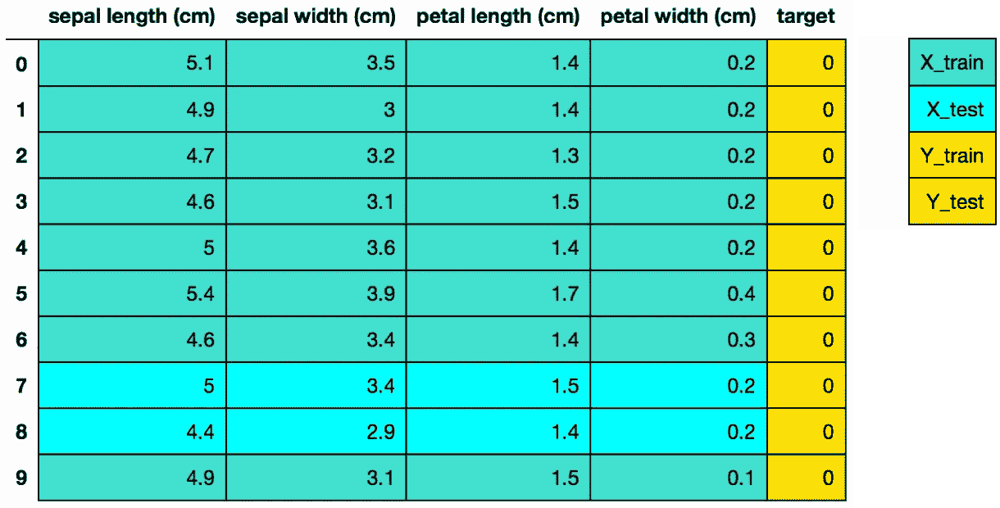
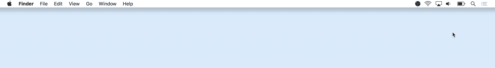

# 用 Python 可视化决策树(Scikit-learn，Graphviz，Matplotlib)

> 原文：<https://towardsdatascience.com/visualizing-decision-trees-with-python-scikit-learn-graphviz-matplotlib-1c50b4aa68dc?source=collection_archive---------0----------------------->

## 了解如何使用 matplotlib 和 Graphviz 可视化决策树


图片来自我的[理解分类决策树(Python)教程](/understanding-decision-trees-for-classification-python-9663d683c952)。

由于各种原因，决策树是一种流行的监督学习方法。决策树的好处包括它们可以用于回归和分类，它们不需要特征缩放，并且它们相对容易解释，因为你可以可视化决策树。这不仅是理解您的模型的一种强有力的方式，而且也是传达您的模型如何工作的一种强有力的方式。因此，了解如何基于您的模型进行可视化会有所帮助。

本教程涵盖:

*   如何使用 Scikit-Learn 拟合决策树模型
*   如何使用 Matplotlib 可视化决策树
*   如何使用 Graphviz 可视化决策树(Graphviz 是什么，如何在 Mac 和 Windows 上安装，如何使用它可视化决策树)
*   如何可视化袋装树或随机森林中的单个决策树

和往常一样，本教程中使用的代码可以在我的 [GitHub](https://github.com/mGalarnyk/Python_Tutorials/blob/master/Sklearn/CART/Visualization/DecisionTreesVisualization.ipynb) 上获得。就这样，让我们开始吧！

# 如何使用 Scikit-Learn 拟合决策树模型

为了可视化决策树，我们首先需要使用 scikit-learn 来拟合决策树模型。如果这一节不清楚，我鼓励你阅读我的[理解分类决策树(Python)教程](/understanding-decision-trees-for-classification-python-9663d683c952)，因为我会详细介绍决策树如何工作以及如何使用它们。

## 导入库

我们将在本教程的这一部分使用以下导入语句。

```
import matplotlib.pyplot as plt
from sklearn.datasets import load_iris
from sklearn.datasets import load_breast_cancer
from sklearn.tree import DecisionTreeClassifier
from sklearn.ensemble import RandomForestClassifier
from sklearn.model_selection import train_test_split
import pandas as pd
import numpy as np
from sklearn import tree
```

## 加载数据集

Iris 数据集是 scikit-learn 附带的数据集之一，不需要从外部网站下载任何文件。下面的代码加载 iris 数据集。

```
import pandas as pd
from sklearn.datasets import load_iris
data = load_iris()
df = pd.DataFrame(data.data, columns=data.feature_names)
df['target'] = data.target
```


原创熊猫 df(特色+目标)

## 将数据分为训练集和测试集

下面的代码执行[训练测试分割](/understanding-train-test-split-scikit-learn-python-ea676d5e3d1)，将 75%的数据放入训练集，25%的数据放入测试集。

```
X_train, X_test, Y_train, Y_test = train_test_split(df[data.feature_names], df['target'], random_state=0)
```



图像中的颜色表示数据帧 df 中的数据用于特定训练测试分割的哪个变量(X_train，X_test，Y_train，Y_test)。迈克尔·加拉尼克的图片。

## sci kit-学习 4 步建模模式

```
# **Step 1:** Import the model you want to use
# This was already imported earlier in the notebook so commenting out
#from sklearn.tree import DecisionTreeClassifier**# Step 2:** Make an instance of the Model
clf = DecisionTreeClassifier(max_depth = 2, 
                             random_state = 0)**# Step 3:** Train the model on the data
clf.fit(X_train, Y_train)**# Step 4:** Predict labels of unseen (test) data
# Not doing this step in the tutorial
# clf.predict(X_test)
```

# 如何使用 Matplotlib 可视化决策树

自 scikit-learn 版本 21.0(大约 2019 年 5 月)起，现在可以使用 scikit-learn 的`[**tree.plot_tree**](https://scikit-learn.org/stable/modules/generated/sklearn.tree.plot_tree.html#sklearn.tree.plot_tree)`用 matplotlib 绘制决策树，而不依赖于`dot`库，后者是一个难以安装的依赖项，我们将在稍后的博客文章中介绍。

下面的代码使用 scikit-learn 绘制了一个决策树。

```
tree.plot_tree(clf);
```


这还不是最容易解释的树。

除了添加允许您保存图像的代码之外，下面的代码试图通过添加特性和类名(以及设置`filled = True`)来使决策树更容易理解。

```
fn=['sepal length (cm)','sepal width (cm)','petal length (cm)','petal width (cm)']
cn=['setosa', 'versicolor', 'virginica']fig, axes = plt.subplots(nrows = 1,ncols = 1,figsize = (4,4), dpi=300)tree.plot_tree(clf,
               feature_names = fn, 
               class_names=cn,
               filled = True);fig.savefig('imagename.png')
```


# 如何使用 Graphviz 可视化决策树


通过 Graphviz 生成的决策树。请注意，我使用文本编辑器编辑了文件，使文本颜色与叶/终端节点或决策节点相对应。

`Graphviz`是开源的图形可视化软件。图形可视化是一种将结构信息表示为抽象图形和网络的方式。在数据科学中，`Graphviz`的一个用途是可视化决策树。我应该注意的是，在介绍完 Matplotlib 之后，我之所以要回顾 Graphviz，是因为让它工作起来可能很困难。这个过程的第一部分包括创建一个点文件。点文件是决策树的 Graphviz 表示。问题是使用 Graphviz 将点文件转换成图像文件(png、jpg 等)可能很困难。有几种方法可以做到这一点，包括:通过 Anaconda 安装`python-graphviz`，通过 Homebrew (Mac)安装 Graphviz，从官方网站(Windows)安装 Graphviz 可执行文件，以及使用在线转换器将您的点文件内容转换成图像。


创建点文件通常不是问题。将点文件转换成 png 文件可能很困难。

## 将模型导出到点文件

代码下面的代码将在任何操作系统上工作，因为 python 生成了点文件并将其导出为名为`tree.dot`的文件。

```
tree.export_graphviz(clf,
                     out_file="tree.dot",
                     feature_names = fn, 
                     class_names=cn,
                     filled = True)
```

## 安装和使用 Graphviz

将点文件转换成图像文件(png、jpg 等)通常需要安装 Graphviz，这取决于您的操作系统和许多其他东西。本节的目标是帮助人们尝试并解决出现以下错误的常见问题。`dot: command not found`。


`dot: command not found`

**如何通过 Anaconda 在 Mac 上安装使用**

为了能够通过这种方法在你的 Mac 上安装 Graphviz，你首先需要安装 Anaconda(如果你没有安装 Anaconda，你可以在这里[学习如何安装它](https://www.datacamp.com/community/tutorials/installing-anaconda-mac-os-x))。

打开一个终端。你可以点击屏幕右上角的聚光灯放大镜，输入终端，然后点击终端图标。



键入下面的命令来安装 Graphviz。

```
conda install python-graphviz
```

之后，你应该可以使用下面的`dot`命令将点文件转换成 png 文件。

```
dot -Tpng tree.dot -o tree.png
```

**如何通过家酿在 Mac 上安装使用**

如果你没有 Anaconda 或者只是想要另一种在 Mac 上安装 Graphviz 的方式，你可以使用[自制软件](https://brew.sh/)。我以前写过一篇关于如何安装家酿软件并使用它将点文件转换成图像文件的文章[这里](https://medium.com/@GalarnykMichael/how-to-install-and-use-homebrew-80eeb55f73e9)(参见教程的家酿软件帮助可视化决策树部分)。

**如何通过 Anaconda 在 Windows 上安装使用**

这是我在 Windows 上更喜欢的方法。为了能够通过这种方法在您的 Windows 上安装 Graphviz，您首先需要安装 Anaconda(如果您没有安装 Anaconda，您可以在这里[了解如何安装它](https://medium.com/@GalarnykMichael/install-python-anaconda-on-windows-2020-f8e188f9a63d))。

打开终端/命令提示符，输入下面的命令来安装 Graphviz。

```
conda install python-graphviz
```

之后，您应该能够使用下面的`dot`命令将点文件转换成 png 文件。

```
dot -Tpng tree.dot -o tree.png
```


通过 conda 安装 Graphviz。这应该可以解决“点”不被识别为内部或外部命令、可操作程序或批处理文件的问题。

**如何通过 Graphviz 可执行文件在 Windows 上安装和使用**

如果你没有 Anaconda 或者只是想要在你的 Windows 上安装 Graphviz 的另一种方式，你可以使用下面的链接[下载并安装它](https://graphviz.gitlab.io/_pages/Download/Download_windows.html)。


如果您不熟悉改变 PATH 变量，而想在命令行上使用 dot，我鼓励您使用其他方法。[有许多 Stackoverflow 问题是基于这个特殊的问题](https://datascience.stackexchange.com/questions/37428/graphviz-not-working-when-imported-inside-pydotplus-graphvizs-executables-not)。

## 如何使用在线转换器来可视化你的决策树

如果其他方法都失败了，或者你只是不想安装任何东西，你可以使用在线转换器。

在下图中，我用 Sublime Text 打开了文件(尽管有许多不同的程序可以打开/读取点文件)，并复制了文件的内容。


复制点文件的内容

在下图中，我将点文件中的内容粘贴到在线转换器的左侧。然后，您可以选择想要的格式，然后将图像保存在屏幕右侧。


将可视化保存到计算机

请记住，有[其他在线转换器](http://www.webgraphviz.com/)可以帮助完成同样的任务。

# 如何可视化袋装树或随机森林中的单个决策树

关于袋装树木的免费预览[视频](https://youtu.be/urb2wRxnGz4)，来自[机器学习与 Scikit-Learn 课程](https://www.linkedin.com/learning/machine-learning-with-scikit-learn/effective-machine-learning-with-scikit-learn)

决策树的一个弱点是它们往往没有最好的预测准确性。这部分是因为高方差，这意味着训练数据中的不同分裂可以导致非常不同的树。上面的[视频](https://youtu.be/urb2wRxnGz4)涵盖了袋装树，这是一个集合模型。这意味着使用多个学习算法来获得比单独从任何组成学习算法获得的预测性能更好的预测性能。在这种情况下，许多树相互保护，避免各自的错误。有趣的是，上面视频中的缩略图可能是袋装树或随机森林的示意图(另一个集合模型)。袋装树和随机森林模型如何工作的区别是另一个博客的主题，但是值得注意的是，对于这两个模型，我们都生长了 N 棵树，其中 N 是用户指定的决策树的数量。因此，在你拟合一个模型之后，看看组成你的模型的各个决策树会很好。

## 使用 Scikit-Learn 拟合随机森林模型

为了可视化单个决策树，我们首先需要使用 scikit-learn 拟合一个袋装树或随机森林模型(下面的代码适合一个随机森林模型)。

```
# Load the Breast Cancer (Diagnostic) Dataset
data = load_breast_cancer()
df = pd.DataFrame(data.data, columns=data.feature_names)
df['target'] = data.target# Arrange Data into Features Matrix and Target Vector
X = df.loc[:, df.columns != 'target']
y = df.loc[:, 'target'].values# Split the data into training and testing sets
X_train, X_test, Y_train, Y_test = train_test_split(X, y, random_state=0)# Random Forests in `scikit-learn` (with N = 100)
rf = RandomForestClassifier(n_estimators=100,
                            random_state=0)
rf.fit(X_train, Y_train)
```

## 可视化您的评估人员

现在，您可以从拟合的模型中查看所有单独的树。在本节中，我将使用 matplotlib 可视化所有决策树。

```
rf.estimators_
```


在这个例子中，注意我们有 100 个评估者。

现在，您可以将单棵树可视化。下面的代码可视化了第一个决策树。

```
fn=data.feature_names
cn=data.target_names
fig, axes = plt.subplots(nrows = 1,ncols = 1,figsize = (4,4), dpi=800)
tree.plot_tree(rf.estimators_[0],
               feature_names = fn, 
               class_names=cn,
               filled = True);
fig.savefig('rf_individualtree.png')
```


请注意，随机森林和袋装树木中的单个树木正在长得更深

您可以尝试使用 matplotlib 子图来可视化尽可能多的树。下面的代码可视化了前 5 个决策树。我个人不喜欢这种方法，因为它更难阅读。

```
# This may not the best way to view each estimator as it is smallfn=data.feature_names
cn=data.target_names
fig, axes = plt.subplots(nrows = 1,ncols = 5,figsize = (10,2), dpi=3000)for index in range(0, 5):
    tree.plot_tree(rf.estimators_[index],
                   feature_names = fn, 
                   class_names=cn,
                   filled = True,
                   ax = axes[index]);

    axes[index].set_title('Estimator: ' + str(index), fontsize = 11)fig.savefig('rf_5trees.png')
```


## 为每个决策树(评估者)创建图像

请记住，如果出于某种原因，您需要所有评估者(决策树)的图像，您可以使用 my [GitHub](https://github.com/mGalarnyk/Python_Tutorials/blob/master/Sklearn/CART/Visualization/DecisionTreesVisualization.ipynb) 上的代码来实现。如果你只是想看看随机森林模型的 100 个估值器中的每一个都适合本教程，而不需要运行代码，你可以看看下面的视频。

# 结束语

本教程讲述了如何使用 Graphviz 和 Matplotlib 可视化决策树。请注意，使用 Matplotlib 可视化决策树的方法是一种较新的方法，因此将来可能会有所改变或改进。Graphviz 目前更加灵活，因为你可以随时修改你的点文件，使它们在视觉上更具吸引力，就像我使用[点语言](https://www.graphviz.org/pdf/dotguide.pdf)所做的那样，甚至只是改变你的决策树的方向。我们没有谈到的一件事是如何使用 [dtreeviz](/beautiful-decision-tree-visualizations-with-dtreeviz-af1a66c1c180) ，这是另一个可以可视化决策树的库。上面有一个很棒的帖子[这里](https://explained.ai/decision-tree-viz/index.html)。


图片来自 [dtreeviz 库](https://github.com/parrt/dtreeviz)制作。

我的下一个机器学习教程介绍了[如何加速 Scikit-Learn 模型训练](https://medium.com/distributed-computing-with-ray/how-to-speed-up-scikit-learn-model-training-aaf17e2d1e1)。如果您对本教程有任何问题或想法，请在下面的评论中或通过 [Twitter](https://twitter.com/GalarnykMichael) 联系我们。