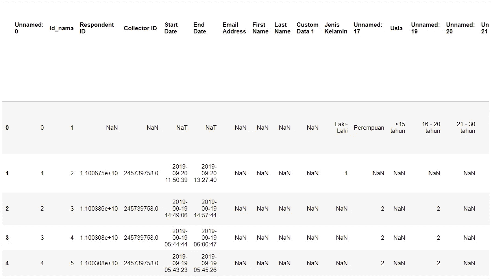
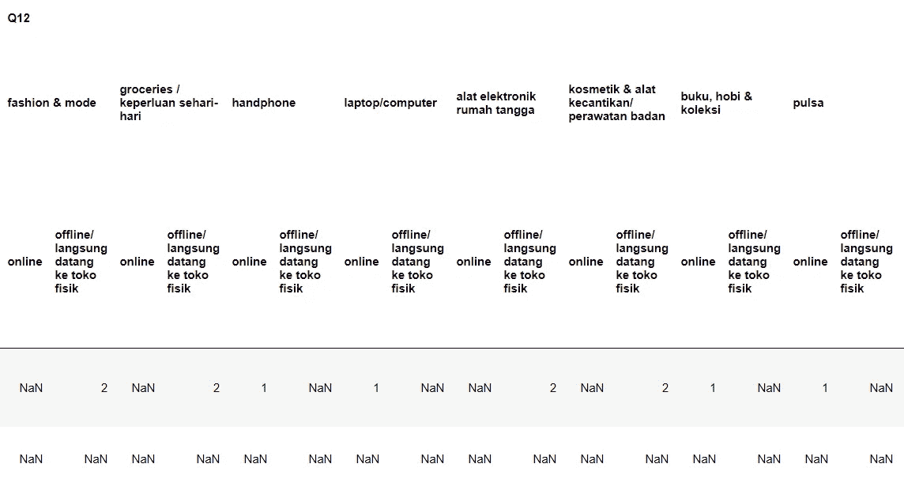
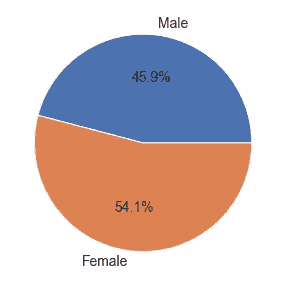
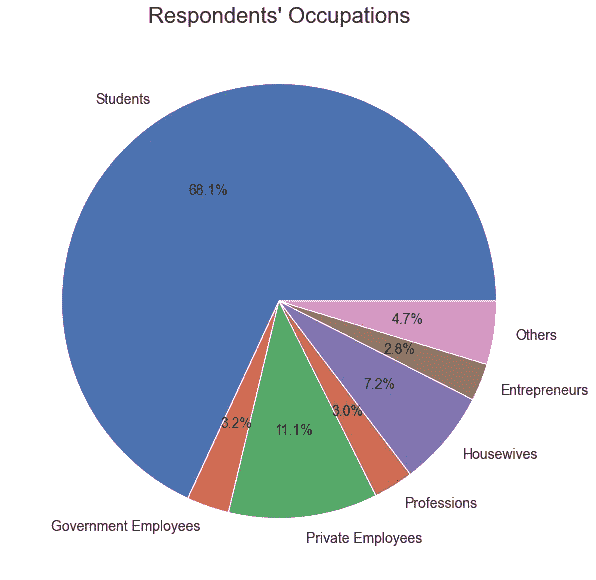
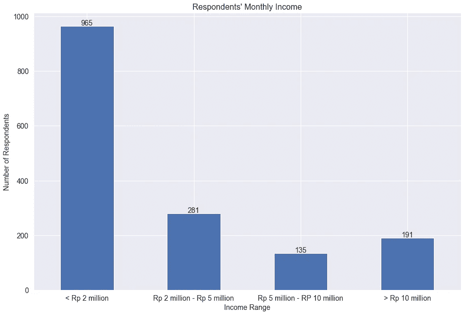
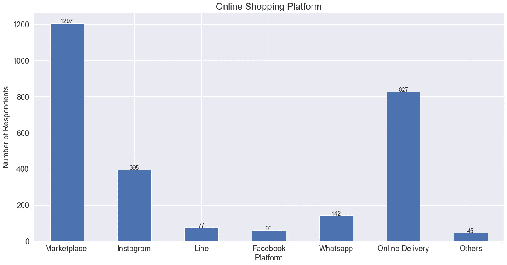
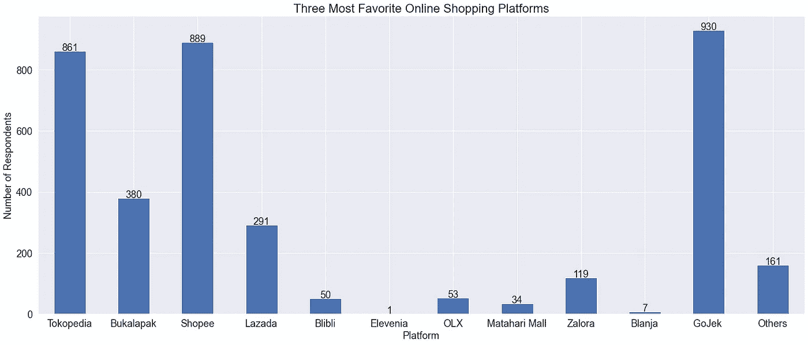
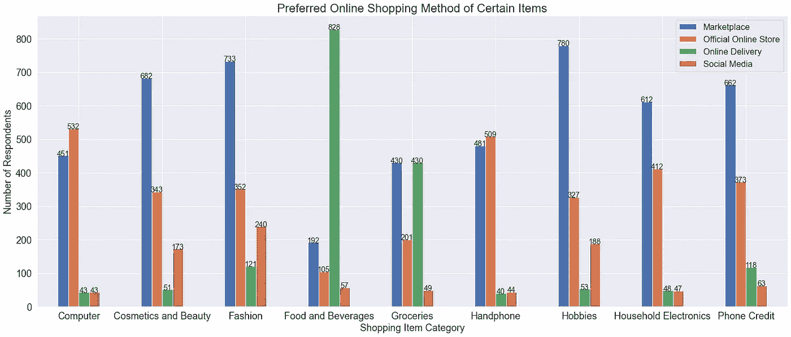
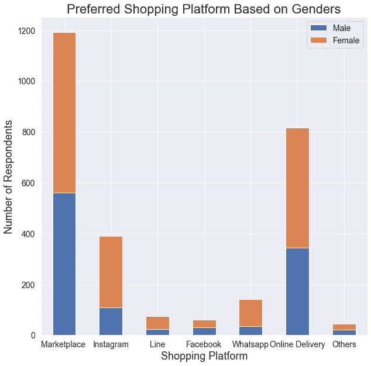
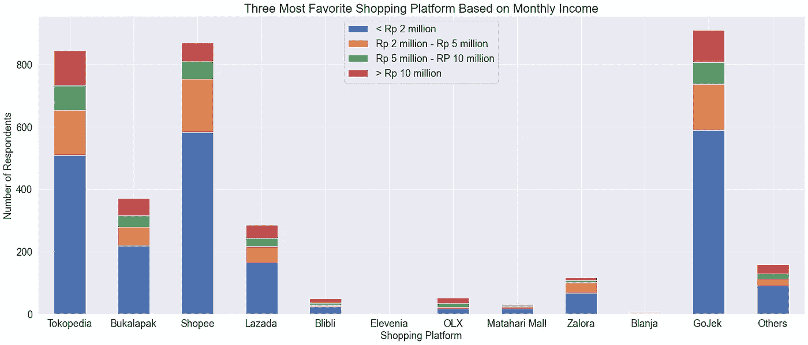

# 可视化电子商务调查数据

> 原文：<https://towardsdatascience.com/visualizing-e-commerce-survey-data-9771bfb3f694?source=collection_archive---------52----------------------->

## 使用 Python 和 Pandas 从 SurveyMonkey 数据进行数据辩论和可视化

卢克·切瑟在 [Unsplash](https://unsplash.com?utm_source=medium&utm_medium=referral) 上的照片

我和 Dimitri Mahayana 博士在概率统计课上有一个期末项目，是关于分析印度尼西亚的电子商务调查数据的。每个学生从一些回答者那里收集数据，做出大约 1600 个回答。这项调查由 50 多个问题组成。有些问题是关于网上购物的个人数据和个人行为。

在这篇文章中，我使用的是 2019 年的数据。我将向您展示数据争论和可视化如何让我们对数据有更多的了解。我们将查看个人数据、行为数据以及它们之间的组合，以获取更多信息。

# 数据集解释

该调查使用 SurveyMonkey 进行数据收集，这是一个流行的调查平台。然而，SurveyMonkey 的原始数据变得非常混乱，因为有许多未命名的列和 NaN 值。因此，清理和分析数据需要一些时间。如下图所示，问题在列名中，选项在第一行。幸运的是，我们可以使用 Pandas，它对于数据争论来说是非常通用的。

来自 SurveyMonkey 的原始数据(图片由作者提供)

# 重新组织数据

数据争论不是一件容易的事情，尤其是当你处理大量数据的时候。也就是说，清理数据是令人疲惫的，因为你必须做一个迭代的过程，直到你得到你需要的。所以，我把我的数据重新整理成一个问题列表，我可以单独访问。例如，我可以键入“Q32”来访问第 32 个问题。这是数据重新排列后的样子。(你可以在我的 [Github](https://github.com/alifim/E-Commerce-Survey) 上看到我的代码)

预处理数据(图片由作者提供)

您可以看到问题和子问题是如何移动到多索引列中的，所有答案都在它下面的行中。此外，您可能已经注意到，仍然有很多 NaN 值，因为 SurveyMonkey 将答案选项视为数字。假设有 2 个选项，A 和 B，当回答者选择 A 时，SurveyMonkey 用 1 填充 A 列，用 NaN 填充 B 列。我们将在以后可视化数据时处理这个问题。

因为这个调查中有很多问题，我只选取其中的一部分进行分析。想看看性别，职业，月收入等一些个人信息。除此之外，我将分析他们的行为，如首选网上购物平台，购买偏好等。之后，我将结合一些特性来获得关于数据的更多见解。

# 个人资料

首先，我想形象化一下按性别划分的回答者人数。下面的饼状图显示了受访者的性别分布。女性人数比男性略高约 8%。请注意，当我们可视化数据时，我们计算每一列的值，并忽略所有 NaN 值。

受访者的性别(图片由作者提供)

接下来，我们将职业分布可视化，以了解受访者的背景。下面的饼图显示，超过三分之二的受访者是学生。第二高的数字是私人雇员，然后是家庭主妇和其他职业。

受访者的职业(图片由作者提供)

最后，我们来看看他们的月收入，以印度尼西亚卢比计算。根据这个问题，我们有四个收入类别，即每月 200 万以下、200 万至 500 万之间、500 万至 1000 万以及 1000 万以上。柱状图表明，近 1000 名受访者的月收入低于 200 万卢比(相当于 135 美元左右)。

受访者的月收入范围(图片由作者提供)

# 行为数据

现在，我们继续研究行为数据。第一个是受访者用于网上购物的平台分布。柱状图表明他们中的大多数人使用 marketplace 进行网上购物。印度尼西亚有几个市场，例如 Tokopedia、Shopee 和 Bukalapak。接下来，在线交付(如 Gojek 和 Grab)是第二高的数字，有超过 800 名受访者。Instagram 的比例也很高，大约 25%(1600 人中有 400 人)的受访者使用它进行在线购物。

受访者使用的网购平台(图片由作者提供)

正如我们所知，他们中的大多数人使用 marketplace 进行在线购物，我想更深入地了解在线商店或 marketplace 的分布。下面的柱状图代表了有多少人选择不同的在线商店作为他们的最爱。大多数人选择 Gojek、Shopee 和 Tokopedia 作为他们最喜欢的三大在线平台，而在印度尼西亚，没有多少人使用 Elevenia、Blanja 和 Matahari Mall。

最喜欢的购物平台(图片由作者提供)

根据我的经验，我用 Gojek 主要是为了食物，用 Tokopedia 是为了其他东西。所以，我认为看看人们在购买某些物品时的偏好可能会很有趣。下面的柱状图表明了在购买某些商品时，从电脑到电话信用卡，有多少人更喜欢某种在线方式。对于每个类别，人们可以通过市场、官方在线商店、在线交付和社交媒体购买商品。

基于商品的首选网上购物方式(图片由作者提供)

总的来说，市场似乎是购买物品时最受欢迎的方式。大多数人在购买化妆品和美容、时尚、爱好、电子产品和电话信用时都会使用市场。然而，大约 75%的人在购买食品和饮料时选择在线交付。此外，在购买电脑和手机时，官方网上商店是最受欢迎的方式。就购买食品杂货而言，网上交货和市场似乎是最受欢迎的网上购物方式。

# 结合个人数据和行为数据

我们不仅可以查看每个特征，还可以组合两个(或更多)特征来获得更多的数据信息。下面的堆积条形图显示了各平台的男女比例。在 Instagram、Line 和 Whatsapp 上，女性的比例明显更高。相比之下，其他平台的男女数量并没有明显差异。

基于性别的首选平台(图片由作者提供)

最后但同样重要的是，我试图根据月收入将三个最受欢迎的在线商店结合起来。堆积条形图显示，月收入低于 200 万卢比的人在所有平台中占主导地位，因为大约 60%的受访者属于这一类别。尽管如此，我们仍然可以观察到每个平台的收入分布大致相同。我们可以有把握地说，基于这一数据，月收入不会严重影响购物平台的偏好。

基于商品的首选网上购物方式(图片由作者提供)

# 结论

数据争论和可视化并不总是一件有趣的事情，但它可以给我们更多关于数据的见解。在清理和可视化之后，我们有了一些关于个人和行为数据的信息。除此之外，组合要素还可以增加对数据的了解。

> 你可以在这里找到我这个项目的代码。

# 关于作者

Alif Ilham Madani 是一名有抱负的数据科学和机器学习爱好者，他热衷于从他人那里获得洞察力。他在印尼最顶尖的大学之一 [*万隆技术学院*](https://www.itb.ac.id/) 主修电子工程。

如果你有任何要讨论的话题，你可以通过 [LinkedIn](https://www.linkedin.com/in/alif-ilham-madani/) 和 Twitter @_alifim 联系 Alif。