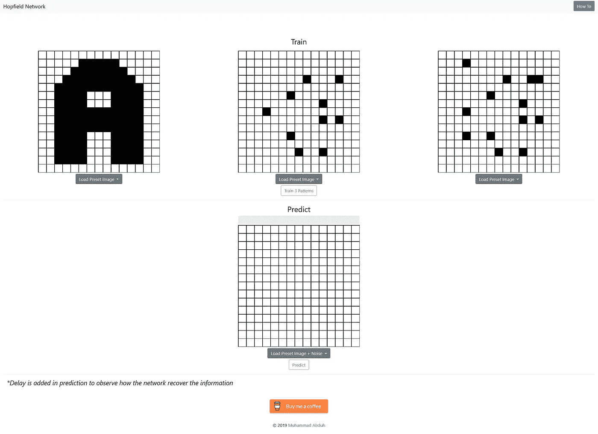

# 用 Hopfield 网络可视化情景记忆

> 原文：<https://towardsdatascience.com/visualizing-episodic-memory-with-hopfield-network-a6e8bde967cb?source=collection_archive---------62----------------------->

## 一个可以学习模式的网络，给定部分学习的模式，该网络可以恢复整个学习的模式。

2018 年，我写了一篇[文章](/a-history-of-triggering-artificial-neuron-d1d9853d9fdc)描述神经模型及其与人工神经网络的关系。我参考的《T2》一书中的一章解释说，当一组神经元一起工作并形成网络时，某些特性可能会出现。书中有很多理论，但更吸引我的是一个可以模拟人类记忆如何工作的网络，叫做 [Hopfield 网络](https://www.researchgate.net/publication/16246447_Neural_Networks_and_Physical_Systems_with_Emergent_Collective_Computational_Abilities)【Hopfield，J.J. 1982】。

Hopfield 网络的前身是受限玻尔兹曼机(RBM)和多层感知器(MLP)。这是一个**基于能量的自动联想记忆、循环和生物启发网络**。

*   它是一个基于能量的网络，因为它使用能量函数并最小化能量来训练权值。想象一个神经元被一种外部脉冲能量触发，这种能量在整个网络中传播，激发所有其他连接的神经元。
*   它是一个**自联想**记忆网络，意思是训练好的网络可以在只给部分信息作为输入的情况下恢复全部记忆信息。例如，假设我们有一个由 10 个相互连接的神经元组成的网络。当我们用所谓的*输入一个状态*触发 8 个神经元时，网络会来回反应和计算，直到所有的神经元和神经元突触(神经元之间的连接)稳定。假设这个稳定状态叫做 S，但现在实际上网络被隐含地记忆了*输入状态*。之后，当我们触发一些神经元(与之前被触发的神经元相同，但不是全部，少于 8 个)时，网络将再次做出反应，直到所有神经元都稳定下来。而稳定的条件是先前的 8 个神经元都处于*输入状态*。
*   这是一个*循环*网络，意思是网络输出回到网络输入，网络形成一个有向图。在这种情况下，有向循环图。
*   由于海马 CA3 区的结构形成了与 Hopfield 网络相似的结构和行为，这是一个受生物启发的网络。

> 行为研究表明，CA3 支持空间快速一次性学习、以空间为成分的任意联想学习、模式完成、空间短期记忆和通过连续项目之间形成的联想进行的序列学习。[ [Cutsuridis，V. &温内克斯，T](https://www.sciencedirect.com/science/article/pii/S0301008206000360) 。2006]

与其他使用*反向传播*来学习权重的神经网络不同，Hopfield 网络使用 Hebb 的学习或 Hebbian 学习 [Hebb，D.O. 1949](https://www.amazon.com/Organization-Behavior-Neuropsychological-Theory/dp/0805843000) ，这也是一种*生物启发的*学习。希伯莱学习背后的想法是，如果两端的神经元积极相关，两个神经元(突触)之间的连接将会更强。在 Hopfield 网络中，神经元只有两种状态，激活和非激活。有时人们用 1 来量化激活状态，用 0 来量化非激活状态。有时他们也用 1 来量化激活状态，用-1 来量化非激活状态。

2019 年底，我抽出时间试图用 Hopfield 网络模拟和可视化记忆回忆是如何工作的。我做的模拟和可视化是一个网络应用程序，所以它是可访问的，所有人都可以尝试。关于 Hopfield 网络有很多解释，这是多余的(或者不是？)如果我在这里也解释一下。相反，我将开放这个 web 应用程序的[源代码](https://github.com/mabdh/hopfield-network),让人们探索并获得实现的想法。这里的链接是[这里的](https://hopfield-network.mabdh.now.sh/)。

hopfield 网络可视化模拟 web app 截图

上图显示了用于可视化 Hopfield 网络的 web 应用程序的屏幕截图。有两个部分，`Train`和`Predict`。您可以在每个网格上绘制一些图案(最多 3 个),也可以选择提供的预定义图案。图案绘制完成后，可以点击`Train 3 Patterns`按钮。完成后，网络已经记住了上面提供的 3 种模式。您可以通过在`Predict`网格中绘制(不完整的)模式，来尝试形象化 Hopfield 网络如何回忆一个模式。下面是我们玩可视化时的 GIF。

Hopfield 网络如何工作的可视化

这篇文章和模拟希望启发一些仍然对 Hopfield 网络如何工作感到困惑的人。对于那些通过视觉更好地学习的人来说，这可能也是有用的。

除了 Hopfield Network，我还创建了一个 web 应用程序来模拟 Q-learning 是如何工作的。q 学习是强化学习算法的一种。你可以在这里查看。