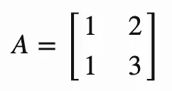
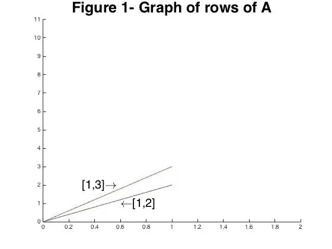
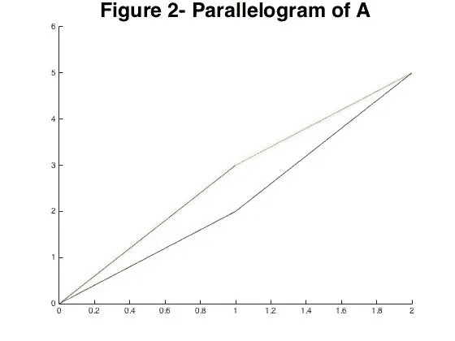
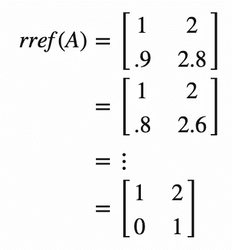
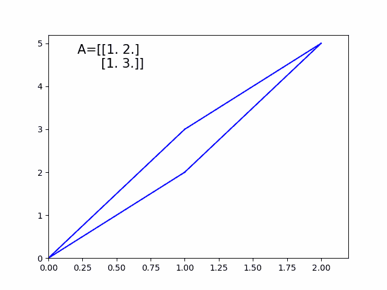
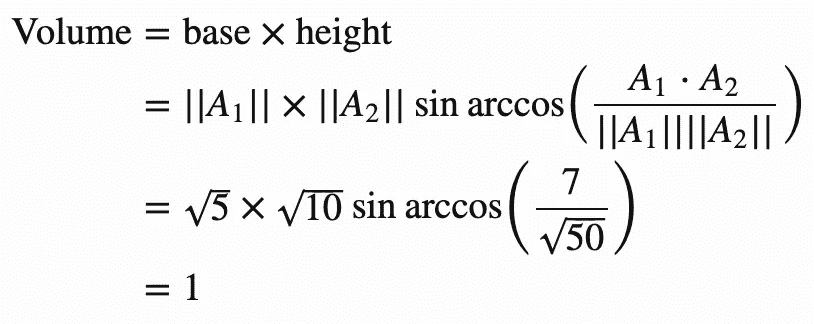
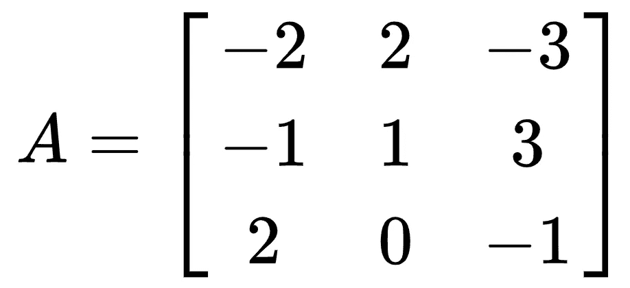
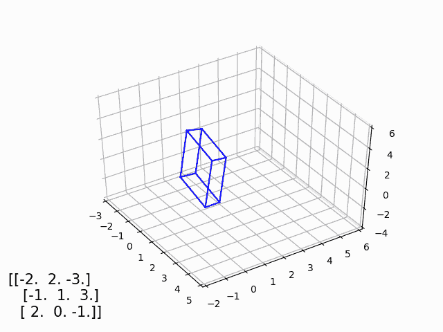

# 可视化高斯消去法

> 原文：<https://towardsdatascience.com/visualizing-gaussian-elimination-6cb6fdb59475?source=collection_archive---------50----------------------->

## 行列式与矩阵中向量所跨越的平行六面体的体积有关，让我们来看看是怎么回事。

最近，我被要求制作一个视频，演示如何将一个矩阵转换成减少行梯队形式(RREF)揭示行列式。我知道这听起来难以置信，但它确实发生了。这篇文章的目的不是描述行列式的所有性质，也不是解释高斯消去法是如何工作的，有大量的其他资源，而是展示矩阵的几何如何与行列式相关，以及将矩阵转换成 RREF 揭示了几何对象的体积。首先，让我们考虑如何从几何角度来看矩阵。在整个讨论中，我将使用矩阵:

查看该矩阵的一种方式是将它看作行向量的集合，如图 1 所示。

该矩阵与图 2 中的平行四边形相关，其中行列式的绝对值是其体积。我们最终会证实这一点，但现在请相信我。

我们取行列式***ad***-**-*BC***= 1。这很好，你们大多数人已经知道如何计算一个行列式了，但是对矩阵进行行归约是如何实现的呢？当我们缩小矩阵时，我们开始将值集中在矩阵的对角线上。这基本上相当于将矢量与笛卡尔轴对齐。为了看到这一点，让我们朝着矩阵*的简化行形式的方向前进一步。让我们从 A_2 中取. 1 × A_1 几次，看看会发生什么。*

**

*我们可以看到，底部向量逐渐与规范的 x，y 轴对齐！如果我们做同样的事情，但是从 A _ 1 中减去 A_2，我们将对齐另一个向量。这意味着查看缩减的行梯队形式的另一种方式是作为原始矩阵的轴对齐版本。这一点可以从下面的视频中看出。*

**

*高斯消去法的可视化*

*现在，我们可以很容易地计算这个缩小的平行四边形的体积，因为高度和底部尺寸只是对角线的条目，它们都是 1，意味着体积是 1。*

*为了验证原始平行四边形的体积是 1，我们可以使用标准的体积=底×高计算方法。在开始走这条路之前，我们需要考虑我们的基础和高度。我们将我们的底||A_1||，我们可以使用三角公式 **sin** (θ) =对边/斜边和点积 a⋅b = | | a | | | b | |**cos**(θ)来找到我们的高度。在这种情况下，我们的对立面是||A_2||现在我们有了计算体积所需的一切。*

**

*实际上是 1！这里我们已经验证了所有矩阵的行列式和体积都是相同的。我们还可以看到减少一个矩阵是如何改变基础向量的几何形状，使其与轴对齐，从而更容易解释。如果你想在更高的维度上看到同样的过程，我为 3× 3 矩阵制作了另一个视频。*

****

*3×3 矩阵上高斯消去法的可视化*

**最初发表于*[*【http://www.nbertagnolli.com】*](http://www.nbertagnolli.com/jekyll/update/2015/10/16/Determinant.html)*。**