# 用 Python 可视化地理空间数据

> 原文：<https://towardsdatascience.com/visualizing-geospatial-data-in-python-e070374fe621?source=collection_archive---------0----------------------->

## 用于在自定义地图上可视化数据的开源工具和技术

在全球疫情中，许多人花了大量时间查看可视化数据的地图。重要数据。从事数据科学工作的人可能会发现使用地理空间数据的需求越来越多，尤其是在可视化方面。越来越需要了解有关地理区域的指标，分析供应链，制定考虑当地条件和规则的计划等。

本文展示了如何使用 Python 中两个流行的地理空间库:

*   [geopandas](https://geopandas.org/) :扩展 pandas 以允许对几何类型进行空间操作
*   [geoplot](https://residentmario.github.io/geoplot/index.html) :高级地理空间绘图库

第二个库特别有用，因为它建立在其他几个流行的地理空间库之上，简化了通常需要的编码。这些工具包括: [cartopy](https://scitools.org.uk/cartopy/docs/latest/) ，它依次利用 [Cython](https://pypi.python.org/pypi/Cython/) 、 [NumPy](http://www.numpy.org/) 、 [GEOS](https://trac.osgeo.org/geos/) 、 [Shapely](https://github.com/Toblerity/Shapely) 、 [pyshp](https://pypi.python.org/pypi/pyshp) 、 [PROJ](https://proj4.org/) 、[六个](https://pypi.python.org/pypi/six)，或许还有其他一些工具，比如 [mapclassify](https://pysal.org/mapclassify/index.html) ，这取决于您需要使用哪些功能。

注意:所有这些代码都可以在 Jupyter 的笔记本上找到，网址是[github . com/DerwenAI/IBM _ DSC _ articles/blob/master/2020 _ 05/tutorial . ipynb](https://github.com/DerwenAI/ibm_dsc_articles/blob/master/2020_05/tutorial.ipynb)

# 装置

安装应该很快。只需将以下三个命令行与 [conda](https://docs.conda.io/) 一起使用:

注意:如果您在这些安装中遇到问题，还有其他方法可用。一些附加说明讨论了如何在 Linux 上构建这些依赖项

[github . com/DerwenAI/IBM _ DSC _ articles/blob/master/2020 _ 05/install . MD](https://github.com/DerwenAI/ibm_dsc_articles/blob/master/2020_05/INSTALL.md)

# 术语

使用地理空间数据的部分学习曲线是使用了大量的特殊术语。这里有一张你可能会遇到的术语的便签:

*   [shapefile](https://en.wikipedia.org/wiki/Shapefile) : *用于表示地图上项目的数据文件格式*
*   [几何](https://datacarpentry.org/organization-geospatial/02-intro-vector-data/) : *用于表示点、多边形和其他几何形状或位置的向量(通常是数据帧中的一列)，通常表示为* [*熟知文本*](https://en.wikipedia.org/wiki/Well-known_text_representation_of_geometry)*【WKT】*
*   多边形:*一个区域*
*   点:*具体位置*
*   [底图](https://www.gislounge.com/basemaps-defined/) : *地图的背景设置，如加州的县界*
*   [投影](https://datacarpentry.org/organization-geospatial/03-crs/) : *由于地球是一个三维球体，选择了一种如何将一个区域展平到 2D 地图的方法，使用一些* [*坐标参考系统*](https://geopandas.org/reference.html?highlight=crs#geopandas.GeoDataFrame.crs) *(CRS)*
*   [色彩图](https://matplotlib.org/3.1.0/tutorials/colors/colormaps.html) : *选择渲染数据的调色板，用 cmap 参数*选择
*   过度绘制:*将几块不同的图堆叠在一起*
*   [choropleth](https://residentmario.github.io/geoplot/plot_references/plot_reference.html#choropleth) : *用不同的色调给多边形上色，作为一种表现数据等级的方式*
*   [内核密度估计](https://en.wikipedia.org/wiki/Kernel_density_estimation) : *一种数据平滑技术(KDE ),创建阴影轮廓来表示数据级别*
*   [图表](https://en.wikipedia.org/wiki/Cartogram) : *扭曲多边形的相对面积来表示数据等级*
*   [分位数](https://pysal.org/mapclassify/generated/mapclassify.classifiers.Quantiles.html?highlight=quantiles#mapclassify.classifiers.Quantiles) : *将宁滨数据值分成指定数量的大小相等的组*
*   [voronoi 图](https://mathworld.wolfram.com/VoronoiDiagram.html) : *将一个区域划分为多边形，使得每个多边形恰好包含一个生成点，并且给定多边形中的每个点都比任何其他点更靠近其生成点；也称为狄利克雷镶嵌*

好了，这些术语定义在这里供参考…让我们开始吧！

# 获取一些数据

我们需要获得一些数据用于这些例子。虽然 geoplot 包含大量[样本数据集](https://github.com/ResidentMario/geoplot-data)的 [geojson](https://geojson.org/) 格式，但它有助于了解如何加载您自己的数据。

首先，让我们从[美国人口普查局](https://www2.census.gov/geo/tiger/GENZ2018/description.pdf) *TIGER* 数据库中获取一个 shapefile 来可视化州边界，我们将把它放入一个“maps”子目录中:

当然，像这样的 shapefiles 有很多开放的数据源。以下是一些例子:

*   [自然地球](http://www.naturalearthdata.com/downloads/)
*   [ESRI: ArcGIS Living Atlas](https://livingatlas.arcgis.com/en/)
*   [NOAA 天气数据](https://www.weather.gov/gis/NWS_Shapefile)

接下来，让我们获取一些要绘制的数据，在这种情况下，我们将把美国 2018 年的人口估计值放入“data”子目录中:

# 开始绘图

要在 Python 中导入所需的包:

如果你在一个 [Jupyter 笔记本](https://jupyter.org/)上工作，确保运行下面的“魔法”命令来正确渲染图形:

```
%matplotlib inline
```

然后加载 shapefile 并查看其部分内容:

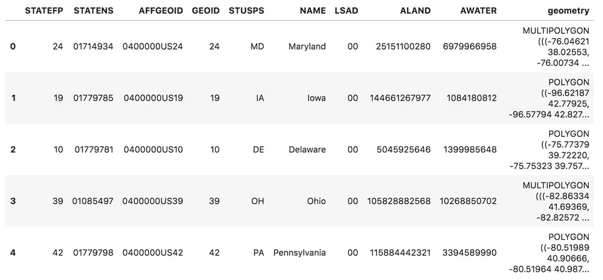

注意“几何”栏，它指定了*多边形*的形状。

现在，我们将把美国人口普查数据作为一个熊猫数据框架加载，并查看其中的一部分:

接下来，我们将 shapefile 与人口数据合并，加入州名:

很好，现在数据已经准备好绘制形状了。我们将按名称指定加利福尼亚:


或者，我们可以通过从 geoplot 加载一个样本数据集来创建一个*地理数据框*(一个包含地理空间数据的数据框)，在本例中是州边界的多边形:

然后画一张美国各州的地图:

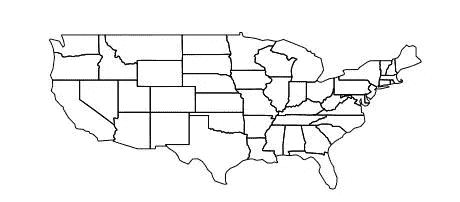

让我们加载另一个样本数据集，在本例中是美国城市:

然后以点的形式标出美国大陆每个城市的位置:

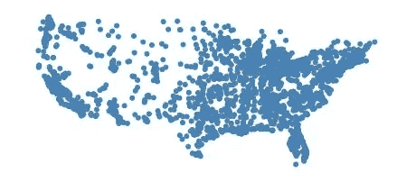

合成这两个，我们将使用*超画*来显示美国大陆的城市和州。请注意，州多边形的“ax”变量如何提供一个轴，我们在该轴上绘制城市:

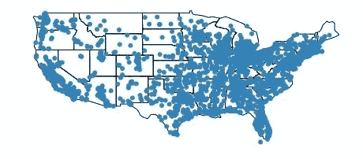

这看起来有点夸张，所以让我们调整*投影*以使用[艾伯斯等面积圆锥投影](https://en.wikipedia.org/wiki/Albers_projection):

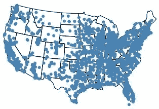

好吧，这样更好！同样，由于地球是一个 3D 球体，投影是一种如何使用某个[坐标参考系统](https://geopandas.org/reference.html?highlight=crs#geopandas.GeoDataFrame.crs) (CRS)将一个区域展平到 2D 地图中的方法。geoplot 库使我们可以方便地使用任意数量的投影— *艾伯斯等积投影*是一个符合库文档的选择。你也可以玩一些你可能还记得的小学游戏，比如“墨卡托 gcrs”。墨卡托()`或它的现代变体，如` gcrs . web 墨卡托()`投影。和他们一起玩吧，让我们知道你更喜欢哪一个，为什么！

# 表示数据

现在让我们比较几种不同的可视化地理空间数据的方法。首先，我们将根据城市的海拔高度更改城市标绘点的*色调*，并添加一个*图例*，以便人们解读不同色调的含义。参数列表开始变得很长，所以我们将在不同的行中指定参数:

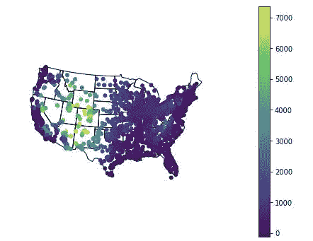

我们也可以使用每个标绘点的*刻度*来表示另一个尺寸。在这种情况下，城市点的比例基于其高程:

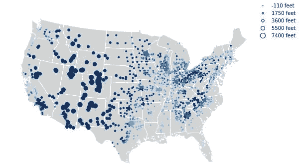

使用 *choropleth* 我们使用不同的色调给多边形着色，以表示数据的维度:

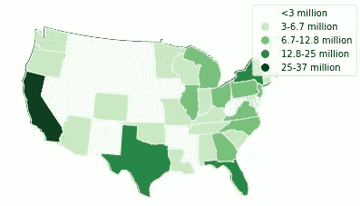

一种被称为*核密度估计* ( [KDE](https://jakevdp.github.io/PythonDataScienceHandbook/05.13-kernel-density-estimation.html) )的数据平滑技术创建等高线来表示数据的维度。在这种情况下，我们将放大查看纽约市各区的交通碰撞:

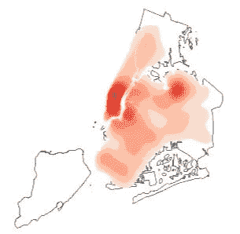

让我们缩小范围，在全美国的主要人口中心尝试 KDE:

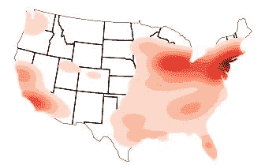

下一节将介绍如何处理与区域(多边形)相关的数据。我们将加载一个关于美国各州肥胖率的数据集:

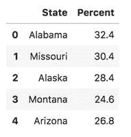

使用*连接*将其转换为地理数据框架。请注意这是如何添加所需的“几何图形”列的:

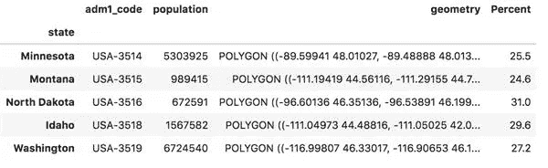

现在我们可以使用这些数据来绘制一个*图表*，它可以增长或收缩多边形来表示一个维度的数据——在本例中，是每个州的肥胖率:


简化数据可视化的一个好方法是将数据宁滨成分位数。这些是大小相等的组，在这种情况下，10 个分位数代表海拔:

这里，我们将高程分为 10 个分位数，每个分位数大约有 375 个值。现在让我们给每个分位数分配一个不同的*色调*，加上一个*图例*来解释它们:

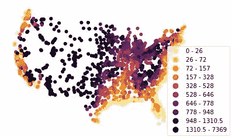

注意*色彩图*是如何被更改为“inferno_r”设置的。

接下来，让我们为可以忽略的典型警告添加一个过滤器:

下一个例子使用了一个 *voronoi 图*，根据数据的维度计算多边形面积。每个多边形以一个*生成点*为中心，这样多边形中的每个位置都比其他任何位置更靠近它的生成点。当您想要检查一列数据，以查看它是否有任何地理空间相关性时，这很有帮助。

在以下示例中，我们将绘制澳大利亚墨尔本小学的位置，并使用 voronoi 图显示它们的集中位置:

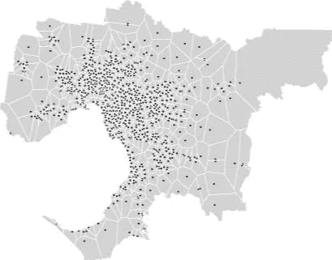

让我们构建一个美国城市海拔的 voronoi 图。这是一种数据平滑技术，因为高程是针对点的，但我们将跨区域“平滑”这些值:

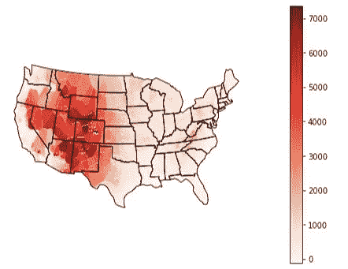

# 可视化新冠肺炎数据

接下来，让我们从华盛顿大学 IHME 中心下载一些新冠肺炎的数据。根据需要更改解压缩目录的名称(下载日期):

然后加载数据集:

我们将过滤行，将此可视化限于 2020 年地球日(4 月 22 日):

现在将州名与之前的美国大陆数据集合并:

为“每百万死亡人数”添加一个计算列:

然后为了形象化这些数据，让我们画出每个州“每百万死亡人数”的曲线图，再画出每个城市的人口:

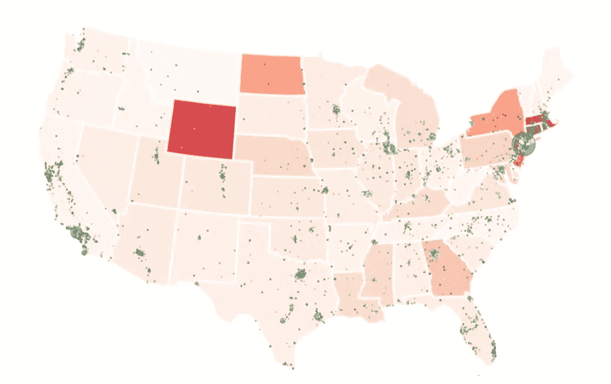

请注意，通过重复使用相同的“ax”变量，choropleth 是如何与点绘图过度绘制的。点绘图规定了一个“zorder”参数(哪一个“层”)和一个“alpha”参数(如何“半透明”)，以使过度绘图更可读。第一个图中的“figsize”参数修改图的整体大小。

这幅图像显示了美国人口集中的地方风险更大:纽约市地区、路易斯安那州、伊利诺伊州、密歇根州、乔治亚州等。这也是 2020 年地球日当天美国关于新冠肺炎的新闻头条的焦点。

# 动画地图

接下来，让我们准备动画这个可视化。我们将定义一个函数来可视化给定日期的数据:

然后定义一个日期范围:

遍历这些日期，为每个日期创建一个可视化结果，并保存到一个文件中:

使用“imageio”以 2 帧/秒的速度将这些单独的图形拼接成动画 GIF:

这是最终动画的视频:

注意:还有一个 [matplotlib.animation](https://matplotlib.org/api/animation_api.html) API，我们可以用它来代替 imageio。前者在最近的版本中有一些 bug，而后者有更多的通用用途。

同样，所有这些代码都可以在 Jupyter 笔记本上找到，网址是[github . com/DerwenAI/IBM _ DSC _ articles/blob/master/2020 _ 05/tutorial . ipynb](https://github.com/DerwenAI/ibm_dsc_articles/blob/master/2020_05/tutorial.ipynb)

如果你想尝试扩展这个可视化的例子，在 https://covidtracking.com/data 的[有很多相关的数据集](https://covidtracking.com/data)

**合著:** [**威廉·罗伯茨**](https://twitter.com/will_s_roberts)

*最初发表在 IBM 数据科学社区博客上，地址:*[https://ibm.biz/paco-geospatial](https://ibm.biz/paco-geospatial)