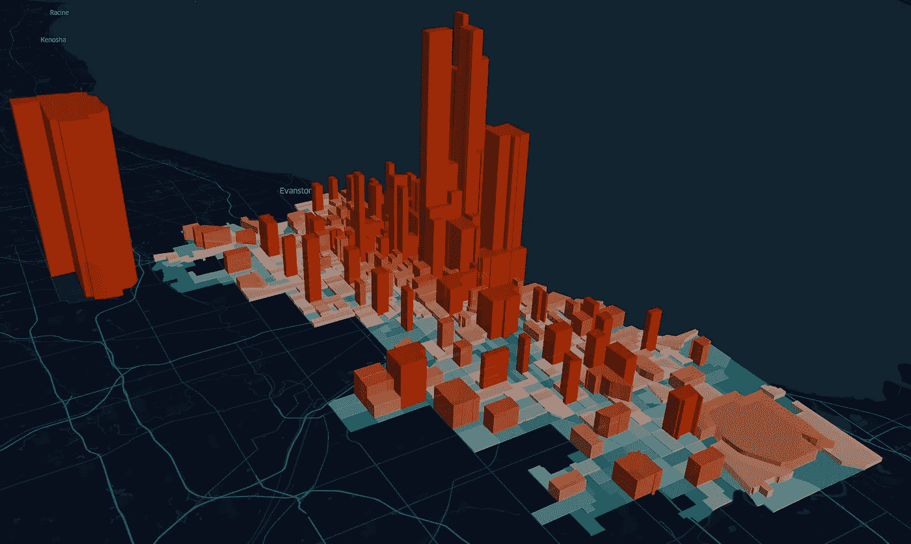
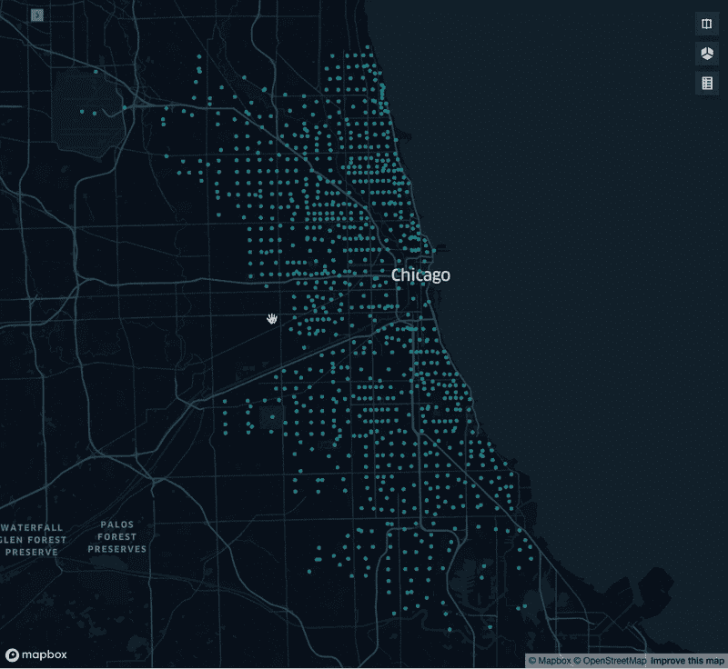
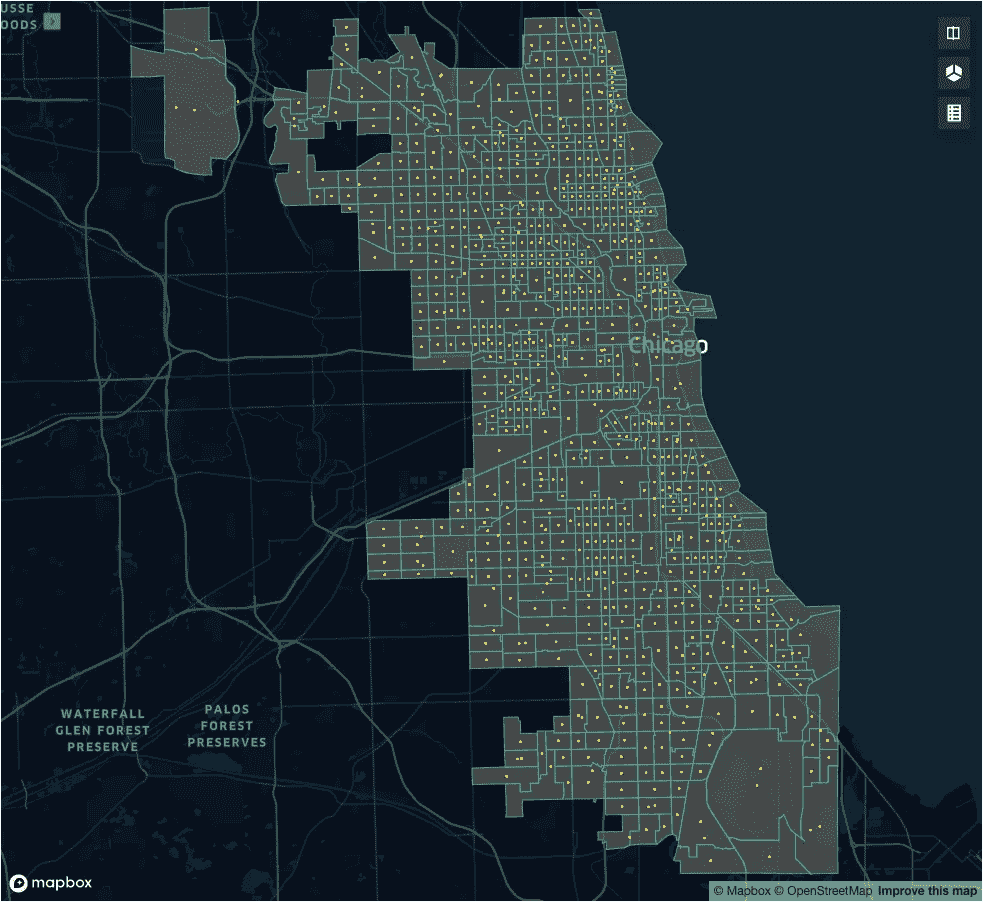
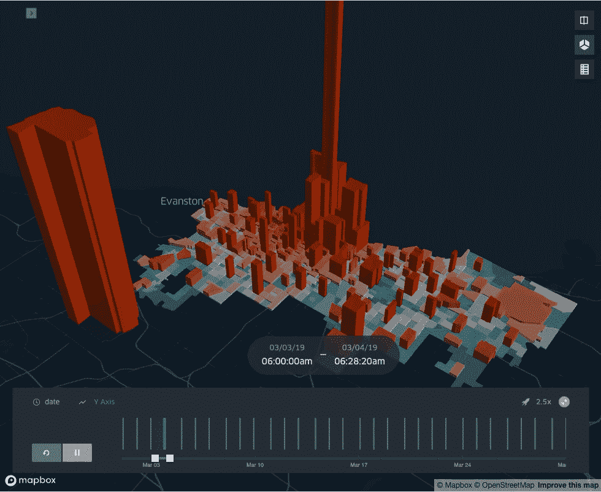

# 使用优步的 Kepler.gl 可视化地理空间数据

> 原文：<https://towardsdatascience.com/visualizing-geospatial-data-with-ubers-kepler-gl-2a437ada573d?source=collection_archive---------34----------------------->

## 了解事件发生的方式、地点和时间。

最终产品是一张按人口普查区域划分的拼车出行地图

Kepler.gl 是优步对地理空间分析的回答。它于 2019 年开源，以最终用户为中心，创建了一个“拖放”系统，能够在瞬间分析数百万个点。幸运的是，对于我们这些喜欢在 Jupyter 笔记本上工作的人来说，他们已经使用 ipywidgets 创建了一个扩展，允许用户在我们的日常数据科学工作流中创建地图。继续阅读教程，轻松开始创建自己的地图！

如果你想在笔记本文件中跟随，继续前进，并在这里叉我的 github repo-found。你也可以在下面玩我们最终地图的现场版本:

 [## 芝加哥的拼车旅行- kepler.gl

www.dancorley.com](https://dancorley.com/chicago.html) 

## **套餐**

首先，我们需要安装将要使用的软件包；GeoPandas、keplergl 和 sodapy。这些可以很容易地安装，然后导入到我们的笔记本电脑与每个人都喜欢的包管理系统，匹普！

安装/导入软件包

## **收集数据**

我们今天要看的数据可以很容易地通过芝加哥市的数据门户网站获得，其中包括从圣诞树回收地点到当前政府雇员工资的各种数据。很多数据，但今天我们将只关注两个数据集——[交通网络提供商——Trips](https://data.cityofchicago.org/Transportation/Transportation-Network-Providers-Trips/m6dm-c72p)和[人口普查区](https://data.cityofchicago.org/Facilities-Geographic-Boundaries/Boundaries-Census-Tracts-2010/5jrd-6zik)。

该城市的数据门户有一个很棒的用户界面，可以方便地导出到用户选择的文件类型。csv，。xml 等。)，但是在撰写本文时，我们的目标数据集已经超过 1.29 亿行。为了节省时间(和本地存储空间)，谢天谢地，他们允许通过 Socrata 进行类似 SQL 的查询。我们之前安装的包(sodapy)将允许我们轻松地对这个数据集进行请求。同样值得注意的是，我们可以匿名访问这些数据，但您将受到限制，为了绕过，您可以获得一个可选的授权令牌-请参见此处的

让我们继续收集我们的旅行数据。以下要点将带领我们创建一个 Socrata 查询，返回由 2019 年 3 月的旅行次数组成的 geojson(按点分组)(纬度/经度坐标),并实例化地理数据框架。然后我们只用三行代码就可以创建我们的第一张开普勒地图……就这么简单！

函数来调用旅行数据，并创建我们的第一个地图

该地图是交互式的，允许用户轻松缩放、平移和滚动点来查看数据。还可以根据与每个点相关联的乘坐次数来定制点，以改变颜色或大小，从而更容易摄取。这可能是本文的结尾，但开普勒不仅仅是点。输入人口普查区域多边形:

调用芝加哥人口普查区域数据集的函数

将图层添加到我们创建的当前地图中，可以让我们看到每个人口普查区域的边界，以及我们之前点的位置。现在，因为这是两个不同的数据集，我们不能根据另一个来操纵每个数据集的属性。借助 GeoPandas 的几何操作，这一点很容易克服，它允许我们检查一个点是否包含在一个区域内，并返回乘坐的总次数:

有了这张地图，我们为我们的最终用户添加了更多的数据，我在最后几张图片中提到过。根据客流量级别创建区域的填充颜色和高度使得从我们的数据中收集见解变得更加简单。

这个看起来很棒，但是还没有完成。我们仍然需要添加等式的最后一部分；时间。下一个代码块运行了我们在这篇文章中完成的查询，并添加了一个 datetime 元素，创建了每天每个区域的乘车次数总和:

现在，我们如何分享它，以便其他人可以享受？？当然 Kepler.gl 的 python 包也有一个简单的方法来做这件事！

保存文件以便于部署！

如果你已经走了这么远，感谢你加入我的地理空间之旅！我们已经通过查询芝加哥的开放数据来收集数据，在 Kepler.gl 中使用点和多边形创建地图，以及使用 GeoPandas 进行几何操作。

如果你对方法论有任何问题/意见，欢迎在评论栏或我的收件箱——hello@dancorley.com 里开始对话