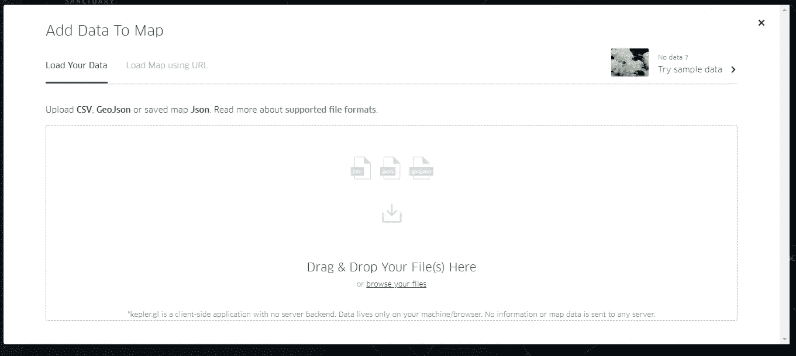
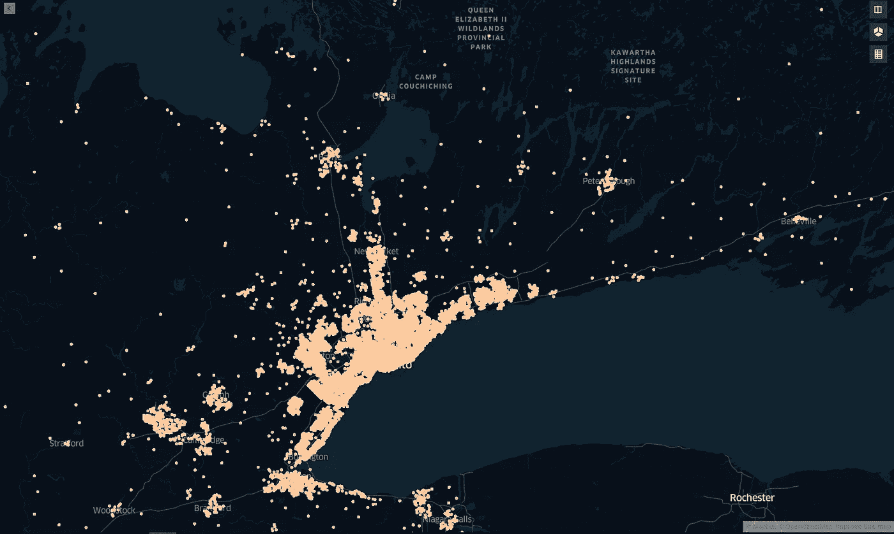
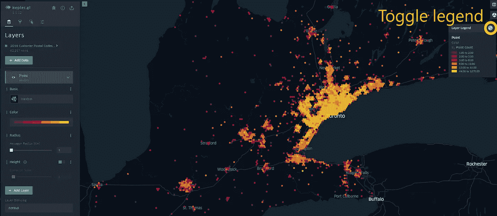
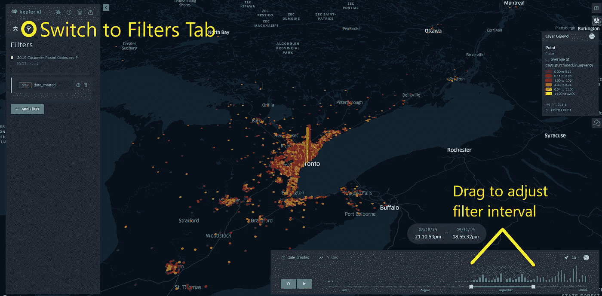
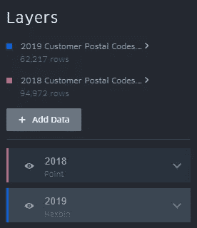
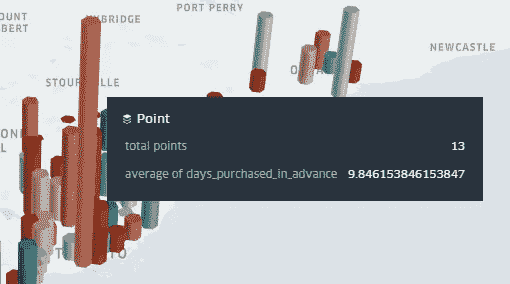

# 用 kepler.gl 可视化地理空间电子商务销售数据

> 原文：<https://towardsdatascience.com/visualizing-geospatial-e-commerce-sales-data-with-kepler-gl-ff127896804e?source=collection_archive---------43----------------------->

## 在几分钟内实现优雅的数据可视化

*(最初发布于*[https://www . dattivo . com/visualizing-geospatial-e-commerce-sales-data-with-Kepler-GL/](https://www.dattivo.com/visualizing-geospatial-e-commerce-sales-data-with-kepler-gl/)*)*

# **任务背景**

作为内部研究和发现工作的一部分，我们希望评估可视化数据分析工具的可用性和功能，以检查我们的一个客户举办的活动的在线门票销售数据集。我们的数据集包括在线购买活动门票的客户的位置，以及提前多长时间购买活动门票。在这种情况下，像 [kepler.gl](https://kepler.gl) 这样的数据可视化工具非常适合快速生成任何观察者都能轻松理解的数据视图。

Kepler.gl 是由优步开发的开源地理空间数据分析和可视化工具。Kepler.gl 可以直接集成到基于 React 的 web 应用程序或 Jupyter 笔记本中。在这个练习中，我们将在 https://kepler.gl/demo[使用“演示应用程序”。](https://kepler.gl/demo)

请注意，虽然这些可视化效果是由现实生活中的事件激发的，但实际的可视化效果只是为了演示 kepler.gl 而放在一起的。

# **地理编码电子商务订单**

在对订单数据集执行任何地理空间分析之前，我们首先需要通过为每个订单分配一个纬度和经度来对附加到订单的地址进行地理编码。对于我们的数据集，一个包含客户订单和相关细节的 MySQL 数据库，我们将基于客户账单地址的邮政编码来完成这项工作。许多提供商提供不同价位和请求限制的地理编码 API，但在本练习中，我们将使用 Google 的地理编码 API。为了获得最佳结果(以及数据集的一般可读性)，我们通过将字母转换为大写并过滤掉任何空格、连字符或其他非字母数字字符来“规范化”邮政编码。

将初始数据集导出到 CSV 文件后，下一步是检索地理编码数据。这是使用 Python 脚本完成的，但当然也可以使用任何允许您发出 HTTP 请求和/或写入 CSV 的语言来完成。首先，我们导入必要的库，并将地理编码数据加载到 Pandas DataFrame 对象中:

熊猫⁴是一个非常强大的 Python 开源库，具有许多数据操作和分析的特性。它可以快速有效地读写串行数据或 DataFrame 对象中的数据，处理 CSV、Excel 或文本文件，以及数据库导出。接下来，我们将开始构建邮政编码“目录”的过程，将邮政编码映射到其纬度和经度值。条目的示例可能是:[N6J3T9，43.3326543，-79.4324534]。我们将使用它来修饰我们当前的数据集，但也保留它以备将来使用，以便我们可以在将来将它应用于任何重复的邮政编码，而不必进行多余的 API 调用。为了向 Google 的地理编码 API 发出这些请求，我们使用 Python 的开源 [Requests](https://requests.readthedocs.io/en/master/) ⁵库，它提供了发出 HTTP 请求的简单函数，来创建一个会话对象来发出我们的多个请求。我们还使用了[地理编码器](https://geocoder.readthedocs.io/) ⁶库，它带有简单的功能，可以向许多不同的提供商发出地理编码 API 请求，包括 Google、Bing、ArcGIS 等等。

这段代码将遍历数据集中每个唯一的邮政编码，并请求获取其大概的经度和纬度。我们将把响应保存到我们的目录文件中，并输出到控制台，这样我们仍然可以把它复制到一个文件中，以防脚本运行时出现问题。如果脚本由于任何原因中断，并且我们最终只得到部分地理编码数据，我们可以简单地重复该过程，过滤掉任何已经地理编码的值，并将结果文件合并在一起。

一旦我们有了地理编码数据，我们就可以用 Pandas 来修饰我们最初的客户数据导出。

准备好数据后，我们现在准备将其导入 kepler.gl。

# **在 kepler.gl 中可视化数据**

将数据加载到 kepler.gl 很简单，https://kepler.gl/demo[的演示应用程序提供了一种直观的方式来立即在地图上查看数据。页面首次加载时，会提示您上传数据。请注意，kepler.gl 演示在您的浏览器中运行，因此任何上传的数据都不会发送到他们的服务器，而是保留在您的本地计算机上。](https://kepler.gl/demo)

基于数据集中的列，kepler.gl 将尝试自动决定如何呈现数据。如果您的数据集包含标记为“lat”和“lng”的列，kepler.gl 将自动识别它们，并使用这些字段将您的数据放置在地图上。

定义数据图层时，也可以手动指定用于纬度和经度的列。单击图层名称旁边的符号查看设置，然后单击“基本”旁边的省略号选择要用于点位置的列。

当前状态下的地图向我们显示了每张已购买机票的位置，但是 kepler.gl 提供了不同的图层类型，我们可以使用它们来聚合数据。在这个练习中，我们将使用一个 Hexbin 层，它将数据点聚合成一个指定半径(默认为 1 公里)的六边形。

基于指定的度量，将选定光谱上的颜色分配给每个六邻体。默认情况下，这基于点计数，但可以更改为数据集中的任何列。还可以配置使用的色标和光谱中的级数。

如果我们通过切换右上角的立方体图标从 2D 地图切换到 3D 地图，我们可以根据数据集中的另一个字段为我们的 hexbins 分配一个高度值。在这个例子中，我们用高度表示每个聚类的点数(在我们的例子中，它表示购买的门票数量)，用颜色表示在活动日期前多少天购买的门票。还可以应用高程比例，以便更容易地识别数据集中的极值。

从视觉上看，我们可以看到，虽然有客户会提前购买全省的门票，但那些远离多伦多市中心的客户似乎更有可能在接近活动日期时购买(其中较暗的数据点表示门票是在活动当天购买的)。这是有意义的，因为天气等变量会影响客户的决策过程。

接下来，我们可以基于数据集的任何列对数据集应用过滤器。单击漏斗图标切换到过滤器选项卡，然后单击添加过滤器并选择一列。

对于数值或“时间”数据类型(例如，格式化为日期和时间，如 2019–12–25 12:00:00)，您可以通过单击并拖动显示的范围来选择要过滤的列的最小值、最大值和范围值。按时间值过滤时，您还可以单击播放按钮来显示地图数据的延时动画(您需要单击并拖动屏幕底部的日期过滤间隔的边缘，这样才有用)。对于字符串或日期等其他数据类型，可以选择特定的值进行筛选。

如果我们想要比较多个数据集之间的数据(例如，多年的活动销售数据)，我们可以简单地在 kepler.gl 中向我们的可视化添加另一个图层。此时，从默认的“点”标签的图层选项卡中重命名您的图层很有帮助，以便更容易地在菜单和图例中区分它们。

如果您愿意，可以在同一个地图视图上显示多个图层，但是如果我们像本例中一样尝试在相似的数据集之间进行直接比较，在各自的地图上查看每个数据集会更有意义。我们可以通过点击右上角的图标切换到双地图视图，并切换每个视图中可见的图层。请注意，滤镜是分别应用于每一层的。

# **结论**

如前所述，数据集的初始地理编码数据检索和修饰可以通过多种方法完成，但我们选择使用提到的 Python 库，以评估它们在未来项目中的效用。这个练习没有深入到 Pandas 的功能中，但是我们鼓励您深入了解它，看看它是否适合您的需要，因为它提供了各种各样的功能。

Kepler.gl 允许非常快速地生成专业外观的数据可视化，并提供许多不同类型的数据可视化。除了这里演示的点和六边形以外，kepler.gl 的可用数据图层还包括用于聚合分析的热点图和聚类、用于可视化移动的弧和线，以及用于显示复杂路径或多边形(如出行路线)的 GeoJSON 图层。如果我们将来需要执行这些类型的分析，kepler.gl 将是一个显而易见的选择。生成的视图在第一次呈现时有一个明确的“哇”的因素，并且可以根据被调查的数据提供清晰的、可操作的见解

Kepler.gl 也是一个 React 库，可以集成到现有的前端项目中。对于未来的工作，我们可能会研究实现在嵌入管理界面的 kepler.gl 地图中查看最近销售数据子集的能力。

需要注意的一点是:数据点的颜色比例和高度/大小会根据当前正在检查的数据子集而动态变化。这意味着，当从一个视图到另一个视图比较数据时，您必须关注图例，以确保您得出的结论是准确的。例如，来自不同过滤数据集的两个点可能具有相同的颜色，但是为其分配特定颜色的值的范围在视图之间可能不同(例如，在一个视图中，值小于 16.2 的点可能显示为红色，而在另一个视图中，阈值为 12.0)。遗憾的是，在执行时间序列回放或使用双地图视图时，目前似乎没有标准化该比例的方法。

# **参考文献**

[1] [开普勒. gl](https://kepler.gl/)

[2] S. He，[从美丽的地图到可行的见解:介绍开普勒. gl，优步的开源地理空间工具箱](https://eng.uber.com/keplergl/) (2018)

[3][kepler.gl/demo](https://kepler.gl/demo)

[4] [熊猫— Python 数据分析库](https://pandas.pydata.org/)

[5] K. Reitz，[请求:人类 HTTP 请求 2.23.0 文档](https://requests.readthedocs.io/en/master/)

[6] D. Carriere， [Geocoder:简单、一致— geocoder 1.38.1 文档](https://geocoder.readthedocs.io/)