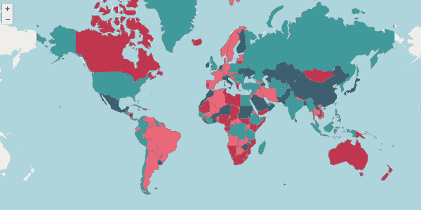
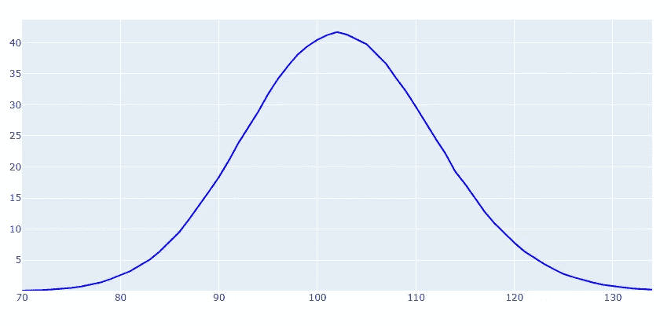
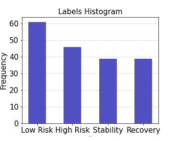

# 使用 leav 可视化新冠肺炎的全球地位

> 原文：<https://towardsdatascience.com/visualizing-global-status-of-covid-19-using-folium-52797b5dcc19?source=collection_archive---------63----------------------->

## 这个博客是关于根据国家对抗冠状病毒的表现将国家分为不同的组，并最终可视化地理结果。

2019 年全球冠状病毒状况

冠状病毒已经影响了我们每一个人的生活。随着世界大部分地区陷入经济活动萎缩的困境，我们每个人都想知道我们在遏制疫情方面做得有多好，它何时会最终结束？

虽然预测疫情的终结是一个百万美元的问题，也是另一个博客的主题，但这篇文章是关于理解和可视化所有国家如何抑制其蔓延。在这篇博客中，我们的目的是根据确诊病例、死亡和患者康复数据将国家分类，然后在地图上显示出来。

# 方法

我们将使用 PPDAC 方法来解决这个问题。我们将从讨论我们的问题开始，然后计划解决它。一旦我们弄清楚了这一点，下一步就是收集必要的数据并对其进行分析。最后，我们将提出我们的结论并交流我们的结果。

解决数据科学问题的 PPDAC 方法

我们会一步一步地走完每一步。

# 问题

我们试图解决的问题是将不同的国家分为不同的类别，分别命名为“低风险”、“高风险”、“稳定”和“复苏”。在这一点上，我们只能模糊地定义这些群体。如果新冠肺炎病毒的传播正在增加，增长仍然是线性的，但存在指数增长的普遍风险，我们可以将任何国家标为“低风险”。使用类似的标准，“高风险”国家是 COVID 病例呈指数增长的国家。“稳定”阶段可以定义为病例减少和指数增长停止的情况。最后，恢复是指病例非常少，而且该国正在走向彻底根除疫情。由于新病例不能作为确定任何国家状况的唯一标准，我们需要有类似的报告死亡和成功康复的标准。

一旦我们对我们的标签有了一个模糊的理解，我们就需要制定一个标准，如何从一个包含新病例、死亡和康复的数据集转移到一个包含我们的标签的数据集。为此，我们必须后退一步，理解疫情图。

疫情图

我们现在已经看够了这个图表，它解释了使曲线变平的所有智慧，这样医疗保健系统就不会压力过大，最迫切需要医疗护理的人可以得到最多的医疗护理。但是我们可以比这挖得更深一点。正如我们从图表中看到的，病例数开始或多或少地呈线性增长，之后呈指数增长。指数增长达到峰值，之后开始下降。这是任何流行病的一般趋势，它达到最大值，趋势开始逆转。这一点被称为病毒的死亡，因为在这一点上，要么所有的人都被感染，人群中没有更多的人被感染，导致病毒死亡，要么在另一种情况下，采取措施，如社会距离，锁定，这拒绝了新的宿主病毒导致其死亡，或者我们可能有最终的救世主，一种疫苗基本上杀死它。

有了这样的理解，我们现在可以看看另一个有趣的特征，在特定点的导数或变化率。这定义了每天新病例的增加或减少。请看下图:

正如我们所见，导数展示了四种特定的行为。第一个，当变化率是正的和线性的，在这个点之后它变成指数正的。在达到最高点之后，梯度为零，它开始变成指数负值，并最终变成线性负值。衍生产品的所有这四种不同行为都可以与我们的标签联系起来，即低风险、高风险、稳定和恢复。这个想法可以用下图来表达:

哇，我们这里有很多信息，我们还有一段路要走。顺便说一下，如果你有兴趣了解我是如何制作这些图表的，请查看这里的。

现在，我们已经定义了衍生品如何帮助我们确定任何特定国家的地位或标签，故事中还有另一个陷阱。我们注意到，即使该国处于稳定阶段，回到低风险或高风险阶段，病例数量仍可能增加。为了迎合这一点，我们需要以某种方式检查情况是在变好还是在变坏。

我们可以通过将任何特定一天的导数与 14 天的平均导数(14AVd)进行比较来做到这一点。如果我们用特定一天的导数减去 14AVd，值为负，这意味着特定一天的导数高于 14 天的平均值，这意味着情况正在变得更糟。反之亦然，如果答案是肯定的，这意味着情况正在好转，疾病正在走向根除。

现在，我们可以将上述基本原理应用于确诊病例、死亡和康复的所有数据集。一旦完成，我们就可以应用 K-means 算法来寻找组的聚类。由于我们对可视化和简单理解 k-means 结果更感兴趣，所以我们需要将我们的维度从新增病例、死亡和恢复的三个维度降低到两个信号。

新病例信号对确定任何国家的情况都至关重要。我们称这个信号为“强度信号”。它决定了病毒在特定国家传播的快慢。然而，死亡和康复的其他数据集是疾病的两个结果。要么，任何人都可能死于这种疾病，要么康复。从今以后，死亡和康复可以结合起来产生一个冲击信号。我们可以从死亡中减去康复。如果结果是负数，这意味着死亡人数大于复苏人数，情况正在变得更糟，而在其他情况下，结果是积极的，这意味着复苏正在增加，情况正在好转。

看看下面的象限，它们有意义吗？

据此，我们更新了不同标签的定义，建立了从新病例、死亡和康复的数据集到特定国家的标签或标记的必要联系。

当我们进行编码时，我们将把这种方法称为“algo”。没有特别的理由称之为“算法”。只是我找不到更好的了，:D

最后，我们可以将“强度”和“影响”这两个信号输入 k-means 算法，以生成组的聚类，从而确定标签。

Huff，如果你正在跟随，拍拍你的背，为你欢呼。

# 计划

我们将使用由 HDX 编辑的数据集，并将上述基本原理应用于熊猫。数据集可以在[这里](https://data.humdata.org/dataset/novel-coronavirus-2019-ncov-cases)找到。该数据集包含每个国家每日新增确诊病例、死亡和恢复的数量，并且几乎每天更新。

一旦我们完成编码，我们只需要更新数据集，每个国家的新标签将自动计算。

# 数据

现在是时候用代码弄脏我们的手了。我们将首先从 HDX 网站[这里](https://data.humdata.org/dataset/novel-coronavirus-2019-ncov-cases)下载新确诊病例、死亡和康复的所有相关数据集，并将它们放在一个名为“数据集”的文件夹中。

现在需要一些预处理。很少有国家有一个以上的列与自己相关联，像澳大利亚有八个相关联的列，每个列代表一个州。我们需要将所有这些列相加，以获得整个国家的数据。

接下来，我们需要将每个数据集作为一个熊猫数据框，提取最后 14 列数据，计算导数，并使用它来计算所有国家的 14 天平均值。

完整的 python 实现以及代码解释可以在[这里](https://github.com/usamatrq94/covid-19-global-status/blob/master/scripts/data_preprocessing.py)找到。至此，我们已经完成了数据预处理练习，可以继续前进了。

# 分析和结论

我们已经走得足够远，可以对我们的数据实现 k 均值。这个想法是在两个强度和冲击信号之间应用 k-means 聚类，看看我们是否能找到一些足够接近我们早先开发的基本原理的聚类。KNN 的 python 实现可以在[这里](https://github.com/usamatrq94/covid-19-global-status/blob/master/scripts/knn.py)找到。一旦我们运行这个 python 脚本，我们最终会得到如下所示的聚类图:

现在，我们需要根据我们之前开发的原理，查看哪个集群可以被标记为“低风险”、“高风险”、“稳定”和“恢复”。正如我们所看到的，大部分国家都被困在原点附近，只有少数国家在他们的探索中做得特别好或特别差。然而，正如我们所看到的，集群并没有像我们预期的那样形成。我们已经结束了左边的三个集群，标记出可以被称为低、中、高风险区域的区域，而例外的是没有国家处于复苏阶段，描绘了一幅令人沮丧且与事实相反的画面。

我们数据集的主要问题是离群值问题，这使得聚类过程变得困难。正如我们所看到的，在图表的右边有一个国家，做得非常好。但是它使我们无法进行聚类工作，因为它被当作自己的一个聚类。为了解决数据中的这些问题，我们可以尝试使用一个简单的 if-else 函数对我们之前的基本原理进行编码，并查看其结果。

对右边的国家很好奇。点击查看[。](https://covid-scatter-using-knn.web.app/)

我们之前开发的基本原理的一个简单 Python 实现可以在[这里](https://github.com/usamatrq94/covid-19-global-status/blob/master/scripts/algo.py)找到。生成了下图。

是啊，这还差不多。按照我们的基本原理准确地描绘我们的世界。然而，上面提到的右边的异常值在这里被忽略了，以强调数据集中的主要聚类。分配状态标签后，我们可以进入项目的最后一个也是最有趣的部分，地理数据可视化。

我们将使用 Geopandas 和 leav 来可视化我们的数据。安装 geopandas 有时会很棘手。如果您正在任何阶段挣扎，请看看如何创建 anaconda 的环境来管理依赖关系。

一旦我们的环境创建完成，Geopandas 和 Folium 启动并运行，我们就可以在这里实现代码来生成我们对抗冠状病毒的性能的全局可视化。

请使用[这个](https://covid-19-visualization-f0e1a.web.app/)链接查看你所在国家的状态。

我们终于看到了新冠肺炎的世界地位。结果更新至 2020 年 4 月 11 日。想要可视化当前状态吗？只需锥形[这个](https://github.com/usamatrq94/covid-19-global-status)储存库，更改文件夹数据集中的文件，并执行 jupyter notebook [这里的](https://github.com/usamatrq94/covid-19-global-status/blob/master/Covid19-Global-Status.ipynb)。

在最后，一个直方图显示了每种状态下的国家数量，可以帮助我们进一步了解世界的状态。

正如我们可以想象的那样，世界上最大的一部分陷入了“低风险”,稳定和复苏的频率越来越低。对于许多国家正在复苏的世界来说，这仍然是一线希望。低风险和高风险的最高频率强调了仍然坚持自我隔离和社会距离的重要性。

数据可视化完成后，讨论我们的数据和算法的缺点是很重要的。所使用的强度信号并不是一个很强的方向指示器，这个国家正在前进。几个病例的随机出现可以极大地影响一个国家的地位。另一个主要争论点是缺少测试数据。怎么强调都不为过，任何国家的地位都可能是虚假的，因为它没有积极地测试其公民。事实上，病毒的传播速度可能比想象的要快得多。

最后，我想说，我绝不是流行病方面的专家，但是如果有人碰巧读到这篇文章，请随时向我提出你的建议。我们可以一起使这些数据更准确，更能代表地面的实际情况。同时，[这里的](https://covid-19-visualization-f0e1a.web.app/)是可视化 web 应用的链接，玩一玩，乐一乐。

特别感谢[艾哈迈德·赛义德](https://medium.com/u/ceebfb520c69?source=post_page-----52797b5dcc19--------------------------------)对这个项目的帮助。