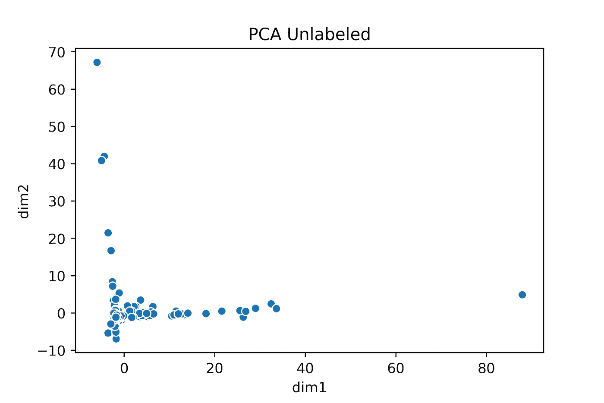
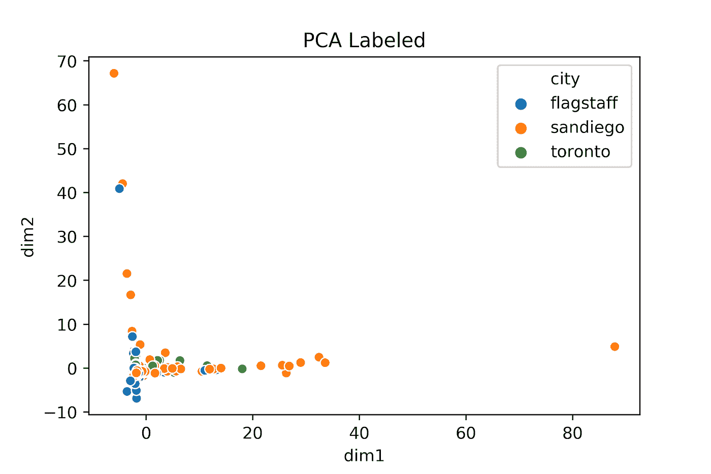
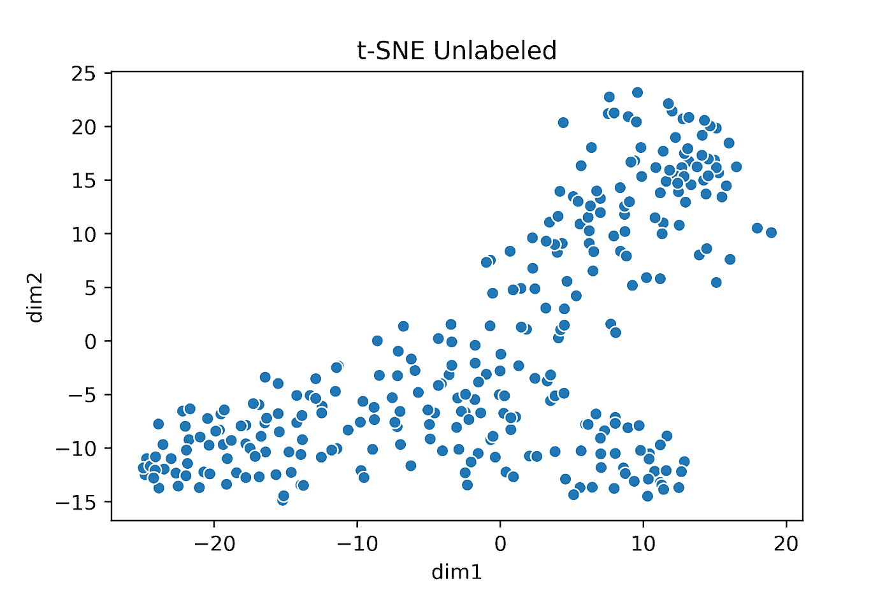
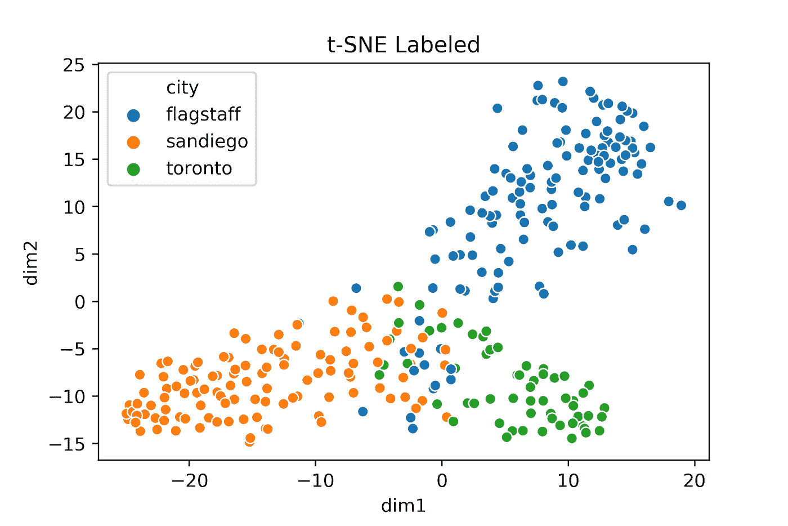
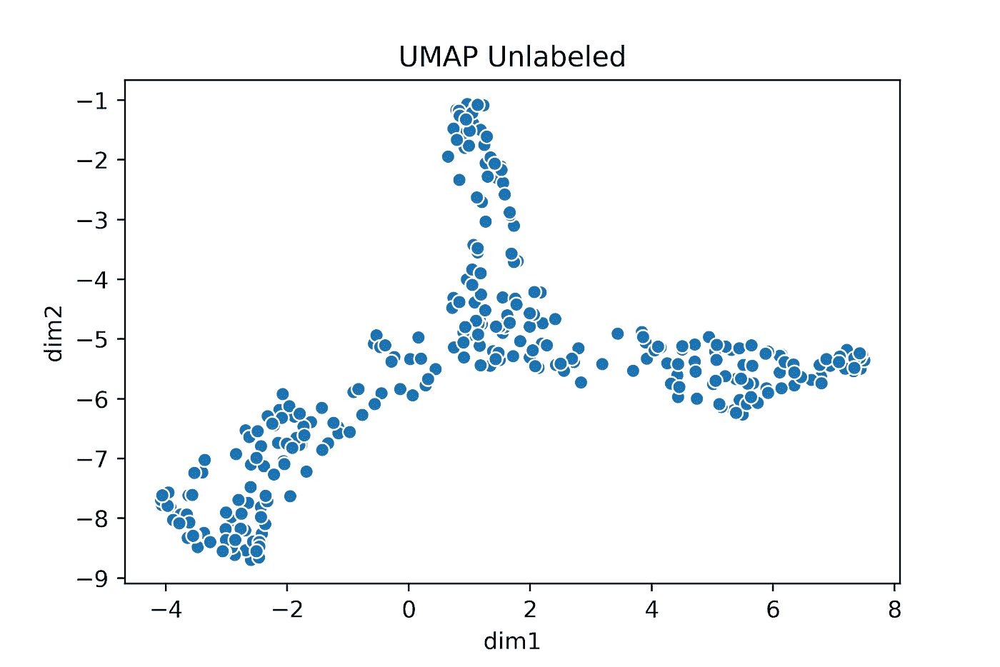
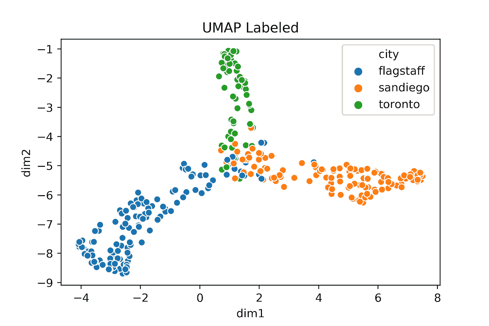
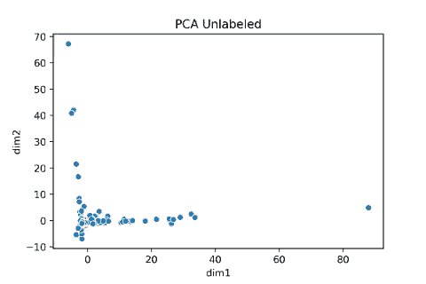

# 可视化高维微生物组数据

> 原文：<https://towardsdatascience.com/visualizing-high-dimensional-microbiome-data-eacf02526c3a?source=collection_archive---------22----------------------->

来源:wallpapercave.com/dna-background

## 第 2 部分—基因组数据科学系列

本文是将机器学习应用于生物信息学数据的系列教程的一部分:

[第一部分—数据采集&预处理](/analyzing-microbiome-data-320728b56b8e)

第 2 部分—降维

为了跟进，你可以在这里下载我们的 Jupyter 笔记本，或者继续阅读并输入下面的代码。

# 介绍

无监督的机器学习方法可以让我们在没有给定明确标签的情况下理解和探索数据。一种无监督的机器学习方法属于聚类家族。获得相似数据点的组或簇的一般概念可以告知我们数据中的任何潜在结构模式，例如地理、功能相似性或社区，否则我们不会事先知道这些信息。

我们将把我们的降维技术应用于从 UCSD 的 Qiita 平台获取的微生物组数据。如果您还没有这样做，请参阅本教程系列的[第 1 部分](/analyzing-microbiome-data-320728b56b8e)了解如何获取和预处理您的数据，或者在这里下载我们的笔记本。在我们继续前进之前，我们需要这个。基本上，我们的微生物数据集的列代表细菌 DNA 序列的数量，我们的行代表单个细菌群落的样本。这种类型的数据表可以从 Illumina NGS 测序数据经过各种生物信息学数据清理和转换后创建。我们期望来自不同环境的样本具有不同的微生物特征，因为细菌群落受其环境的影响。我们为本文处理的数据是从多伦多、弗拉格斯塔夫和圣地亚哥采集的样本，它们应该各不相同。我们希望将这种隐藏在细菌组成中的差异可视化。

预计这三个不同地点的细菌群落是独特的，我们希望通过高维微生物组数据来可视化这一点。图片来源:Pexels，由用户修改。

为了将这种复杂、稀疏和高维的宏基因组数据可视化为我们的眼睛可以在二维计算机屏幕上解释的东西，我们将需要大幅减少我们的维度大小，或者换句话说，我们数据中的特征数量。我们的数据集有 25，000 列，这些列目前代表了每种生物体的一部分基因序列以及它们在我们的微生物组中的数量，相反，我们希望绘制“最重要的特征”的概念。本文探讨了应用于微生物组数据的 3 种不同的维度减少和可视化技术，并解释了这些可视化可以告诉我们关于我们的数据中固有的结构的信息。

所有可视化都是用 python 和 Matplotlib 和 Seaborn 绘图包制作的，pandas 用于构建数据框。

出于演示的目的，由于我们实际上有这个数据集的标签，我们可以通过为对应于不同地理位置的每个点分配不同的颜色来确认我们的数据集是否产生了良好的可视化效果。在现实中，如果你已经在采用无监督的机器学习方法，你通常不会有这种情况。

# 主成分分析

我们的第一种降维技术，也是最常用的一种，叫做主成分分析(PCA)。PCA 试图将特征空间减少到数据中发现的变化的表示。它通过获取所有数据点并旋转到清晰显示最大可变性的轴来实现这一点。这个轴被称为你的“第一主成分”。从数学上来说，这条线的位置穿过数据的质心，同时也最小化了每个点到这条线的平方距离。它也是数据变化最大的轴。重新排列数据后，我们将把所有数据点折叠到该维度上。一旦这一步完成，我们冲洗和重复，记住，每次我们找到一个新的主成分，新的线将总是垂直于前一个主成分。看这里([https://setosa.io/ev/principal-component-analysis/](https://setosa.io/ev/principal-component-analysis/))对 PCA 的形象化解释。

为了进行 PCA，我们可以在我们之前构建的特性表上运行下面的代码。

来源:作者图片

如果给我们一些标签来检查我们的维数减少情况(提醒一下，在现实中这是不能保证的)，我们可以用颜色重新绘制我们的 PCA:

当我们将数据从 1，894 个特征转换为 2 个特征时，我们可以看到数据被放入两个可辨别的维度。然而，一旦我们在数据的地理来源被揭示后查看数据的真正含义，我们会发现这种可视化技术*并没有*给我们一个地理数据的良好表示。不幸的是，当应用于微生物组数据产生的稀疏水平时，这种常见技术就分崩离析了。

*需要注意的是，应用 PCA 后，我们可以得到各种形状的图。为了解释你可以得到的不同形状，我们建议你看看这个帖子[这里](http://www.nxn.se/valent/2017/6/12/how-to-read-pca-plots)。

# t-SNE

另一种用于探索像我们的微生物组数据这样的高维数据的技术是使用一种被称为 t-分布式随机邻居嵌入 [t-SNE](http://jmlr.org/papers/volume9/vandermaaten08a/vandermaaten08a.pdf) 的东西。与 PCA 不同，它通过使用线性方法试图在我们的低维表示中保持不同的数据点相距很远，t-SNE 试图通过试图保持相似的数据点靠近来处理位于非线性低维流形上的数据。

t-SNE 通过最小化两个分布之间的差异来工作。第一个分布来自我们在原始高维输入空间中对象的成对相似性。第二个分布是我们在相应的低维嵌入中对象的成对相似性。本质上，我们试图最小化原始高维空间和相应的低维空间的这两种分布之间的差异。

要运行 t-SNE，让我们使用 scikit-learn 的实现，并在之前的功能表上运行它:

在我们继续之前，让我们提出几个要点。t-SNE 的一个参数是我们用来计算特征实例之间距离的度量。默认值是*欧几里德*距离，但是因为我们使用计数作为每行的条目，所以我们将使用一个称为 *Jaccard* 距离的度量。实质上，Jaccard 距离度量是两个集合中的计数数量除以任一集合中的数量，乘以 100，然后从 1 中减去所有这些。它从技术上衡量样本集之间的差异。

我们可以在 t-SNE 中调整的另一个重要的超参数是*困惑*。从本质上说，困惑让我们能够平衡我们在数据中对本地和全球关系的重视程度。我们选择坚持困惑=30 的默认设置，但是我们强烈推荐这次探索 t-SNE 和困惑[这里](https://distill.pub/2016/misread-tsne/)。

让我们绘制 t-SNE 嵌入的结果，显示一个没有标签的图(同样，就像你在真实的无监督场景中所期望的那样)和一个有已知标签的图:

当标签被揭示时，我们可以看到，这种嵌入是我们微生物组遗传数据中存在的潜在地理结构的体面代表，正如从相同地理区域获取的数据点在它们自己的象限中所证明的那样。接下来，我们将转向 UMAP，这是一种我们发现对这类数据最有效的技术。

我们将用于表示高维微生物组宏基因组数据的最后一种降维技术称为一致近似和投影(UMAP)。UMAP 改进了 t-SNE 的性能，不仅在明显更短的时间内更好地处理更大的数据集，而且保留了更多的原始数据全局结构。为了更深入地比较 t-SNE 和 UMAP，我们在这里推荐这个教程。

UMAP 的数学基础集中在首先构建一个加权图，其中边权重表示点之间连接的可能性。这是由从每个点向外扩展的半径和具有重叠半径的连接点决定的。随着每个点的半径增加，其连接的可能性降低。

类似于 t-SNE，我们也可以调整与 UMAP 相关的超参数，以平衡我们在低维嵌入中的局部和全局结构。我们的 *n_neighbors* 参数对应于用于构建原始图形的最近邻点的数量，低值强调局部结构，高值强调全局结构。

第二个主要参数是 *min_dist* 的参数。该参数表示我们在低维嵌入中想要的点之间的最小距离，低值给出更紧密包装的点组，而较大值给出更松散包装的点组。我们建议在这里使用交互式可视化[来获得对 UMAP 超参数的直观感受。](https://pair-code.github.io/understanding-umap/)

现在让我们用 UMAP 创建新的低维嵌入:

…并且带有标签:

正如我们可以看到的，一旦我们应用颜色来显示我们的标签，似乎 UMAP 在将基础地理结构从我们原始的高维宏基因组数据集传递到上面的低维可视化方面做得更好，图中的每个“轮辐”或“花瓣”代表该地区的当地微生物群落，也称为那些微生物组。

# 结论

微生物组数据因其固有的高维度和稀疏性而呈现出独特的挑战。为了降低维数，我们应用了三种技术:主成分分析，t-SNE 和 UMAP。在对类似数据进行分组方面，如具有类似地理来源的微生物样本，UMAP 表现最好。

在上面的基础上，我们可以使用这些 2D 嵌入结合我们最喜欢的聚类算法来从数据中推断类别。我们可以尝试将维度减少到任意数量的维度，然后在此基础上应用聚类，而不是将维度减少到两个维度。使用聚类方法对微生物组数据进行分类是我们可能在下一篇文章中讨论的主题。

这一系列教程的两位合著者是[尼古拉斯·帕克](https://medium.com/u/76a19323c6b6?source=post_page-----eacf02526c3a--------------------------------) & [蒙迪·雷默](https://medium.com/u/65f1193d859e?source=post_page-----eacf02526c3a--------------------------------)，他们都是旧金山大学数据科学硕士项目[的毕业生。](https://www.usfca.edu/arts-sciences/graduate-programs/data-science)

如果您想联系我们，请联系我们:

**蒙迪·雷默** [领英](https://www.linkedin.com/in/mundyreimer)
[个人博客](https://mundyreimer.github.io/)
[推特](https://twitter.com/MondayRhymer)

**尼克·帕克** [领英](https://www.linkedin.com/in/nicholas-j-parker)
[个人博客](https://medium.com/@njparker_8716)

PCA，SNE 霸王龙和 UMAP。用户创建的图像。