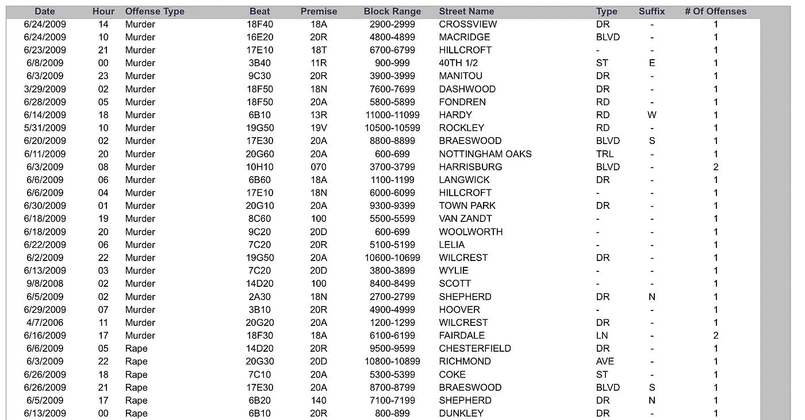
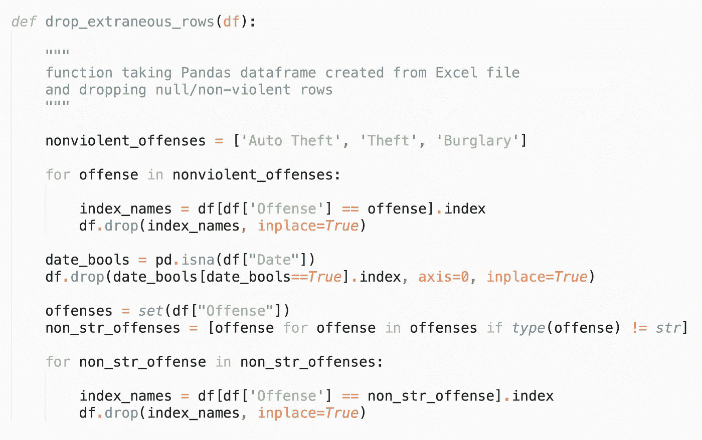
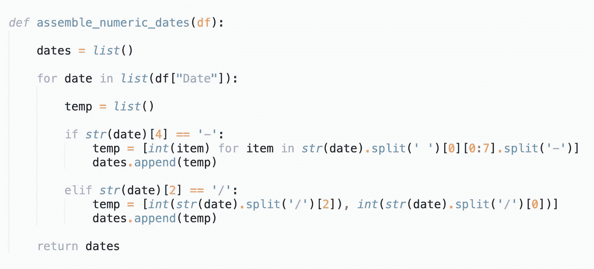
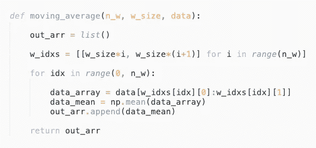
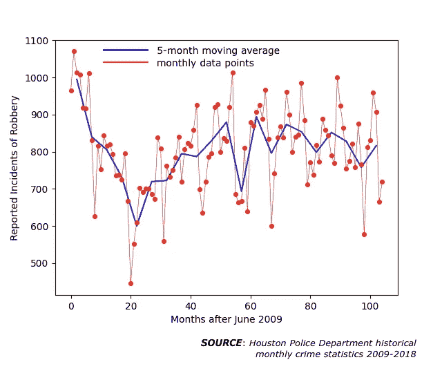

# 通过数据收集和清理可视化休斯顿暴力犯罪趋势

> 原文：<https://towardsdatascience.com/visualizing-houston-violent-crime-trends-via-data-collection-and-cleaning-64592a8bac25?source=collection_archive---------43----------------------->

黄昏时分的休斯顿市区。 [Pixabay](https://pixabay.com/) 供图。

暴力犯罪是表明社会疾病的症状之一。这在很大程度上是因为一个社会及其政府未能提供人类繁荣所必需的要素:食物、住所、教育、职业培训和获得身心保健。与此同时，犯下滔天罪行和轻微罪行的人都具备这些基本条件。在本文中，我将使用暴力犯罪统计的例子来说明 Python 中的基本数据科学方法。特别是，我将关注我的家乡德克萨斯州休斯顿的暴力犯罪数据。

本文的目标是展示

1.  **数据采集**:网页抓取将文件下载到本地目录
2.  **数据清洗**:仅提取并存储所需值
3.  **数据可视化**:绘制数据揭示趋势

*免责声明*:我不会逐行检查执行上述三个步骤所需的代码。我希望代码块的截图能够帮助您理解:(1)如何对数据文件执行 web 抓取(2)读取 Excel 文件并将其转换为 Pandas dataframes (3)在 Pandas 中执行标准的数据清理操作(4)使用 matplotlib 库绘制 Pandas dataframes 中存储的数据。

# **一、利用网页抓取和浏览器自动化进行数据收集**

首先，我们去休斯顿警察局犯罪统计[网页](https://www.houstontx.gov/police/cs/crime-stats-archives.htm)。

休斯顿警察局 2009 年至 2018 年每月犯罪统计网页。

每月犯罪统计数据有 Access 和 Excel 两种格式。我将使用 Excel 文件。当您单击 Excel 链接时，包含该月统计数据的 Excel 文件会下载到您的本地计算机上。下面是 2009 年 6 月数据的前几列的示例。

2009 年 6 月休斯顿犯罪数据

在继续讨论数据科学之前，让我们花一点时间来思考上述每一个事件所带来的痛苦，再花一点时间来思考无数未报告的此类事件。

请注意，有些行的日期不在 2009 年 6 月。这可能是由于以前的事故在以后的日期得到报告。我们必须在数据清理和处理步骤中处理这些情况。为了开始收集数据，我们注意到所有的 Excel 链接都有 URL，当被访问时会启动相关文件的下载。所以首先我们需要收集上面网页上所有的 Excel 链接网址。我们将使用**请求**和 **bs4** (也称为 BeautifulSoup)库来完成这项工作。使用以下函数可以获得 Excel 链接。

功能，以刮除每月犯罪统计网页上的 Excel 文件的所有网址

该函数将两个 URL 作为输入:一个**主页 URL** 和一个**基本 URL** 。因为这两个 URL 是固定的，所以可以在名为 **config.py** 的配置文件中定义它们。以下是它们的定义:

网页抓取步骤的固定网址

有了链接，我们需要编写浏览器自动化代码来访问它们，并将它们下载到我们选择的目录中。这个特殊数据集的一个障碍是文件名和扩展名是两种不同的格式。此外，包括字符串**NIBRS _ Public _ Data _ Group _ A&B**在内的较长文件名的文件具有更复杂的结构，并且在使用 **Pandas** 库导入时会产生官样文章。由于这些文件仅包含数据集中 114 个月中的最后 6 个月，我们现在将忽略这些文件。为了适当地忽略它们，我们将它们保存在一个名为**凌乱**的子目录中。这里有一个从 URL 链接下载文件到本地目录的功能

从 HPD 罪案统计网页下载 Excel 文件的功能

其中 **data_dir** 是下载目录的路径，字典 m_dict 用于在 3 个字符的字母和 2 个字符的数字字符串之间进行转换，表示由

忽略**乱七八糟的**文件，其他都是格式 **mm-yyyy.xlsx** 。我想把它们改成格式 **yyyy-mm.xlsx** ，这样文件系统在按字母数字排序时会按时间顺序列出它们。下面的函数将完成这个任务

现在，非混乱文件按时间顺序列出，混乱文件存储在子目录中。

我们的数据收集步骤现在已经完成。为了组织代码，我将上面显示的所有函数放入一个名为 **helper_funcs.py** 的文件中，并导入了**请求**、**操作系统**和 **bs4** 库。然后，我创建了另一个名为 **data_collection.py** 的文件来处理这个数据收集步骤。下面的屏幕截图提供了该文件的全部内容

网页抓取和文件重命名的完整代码(又名数据收集)

# 二。用熊猫清理数据

现在我们准备清理数据并提取信息的子集。我们希望使用 **read_excel** 函数将单个电子表格导入到 Pandas 数据框中。当我直接尝试这样做时，我遇到了以下文件重要子集的错误:

警告***文件大小(3085901)不是 512 +扇区大小的倍数(512)
警告*** OLE2 不一致:SSCS 大小为 0，但 SSAT 大小为非零

为了绕过这些错误，我在这里找到了下面的 hack [，它需要导入 **xlrd** 库。](https://github.com/pandas-dev/pandas/issues/16620)

一旦我们将电子表格转换成 Pandas 数据框架，我们需要删除所有无关信息的列。在这种情况下，我们只对发生日期、犯罪类型和犯罪次数感兴趣。我们还将只记录暴力犯罪，因此将删除与非暴力事件相关的行。被认为是暴力和非暴力的犯罪列举如下

我们稍后会把“严重人身攻击”改名为“人身攻击”。以下是数据集(2009 年前后)开头的许多文件共有的所有列名的列表

我们感兴趣的列子集是['日期'，'犯罪类型'，'犯罪数量']。为简单起见，我们将把“冒犯类型”列重命名为“冒犯”，将“冒犯数量”重命名为“#”。然而，在浏览数据时，我注意到并非所有最后一栏都标有“犯罪数量”。事实上，以下是本专栏所有备选名称的详尽列表:

为了处理这些不规则性，我们将查找上述项目的任何出现，并将它们重命名为' # '。这个问题正在处理，我们现在可以删除无关的列。以 2009 年 6 月的数据为例，下面是熊猫数据框架的打印结果，其中删除了一些列

以下函数将从 Excel 文件中创建一个 Pandas 数据框，并生成一个三列数据框作为输出，如上图所示

请注意 *inplace=True* 参数的用法。这在将数据帧传递给函数时是必要的，因为它告诉 Pandas 更新原始数据帧，而不是创建一个副本并保持原始数据帧不变。最后一行是行条目重命名，而不是删除列。

数据清理操作中剩下的两个步骤是:(1)删除无关的行，以及(2)合计给定月份中发生的所有违规行为。为了删除无关的行，我们使用下面的代码删除与非暴力犯罪相关的行和包含空条目的行

现在我们需要合计每个月的暴力犯罪。在此之前，有几件事需要做。

首先，对于一些数据文件，与进攻类型相关的字符串包含额外的空格，需要清理。下面的代码将完成这个任务。

第二，我想重新格式化事件日期的存储方式，因为我不想在演示如何将数据分成多列的同时使用 Pandas 的时间戳对象。下面的代码有两个函数:第一个函数将日期转换成数字格式，而第二个函数将数字信息拆分成年份和月份列。第二个函数也会删除缺少日期值的行。

我们的数据清理操作的最后一步涉及总结给定类型的所有违例，并将它们存储在输出数据帧中。下面的函数 **append_monthly_sum** 实现了这一点:

将所有这些放在一起，我们创建一个名为 **data_collection.py** 的文件来执行上述步骤。首先，我们导入库和函数，然后创建一个空的 Pandas 数据框架，并遍历目录中的所有数据文件

在循环内部，对于目录中的每个文件(对应于当月发生的犯罪统计数据)，我们调用上面定义的函数

一旦所有月份都被添加到输出数据帧中，我们就可以使用 **to_pickle** 命令将数据帧导出到 pickle 文件中。我们现在已经成功清理了数据。

# 三。使用 *matplotlib* 进行数据可视化

清理完数据后，让我们绘制九年数据期内每月报告的暴力犯罪事件，以直观地捕捉时间序列动态。我们将使用 [**matplotlib**](https://matplotlib.org/) 库绘制数据。当然，还有更好的开源绘图库。特别是，我发现**库有更广泛的功能，更简单的语法和更漂亮的自然外观。但是，在写的时候，我用的是 matplotlib。**

**在进入这个数据可视化步骤的最终代码版本之前，让我们先来看一下每月攻击数据的图表。**

****

**从 2009 年 6 月到 2018 年 5 月德克萨斯州休斯顿每月报告的攻击次数**

**我们可以看到，每个月的数据都有很大的波动。使用移动平均线来消除这些波动会更容易确定数据的总体趋势。为了查看原始数据和平滑趋势，我绘制了月度数据和移动平均值。**

**下面是计算一个名为 **data** 的数组的移动平均值的函数，该数组带有大小为 **w_size** 的 **n** _ **w** 个窗口。**

****

**下面是针对给定犯罪类型绘制月度和移动平均数据的函数:**

****

**我们将所有内容放在一个名为 **data_visualization.py** 的文件中，该文件简单地循环所有暴力犯罪类型并应用该函数。**

****

**在名为 [Photopea、](https://www.photopea.com/)的免费在线照片编辑器中稍加欺骗，插入一个图例，这里是每种暴力犯罪类型的最终情节。**

****************

**数据可视化的全部目的是获得关于整个时间序列数据集的直觉。事实上，上面的图表有助于我们确定每种犯罪类型发生的总体趋势。以上情节讲述的故事是:**

**(1) **袭击事件**在 2009 年 6 月后的 80 个月开始的快速增长期之前，下降了最初水平的三分之一。**

**谋杀案在整个九年期间大致保持不变。然而，前 60 个月有所下降，随后又有所上升。**

**在前 70 个月里，强奸案基本保持不变。之后，每月的事件数量急剧增加，到 2018 年 5 月，几乎是初始值的两倍。*这一趋势令人担忧，需要调查其根源*。**

**在最初的两年里，的抢劫案几乎减少了一半。随后，它们反弹，并以略低于最初月值的价格稳定下来。**