# 可视化不同的 ML 模型如何在特征空间中操作

> 原文：<https://towardsdatascience.com/visualizing-how-different-ml-models-operate-in-the-feature-space-c6caa8a96375?source=collection_archive---------44----------------------->

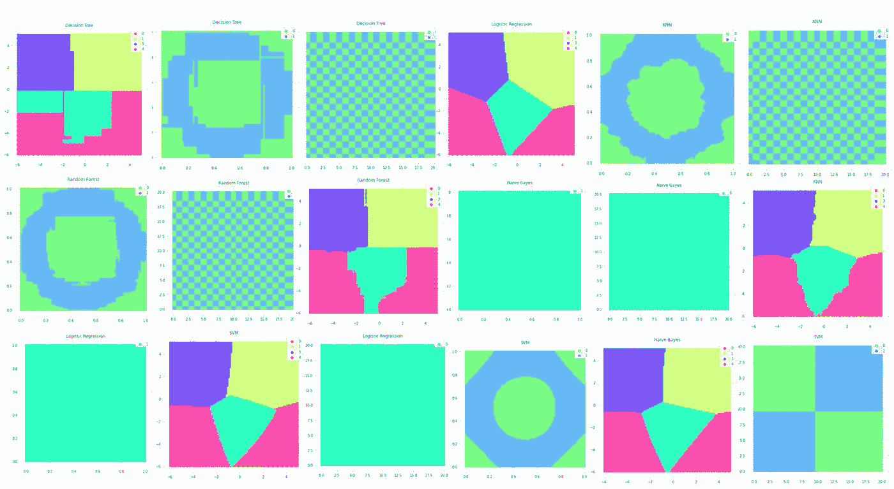

## 直观地理解每个机器学习模型的本质

我记得当我学习机器学习模型时——KNN、逻辑回归、SVM、决策树等等——我只学习了理论。因为所有这些算法都涉及大量的数学，大多数人只学到了肤浅的理论。但是，往往对一个模型的理解还不够深入，理解不了算法的本质。

每个机器学习模型如何在特征空间中操作可以用三个机器学习问题来可视化——识别聚类、环带问题和棋盘问题。通过这些可视化，将实现对每个机器学习模型如何在特征空间中操作的更深入理解。

所有人物由作者创作。

# 识别集群

在这个问题中，每个机器学习模型必须将一个二维点分类到五个聚类中的一个，标记为 0 到 4。

决策树算法创建一个规则系统，将特征空间分成几个区域。该算法划分特征空间的一个直接引人注目的方式是，它创建了几个“不自然”的区域，因为决策树算法创建了水平和垂直线条的复杂系统，而不是线条清晰。这可以归因于算法用来划分空间的规则系统——例如，具有 0 *< y <* 5 和-6 < *x* < -1 的数据点。

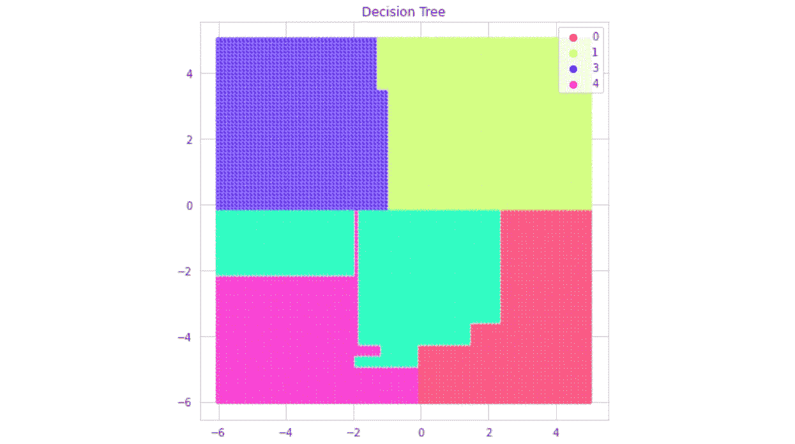

随机森林算法类似于决策树分类器，但是区域的组织更加精确。而决策树算法将中左区域中的一段空白空间分类为类别 2(绿色)，即使它确实属于任何区域。因为随机森林算法包含几个决策树的智慧，所以区域被更好地划分，但也更详细，以捕捉已经复杂的模型集合的更大复杂性。

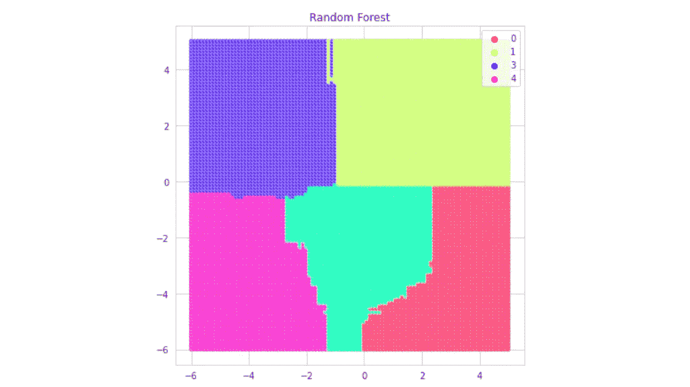

支持向量机(SVM)算法的性质决定了比决策树和随机森林算法更平滑的线，在决策树和随机森林算法中，对角线实际上不是线，而是非常复杂和长的垂直和水平移动序列。因此，它实现了随机森林的目标，而没有增加方差(过拟合)。

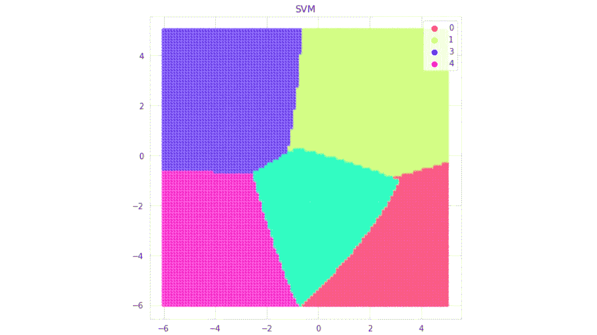

K-最近邻算法类似于随机森林算法，但由于其算法本质上严重依赖于少量的唯一数据点，因此方差增加了。虽然在其他机器学习问题上，KNN 可能并不强大，但它在识别几何轮廓清晰的聚类方面似乎表现不错。

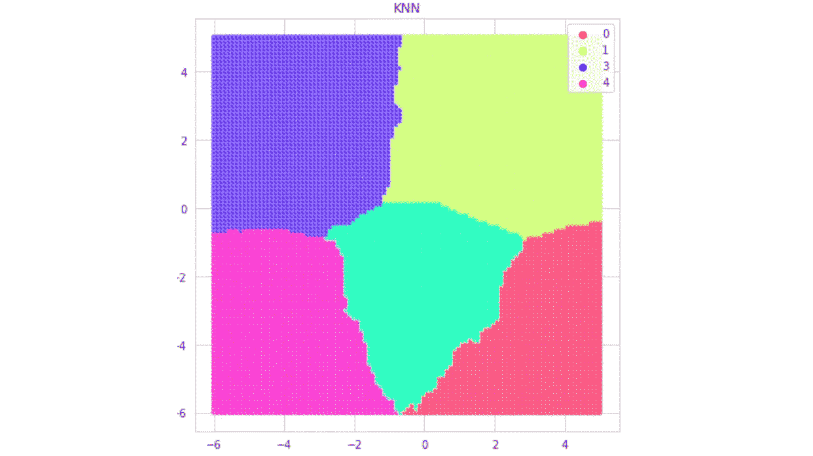

六种流行的机器学习算法的并排比较很能说明每种算法在特征空间上如何操作的本质。

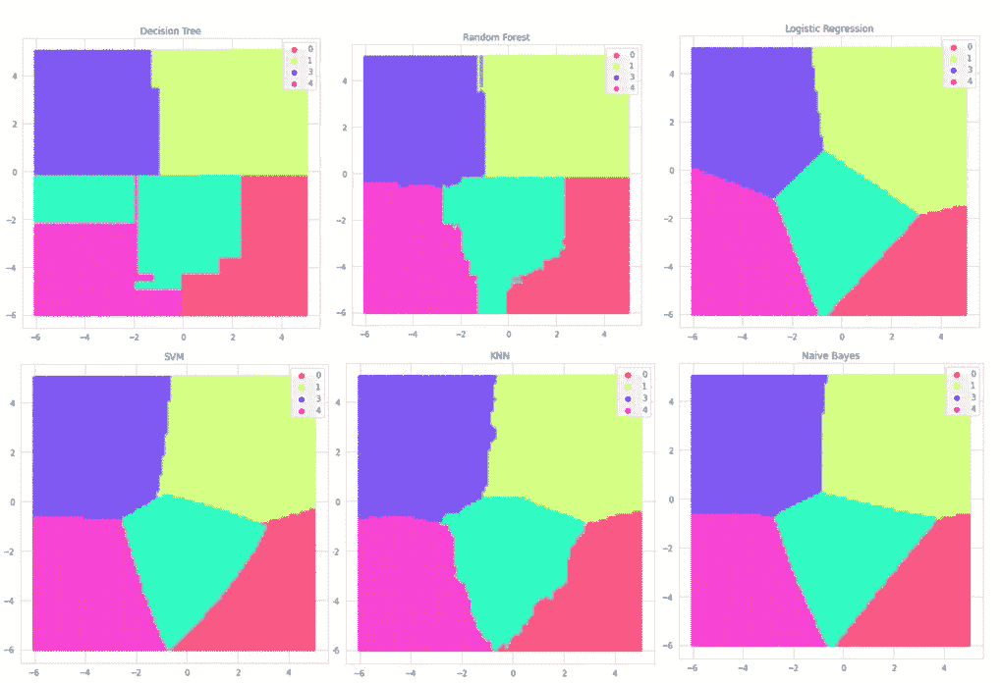

# 环形问题

在环带问题中，分类器必须区分环带内的区域和环带外的区域，其中环带由两个圆定义。成功解决环形问题的模型可以处理非线性数据和同类的分离区域。

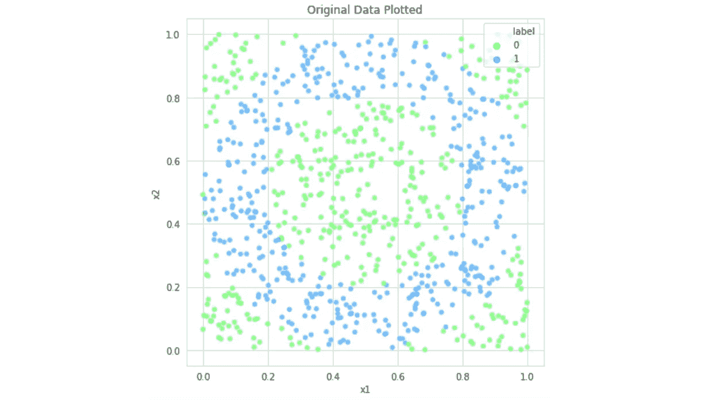

正如前面在聚类识别问题中所看到的，决策树试图仅使用由严格的水平线和垂直线界定的区域来重新创建环。它的许多异常，包括在右上角断开。这是决策树过度拟合能力和偶尔无法识别看似明显的模式的一个强有力的可视化表示。

随机森林算法可以通过利用大数定律的导数来避免这种缺陷，并通过增加集合中投票者的数量来提高准确性和理解性。很明显，随机森林算法认识到了环的连续性——然而，环周边的颗粒噪声表明该算法缺乏泛化能力。

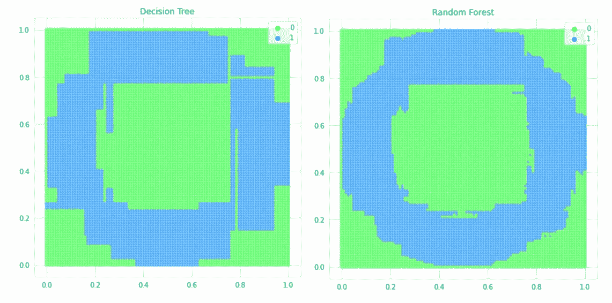

KNN 算法能够形成环的形状，但是外部和内部参数中的噪声细节再次显示了对数据点的过度依赖和缺乏理解。SVM 同样理解环带的连续性，并且几乎完美地描绘了环带的内周。即使角点是线，但看数据，也不能怪算法画了线性边界。

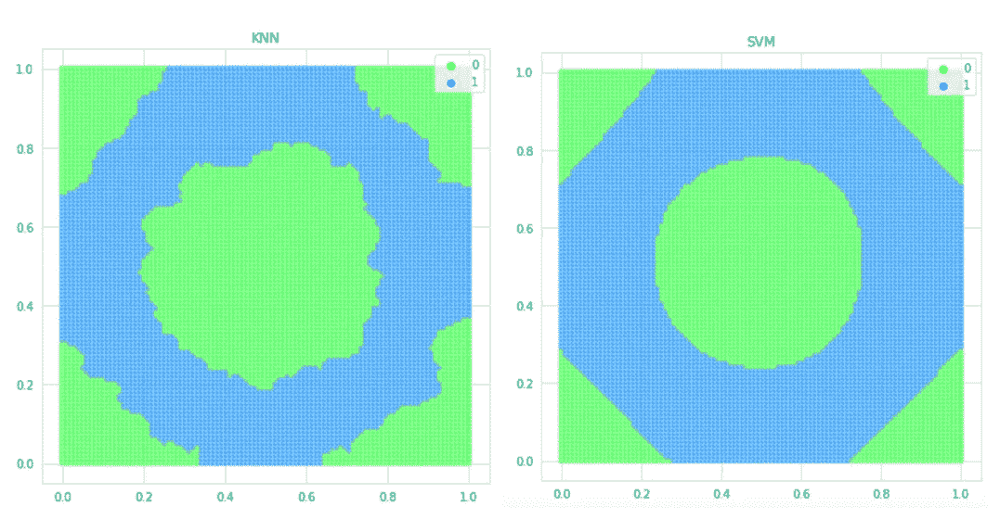

逻辑回归和朴素贝叶斯在环带问题上都失败了，显示出太多的偏差和太少的方差。两种算法都将整个特征空间归为一类。

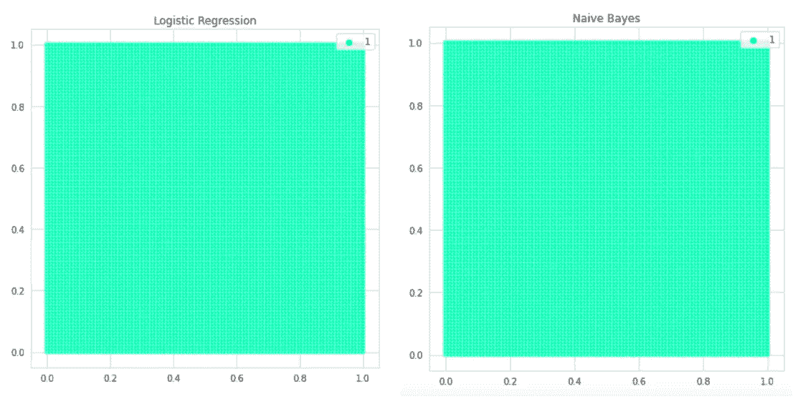

环空问题模型的横向比较；

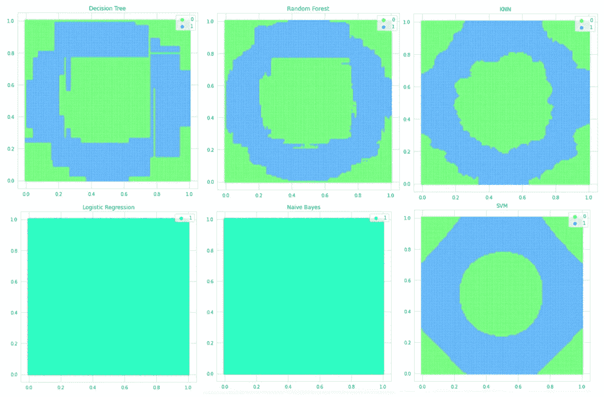

# 棋盘问题

棋盘问题是一个高方差问题，其中二进制类在棋盘空间中交替出现。

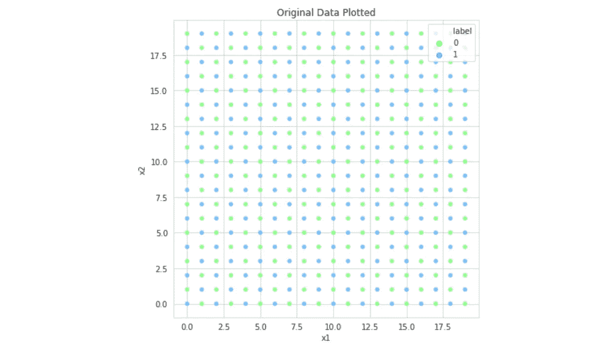

决策树、随机森林和 KNN 算法都是非常高方差的算法，展示了基于给定数据构建棋盘的强大能力。但是，请注意，他们无法将棋盘图案推广到任何大小的棋盘——在棋盘的顶部和右侧，颜色一致的矩形向前扩展到无穷远。

应该注意到 SVM 在高方差问题上表现不佳。由于 SVM 只能分配有限数量的支持向量，它能做的最好的事情就是将棋盘空间分成四个区域。

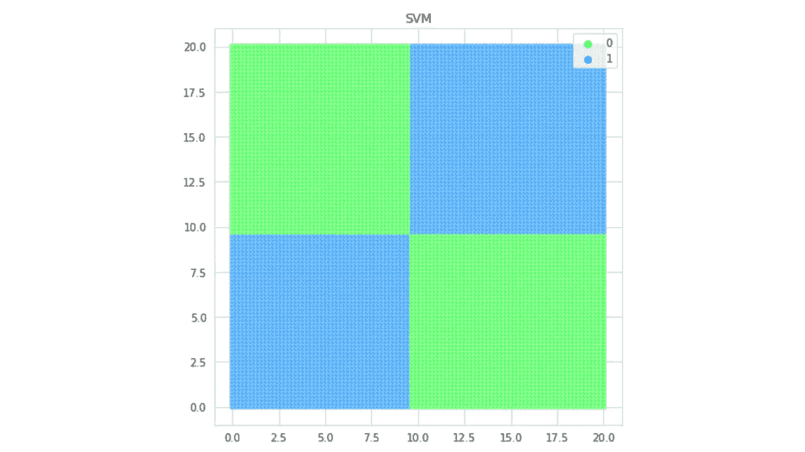

与环形问题一样，逻辑回归和朴素贝叶斯在棋盘问题上失败，预测整个棋盘的一个类。与 SVM 一样，这些低方差算法在需要如此多复杂区域划分的任务中失败了。

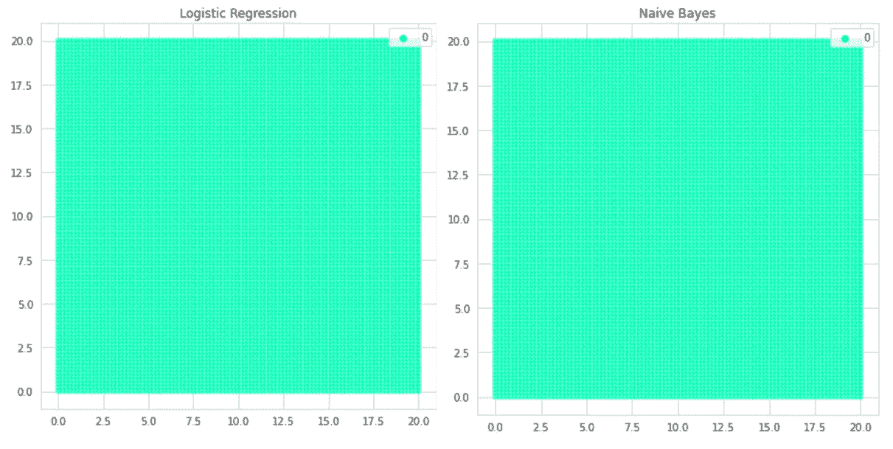

这些算法中没有一个能够有效地划分棋盘并推广到比训练空间更大的空间。神经网络已经能够在这方面显示出希望；也就是说，在例如 20×20 的棋盘上进行训练，并且能够在例如 40×40 的棋盘上继续该模式。棋盘问题的一个解决方案是画对角线，这是一种神经网络能够识别的模式。

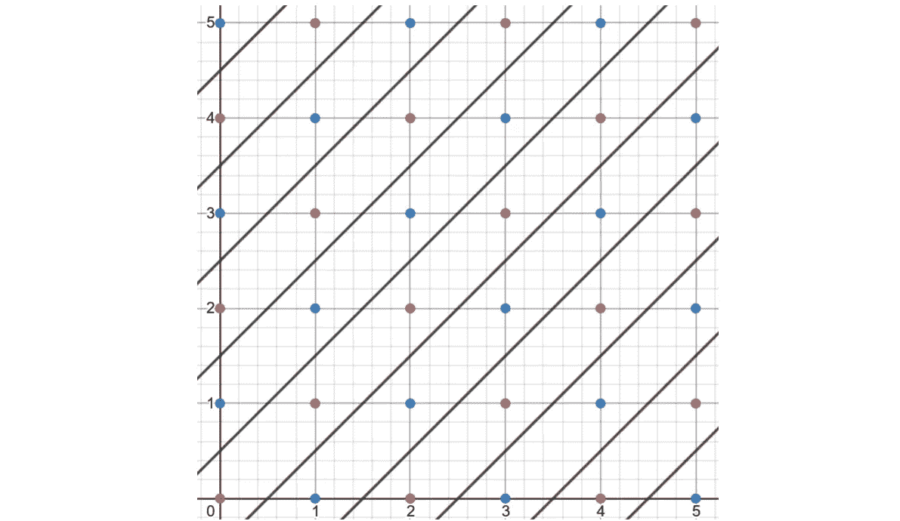

棋盘问题算法的并列比较；

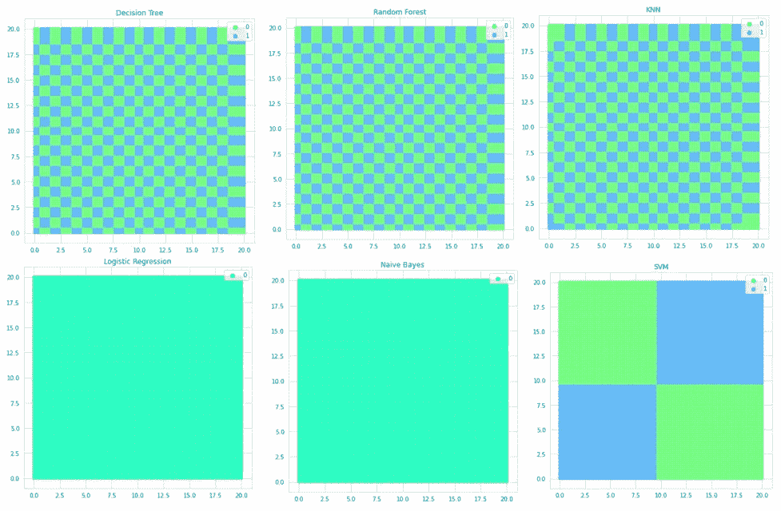

# 感谢阅读！

希望这些来自三个完全不同的问题的可视化能够说明每个算法的本质，以及它如何划分特征空间以实现减少错误的目标。

创建这些问题和其他合成数据问题的代码和解释可以在[这里](/playing-god-with-data-d7d566550745)找到。

[识别星团代码](https://www.kaggle.com/washingtongold/visualize-different-ml-models?scriptVersionId=32661681)、[圆环问题](https://www.kaggle.com/washingtongold/visualize-ml-models-2-0?scriptVersionId=32661666)、[棋盘问题](https://www.kaggle.com/washingtongold/visualize-ml-models-3-0?scriptVersionId=32662030)