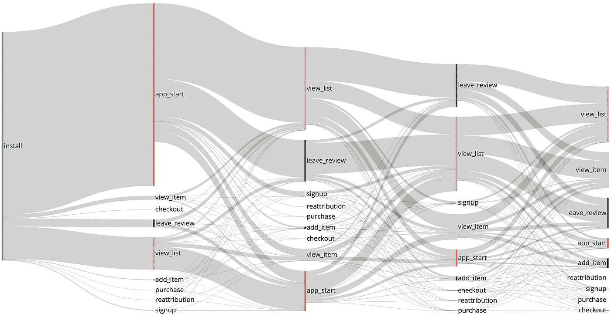
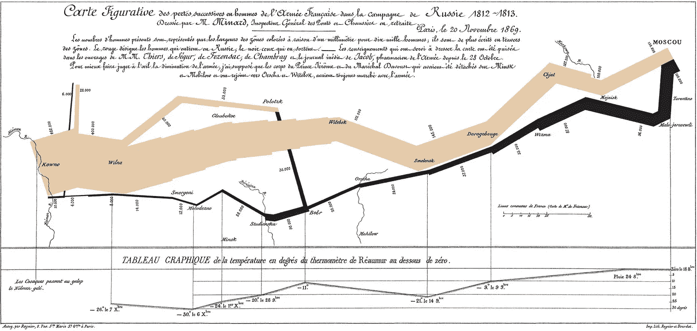

# 使用 Python 中的桑基图可视化应用内用户旅程

> 原文：<https://towardsdatascience.com/visualizing-in-app-user-journey-using-sankey-diagrams-in-python-8373a7bb2d22?source=collection_archive---------3----------------------->

## 应用程序开发人员和营销人员 DIY 指南



*TL；DR: Sankey 图可以在二维空间显示多种类型的数据，这使它们成为可视化您的应用程序或网站用户旅程的一个很好的工具。本文将帮助您开始用 Python 构建自己的 Sankey 图表(在此* [*要点*](https://gist.github.com/nicolasesnis/595d34c3c7dbca2b3419332304954433) *中找到代码)。*

盯着图表想知道你应该从中得到什么是令人沮丧的。就数据类型而言，可视化越恰当，受众就越容易理解数字背后的故事。并且可以推断的信息越丰富。

作为领先的游戏应用移动广告公司 [Adikteev](https://www.adikteev.com/) 的数据分析师，我一直在寻找一种方法来展示我们客户的应用内用户旅程，Sankey diagrams 是实现这一目标的绝佳数据可视化工具:

*   像任何组织或层次结构图一样，Sankey 图可以表示一组节点之间的顺序关系。如果不是按时间顺序排列的不同步骤或阶段之间的关系，那么什么是用户旅程呢？
*   桑基图的每个节点之间的链接宽度与流量成比例，查看者可以一眼看出完成特定旅程的用户比例。

Sankey 图可以在两个维度上显示不同的数据类型:节点的数量和链接的宽度。在用户旅程的情况下，节点的数量可以传递应用内事件的数量和时间顺序信息，链接的宽度可以显示从特定应用内事件转移到另一个应用内事件的用户比例。

更一般地说，桑基图可用于绘制网站流量、工厂能源流量……甚至拿破仑的俄罗斯战役地图:



查尔斯·密纳德绘制的拿破仑 1812 年灾难性的俄国战役地图。作为一个法国人，我不得不在文章中提到拿破仑。

当涉及到用户旅程分析时，这些图表可以让您一目了然地确定哪些是最频繁触发的事件，以什么顺序触发，或者从操作 A 到操作 b 有什么不同的路径。这些是营销人员、决策者或您的客户可能感兴趣的信息。

但是当构建具有三个或更多节点级别的 Sankey 图时，事情会变得混乱。您不希望花费数小时来绘制点并手动链接它们，如果您需要分析多个旅程或定期更新分析，就更是如此。在处理大型数据集时，Python 非常方便，两个 Python 库可以在这里帮助我们:

*   Pandas:用于数据分析的最著名和最常用的 Python 库之一。如果你不熟悉熊猫，但对 SQL 有一些概念，我推荐[这篇伟大的文章](https://medium.com/jbennetcodes/how-to-rewrite-your-sql-queries-in-pandas-and-more-149d341fc53e)。
*   Plotly :一个 Python 图形库，允许创建交互式的、出版物质量的图形。

本文的其余部分是使用 Pandas DataFrames 和 [Plotly 的 Sankey graphing object](https://plotly.com/python/sankey-diagram/) 在 Python 中进行自己的用户旅程分析的分步指南。

# 使用 Pandas 和 Plotly 在 Python 中绘制用户旅程的快速指南

还在吗？太好了！

我们将描绘一个非常简单的应用程序的用户旅程。为了清楚起见，这个应用程序只包含 4 种类型的事件:`installs`、`opens`、`signup`和`purchase`。

这是在安装后用户旅程的第四个应用内事件中截断时的样子:

如果您尝试将鼠标悬停在链接和节点上，您会看到您可以获得更多关于传入和传出流的详细信息，以及从一个事件到另一个事件的平均时间。

要完成本次研讨会，您需要:

*   **Python 3.6** 安装完毕；
*   [Plotly python 包](https://plotly.com/python/getting-started/?utm_source=mailchimp-jan-2015&utm_medium=email&utm_campaign=generalemail-jan2015&utm_term=bubble-chart):我们将使用 **plotly.graph_objects** 来创建图表；
*   **Pandas** :我们将使用 Pandas 的 DataFrames 属性和一些常用的 Pandas 函数；
*   或者，您可以安装 Seaborn 和 Plotly 的 chart_studio 包。 **chart_studio** 会让你发布你的图表，而 **Seaborn** 会让你生成酷酷的调色板来定制你的图表。

你需要一些数据。你会在这里找到一组原始数据来帮助你开始。这个数据帧的头部看起来像这样:

我们将在图表中加入以下信息:

*   用户旅程的每个应用内事件:图表的节点将代表所有应用内事件，从安装到第 n 个事件。在这里，我们将进行到第 10 个事件。
*   每个用户的事件漏斗:每次我们看到一个用户完成了一个应用内的事件，我们会把这个事件和他之前的事件联系起来。我们将只查看安装程序的数据，这样每个用户的第一个事件就是一个安装事件。随着我们观察到更多的用户完成同一系列的应用内事件，链接的宽度将会增加。
*   两个事件之间的平均时间:我们还将计算每个用户的每个事件之间的时间，以便能够计算漏斗的每个步骤之间的平均时间。

本教程的第一步是准备和清理数据集:

*   删除`time_install`列，在`event_name`和`time_event`列增加虚拟`install`事件；
*   在新的`rank_action`列中计算每个事件在用户级别的排名；
*   增加`next_action`和`time_to_next action`列；
*   在本教程中，我们将只保留每个用户第 10 个事件之前的行，但是如果您愿意，可以随意保留更多的事件！

您现在应该有一个新的数据帧，如下所示:

Plotly 的 Sankey 数据结构由两个 Python 字典组成:`node`和`link`。`link` dict 将四个 Python 列表作为参数:

*   `source`:每个流的源节点列表。为了让每个事件流都有一个源，我们需要将每个事件的唯一索引*和每个事件等级的唯一索引*添加到这个列表中。
*   `target`:目标节点列表。我们将使用`next_event`列将每个源事件映射到它的目标事件。
*   `value`:包含每个流量的流量信息的列表。每次我们将一个源映射到一个目标时，我们都会进行计数，并将这个计数添加到`value`列表中。
*   `label`:悬停每个链接时显示的元数据列表。这里，我们想知道从一个源事件到一个目标事件的用户数量，以及他们这样做所花费的平均时间。

`node`字典采用以下两个参数:

*   `label`:包含节点名称的列表(在我们的例子中，是事件的名称)；
*   `color`:包含节点颜色信息的可选列表。

查看 [Plotly 的文档](https://plotly.com/python/sankey-diagram/)以了解关于每个参数的更多信息。

首先，我们将在用户旅程的每一步为每个事件创建一个唯一的`source_index`，记录每个事件的名称。Python 字典可以做到这一点，看起来会是这样的:

```
1: {
    'sources': ['install'], 
    'color': [(80, 190, 151)],
    'sources_index': [0]
  },
2: {
    'sources': ['signup', 'purchase', 'reopen'],
    'color': [(228, 101, 92), (191, 214, 222), (252, 200, 101)],
    'sources_index': [1, 2, 3]
  },
3: {
    'sources': ['reopen', 'purchase', 'signup'],
    'color': [(252, 200, 101), (191, 214, 222), (228, 101, 92)],
    'sources_index': [4, 5, 6]
  }
}
```

第一级键是每个事件的等级。排名#1 只包含`install`作为来源，因为我们只查看新安装者的数据。

我们存储一个唯一的`source_index`，而不是事件的名称，因为事件在旅程中可能会出现多次。我们还为每个事件赋予了一个独特的颜色，并将这个 dict *命名为 nodes_dict。*

下面是实现这一点的脚本:

然后，我们需要计算漏斗的每一步(即每一个`rank_event`)，每个用户从一个源到一个目标有多少次，并使用我们的`time_to_next`列记录花费了多长时间。

这里，Python 字典将再次完成这项工作——这次我们将把它命名为 *links_dict* 。第一级键将是我们的源索引，第二级键是每个流的目标索引。从排名 N+1 的源索引中检索排名 N 的目标索引:

```
{
  0: { # source index
    1: { # target index
      'unique_users': 14991,
      'avg_time_to_next': numpy.timedelta64(192..., 'ns')
    },
    2: {
      'unique_users': 3879,
      'avg_time_to_next': numpy.timedelta64(393..., 'ns')
    },
    ...
  },
  1: {
    4: {
      'unique_users': 3158,
      'avg_time_to_next': numpy.timedelta64(495..., 'ns')
    },
    5: {
      'unique_users': 4843,
      'avg_time_to_next': numpy.timedelta64(303..., 'ns')
    },
    ...
  },
  2: {
    5: {
      'unique_users': 1426,
      'avg_time_to_next': numpy.timedelta64(14524260000000000, 'ns')
    },
      ...
  },
  3: {...}
```

对于每个用户的事件序列，我们需要:

*   1)读入 *nodes_dict* 序列中每个事件的唯一`source_index`。
*   2)同样，读取每个事件的下一个事件的`source_index`(从等级 N+1 的源索引中检索等级 N 的目标索引)并将其存储到一个`target_index`变量中。
*   3)检查`source_index`和`target_index`的组合是否已经是 *links_dict* 的一个键。如果没有，我们将创建它。如果是，我们将增加唯一用户的数量，并添加`time_to_next`信息。稍后，通过将`time_to_next`除以独立用户的数量，我们将得到从一个事件到另一个事件的平均时间。

该脚本如下所示:

在能够绘制我们的 Sankey 图之前，我们需要从我们的字典中创建`targets`、`sources`、`values`、`labels`和`colors`列表，这些列表将作为参数在绘图函数中传递。这可以通过迭代我们的 *nodes_dict* 和 *links_dict* 轻松实现:

安全了。现在一切都准备好了，我们只需绘制图形。我们可以用`line`和`thickness`参数给节点添加一些样式，并利用`hovertemplate`来重新表述悬停的元数据，以满足我们的需求。`update_layout` Plotly 功能允许我们调整图表的大小、标题文本、字体大小和背景颜色。

如果你想把它发布到网上，你需要[创建一个 Plotly 账户并设置你的凭证。](https://plotly.com/python/getting-started-with-chart-studio/)如果你想保持离线，你也可以在笔记本或 Chrome 上渲染你的图表。

如果你喜欢这个故事，请在 Medium 上关注我！感谢阅读。