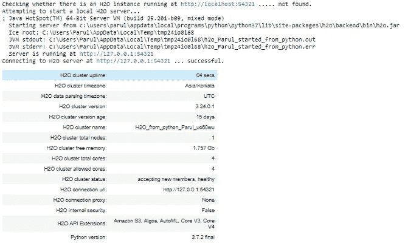
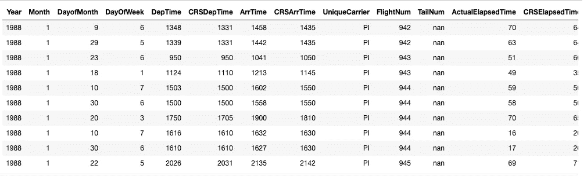
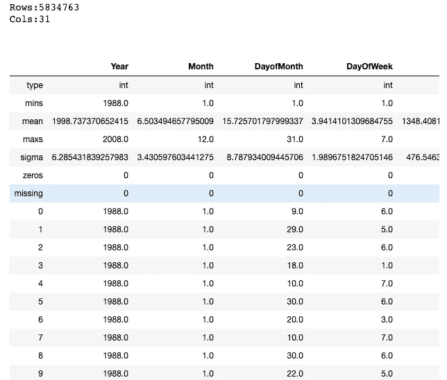
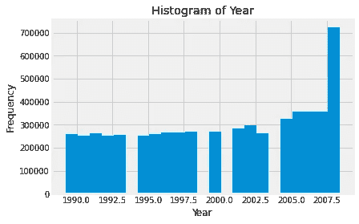
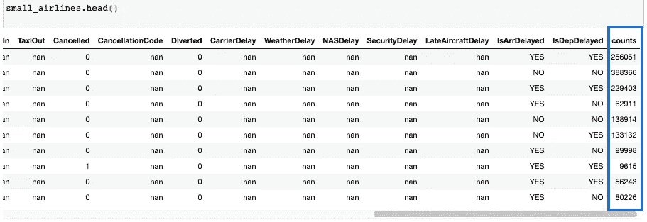

# 使用 H2O 可视化大型数据集

> 原文：<https://towardsdatascience.com/visualizing-large-datasets-with-h2o-ffe9af40371b?source=collection_archive---------26----------------------->

## 了解如何使用 H2O 聚合器函数有效地减少数据量。


梅尔·普尔在 [Unsplash](https://unsplash.com?utm_source=medium&utm_medium=referral) 上的照片

探索性数据分析是任何数据处理管道的基本部分之一。然而，当数据量很大时，这些可视化就变得模糊了。如果我们要绘制数百万个数据点，就不可能区分各个数据点。在这种情况下，可视化的输出看起来很舒服，但是对分析人员来说没有统计上的好处。研究人员设计了几种方法来驯服海量数据集，以便更好地进行分析。这篇短文将着眼于 **H2O 图书馆**如何聚集大规模数据集，然后可以轻松地可视化。

# 目标

[**H2O**](https://www.h2o.ai/products/h2o/) 是一个完全开源的、分布式内存机器学习平台，具有线性可扩展性。通过使用 Python 和 R 社区，H2O 支持大多数领先的和广泛使用的机器学习算法。我们将使用一个公开可用的 [**航空公司数据集**](https://s3.amazonaws.com/h2o-public-test-data/bigdata/laptop/airlines_all.05p.csv) 来证明我们的观点。这是一个包含超过 500 万条记录的庞大数据集，非常适合这种情况。

# 先决条件

在继续操作之前，请确保您的系统上安装了最新版本的 H2O。我们将使用 H2O 3.32——H2O 的[最新版本](https://www.h2o.ai/blog/h2o-release-3-32-zermelo/)以[恩斯特·策梅洛](https://en.wikipedia.org/wiki/Ernst_Zermelo)命名。关于安装库的详细说明可以在文档的 [**下载&安装**](http://docs.h2o.ai/h2o/latest-stable/h2o-docs/downloading.html#downloading-installing-h2o) 部分找到。

# 可视化大数据

现在让我们看看如何利用 H2O 来可视化一个大型数据集。

## 1️⃣.初始化 H2O 集群

H2O 有一个 R 和 Python 接口以及一个名为 Flow 的 web GUI。然而，在本文中，我们将使用 H2O 的 Python 接口。每个新会话都从初始化 python 客户端和 H2O 集群之间的连接开始。

> 一个[集群](http://docs.h2o.ai/h2o/latest-stable/h2o-docs/glossary.html)是一组协同工作的 H2O 节点；当作业提交到集群时，集群中的所有节点都处理作业的一部分。

要检查是否一切就绪，请打开 Jupyter 笔记本，键入以下内容:

```
% matplotlib inline
import matplotlib.pyplot as plt
plt.style.use('fivethirtyeight')import h2o
h2o.init()
```

这是一个本地的 H2O 集群。在执行单元时，一些信息将以表格形式打印在屏幕上，显示节点数量、总内存、Python 版本等。



用户运行 H2O . init()(Python 中)| Image

## 2️⃣.第一次看数据👀

接下来，我们将导入航空公司数据集并进行快速浏览。

```
path = "https://s3.amazonaws.com/h2o-public-test-data/bigdata/laptop/airlines_all.05p.csv" airlines = h2o.import_file(path=path)
```

*   让我们检查数据集的前十行。

```
airlines.head()
```



按作者排列的数据帧|图像的前十行

我们上面所说的叫做 H2O 框架。类似于`Pandas’ dataframe` 或者`R’s data.frame`。一个关键的区别是
数据通常不保存在内存中。相反，它位于一个(可能是远程的)H2O 集群上，因此 H2OFrame 仅仅代表该数据的一个句柄。

我们还可以使用如下所示的`.describe()`命令查看数据集的快速统计摘要

```
airlines.describe
```



按作者统计的数据帧|图像摘要

## 3️⃣.可视化数据

数据集大约有 500 万行和 31 列。现在让我们快速绘制一个`Year`列的直方图，看看数据中是否有某种模式。

```
%matplotlib inline
airlines["Year"].hist()
```



航班频率|作者图片

有趣的是，直方图显示我们没有某些年份的数据。这就是 EDA 带给分析的力量。它有助于快速查明数据集中的异常，如缺失值、异常值等。

接下来，让我们画出`Departure`和`Arrival time`的对比图，看看两者之间是否有关系。这次我们将绘制一个**散点图**，这样我们就可以看到各个点。

```
# Convert H2O Frame into Pandas dataframe for plotting with matplotlibairlines_pd = airlines.as_data_frame(use_pandas = True)plt.scatter(airlines_pd.DepTime, airlines_pd.ArrTime)
plt.xlabel("Departure Time")
plt.ylabel("Arrival Time") 
```


`Scatterplot of Departure`对`Arrival time | Image by Author`

如上所述，我们确实得到了一个散点图，但是很难辨别出各个点。大量的重叠点使得很难看出数据中的总体趋势。

# H2O 3 号的聚合器救援方法

仅仅查看整个数据没有多大意义。相反，我们可以研究一部分数据，只要它反映了整个数据集的属性。这就是 [**H2O-3 的聚合器**](http://docs.h2o.ai/h2o/latest-stable/h2o-docs/data-science/aggregator.html) 方法的用武之地。H2O 聚合器方法是一种基于聚类的方法，用于将数值/分类数据集缩减为行数较少的数据集。

> “聚合器方法的行为就像任何其他无监督模型一样。您可以忽略列，这些列将在距离计算时被删除。

聚合的输出是一个新的聚合框架，可以在 R 和 Python 中访问。

## 为什么不能用随机抽样来代替？

这种方法优于随机抽样，因为聚合器将保持数据的形状。随机抽样经常会导致异常值被意外删除。

## 使用 H2O-3 的聚合器减少数据量

现在让我们将数据的大小减少到 1000 个数据点。我们将首先创建一个包含大约 1000 条记录的聚合框架，然后使用这个聚合框架创建一个新的数据框架。

```
from h2o.estimators.aggregator import H2OAggregatorEstimator# Build an aggregated frame with around 1000 records
agg_frame = H2OAggregatorEstimator(target_num_exemplars = 1000)
agg_frame.train(training_frame=airlines)# Use the aggregated model to create a new dataframe using aggregated_frame
small_airlines_data = agg_frame.aggregated_frame
```

让我们来看看新数据帧的尺寸

```
small_airlines_data.dim[979, 32]
```

事实上，我们现在有大约 1000 个数据点，但是我们也有一个额外的列。如果您注意到，列数增加了一。让我们看看新数据帧的所有列。

```
small_airlines.head()
```



作者新创建的聚合数据帧|图像

如上所述，创建了一个新的**计数**列。[聚合器将异常值保持为异常值，但是将密集的聚类聚集到样本中，并附带显示成员点的计数列。](http://docs.h2o.ai/h2o/latest-stable/h2o-docs/data-science/aggregator.html)

## 可视化简化的数据帧

现在让我们想象一下新的数据帧。我们将创建与上面相同的散点图来比较两者。

```
small_airlines_pd = small_airlines.as_data_frame(use_pandas = True)
plt.scatter(small_airlines_pd.DepTime, small_airlines_pd.ArrTime)
plt.xlabel("DepTime")
plt.ylabel("ArrTime") 
```


`Scatterplot of Departure`对`Arrival time — Reduced dataframe| Image by Author`

正如预期的那样，这一步花费的时间要少得多，而且输出的数据点清晰易辨。

## 正在关闭集群

完成实验后，记得使用下面的命令关闭集群。

```
h2o.cluster().shutdown()
```

# 结论

在本文中，我们研究了一种使用 H2O 聚合器方法将数值/分类数据集缩减为行数更少的数据集的方法。在如上所述的情况下，我们需要可视化大数据集，这种用途是显而易见的。如果你有兴趣深入挖掘，论文— [**威尔金森，利兰。“可视化离群值。”(2016)**](https://www.cs.uic.edu/~wilkinson/Publications/outliers.pdf)——一定会引起你的兴趣。本文提出了一种新的检测多维异常值的算法，将帮助您理解聚合器方法的功能。

# 承认

感谢 H2O.ai 的高级客户数据科学家 [Megan Kurka](https://www.linkedin.com/in/megan-kurka-36336569/) ，为本文编写代码。代码已经与 H2O 3 库的其他实现一起公开发布。