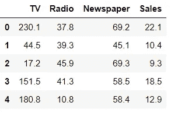

# 可视化线性、脊形和套索回归性能

> 原文：<https://towardsdatascience.com/visualizing-linear-ridge-and-lasso-regression-performance-6dda7affa251?source=collection_archive---------24----------------------->

## 使用黄砖可视化分析模型性能


亨特·哈里特在 [Unsplash](https://unsplash.com?utm_source=medium&utm_medium=referral) 上的照片

机器学习是对通过经验自动改进的计算机算法的研究。根据问题和我们正在处理的数据集，有大量的机器学习算法。

机器学习模型性能是选择特定模型的最重要因素。为了选择机器学习模型，我们可以查看某些指标，这些指标可以帮助我们选择具有最高准确性和最小误差的最佳模型。除了所有这些因素，显示模型性能的最重要因素是不同类型的可视化。我们可以使用预测误差和残差图等可视化工具来选择性能最佳的模型。

Yellowbrick 是一个开源 python 库/包，它扩展了 Scikit-Learn API，使模型选择和超参数调整更加容易。在引擎盖下，它使用的是 Matplotlib。

在本文中，我们将探讨如何使用可视化技术(即使用 Yellowbrick 创建的残差图和预测误差)来可视化线性、岭和套索回归的模型性能。

# 安装 Yellowbrick

像任何其他库一样，我们将使用 pip 安装 yellowbrick。

```
pip install yellowbrick
```

# 导入所需的库

我们将使用 sklearn 库下定义的线性、岭和套索回归模型，除此之外，我们将导入 yellowbrick 进行可视化，并导入 pandas 来加载我们的数据集。

```
from sklearn.linear_model import LinearRegression, Lasso, Ridge
from sklearn.preprocessing import StandardScaler
from sklearn.model_selection import train_test_split
from yellowbrick.regressor import PredictionError, ResidualsPlot
import pandas as pd
```

# 正在加载数据集

在本文中，我们将探索一个包含跨国公司销售数据的简单数据集，您可以使用任何包含回归相关数据的数据集。让我们加载数据集，看看有哪些属性。

```
df = pd.read_csv("Advertsisng.csv')
df.head()
```



数据集(来源:作者)

# 分割测试和训练数据

为了将数据集分为测试和训练，我们首先需要定义特征和目标变量。定义功能和目标后，我们将使用标准缩放器缩放数据，然后使用 sklearn 拆分数据。

```
X=df.iloc[:,0:3]
y=df.iloc[:,3]
#Scaling The data
scaler = StandardScaler()
scaler.fit(X)
X = scaler.transform(X)
#Splitting the data
X_train, X_test, y_train, y_test = train_test_split(X, y, test_size=0.3, random_state=101)
```

# 创建模型可视化

现在我们将创建模型并使用该模型来创建可视化。我们将创建的可视化是:

a.**预测误差**

预测误差图显示了数据集的实际目标与模型生成的预测值的对比。这让我们可以看到模型中的方差有多大。

b.**残差图**

在回归模型的上下文中，残差是目标变量的观测值(y)和预测值(ŷ)之间的差，即预测的误差。残差图显示了垂直轴上的残差和水平轴上的因变量之间的差异。

## 1.线性回归

```
model1 = LinearRegression()
visualizer = PredictionError(model1)
visualizer.fit(X_train, y_train)  
visualizer.score(X_test, y_test)  
visualizer.poof()
```


预测误差(来源:作者)

```
visualizer = ResidualsPlot(model1)visualizer.fit(X_train, y_train)  
visualizer.score(X_test, y_test)  
visualizer.poof()
```


残差图(来源:作者)

## 2.套索回归

```
model2 = Lasso()
visualizer = PredictionError(model2)
visualizer.fit(X_train, y_train)  
visualizer.score(X_test, y_test)  
visualizer.poof()
```


套索预测(来源:作者)

```
model2 = Lasso()
visualizer = ResidualsPlot(model2)
visualizer.fit(X_train, y_train)  
visualizer.score(X_test, y_test)  
visualizer.poof()
```


套索残差(来源:作者)

## 3.里脊回归

```
model3 = Ridge()
visualizer = PredictionError(model3)
visualizer.fit(X_train, y_train)  
visualizer.score(X_test, y_test)  
visualizer.poof()
```


山脊预测(来源:作者)

```
model3 = Ridge()
visualizer = ResidualsPlot(model3)
visualizer.fit(X_train, y_train)  
visualizer.score(X_test, y_test)  
visualizer.poof()
```


岭残差(来源:作者)

这就是我们如何为不同的模型创建残差图和预测误差图。通过分析这些图，我们可以选择性能最佳的模型。

在我们数据集的上述图中，我们可以看到，根据我们创建的图，性能最好的模型是线性回归，因此对于这个给定的数据集，我们将使用线性回归进行预测，因为它的准确性高，误差小。

类似地，我们可以将 yellowbrick 用于不同的机器学习模型性能可视化。你可以尝试不同的数据集，找到最适合你的数据的模型，尝试一下，让我知道你对这个故事的反应。

# 在你走之前

***感谢*** *的阅读！如果你想与我取得联系，请随时通过 hmix13@gmail.com 联系我或我的* [***LinkedIn 个人资料***](http://www.linkedin.com/in/himanshusharmads) *。可以查看我的*[***Github***](https://github.com/hmix13)**简介针对不同的数据科学项目和包教程。还有，随意探索* [***我的简介***](https://medium.com/@hmix13) *，阅读我写过的与数据科学相关的不同文章。**