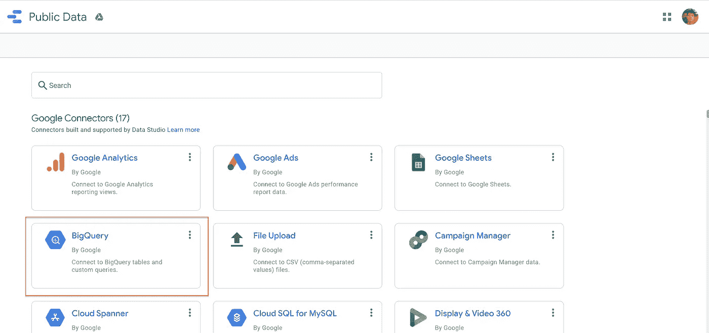
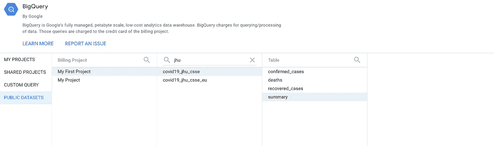
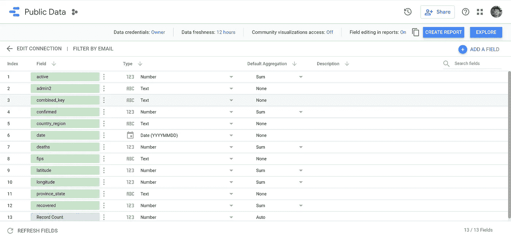
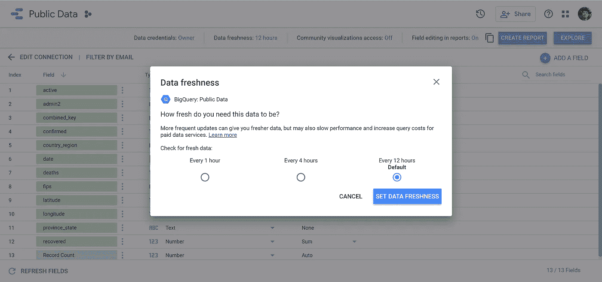

# 使用大查询自由可视化实时大数据源

> 原文：<https://towardsdatascience.com/visualizing-live-big-data-sources-freely-with-big-query-28c9b5ad985d?source=collection_archive---------32----------------------->

## 构建第一个仪表板的指南

## 从大数据查询构建您的第一个可视化的指南

来源( [Unsplash](https://unsplash.com/photos/JKUTrJ4vK00) )

> 对庞大的数据集进行数据分析需要几个小时
> 
> 没有付费订阅，我无法找到实时数据源

**可扩展性**是数据分析中的一个问题。现在大数据时代，分析 Pb 级数据的技能弥足珍贵。但是，我们在大学期间学习的大多数工具是不够的。大多数时候，我们使用小规模数据集，这并不能测试我们扩展解决方案的技能。

想象 MySQL 和 Excel 作为给定的数据源。Excel 是很好的电子表格分析工具，但是它们最多允许 1，048，576 行和 16，384 列。MySQL 可以对超过这些容量的数据集运行查询，但连接、聚合和可视化大型数据集的速度很慢。

> 为什么我们不把它们平行地分割、聚合和具体化呢？

一个常见的解决方案是设计**数据仓库**和 **ETL 管道**(提取、转换和加载)，它们将物化的更小的聚合数据集开发为具有大量处理单元的输入流。

这就是 Hadoop 等 MapReduce 工具试图完成的任务。它通过对数据集进行分片并使用多线程运行操作和聚合来加速这些作业。它适用于大数据，但很难从头开始构建一个健壮的管道。

我们需要开始的是一个工具来编码、重新编译、重新部署和重新运行工作，而不需要大量的努力来构建和维护；一个拥有众多工人的加工中心，具有故障保护功能，可扩展，损耗最小。

> 欢迎来到谷歌大查询

# 教程

我将向您展示如何在不到 10 分钟的时间内将 Google BigQuery 公共数据集导入仪表板。

我们将使用实时公共数据集(JHU·科维德数据集)进行实验，这将为您快速介绍如何将该数据集导入仪表板(谷歌数据工作室)。

请随意[跟随本教程](/how-to-build-a-great-dashboard-ee0518c3d3f7)或直接访问[仪表板，在这里](https://datastudio.google.com/reporting/9f6b7856-aa66-4ae0-8864-8abef1e77f6a)您可以复制并亲自尝试。

**附言:**如果您想要一种简单的方式来开发和部署您的仪表板即服务。[我也为 Dash & Plotly 提供一个教程。它们是构建在 Matplotlib 和 Flask 之上的 python 库，是构建 web 应用程序的有用框架。](/build-your-own-data-dashboard-93e4848a0dcf)

# 什么是谷歌大查询

使用 Google BigQuery 访问公共数据集

> Google Big Query 是一个完全托管的无服务器数据仓库，可以专注于分析，而不是管理基础架构。它允许您可伸缩地托管您的数据。

**Google BigQuery** 是由 Google 大表和 Google 云平台组成的企业数据仓库。每个技术层都是无服务器的，可扩展到所有数据大小。从 Excel 电子表格到数 Pb 的流数据，它都能很好地工作。

大查询非常适合大数据，因为它可以自动管理复制的分布式存储。它可以接收多个自定义存储，然后查询大型分析。

BigQuery 是一个分布式数据存储，用于为流式工作流建立数据仓库和数据集市。BigQuery 擅长防止每个数据产品的可配置访问权限层的泄漏。

方便的是，谷歌已经有了实时公共数据集，如 JHU 实时数据连接，供我们查询。

# 好处

## **自动扩展大型数据集的计算能力。**

BigQuery 连接到 Google 云平台，该平台在一个池中拥有数千个 CPU 来处理请求和作业。

当您执行 BigQuery 时，它会立即赋予您部署每个单元来计算一小部分数据的能力。然后，BigQuery 将这些数据合并在一起并进行聚合。

换句话说，BigQuery 使用类似的 Map Reduce 算法，提供了巨大的集群，而不需要太多的麻烦和配置。全部免费。

## **托管大量公共实时数据集(犯罪、出租车、COVID 等)。**

BigQuery 通过[谷歌云公共数据集计划](https://cloud.google.com/public-datasets)向公众开放。

谷歌已经付费托管这些数据集，并提供这些数据集的公共访问。您可以免费访问每月 1TB 的查询数据集，这些数据集为您的投资组合托管大中型项目。

## **定期更新实时数据(数据新鲜度)**

这有助于您配置将实时数据直接更新到可视化中的频率。

这个想法是为了缩短用户交互和用户影响您的仪表板或分析之间的时间。因此，您可以优化计算能力以及仪表板带来的影响。

例如，如果您关注每天的出租车收入。让它成为每日新鲜感可能是有意义的。但是，如果你关注的是出租车的供给/需求流量。每小时更新一次是有道理的。

# 使用 BigQuery 公共数据集

## 首先打开[谷歌数据工作室](https://datastudio.google.com/)

在“报告”页面上，从模板部分开始。单击空白报告模板。谷歌大查询处理不同的数据集，你可以直接分析并立即加入。

## 点击 BigQuery

选择 BigQuery

## 单击公共数据集→我的第一个项目→选择数据集

获取公共数据集 JHU Covid 案例

打开公共数据集，我的第一个项目，搜索 jhu(约翰·霍普斯金大学 Covid 数据集)

## 确认您的数据字段和类型

获取字段和列

如果你看一看，你会发现有各自类型的字段。这些数据类型包括分类数据、数字数据和顺序数据，默认聚合是所有数字的总和。

## 调整实时数据馈送频率(数据新鲜度)

在顶部，您可以点击数据新鲜度，然后您可以调整新鲜度。Google 已经为您建立了数据连接，因此您可以直接配置其新鲜度。

操纵数据新鲜度

一旦你完成了。点击右上角的**创建报告**，进入 Data Studio 网站。这样，您就可以将仪表板连接到一个实时的大型公共数据集进行探索。

[最后，您应该会得到以下结果，您可以进一步将其制作成仪表板。](/how-to-build-a-great-dashboard-ee0518c3d3f7)

从 BigQuery Covid (JHU)数据集构建数据仪表板

> *全部免费。*

# 最后的想法

在本教程中，我们学习了 Google BigQuery 获取实时数据集的 3 个最大优势:

1.  **可扩展性:**扩展大型数据集的计算能力
2.  **存储库:**实时公共数据集(犯罪、Covid 等)的存储库
3.  **数据新鲜度:**直接为您的可视化配置实时数据

有了它，您可以将实时数据导入 dashboard，拖放交互式可视化和令人惊叹的样式，并与您的同事和经理轻松分享。

一如既往，如有任何问题，请通过 LinkedIn[联系我。如果时间允许，我很乐意回答你的问题。](http://www.linkedin.com/in/vincenttatan/?source=post_page---------------------------)

索利·德奥·格洛丽亚

# 关于作者

文森特用 ML @ Google 对抗网络滥用。文森特使用高级数据分析、机器学习和软件工程来保护 Chrome 和 Gmail 用户。

除了在谷歌的工作，Vincent 还是《走向数据科学媒体》的特约撰稿人，为全球 50 万以上的观众提供有抱负的 ML 和数据从业者的指导。

在空闲时间，文森特在佐治亚理工学院攻读硕士学位，并为铁人三项/自行车旅行进行训练。

最后，请通过 [**LinkedIn**](http://www.linkedin.com/in/vincenttatan/?source=post_page---------------------------) **，** [**Medium**](https://medium.com/@vincentkernn?source=post_page---------------------------) **或** [**Youtube 频道**](https://www.youtube.com/user/vincelance1/videos?source=post_page---------------------------) 联系文森特