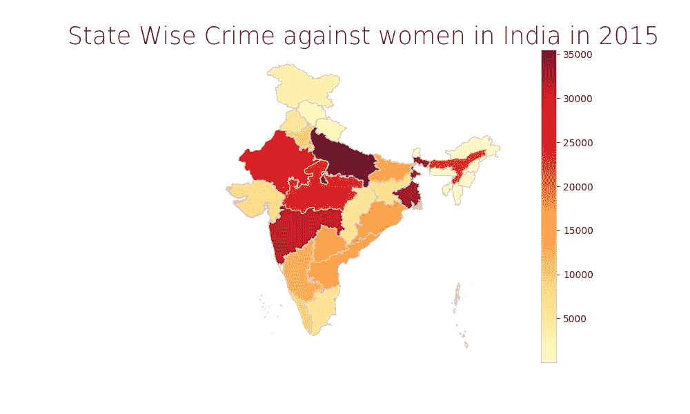
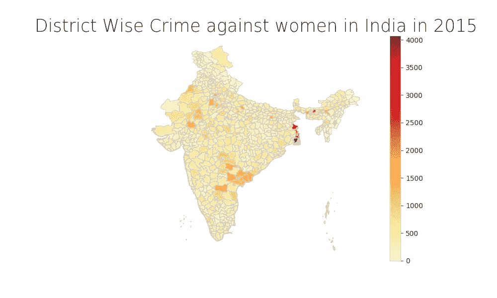
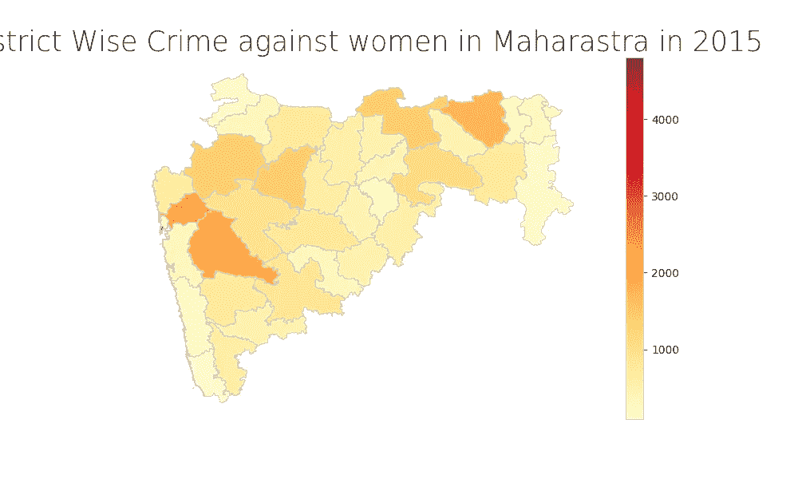

# 使用 Geopandas 在地图上可视化印度针对女性的犯罪

> 原文：<https://towardsdatascience.com/visualizing-map-of-crime-against-women-in-india-using-geopandas-2d31af1a369b?source=collection_archive---------11----------------------->

## 本文向我们展示了一种使用 GeoPandas:一个 Python 库在印度地图(或者您可以选择任何国家)上绘制邦或地区统计数据(就像这里使用的一样，即印度针对女性的犯罪)的简单方法。


图片提供:雷纳萨莫拉，[Pinterest 邮报]。于 2020 年 2 月 18 日从[https://in.pinterest.com/pin/626563366894685267/](https://in.pinterest.com/pin/626563366894685267/)检索

## 简介:

大家好，这篇文章演示了如何在印度各邦的 choropleth 地图上绘制针对女性的*犯罪数据。*

> 根据谷歌字典的解释:“choropleth 地图是一种利用预先定义的区域内的阴影、颜色或符号放置的差异来表示这些区域内特定数量的平均值的地图。”

## 地质公园:

Geopandas 是一个不需要太多代码就可以创建 choropleth 地图的库！它可以将文件作为数据帧读取，这通常称为地理数据帧。地理数据框架很像熊猫数据框架，因此两者通常配合得很好。更多关于 https://geopandas.org/的地质公园

## 形状文件:

shapefile 是一种简单的非拓扑格式，用于存储地理要素的几何位置和属性信息。shapefile 中的地理要素可由点、线或面(区域)表示。

> 本文中用于绘制印度地图的带有邦边界的形状文件可以从[链接](https://map.igismap.com/share-map/export-layer/Indian_States/06409663226af2f3114485aa4e0a23b4)下载，而带有地区边界的形状文件可以从[链接](https://www.arcgis.com/home/item.html?id=cba8bddfa0ab43ddb35a7313376f9438)下载。

## 使用 Pip 安装:

您可以使用 pip 安装 Geopandas 库，如下所示:

```
pip install geopandas
pip install descartes
```

库 **descartes** 是 geopandas 的依赖项，必须显式安装，所以别忘了也安装它。

## 实施:

我们在 **5 个简单步骤**中解释了 Python 的整个实现

假设我们有一个名为 state_wise_crimes.xlsx 的 excel 文件，其中包含印度所有的州名以及针对女性的犯罪总数，如下所示:

```
+-------------------+----------------------------+
|    state_name     | Total Crimes against Women |
+-------------------+----------------------------+
| Andhra Pradesh    |                    15931.0 |
| Arunachal Pradesh |                      384.0 |
| Assam             |                    23258.0 |
| Bihar             |                    13891.0 |
| Chhattisgarh      |                     5720.0 |
| .....             |                      ..... |
+-------------------+----------------------------+
```

我们按照以下步骤创建 chloropeth 图

**第一步:将 excel 文件读入熊猫数据帧:**

```
df = pd.read_excel('state_wise_crimes.xlsx')
```

**步骤 2:读取地理数据框架中带有地区边界的印度地图 shape file:**

```
fp = "Igismap/Indian_States.shp"
map_df = gpd.read_file(fp)
```

**第三步:通过州名连接两个数据帧:**

```
merged = map_df.set_index('st_nm').join(data_for_map.set_index('state_name'))
merged.head()
```

**第四步:为 Matplotlib 创建图形和轴，并设置标题**

```
fig, ax = plt.subplots(1, figsize=(10, 6))
ax.axis('off')
ax.set_title('State Wise Crime against women in India in 2015', fontdict={'fontsize': '25', 'fontweight' : '3'})
```

**第六步:最后，绘制绿色地图**

```
merged.plot(column='Total Crimes against Women', cmap='YlOrRd', linewidth=0.8, ax=ax, edgecolor='0.8', legend=True)
```

**输出:** 输出应该是这样的



您还可以使用下面的代码片段将输出保存为图像:

```
fig.savefig("State_wise.png", dpi=100)
```

类似地，我们可以使用**形状文件**一节中提到的形状文件来绘制地区的 chloropeth 地图。您可以从[此链接](https://data.gov.in/catalog/district-wise-crimes-committed-against-women?filters%5Bfield_catalog_reference%5D=87613&format=json&offset=0&limit=6&sort%5Bcreated%5D=desc)下载包含针对女性的地区性犯罪的 excel 文件。

的输出如下所示:



我们也可以对任何一个邦做同样的事情，就像我对马哈拉施特拉邦所做的那样。
为此，我们可以通过添加一行来使用用于分区可视化的相同形状文件:

```
map_df = map_df[map_df['NAME_1']=='Maharashtra']
```

输出如下所示:



## Github 链接:

你可以在这里得到完整的代码:

[](https://github.com/yasersakkaf/Visualize-Women-Harrasment-in-India-using-GeoPandas) [## yasersakkaf/Visualize-Women-Harrasment-in-India-using-geo pandas

### GeoPandas 图书馆的实现，用于可视化印度各邦和各地区的妇女遭遇。…

github.com](https://github.com/yasersakkaf/Visualize-Women-Harrasment-in-India-using-GeoPandas) 

**总结:**

在本文中，我们看到了如何使用 GeoPandas 库来绘制印度的 chloropeth 地图，以描述 2015 年各邦和各地区针对女性的犯罪。

有了合适的数据集和形状文件，我们可以对其中的任何国家或州做同样的事情。

**参考文献:**

[](/lets-make-a-map-using-geopandas-pandas-and-matplotlib-to-make-a-chloropleth-map-dddc31c1983d) [## 让我们做一张地图吧！利用 Geopandas、pandas 和 Matplotlib 制作 Choropleth 地图

### 所以你想用 Python 做地图。我们开始吧！

towardsdatascience.com](/lets-make-a-map-using-geopandas-pandas-and-matplotlib-to-make-a-chloropleth-map-dddc31c1983d)  [## 什么是 shapefile？

### shapefile 是一种简单的非拓扑格式，用于存储的几何位置和属性信息…

desktop.arcgis.com](https://desktop.arcgis.com/en/arcmap/10.3/manage-data/shapefiles/what-is-a-shapefile.htm)