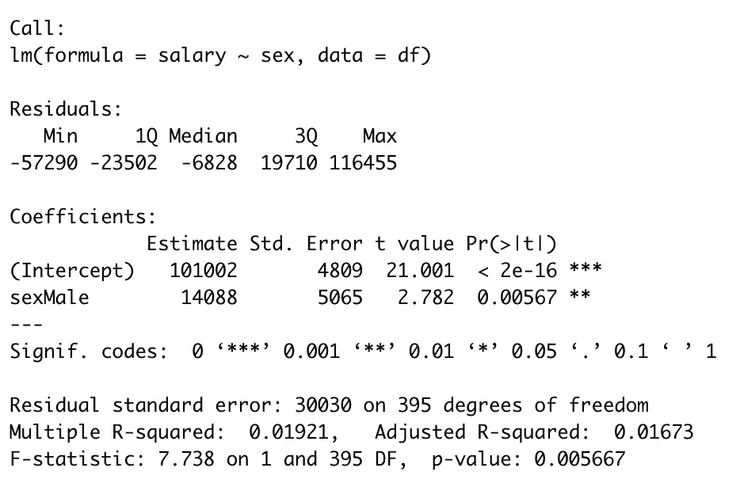
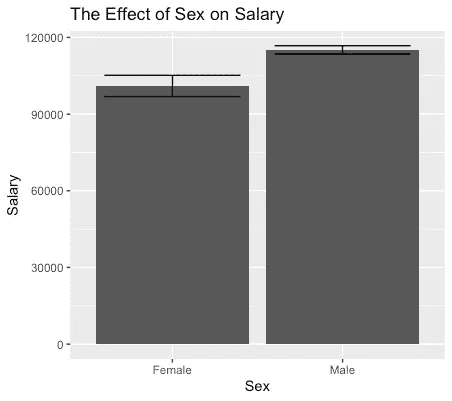
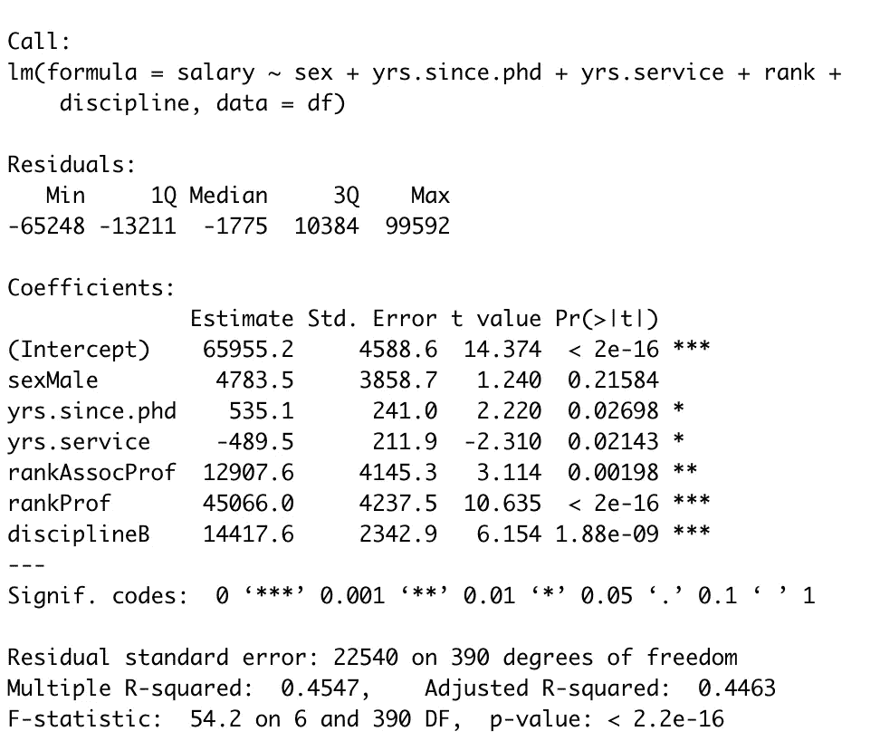
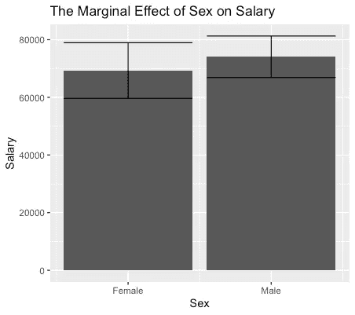

# 在 R 中使用 ggeffects 可视化边缘效果

> 原文：<https://towardsdatascience.com/visualizing-marginal-effects-using-ggeffects-in-r-4e7fb0569040?source=collection_archive---------10----------------------->

## 数据集中关键变量边际效应的图解指南。

这是一个众所周知的困境:你知道你的变量 X1 影响你的变量 Y，你可以在回归分析中显示出来，但很难用图形显示出来。原因是还有一个变量影响着 Y，即 X2，只有在考虑了 X2 的影响后，X1 对 Y 的影响才显现出来。因此，你需要一种方法来显示 X1 如何影响 Y，同时考虑 X2 的影响。

这就是边际效应派上用场的地方。它们使您能够显示感兴趣的自变量的变化如何影响因变量，同时将所有其他自变量考虑在内。更具体地说，您可以使用 ggeffects 包来可视化关键变量的边际效应。

下面的教程将使用 base R 中可用的 sales 数据集。它包含教授的薪水数据和其他几个会直观地影响他们薪水的变量。


也许有人拿着他或她的薪水？亚历山大·密尔斯在 [Unsplash](https://unsplash.com/s/photos/salary?utm_source=unsplash&utm_medium=referral&utm_content=creditCopyText) 上拍摄的照片

您只需输入以下命令就可以加载它。

```
df=Salaries
```

我们想回答这个数据集中的关键问题:教授的性别会影响他们的薪水吗？

天真地，人们可以通过简单地运行下面的回归模型来尝试回答这个问题:

```
fit1=lm(salary~sex,df)
summary(fit1)
```



单看产量，似乎性别影响一个教授的工资。此外，当绘制性别对工资的影响时，这种影响似乎是显著的。

```
#install and load ggplot
install.packages("ggplot2")
library(ggplot2)#plot the relationship
ggplot(df,aes(y=salary, x=sex))+
  stat_summary(fun.y="mean", geom="bar",position="dodge")+
  stat_summary(fun.data = mean_se, geom = "errorbar", position="dodge",width=.8)+
  labs(
    x="Sex",
    y="Salary",
    title="The Effect of Sex on Salary"
  )
```



性别对工资的影响

然而，问题是:是性别导致了这种差异，还是性别与更直接的薪水预测因素相关？这个问题在回归中很容易回答。一种方法是增加更多的协变量来检验是性别还是其他原因导致了这种差异。

```
fit2=lm(salary~sex+yrs.since.phd+yrs.service+rank+discipline,df)
summary(fit2)
```



第二次回归的输出

正如你所看到的，性别的边际效应现在是微不足道的，这意味着在这个数据集中，性别不是工资的实际预测因素，而是与数据集中的其他变量之一相关，这些变量可以概括为资历和学术学科的指标。

所以我们知道性别不是工资的重要预测因素。但是如果我们要绘制性别和薪水之间的关系——如上图所示——看起来好像性别是一个实际的薪水预测因素。如果我们想在考虑所有其他协变量后，绘制性别对工资的实际影响——即绘制边际影响——会怎么样？这就是 ggeffects 发挥作用的地方。

因此，我们安装并加载 ggeffects，如果我们还没有这样做的话。

```
install.packages("ggeffects")
library(ggeffects)
```

然后，我们使用 ggeffects 包中的 ggpredict 函数，预测数据集中每个性别的边际效应。我们将输出保存为一个整洁的数据帧，命名为 dummy。

```
dummy=ggpredict(fit2, terms = "sex")
```

然后，我们使用 ggplot 来绘制这些边际效应。

```
ggplot(dummy, aes(x=x, y=predicted)) +
  geom_bar(stat = "identity", position = position_dodge()) +
  geom_errorbar(aes(ymin = conf.low, ymax = conf.high), alpha = .9,position = position_dodge())+
  labs(
    x="Sex",
    y="Salary",
    title="The Marginal Effect of Sex on Salary"
  )+scale_x_continuous(breaks=c(1,2) ,labels = c("Female", "Male"))
```



性别对工资的边际影响

在控制了所有其他预测因素后，我们现在可以绘制出性别对工资的实际边际影响。

觉得这个故事有趣？[在 Medium 上关注我](https://medium.com/@mattifuchs)看我的其他故事！